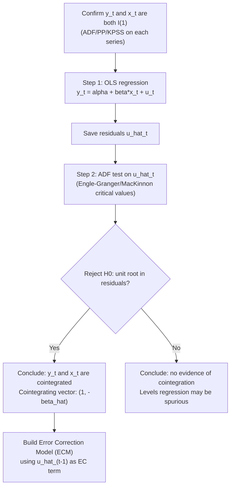

## Engle-Granger Two-Step Cointegration

### Overview

The Engle-Granger (1987) two-step procedure is the foundational method for testing and estimating cointegrating relationships between non-stationary time series. It formalizes the intuition that while individual $I(1)$ series wander without bound, certain linear combinations of them may be stationary — representing a stable long-run equilibrium relationship despite short-run deviations. The procedure both **tests** for cointegration and **estimates** the long-run relationship, using a simple two-stage OLS-based approach.

### The Concept of Cointegration

Two (or more) time series $y_t$ and $x_t$, each individually $I(1)$, are said to be **cointegrated** if there exists a linear combination:

$$u_t = y_t - \beta x_t$$

that is $I(0)$ (stationary), for some non-zero $\beta$. The vector $(1, -\beta)$ is called the **cointegrating vector**, and $\beta$ the **cointegrating parameter**. Economically, cointegration implies $y_t$ and $x_t$ share a common stochastic trend — they can each wander individually, but a specific combination of them does not, implying they cannot drift arbitrarily far apart in the long run.

**Key Points**

- Cointegration is what separates a **genuine long-run equilibrium relationship** between non-stationary variables from a **spurious regression** — the defining diagnostic is whether the residual from the levels regression is stationary.
- Not every economically plausible pair of $I(1)$ series is cointegrated; cointegration is an empirical property to be tested, not assumed from theory alone, though theory (e.g., PPP, money demand, permanent income) often motivates which pairs to examine.
- Cointegration requires the series be integrated of the **same order** (commonly both $I(1)$) for the simple bivariate case; combinations of series with differing integration orders generally cannot cointegrate in the standard sense.

### Step One: Estimate the Long-Run (Cointegrating) Regression

Regress $y_t$ on $x_t$ (and a constant, and a trend if warranted) by OLS in **levels**:

$$y_t = \alpha + \beta x_t + u_t$$

obtaining $\hat\beta$ and residuals $\hat u_t = y_t - \hat\alpha - \hat\beta x_t$.

**Key Points**

- If $y_t$ and $x_t$ are genuinely cointegrated, Engle and Granger show $\hat\beta$ is **super-consistent** — it converges to the true $\beta$ at rate $T$ rather than the usual $\sqrt{T}$, meaning the cointegrating parameter is estimated with unusually high precision asymptotically, even though standard OLS standard errors from this first-stage regression are **not valid for inference** on $\beta$ (a well-known complication addressed by alternative estimators — see Limitations below).
- The choice of which variable to place on the left-hand side ($y_t$ vs. $x_t$) is asymptotically irrelevant for detecting cointegration, but yields numerically different $\hat\beta$ estimates in finite samples (normalization is not innocuous in applied work).
- If more than two variables are involved, multiple cointegrating vectors can potentially exist, but the Engle-Granger single-equation approach is best suited to the bivariate (or single cointegrating relationship) case; the Johansen procedure is preferred for testing multiple cointegrating relationships among several variables.

### Step Two: Test the Residuals for Stationarity

Apply a unit root test (typically ADF) to the residuals $\hat u_t$ from Step One:

$$\Delta \hat u_t = \gamma \hat u_t^{} + \sum_{j=1}^p \phi_j \Delta \hat u_{t-j} + \varepsilon_t$$

(no separate constant or trend in this auxiliary regression, since the residuals from Step One are already demeaned/detrended by construction).

$$H_0: \gamma = 0 \quad \text{(} \hat u_t \text{ is } I(1)\text{: no cointegration)}$$

$$H_1: \gamma < 0 \quad \text{(} \hat u_t \text{ is } I(0)\text{: cointegration present)}$$

**Key Points**

- **Critical values differ from standard ADF critical values.** Because $\hat u_t$ is a residual from an *estimated* regression (not directly observed data), OLS has already "chosen" $\hat\beta$ to minimize residual variance, mechanically biasing the residuals toward appearing more stationary than the truth. The appropriate critical values — tabulated by **Engle and Granger (1987)** and refined by **MacKinnon (1991, 2010)** — are more negative than standard ADF critical values, and depend on the number of variables ($n$) in the cointegrating regression.
- This test is commonly called the **Engle-Granger (EG) test** or **Cointegrating Regression Durbin-Watson (CRDW) test** in its earlier, simpler form (using the DW statistic from Step One directly, now largely superseded by the residual-based ADF approach).
- Rejecting $H_0$ (finding stationary residuals) supports the conclusion that $y_t$ and $x_t$ are cointegrated with cointegrating vector $(1, -\hat\beta)$.

### Full Procedure Summary

**Step 1 — Pretest integration order:** Confirm both $y_t$ and $x_t$ are individually $I(1)$ (via ADF/PP/KPSS on each series) — cointegration testing is only meaningful if this holds.

**Step 2 — Estimate cointegrating regression:** OLS of $y_t$ on $x_t$ (with appropriate deterministic terms), save residuals $\hat u_t$.

**Step 3 — Test residuals for a unit root:** Apply ADF (or PP) to $\hat u_t$, using Engle-Granger/MacKinnon critical values (not standard ADF critical values).

**Step 4 — Interpret:** If $H_0$ (unit root in residuals) is rejected, conclude $y_t, x_t$ are cointegrated; proceed to build an error-correction model (ECM) using $\hat u_{t-1}$ as the error-correction term. If not rejected, treat the levels regression as potentially spurious and consider a first-differenced specification instead.

### Diagram: The Two-Step Procedure

### The Granger Representation Theorem

A foundational result connecting cointegration to dynamic modeling: if $y_t$ and $x_t$ are cointegrated, there exists a valid **error correction representation**:

$$\Delta y_t = \alpha_1 \left(u_{t-1}\right) + \sum_j \phi_{1j}\Delta y_{t-j} + \sum_j \psi_{1j}\Delta x_{t-j} + \varepsilon_{1t}$$

where $u_{t-1} = y_{t-1} - \beta x_{t-1}$ is the (lagged) deviation from long-run equilibrium, and $\alpha_1$ is the **speed of adjustment** coefficient — the fraction of the previous period's equilibrium deviation corrected in the current period. This is the **Granger Representation Theorem**: cointegration and error correction are **equivalent** representations of the same underlying data-generating process. This motivates estimating the ECM as a natural second-stage model once cointegration is established, rather than treating cointegration testing as an end in itself.

### Estimating the Error Correction Model (Second Application)

Using $\hat u_{t-1}$ (the lagged residual from Step One) as a generated regressor:

$$\Delta y_t = \alpha_1 \hat u_{t-1} + \sum_{j=1}^{p} \phi_j \Delta y_{t-j} + \sum_{j=0}^{q} \psi_j \Delta x_{t-j} + \varepsilon_t$$

**Key Points**

- $\hat\alpha_1$ should be **negative and significant** for a stable equilibrium-correcting relationship: a positive deviation from equilibrium ($u_{t-1}>0$) should predict a subsequent *decline* in $\Delta y_t$, pulling the system back toward equilibrium.
- Because $\hat u_{t-1}$ is a **generated regressor** (from Step One's estimated $\hat\beta$), standard errors in the ECM stage require care; Engle and Granger note the asymptotic distribution of the short-run parameters is largely unaffected by this generated-regressor issue (unlike the long-run parameter $\hat\beta$ itself), a convenient — though not universal — result specific to this two-step context.
- This two-step approach (cointegrating regression, then ECM with the lagged residual) is sometimes distinguished from a **one-step ECM** approach that estimates the long-run and short-run parameters jointly by nonlinear least squares, trading off simplicity for improved small-sample efficiency.

### Example: Testing Money Demand

Suppose testing cointegration between log real money balances $m_t$ and log real income $y_t$, motivated by standard money demand theory.

**Step 1:** Confirm via ADF that $m_t$ and $y_t$ are each $I(1)$ — fail to reject unit root in levels, reject unit root in first differences for both.

**Step 2:** Estimate $m_t = \alpha + \beta y_t + u_t$ by OLS.

**Output (illustrative):** $\hat\beta = 0.87$ (income elasticity of money demand).

**Step 3:** ADF test on $\hat u_t$ (no additional constant/trend, since Step One already demeaned):

**Output (illustrative):** ADF $t$-statistic on residuals $= -3.85$; Engle-Granger 5% critical value (2-variable case, $T\approx 150$) $\approx -3.37$. Since $-3.85 < -3.37$ (more negative), **reject** $H_0$: residuals are stationary.

**Conclusion:** $m_t$ and $y_t$ are cointegrated with cointegrating vector $(1, -0.87)$, consistent with a genuine long-run money demand relationship. An ECM would then be estimated to characterize short-run dynamics and the speed of adjustment back to this long-run relationship after a shock.

### Comparison: Engle-Granger vs. Johansen Approach

| Feature | Engle-Granger | Johansen |
| --- | --- | --- |
| Number of variables | Best suited to 2 (single equation) | Handles $n \geq 2$ variables jointly |
| Number of cointegrating relationships | Assumes at most 1 (implicitly) | Tests for and estimates the number of cointegrating vectors ($r$) explicitly |
| Estimation method | Two-step OLS | Full-system maximum likelihood (VAR-based) |
| Normalization issue | Choice of dependent variable affects finite-sample $\hat\beta$ | Less sensitive; system estimated jointly |
| Complexity | Simple, widely taught as introduction | More involved (VECM specification, lag selection, trace/max-eigenvalue tests) |
| When preferred | Bivariate relationships, simplicity valued | Multivariate systems, multiple possible cointegrating relationships |

### Software Implementation Notes

- **Stata:** No single dedicated command for the full two-step procedure; typically implemented manually (`regress` for Step One, `dfuller` with `noconstant` on residuals for Step Two, appropriate MacKinnon critical values applied manually or via community-contributed commands).
- **R:** `urca::ca.jo()` primarily implements Johansen; Engle-Granger residual-based testing can be implemented via `tseries::adf.test()` applied to `lm()` residuals, or via `urca::ur.df()` for correct critical value handling in some versions.
- **Python:** `statsmodels.tsa.stattools.coint()` implements the Engle-Granger two-step test directly, returning the test statistic and appropriate MacKinnon-based p-value.

### Limitations

- The **normalization problem**: choosing $y_t$ as dependent vs. $x_t$ as dependent in Step One can yield different conclusions in finite samples, particularly troublesome when it is not obvious which variable should be treated as "explained" by the other.
- Restricted to testing for **at most one cointegrating relationship** in a single-equation framework; with three or more variables, multiple cointegrating vectors may exist, and Engle-Granger cannot identify or separate them — the Johansen procedure is required in that setting.
- Step One standard errors are **not valid for hypothesis testing on $\beta$** despite $\hat\beta$'s super-consistency; alternative estimators such as **Fully Modified OLS (FM-OLS, Phillips-Hansen 1990)** or **Dynamic OLS (DOLS, Stock-Watson 1993)** are preferred when valid inference on the cointegrating parameter itself (not just detection of cointegration) is the research goal.
- Like other unit-root-adjacent tests, the residual-based cointegration test has **relatively low power** in short samples, and results can be sensitive to lag length choice in the auxiliary ADF regression on residuals.
- Assumes the cointegrating relationship is **stable** (constant $\beta$) over the full sample; structural breaks in the long-run relationship require extensions (e.g., Gregory-Hansen test for cointegration with a structural break).

**Related Topics**

- Random walks and unit root processes
- The Augmented Dickey-Fuller test
- Spurious regression
- Error correction models (ECM) and the Granger Representation Theorem
- The Johansen cointegration procedure and VECM
- Fully Modified OLS and Dynamic OLS estimators
- Gregory-Hansen test for cointegration with structural breaks