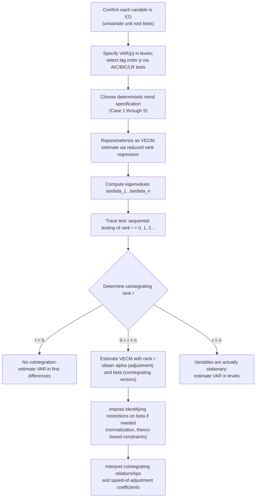

## The Johansen Cointegration Procedure

### Overview

The Johansen (1988, 1991, 1995) procedure is a full-system, maximum-likelihood-based approach to testing for and estimating cointegrating relationships among multiple $I(1)$ variables simultaneously. Unlike the Engle-Granger two-step method, which is restricted to a single equation and at most one cointegrating relationship, Johansen's method operates within a Vector Autoregression (VAR) framework, allowing detection of **multiple** cointegrating relationships among $n \geq 2$ variables and avoiding the normalization ambiguity inherent in choosing a dependent variable.

### From VAR to Vector Error Correction Model (VECM)

Start with a VAR($p$) in the levels of an $n \times 1$ vector of $I(1)$ variables $Y_t$:

$$Y_t = A_1 Y_{t-1} + A_2 Y_{t-2} + \dots + A_p Y_{t-p} + \varepsilon_t$$

This can be algebraically reparameterized into **Vector Error Correction Model (VECM)** form:

$$\Delta Y_t = \Pi Y_{t-1} + \sum_{i=1}^{p-1} \Gamma_i \Delta Y_{t-i} + \varepsilon_t$$

where:

$$\Pi = \left(\sum_{i=1}^p A_i\right) - I_n, \qquad \Gamma_i = -\sum_{j=i+1}^{p} A_j$$

The entire cointegration question reduces to the **rank of the matrix $\Pi$** — this is the central insight of the Johansen approach.

### The Rank of $\Pi$ and the Number of Cointegrating Relationships

Since $\Delta Y_t$, $\Delta Y_{t-i}$ are all $I(0)$ by assumption (each $Y_{it}$ is $I(1)$), for the VECM equation to balance (left side stationary), $\Pi Y_{t-1}$ must also be stationary. Three cases arise based on $\text{rank}(\Pi) = r$:

- **$r = 0$:** $\Pi$ is the zero matrix. No cointegration exists; the correct model is a VAR in first differences only, $\Delta Y_t = \sum\Gamma_i \Delta Y_{t-i} + \varepsilon_t$.
- **$0 < r < n$:** $\Pi$ has reduced rank $r$. There are exactly $r$ cointegrating relationships. $\Pi$ can be decomposed as $\Pi = \alpha\beta'$, where $\beta$ ($n \times r$) contains the $r$ cointegrating vectors (so $\beta'Y_{t-1}$ is a vector of $r$ stationary linear combinations), and $\alpha$ ($n \times r$) contains the corresponding **speed-of-adjustment (loading)** coefficients.
- **$r = n$:** $\Pi$ has full rank. This implies $Y_{t-1}$ itself must already be stationary — contradicting the assumption that the variables are $I(1)$; in this case the appropriate model is a standard VAR in levels, not a VECM.

**Key Points**

- The case $0<r<n$ is the substantively interesting case for cointegration analysis: it implies the $n$-variable system has $r$ stationary long-run relationships and $n-r$ **common stochastic trends** driving the system.
- $\alpha$ and $\beta$ are not individually identified without a normalization, since $\Pi = \alpha\beta' = (\alpha M)(M^{-1}\beta')$ for any invertible $r\times r$ matrix $M$ — a standard identification issue resolved by normalizing $\beta$ (e.g., setting one row to the identity submatrix) or by imposing theory-based restrictions.
- Rows of $\alpha$ near zero for a given variable indicate that variable does **not respond** to deviations from the long-run equilibrium (it is "weakly exogenous" with respect to that cointegrating relationship) — an economically informative byproduct of the estimation.

### Estimation: Reduced Rank Regression (Johansen's ML Approach)

Johansen's method estimates $\Pi$ via **reduced rank regression**, based on canonical correlation analysis between $\Delta Y_t$ and $Y_{t-1}$, after first concentrating out the short-run dynamics $\Gamma_i \Delta Y_{t-i}$ (via auxiliary regressions). The procedure computes the eigenvalues $\hat\lambda_1 > \hat\lambda_2 > \dots > \hat\lambda_n$ of a matrix derived from these canonical correlations, which are then used both to construct test statistics for the rank $r$ and to obtain maximum likelihood estimates of $\alpha$, $\beta$, and $\Gamma_i$ conditional on a chosen $r$.

### Determining the Cointegrating Rank: Trace and Maximum Eigenvalue Tests

**Trace test:**

$$\lambda_{trace}(r) = -T\sum_{i=r+1}^{n} \ln(1-\hat\lambda_i)$$

Tests $H_0: \text{rank}(\Pi) \leq r$ against $H_1: \text{rank}(\Pi) = n$ (unrestricted). Applied **sequentially**: start at $r=0$; if rejected, test $r\leq 1$; continue until failing to reject, at which point the estimated rank is fixed.

**Maximum eigenvalue test:**

$$\lambda_{max}(r, r+1) = -T\ln(1-\hat\lambda_{r+1})$$

Tests $H_0: \text{rank}(\Pi) = r$ against the more specific alternative $H_1: \text{rank}(\Pi)=r+1$.

**Key Points**

- Both statistics have **non-standard asymptotic distributions** (functionals of multivariate Brownian motion), distinct from chi-squared, and depend on the deterministic trend specification chosen (see below); critical values are tabulated by Johansen (1995) and Osterwald-Lenum (1992).
- The trace and maximum eigenvalue tests can occasionally **disagree** on the estimated rank in finite samples; when they do, applied guidance (e.g., following the original recommendations) often favors the trace test as the primary criterion, supplemented by economic interpretability of the resulting cointegrating vectors.
- As with univariate unit root tests, these tests have known **finite-sample size distortions**, tending to over-reject (find spurious cointegrating relationships) in small samples, motivating small-sample corrections (e.g., the Reimers 1992 or Reinsel-Ahn correction, which adjusts the test statistic by a degrees-of-freedom factor).

### Deterministic Trend Specification

A critical and easily overlooked modeling choice: how constants and trends enter the VECM. Johansen (1995) defines five standard cases, commonly summarized as models 1 through 5:

| Case | Specification | When appropriate |
| --- | --- | --- |
| 1 | No intercept, no trend anywhere | Rare; series with zero mean under no cointegration |
| 2 | Intercept restricted to cointegrating relationship only | Series with no linear trend, but cointegrating relationship has a non-zero mean |
| 3 | Unrestricted intercept, no trend | Series with drift but cointegrating relationship has zero mean; common default |
| 4 | Intercept unrestricted, trend restricted to cointegrating relationship | Series exhibit linear trends, cointegrating relationship may have a trend |
| 5 | Unrestricted intercept and trend | Series exhibit quadratic trends in levels; less common in practice |

**Key Points**

- Cases 2 and 3 are the most commonly encountered in applied macro/finance work; misspecifying this choice (e.g., using Case 3 when Case 2 is correct) affects both the rank test critical values and the interpretation of the estimated cointegrating vectors.
- This choice should be guided by visual inspection of whether the levels series exhibit trends, and by whether economic theory suggests the long-run equilibrium relationship itself should contain a deterministic trend (e.g., a "trend" in a real exchange rate cointegrating relationship might indicate a Balassa-Samuelson-type productivity trend).

### Diagram: Johansen Procedure Workflow

### Lag Order Selection in the Underlying VAR

Before applying reduced rank regression, the lag order $p$ of the underlying VAR in levels must be chosen — typically via standard VAR lag-selection criteria (AIC, BIC/SIC, HQIC) applied to the levels VAR, or sequential likelihood ratio tests, **before** reparameterizing into VECM form. The VECM then uses $p-1$ lagged difference terms.

**Key Points**

- Lag order selection materially affects both the estimated rank (via the trace/max-eigenvalue test statistics) and the estimated cointegrating vectors themselves; robustness checks across a small range of plausible lag orders are standard practice.
- Insufficient lags leave residual serial correlation, invalidating the Gaussian likelihood basis of the trace/max-eigenvalue tests; residual diagnostics (multivariate Ljung-Box/Portmanteau tests) should be checked after estimation.

### Identifying and Interpreting Individual Cointegrating Vectors

When $r > 1$, the estimated $\beta$ matrix is identified only up to an arbitrary linear transformation within the cointegration space — the *space* spanned by the cointegrating vectors is uniquely determined, but individual vectors within it are not, without further restrictions.

**Common identification strategies:**

- **Normalization:** setting the coefficient on one variable to 1 in each cointegrating vector (analogous to choosing a "dependent variable" per relationship).
- **Theory-based exclusion restrictions:** e.g., imposing that a particular variable does not enter a specific cointegrating relationship, informed by economic theory (testable via likelihood ratio tests comparing restricted vs. unrestricted $\beta$).
- **Weak exogeneity restrictions on $\alpha$:** testing/imposing that certain variables do not adjust to deviations from one or more cointegrating relationships.

These restrictions, when just-identifying or over-identifying, can be tested via likelihood ratio tests that are asymptotically chi-squared distributed (unlike the rank tests themselves), since conditional on a chosen rank $r$, restrictions on $\alpha,\beta$ within that rank are standard hypothesis tests.

### Example: Term Structure of Interest Rates

Suppose testing for cointegration among a short-term rate $s_t$, a medium-term rate $m_t$, and a long-term rate $\ell_t$ — motivated by the expectations hypothesis of the term structure, which implies certain linear combinations (spreads) should be stationary.

**Step 1:** Confirm each rate is individually $I(1)$ via ADF.

**Step 2:** Estimate VAR(3) in levels (lag order chosen via BIC), Case 3 deterministic specification (unrestricted intercept, no trend, given no obvious long-run trend in interest rate levels).

**Step 3:** Compute trace test statistics.

**Output (illustrative):**

- $\lambda_{trace}(r\leq 0) = 42.3$; 5% critical value $\approx 29.8$ → reject $r=0$
- $\lambda_{trace}(r\leq 1) = 14.1$; 5% critical value $\approx 15.5$ → fail to reject $r\leq 1$

**Conclusion:** Estimated cointegrating rank $r=1$: exactly one stationary long-run relationship among the three rates, consistent with the expectations hypothesis implying two independent stationary spreads collapse to effectively one degree of long-run co-movement freedom in this system (interpretation depends on exact normalization) — broadly consistent with a single common stochastic trend driving all three rates (e.g., a common monetary policy stance), with $n-r=2$ additional common trends absorbed elsewhere in the system's short-run dynamics.

### Johansen vs. Engle-Granger: When to Use Each

| Consideration | Engle-Granger | Johansen |
| --- | --- | --- |
| Number of variables | 2 (or single-equation with one dependent variable) | $n \geq 2$, jointly |
| Multiple cointegrating relationships | Cannot detect | Explicitly tests for and estimates rank $r$ |
| Normalization ambiguity | Present (dependent variable choice matters) | Resolved via system estimation, though $\beta$ identification within rank-$r$ space still requires restrictions |
| Statistical efficiency | Two-step OLS; less efficient | Full-information maximum likelihood; more efficient given correct specification |
| Complexity/implementation burden | Low | Higher — requires VAR lag selection, deterministic case choice, rank determination, and possibly identification restrictions |
| Typical use case | Simple bivariate long-run relationships | Multivariate systems (term structure, PPP across multiple countries, multi-asset arbitrage relationships) |

### Software Implementation Notes

- **Stata:** `vecrank` (trace and max-eigenvalue tests with deterministic trend options), `vec` (VECM estimation with specified rank).
- **R:** `urca::ca.jo()` (Johansen procedure, `ecdet` argument for deterministic case, `spec="transitory"`/`"longrun"` for VECM parameterization); `vars` package for the underlying VAR lag selection (`VARselect()`).
- **Python:** `statsmodels.tsa.vector_ar.vecm` module — `coint_johansen()` for the trace/max-eigenvalue tests, `VECM` class for estimation.

### Limitations

- Known **finite-sample size distortions** in the trace and maximum eigenvalue tests, generally over-rejecting the no-cointegration null in small samples; correction factors (Reimers, Reinsel-Ahn) are recommended but not universally applied in practice.
- Highly **sensitive to lag order and deterministic trend specification** choices, both of which must be made prior to rank determination and materially affect conclusions — robustness across reasonable alternative specifications should be checked rather than reporting a single specification's result as definitive.
- Individual cointegrating vectors within a rank-$r>1$ space are **not economically interpretable without additional identifying restrictions**, and different (equally valid, statistically) normalizations can suggest different economic narratives if not handled carefully.
- Like all cointegration-based methods, assumes a **stable** cointegrating relationship over the sample; structural breaks in the long-run relationships require extensions (e.g., Johansen-based tests allowing for a known or estimated break in the deterministic components).
- **[Inference]** Given the combination of lag-order sensitivity, deterministic specification sensitivity, and finite-sample size distortions, some practitioners regard rank determination as requiring as much economic judgment as statistical mechanics — a view not universally shared but common in applied macro-econometric practice.

**Related Topics**

- The Engle-Granger two-step cointegration procedure
- Vector autoregressions (VAR) and lag order selection
- Vector Error Correction Models (VECM) and the Granger Representation Theorem
- Random walks and unit root processes
- Weak exogeneity testing in cointegrated systems
- Structural break-robust cointegration tests (Gregory-Hansen, and multivariate extensions)