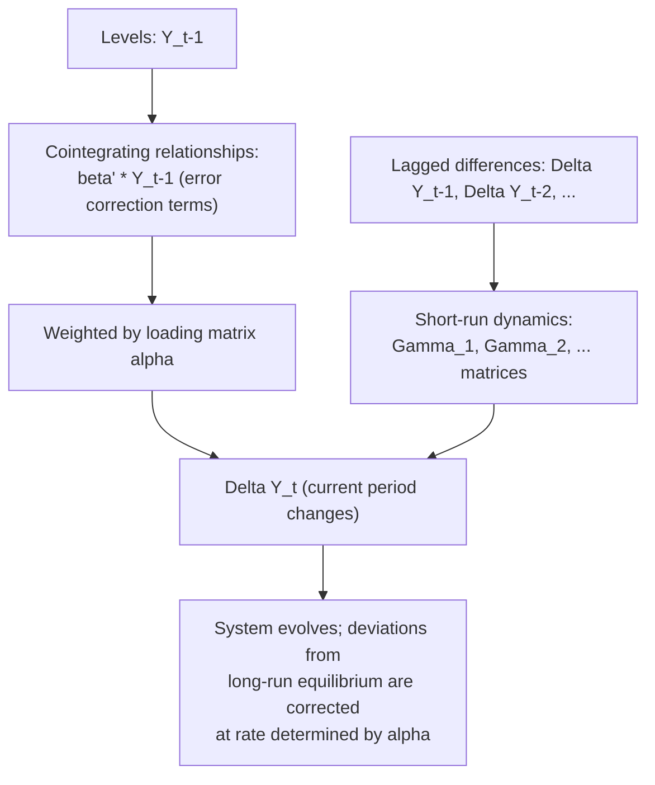

## Vector Error Correction Models

### Overview

Vector Error Correction Models (VECMs) provide the dynamic specification implied by cointegration among a set of $I(1)$ variables: a system that models both short-run fluctuations and the adjustment process back toward one or more long-run equilibrium relationships. The VECM is not a separate modeling choice from cointegration — by the Granger Representation Theorem, cointegration among a set of variables and the existence of a valid VECM representation are mathematically equivalent. This entry focuses on VECM specification, estimation, interpretation, and diagnostic use, building on the rank-determination machinery of the Johansen procedure.

### From VAR to VECM: The Reparameterization

Starting from a VAR($p$) in levels for an $n\times 1$ vector $Y_t$ of $I(1)$ variables:

$$Y_t = A_1 Y_{t-1} + \dots + A_p Y_{t-p} + \varepsilon_t$$

algebraic reparameterization (subtracting $Y_{t-1}$ from both sides and regrouping) yields the VECM:

$$\Delta Y_t = \Pi Y_{t-1} + \Gamma_1 \Delta Y_{t-1} + \dots + \Gamma_{p-1}\Delta Y_{t-p+1} + \varepsilon_t$$

with $\Pi = \sum_{i=1}^p A_i - I_n$ and $\Gamma_i = -\sum_{j=i+1}^p A_j$. This is an **exact** reparameterization — no information is lost or added; it merely reorganizes the same VAR to isolate the long-run levels information ($\Pi Y_{t-1}$) from the short-run dynamics ($\Gamma_i \Delta Y_{t-i}$).

When $\text{rank}(\Pi) = r$ with $0<r<n$, writing $\Pi = \alpha\beta'$ gives the standard VECM form:

$$\Delta Y_t = \alpha \underbrace{(\beta' Y_{t-1})}_{\text{error correction term}} + \sum_{i=1}^{p-1}\Gamma_i \Delta Y_{t-i} + \varepsilon_t$$

### Interpreting the Components

**Key Points**

- $\beta' Y_{t-1}$ is an $r\times 1$ vector of **error correction terms** — the (lagged) deviations of the system from its $r$ long-run equilibrium relationships. Each row of $\beta$ is a cointegrating vector; $\beta'Y_{t-1}$ being stationary is precisely what makes the VECM well-specified (left side $I(0)$, right side balanced).
- $\alpha$ (the **loading matrix** or **speed-of-adjustment matrix**, $n\times r$) governs how strongly each variable in the system responds to deviations from each long-run equilibrium. The $(i,j)$ element of $\alpha$ measures how much variable $i$'s growth rate adjusts in response to a deviation from the $j$-th cointegrating relationship.
- $\Gamma_i$ matrices capture **short-run dynamics** — the standard VAR-in-differences component, describing how past changes in the system predict current changes, independent of the long-run equilibrium.

### Single-Equation VECM: Bivariate Case

For two variables $y_t, x_t$ that are cointegrated with cointegrating vector normalized as $u_{t-1} = y_{t-1} - \beta x_{t-1}$, the VECM system is:

$$\Delta y_t = \alpha_y\, u_{t-1} + \sum_{i=1}^{p-1}\phi_{1i}\Delta y_{t-i} + \sum_{i=1}^{p-1}\psi_{1i}\Delta x_{t-i} + \varepsilon_{1t}$$

$$\Delta x_t = \alpha_x\, u_{t-1} + \sum_{i=1}^{p-1}\phi_{2i}\Delta y_{t-i} + \sum_{i=1}^{p-1}\psi_{2i}\Delta x_{t-i} + \varepsilon_{2t}$$

**Key Points**

- For a stable equilibrium-correcting system, at least one of $\alpha_y, \alpha_x$ should be **significantly nonzero with the theoretically expected sign** (typically negative for the equation whose dependent variable rises above equilibrium, positive... the sign convention depends on how $u_{t-1}$ is defined; the substantive requirement is that deviations from equilibrium trigger a corrective response in at least one variable).
- If $\alpha_x = 0$ (not significantly different from zero) while $\alpha_y \neq 0$, this implies $x_t$ is **weakly exogenous** with respect to the long-run relationship — $x_t$ does not respond to disequilibrium, while $y_t$ does all the adjusting. This is both a testable restriction and an economically meaningful finding (e.g., in a small-open-economy PPP relationship, the foreign price level might be weakly exogenous relative to the domestic economy).
- The magnitude of $|\alpha|$ indicates the **speed of adjustment**: e.g., $\hat\alpha_y = -0.3$ implies approximately 30% of the previous period's equilibrium deviation is corrected within the current period, implying a half-life of roughly 2 periods for the adjustment process.

### Estimation

For a VECM with a **known** cointegrating rank $r$ (typically determined via the Johansen trace/maximum eigenvalue tests beforehand):

**Step 1:** Estimate $\beta$ (the cointegrating vectors) via Johansen's reduced rank regression (maximum likelihood), or, in the single-equation bivariate case, via the Engle-Granger first-stage OLS regression.

**Step 2:** Conditional on $\hat\beta$, estimate $\alpha$ and the $\Gamma_i$ matrices by OLS equation-by-equation (in the single cointegrating relationship case) or by the full Johansen ML procedure (multivariate, multiple relationships).

**Key Points**

- When $r$ is known and $\beta$ estimated first, the remaining VECM parameters ($\alpha, \Gamma_i$) can be estimated by OLS equation-by-equation without loss of efficiency relative to full-system GLS, because the regressors ($u_{t-1}$, lagged differences) are common across equations (a form of the Zellner "seemingly unrelated regressions" efficiency equivalence result applies here).
- Standard errors on $\alpha$ and $\Gamma_i$ are asymptotically valid using conventional OLS formulas once $\hat\beta$ is treated as known/plugged-in, **unlike** the levels-regression coefficient $\hat\beta$ itself in the Engle-Granger first stage, which required special (non-standard) treatment for inference.

### Diagnostic Checking

Standard VAR diagnostic procedures apply to the estimated VECM residuals:

- **Residual autocorrelation:** multivariate Portmanteau or LM tests on the VECM residuals to confirm the chosen lag order $p-1$ (in differences) adequately whitens the residuals.
- **Normality:** multivariate Jarque-Bera-type tests, though VECM estimation and inference are often reasonably robust to moderate departures from normality asymptotically.
- **Stability:** eigenvalues of the companion matrix (excluding unit roots corresponding to the $n-r$ common trends, which are expected by construction) should lie inside the unit circle for the remaining stationary dynamics.

### Diagram: VECM Structure and Information Flow

### Impulse Response Functions and Forecast Error Variance Decomposition

As with standard VARs, VECMs support **impulse response analysis** (tracing the dynamic effect of a one-time shock to one variable on the entire system over time) and **forecast error variance decomposition** (attributing forecast error variance to each structural shock). A key distinction from stationary VARs: because of the cointegrating restrictions, shocks in a VECM generally have **permanent effects** on the levels of the variables (consistent with the underlying $I(1)$ nature of the system), even though the *cointegrating relationships themselves* revert to equilibrium — the common stochastic trend persists, but deviations from it do not.

**Key Points**

- Orthogonalizing shocks (e.g., via Cholesky decomposition) in a VECM requires the same ordering assumptions and associated caveats as in standard VAR impulse response analysis, with the added complexity of distinguishing permanent (trend) shocks from transitory (equilibrium-correcting) shocks — a distinction formalized in the **permanent-transitory decomposition** literature (Gonzalo-Granger 1995, King-Plosser-Stock-Watson 1991).
- **[Inference]** Structural VECM identification (attaching economic meaning to specific shocks) typically requires additional restrictions beyond the cointegrating rank itself, and different identification schemes can yield qualitatively different impulse response conclusions — a general caveat inherited from the broader structural VAR literature.

### Forecasting with a VECM

VECMs typically produce forecasts that respect the long-run equilibrium relationships by construction — forecasted paths for cointegrated variables tend to converge back toward their estimated cointegrating relationship over the forecast horizon, a property not shared by a VAR estimated in first differences alone (which discards the long-run information) or a VAR in levels estimated without imposing cointegrating restrictions (which does not enforce the theoretically implied long-run relationship, though it remains a valid, if less efficient, alternative under correct specification since VECM restrictions are testable, not assumed).

**Key Points**

- **[Inference]** Forecast comparisons in the applied literature generally (though not universally) find VECMs improve **long-horizon** forecast accuracy relative to unrestricted VARs in levels or naive differenced-VAR specifications, when cointegration is genuinely present, while short-horizon forecast gains are more mixed and depend on the specific application.
- Forecast uncertainty in a VECM combines uncertainty about the short-run dynamics with uncertainty about the estimated cointegrating vectors $\hat\beta$ themselves; the latter is frequently treated as negligible in large samples given $\hat\beta$'s super-consistency, but can matter in smaller samples.

### Example: Exchange Rate and Relative Price Levels (PPP)

Consider a VECM for the (log) nominal exchange rate $e_t$ and the (log) relative price level $p_t$ (domestic minus foreign), motivated by purchasing power parity, with previously established cointegration ($r=1$) via the Johansen procedure.

$$\Delta e_t = \alpha_e (e_{t-1} - \beta p_{t-1}) + \Gamma_{11}\Delta e_{t-1} + \Gamma_{12}\Delta p_{t-1} + \varepsilon_{1t}$$

$$\Delta p_t = \alpha_p (e_{t-1} - \beta p_{t-1}) + \Gamma_{21}\Delta e_{t-1} + \Gamma_{22}\Delta p_{t-1} + \varepsilon_{2t}$$

**Output (illustrative):**

- $\hat\beta \approx 1.05$ — close to the PPP-implied theoretical value of 1, broadly consistent with (though not exactly matching) strict PPP.
- $\hat\alpha_e = -0.15$ (significant): the exchange rate does a substantial share of the adjustment toward PPP equilibrium.
- $\hat\alpha_p = 0.02$ (not significant): relative prices do not respond to PPP deviations — consistent with relative prices being **weakly exogenous**, i.e., the exchange rate adjusts to restore PPP rather than prices adjusting to the exchange rate.

**Conclusion:** This pattern — exchange-rate-driven adjustment with sluggish or absent price-level adjustment — is a commonly replicated finding in the empirical PPP literature, reflecting the empirical observation that nominal exchange rates are far more volatile and quicker to adjust than sticky goods prices.

### VECM vs. Alternative Specifications: Comparison

| Specification | Long-run information retained? | Appropriate when |
| --- | --- | --- |
| VAR in levels (unrestricted) | Implicitly yes, but doesn't impose known cointegrating restrictions | Variables stationary, or cointegration rank/vectors highly uncertain |
| VAR in first differences | No — long-run relationship discarded | No cointegration present ($r=0$) |
| VECM | Yes — explicitly imposed via $r$ cointegrating relationships | Cointegration confirmed via Johansen/Engle-Granger; $r$ known |
| Single-equation ECM (Engle-Granger style) | Yes, for one relationship | Bivariate case, or single-equation focus with one dependent variable of interest |

### Software Implementation Notes

- **Stata:** `vec` command estimates VECMs directly given a specified rank (from `vecrank`), with options for deterministic trend case, lag order, and post-estimation commands for impulse response (`irf`) and variance decomposition.
- **R:** `urca::ca.jo()` provides the VECM object; convert to VAR representation via `vars::vec2var()` for standard VAR post-estimation tools (impulse response, forecast error variance decomposition via the `vars` package).
- **Python:** `statsmodels.tsa.vector_ar.vecm.VECM` class supports direct estimation, with `.irf()` and forecasting methods built in.

### Limitations

- All limitations of the Johansen rank-determination procedure carry forward directly, since VECM estimation is conditional on a correctly determined rank $r$ — a misspecified rank leads to either over-restricted (too few cointegrating relationships, discarding genuine long-run information) or under-restricted (too many, imposing spurious long-run restrictions) VECM specifications.
- Estimated cointegrating vectors $\hat\beta$ are treated as known/fixed in the second-stage OLS estimation of $\alpha,\Gamma_i$; while asymptotically justified, this can understate parameter uncertainty in smaller samples, particularly when $r>1$ and identification restrictions on $\beta$ are themselves uncertain.
- As with other cointegration-based methods, assumes the estimated long-run relationships are **stable** over the full sample; structural breaks in $\beta$ or $\alpha$ require extended specifications (regime-switching VECMs, threshold VECMs, or VECMs with tested structural breaks) not covered by the standard linear VECM framework.
- Impulse response and variance decomposition results inherit standard structural VAR identification caveats, compounded by the added complexity of separating permanent (common trend) from transitory (equilibrium-correcting) shock components.

**Related Topics**

- The Johansen cointegration procedure
- The Engle-Granger two-step cointegration procedure
- Vector autoregressions (VAR) and impulse response analysis
- Weak exogeneity and the Granger Representation Theorem
- Permanent-transitory shock decomposition (Gonzalo-Granger, King-Plosser-Stock-Watson)
- Structural break tests in cointegrated systems (Gregory-Hansen and multivariate extensions)