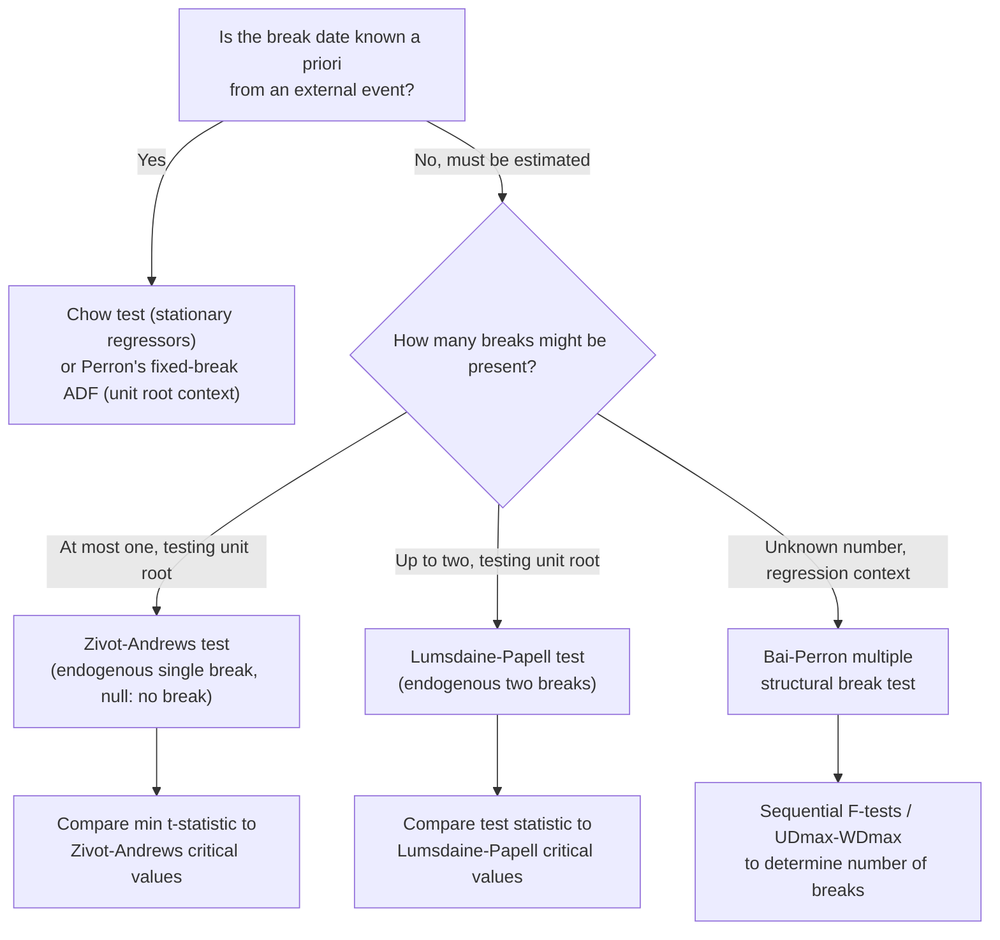

## Structural Break Testing

### Overview

Structural break testing addresses the possibility that parameters of a time series model — means, trends, regression coefficients, variances — change at one or more points during the sample period, rather than remaining constant throughout. Ignoring genuine structural breaks can severely distort unit root tests, cointegration tests, and forecasting, while spuriously detecting breaks that do not exist can lead to over-fitting and unstable inference. This topic covers both classical (known break date) and modern (unknown, endogenously estimated break date) approaches, with particular attention to their interaction with unit root and cointegration testing.

### Why Structural Breaks Matter for Unit Root and Cointegration Analysis

**Key Points**

- **Perron (1989)** demonstrated that a trend-stationary series with a single large structural break, if tested with standard ADF methodology that ignores the break, will frequently **fail to reject the unit root null** even though the series is genuinely stationary around a broken trend — the break's variance contribution gets absorbed into the autoregressive coefficient estimate, biasing $\hat\gamma$ toward zero.
- This finding was historically significant: Perron re-examined the Nelson-Plosser (1982) macroeconomic dataset — widely cited as evidence that most US macro series contain unit roots — and showed that allowing for a single break (e.g., the Great Depression) reversed the unit-root conclusion for several series, suggesting they were better characterized as trend-stationary with an interruption.
- Analogously, unmodeled breaks in a genuine cointegrating relationship can cause the Engle-Granger or Johansen procedures to **fail to detect cointegration** that is actually present but shifted (e.g., a change in the cointegrating vector itself, or in the equilibrium mean) partway through the sample.

### Chow Test: Known Break Date

The classical starting point, applicable when the potential break date $T_B$ is specified *a priori* (e.g., from a known policy change or historical event), not estimated from the data.

**Procedure:** Split the sample at $T_B$ into two subsamples. Estimate the regression separately on each subsample and on the full sample (pooled), then compute:

$$F = \frac{(SSR_{pooled} - SSR_1 - SSR_2)/k}{(SSR_1+SSR_2)/(T-2k)}$$

where $SSR_1, SSR_2$ are the sums of squared residuals from the two subsample regressions, $SSR_{pooled}$ from the full-sample regression, and $k$ is the number of parameters.

$$H_0: \text{no structural break (coefficients stable across } T_B\text{)}$$

**Key Points**

- Under $H_0$ and standard regularity conditions (stationary regressors, no unit roots), the Chow statistic follows a standard $F$-distribution — but this **breaks down** when applied to variables with unit roots, requiring the non-standard critical values developed in the unit-root break-testing literature described below.
- The Chow test requires the break date to be **exogenously known**, not searched for — using the Chow test with a break date chosen by inspecting the data (e.g., picking the date that appears to show the largest shift) invalidates the test's stated size, a form of pretesting bias.
- A variant, the **Quandt Likelihood Ratio (QLR)** test, addresses the unknown-break-date problem within the stationary-regressor Chow framework by computing the Chow statistic at every candidate break date within a trimmed interior region and taking the maximum — the precursor to the Zivot-Andrews approach in the unit root setting.

### Perron's Test with a Known Break Date

Perron (1989) extended the ADF framework to allow for a structural break at a known date $T_B$, under three canonical models:

**Model A (Crash model):** A one-time shift in the intercept of the series.

**Model B (Changing growth model):** A change in the slope of the trend, with the level unaffected.

**Model C (Mixed model):** Both a level shift and a slope change simultaneously.

The augmented regression includes dummy variables (e.g., $DU_t = 1$ if $t > T_B$ for a level shift; $DT_t = t - T_B$ for $t>T_B$, else 0, for a slope change) alongside the standard ADF specification, and tests $H_0: \gamma=0$ (unit root) against $H_1$: trend-stationary around the specified break.

**Key Points**

- Critical values for Perron's break-adjusted ADF statistic are **non-standard and depend on the location of the break** (expressed as $\lambda = T_B/T$, the break fraction) — tabulated separately from standard Dickey-Fuller critical values.
- Because the break date is treated as **known** (exogenous) in Perron's original formulation, using a data-selected break date within this framework without correction invalidates the reported critical values — this limitation directly motivated the endogenous-break extensions that followed.

### Zivot-Andrews Test: Endogenous Break Date

Zivot and Andrews (1992) addressed the exogeneity critique of Perron's approach by treating the break date as **unknown**, estimating it endogenously as part of the testing procedure, under the **null hypothesis of a unit root without a break** (a key distinction from some later tests, described below).

**Procedure:** For each candidate break date $T_B$ in a trimmed interior range of the sample (typically excluding the first and last ~10-15% of observations), estimate the break-augmented ADF regression and record the $t$-statistic on $\gamma$. The Zivot-Andrews test statistic is the **minimum** (most negative) $t$-statistic across all candidate break dates:

$$ZA = \min_{T_B} \hat t_\gamma(T_B)$$

The break date is selected as the one yielding this minimum — i.e., the date that provides the **strongest evidence against the unit root null**, which is also, by construction, the date most likely to be selected under the null even in the absence of a true break (hence the need for specialized, wider critical values than the fixed-break-date Perron test).

**Key Points**

- Because the break date is chosen to **maximize** the evidence against the unit root null (searching over many candidate dates), the resulting critical values are **more extreme** (more negative) than Perron's fixed-break-date critical values, correcting for this implicit data-mining/multiple-testing element.
- The null hypothesis in Zivot-Andrews is **unit root without a break** — a subtlety that matters: the test does not allow for the possibility of a unit root *with* a break under $H_0$, which some researchers view as a conceptual asymmetry (the alternative gets a break, the null does not) addressed by later tests.
- As with Perron's original test, Zivot-Andrews comes in three variants (level shift only, trend shift only, or both) matching Perron's Model A/B/C structure.

### Other Endogenous Break Unit Root Tests

- **Lumsdaine-Papell (1997):** extends Zivot-Andrews to allow for **two** structural breaks under the alternative, addressing series with multiple regime changes (e.g., separate breaks associated with distinct historical episodes).
- **Perron (1997):** refines the endogenous break search with alternative break-selection criteria (e.g., minimizing the $t$-statistic on the break dummy itself rather than on the unit-root coefficient).
- **Break tests allowing a break under both the null and alternative:** address the conceptual asymmetry in Zivot-Andrews by permitting the null hypothesis to include a break as well, testing unit-root-with-break against stationary-with-break rather than against the (arguably less realistic) no-break null.

### Bai-Perron: Multiple Structural Breaks in Regression Models

For regression contexts (not specifically unit root testing) where an **unknown number** of breaks at **unknown dates** may be present, Bai and Perron (1998, 2003) developed a systematic framework:

**Procedure:**

1. For a given maximum number of breaks $m$, estimate break dates and coefficients jointly by minimizing the sum of squared residuals across all possible partitions (efficiently computed via dynamic programming, avoiding the combinatorial explosion of naive search).
2. Test sequentially: $F$-type tests for $\ell$ versus $\ell+1$ breaks (the "sup $F_T(\ell+1|\ell)$" statistic), and a joint test for zero versus $m$ breaks (the "$UDmax$"/"$WDmax$" statistics).
3. Select the number of breaks via sequential testing or information criteria (BIC or a modified Schwarz criterion adapted for break testing).

**Key Points**

- Unlike Zivot-Andrews (which assumes at most one break under the alternative), Bai-Perron allows the **number of breaks to be estimated from the data**, making it more flexible for series with multiple regime shifts.
- Requires specifying a **minimum segment length** (trimming parameter) between breaks to ensure sufficient observations for estimation within each regime, which involves a bias-variance tradeoff similar to bandwidth/lag selection elsewhere in time series testing.
- Primarily developed for regression models with **stationary or trend-stationary regressors**; application to genuinely unit-root variables requires care and connects back to the unit-root-specific break tests above.

### Diagram: Structural Break Testing Decision Framework

### Structural Breaks and Cointegration: The Gregory-Hansen Test

Extending break-testing logic to the cointegration context, **Gregory and Hansen (1996)** developed a residual-based cointegration test allowing for a single structural break (in the intercept, slope, or both) in the cointegrating relationship, under the alternative hypothesis:

$$H_0: \text{no cointegration (with or without break)}$$

$$H_1: \text{cointegration with a single break in the relationship}$$

The procedure searches over candidate break dates, estimating the cointegrating regression with a break-shifted intercept/slope at each candidate date, and applies an ADF-type test to residuals at each, taking the most favorable (most negative) statistic across break dates — structurally analogous to Zivot-Andrews but applied to the cointegrating residual rather than a univariate series.

**Key Points**

- Standard Engle-Granger or Johansen tests, applied without allowing for a break, can **fail to detect genuine cointegration** if the cointegrating vector itself shifted partway through the sample (e.g., due to a policy regime change altering the long-run relationship between two variables).
- As with Zivot-Andrews, the Gregory-Hansen critical values are adjusted (more extreme than standard Engle-Granger critical values) to account for the implicit search over break dates.

### Example: US Real GNP and the Great Depression Break

Following Perron's (1989) original application: testing whether log real US GNP contains a unit root, using annual data spanning a period that includes the Great Depression.

**Step 1 — Standard ADF (no break):** Fail to reject the unit root null — consistent with the broader Nelson-Plosser finding that most macro aggregates appear to be $I(1)$.

**Step 2 — Perron's break test, fixed break at 1929 (Model C: level and slope shift):**

**Output (illustrative, following Perron's reported pattern):** $\hat t_\gamma \approx -3.9$ to $-4.2$ depending on exact specification; break-adjusted critical value (5%, $\lambda\approx 0.3$–0.5 depending on exact sample) $\approx -3.8$ to $-4.0$. Result: **reject** the unit root null once the Depression-era break is accommodated.

**Conclusion:** This finding — that allowing for a single large trend break reverses the unit-root conclusion — is Perron's central and most influential result, illustrating that failing to model a genuine structural break can lead researchers to conclude a series is difference-stationary ($I(1)$) when it is more accurately characterized as trend-stationary with an interruption.

### Software Implementation Notes

- **Stata:** `estat sbknown` / `estat sbsingle` (single unknown break, Bai-Perron style, post-`regress`); community-contributed commands for Zivot-Andrews (`zandrews`) and Gregory-Hansen tests.
- **R:** `strucchange` package (`Fstats()`, `sctest()` for Chow/CUSUM-type tests, `breakpoints()` for Bai-Perron multiple breaks); `urca::ur.za()` for Zivot-Andrews.
- **Python:** `statsmodels` provides basic Chow-type and CUSUM stability diagnostics; dedicated Zivot-Andrews/Gregory-Hansen implementations are less standardized across mainstream Python packages and often require custom implementation or specialized third-party libraries.

### Limitations

- All endogenous break-date tests involve an implicit **search over many candidate dates**, and while critical values are adjusted for this, the tests generally have **lower power** than tests with a genuinely known break date, given the extra uncertainty being accounted for.
- Tests assuming a fixed maximum number of breaks (one for Zivot-Andrews, two for Lumsdaine-Papell) will **misspecify** series with more breaks than assumed, potentially still producing misleading unit-root conclusions if the true break structure is richer.
- The trimming parameter (excluding a fraction of observations at the start/end of the sample from candidate break dates) is a necessary but somewhat arbitrary methodological choice affecting which breaks can be detected.
- **[Inference]** Distinguishing a genuine one-time structural break from other forms of non-linearity (e.g., smooth/gradual regime transition, Markov-switching dynamics, or a genuine unit root with no break at all) is not always possible from break tests alone, and the appropriate choice among these alternative frameworks often depends on institutional/historical knowledge of the series in question rather than statistical evidence alone.

**Related Topics**

- Random walks and unit root processes
- The Augmented Dickey-Fuller test
- The Gregory-Hansen test for cointegration with structural breaks
- Bai-Perron multiple structural break estimation
- Markov-switching and threshold time series models
- Recursive and rolling-window parameter stability diagnostics (CUSUM, CUSUM-of-squares)