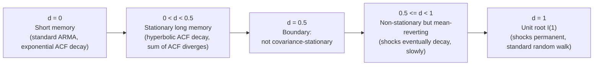

## Long Memory and Fractionally Integrated Processes

### Overview

Long memory (long-range dependence) processes occupy an intermediate ground between short-memory stationary processes (where autocorrelations decay exponentially, such as standard ARMA models) and unit root $I(1)$ processes (where shocks are permanent and autocorrelations decay not at all). Fractionally integrated processes formalize this via a non-integer differencing parameter $d$, extending the $I(0)/I(1)$ dichotomy of standard unit root analysis into a continuum. This framework is particularly relevant for financial volatility series, inflation rates, and other economic time series exhibiting slowly decaying but ultimately vanishing autocorrelation.

### Defining Long Memory

A covariance-stationary process $\{y_t\}$ exhibits **long memory** (long-range dependence) if its autocorrelation function $\rho(k)$ decays **hyperbolically** (at a polynomial rate) rather than exponentially as the lag $k \to \infty$:

$$\rho(k) \sim c\, k^{2d-1} \quad \text{as } k \to \infty$$

for some constant $c>0$ and memory parameter $d \in (0, 0.5)$. This contrasts with:

- **Short memory (e.g., stationary ARMA):** $\rho(k) \sim c\,\phi^k$ for $|\phi|<1$ — exponential (geometric) decay.
- **Unit root ($I(1)$, e.g., random walk):** autocorrelations do not decay to zero at all within any finite sample; the process is non-stationary.

**Key Points**

- A defining diagnostic feature of long memory: the sum of autocorrelations $\sum_{k=-\infty}^{\infty}\rho(k)$ **diverges** for $0<d<0.5$, unlike a short-memory process where this sum is finite — despite the process remaining covariance-stationary (unlike a unit root process, where variance itself is unbounded).
- The **spectral density** $f(\lambda)$ of a long memory process exhibits a pole (diverges) at frequency zero: $f(\lambda) \sim c\,\lambda^{-2d}$ as $\lambda \to 0$, providing an alternative frequency-domain characterization and the basis for several semi-parametric estimators of $d$.

### The Fractionally Integrated Process: $I(d)$

The **fractionally integrated** process, denoted $I(d)$ for non-integer $d$, is defined via the fractional differencing operator applied to the lag polynomial:

$$(1-L)^d y_t = \varepsilon_t$$

where $(1-L)^d$ is defined through its binomial series expansion:

$$(1-L)^d = \sum_{k=0}^{\infty} \binom{d}{k}(-L)^k = 1 - dL + \frac{d(d-1)}{2!}L^2 - \dots$$

This reduces to familiar cases at integer values: $d=0$ gives white noise (short memory, $I(0)$), $d=1$ gives the standard random walk difference operator ($I(1)$), and non-integer $d$ interpolates continuously between these.

**Classification by value of $d$:**

| Range of $d$ | Property |
| --- | --- |
| $d = 0$ | Short memory, standard stationary process (e.g., ARMA) |
| $0 < d < 0.5$ | Stationary, but with long memory (hyperbolic ACF decay, infinite sum of autocorrelations) |
| $d = 0.5$ | Boundary case; not covariance-stationary |
| $0.5 \leq d < 1$ | Non-stationary, but **mean-reverting**: shocks eventually die out, though slowly, and the process does not have a finite unconditional variance |
| $d = 1$ | Standard unit root process ($I(1)$); shocks are permanent |
| $d > 1$ | Higher-order non-stationarity, requiring multiple fractional/integer differencing |

**Key Points**

- The region $0.5 \leq d < 1$ is often described as **"mean-reverting but non-stationary"** — an intermediate category with no analog in the standard $I(0)/I(1)$ dichotomy: shocks eventually dissipate (mean reversion, unlike $I(1)$), but the process lacks finite variance (non-stationary, unlike $I(0)$ or the $0<d<0.5$ stationary long-memory region).
- Estimating $d$ as a **continuous parameter** rather than testing a binary $I(0)$ vs. $I(1)$ hypothesis is the central methodological shift long memory analysis introduces relative to standard unit root testing.

### ARFIMA Models: Combining Fractional Integration with Short-Run Dynamics

The **ARFIMA($p,d,q$)** model (Autoregressive Fractionally Integrated Moving Average) combines fractional differencing with standard ARMA short-run dynamics:

$$\Phi(L)(1-L)^d y_t = \Theta(L)\varepsilon_t$$

where $\Phi(L) = 1-\phi_1 L - \dots -\phi_p L^p$ and $\Theta(L)=1+\theta_1 L+\dots+\theta_q L^q$ are standard AR and MA polynomials, and $d$ captures the long-memory component separately from the short-run ARMA dynamics.

**Key Points**

- This separates two conceptually distinct sources of persistence: **short-run dynamics** (captured by $\Phi(L), \Theta(L)$, governing behavior at short lags) and **long-run memory** (captured by $d$, governing the rate of decay at long lags) — a standard ARMA model forces these to be governed by the same exponential-decay mechanism, which ARFIMA relaxes.
- ARFIMA models nest both standard ARMA ($d=0$) and ARIMA with a unit root ($d=1$) as special cases, making the standard unit-root-vs-stationary dichotomy a testable restriction ($d=0$ or $d=1$) within the broader ARFIMA framework rather than a maintained assumption.

### Estimating the Memory Parameter $d$

**Semi-parametric methods** (do not require specifying the full ARFIMA short-run structure):

- **Geweke-Porter-Hudak (GPH) log-periodogram regression:** regresses the log of the periodogram (an estimate of the spectral density) on $\log|2\sin(\lambda_j/2)|$ for frequencies $\lambda_j$ near zero, with the slope coefficient providing an estimate of $-d$ (or $2d$ depending on parameterization). Simple to implement but requires choosing a bandwidth (how many low frequencies to include), with results sensitive to this choice.
- **Local Whittle (Gaussian semi-parametric) estimator:** a frequency-domain maximum-likelihood-type approach focused on frequencies near zero, generally regarded as having better asymptotic properties than GPH (smaller asymptotic variance) at the cost of requiring numerical optimization rather than simple regression.
- **Rescaled range (R/S) analysis (Hurst exponent):** an older, time-domain method relating a rescaled-range statistic to the sample size via a power law, with the estimated Hurst exponent $H$ related to $d$ via $H = d+0.5$. Historically important (originating in hydrology, Hurst 1951) but generally considered to have less favorable statistical properties than modern spectral-based estimators.

**Parametric/full-likelihood methods:**

- **Exact or approximate maximum likelihood** for the full ARFIMA($p,d,q$) model, jointly estimating $d$ alongside the AR and MA parameters, typically via the Sowell (1992) exact likelihood or Whittle-likelihood-based approximations for computational tractability with longer series.

**Key Points**

- Semi-parametric methods avoid the risk of misspecifying the short-run ARMA structure but are generally **less efficient** than correctly specified parametric methods; parametric methods gain efficiency at the cost of being sensitive to short-run model misspecification.
- Bandwidth/frequency-range choices in semi-parametric methods (how many low frequencies to include in GPH or local Whittle estimation) involve a bias-variance tradeoff directly analogous to bandwidth choices in kernel-based long-run variance estimation (e.g., in the Phillips-Perron test) — too few frequencies increase variance, too many introduce bias from contamination by short-run dynamics.

### Testing for Long Memory vs. Short Memory or Unit Root

**Key Points**

- Standard unit root tests (ADF, PP) have a **binary null** ($d=0$ vs. an unspecified alternative, or effectively testing $d=1$ against $d=0$) and are known to have **poor discriminatory power** between a true long-memory process ($0<d<1$, not equal to 0 or 1) and either a short-memory stationary process or a unit root — a long-memory process can appear to satisfy or violate a standard ADF test depending on sample size and the specific value of $d$, without this reflecting a genuine unit root or genuine short memory.
- Specific tests for long memory against short memory (e.g., **Robinson's (1994) LM test**, or tests based on the estimated $d$'s confidence interval excluding 0 and 1) are preferred when long memory is a serious candidate explanation, rather than forcing a binary $I(0)$/$I(1)$ classification via standard unit root tests.
- **[Inference]** A well-documented empirical concern in this literature is that long memory can be difficult to distinguish from structural breaks or regime-switching in finite samples — a series with an unmodeled break can exhibit sample autocorrelation patterns that closely mimic genuine fractional integration, an ambiguity sometimes termed "spurious long memory."

### Diagram: The $I(0)$–$I(d)$–$I(1)$ Continuum

### Applications in Economics and Finance

**Key Points**

- **Volatility persistence:** realized volatility and squared/absolute returns in financial markets are widely documented to exhibit long memory, with estimated $d$ typically in the range 0.3–0.45 — motivating long-memory volatility models (FIGARCH, the fractionally integrated GARCH model) as an alternative to standard GARCH's exponential volatility decay.
- **Inflation rates:** several studies estimate fractional integration in inflation series, with findings often (though not universally) supporting $0<d<1$ rather than clean $I(0)$ or $I(1)$ classification, with implications for the persistence of inflation shocks and the credibility of monetary policy regimes.
- **Interest rates and exchange rates:** long-memory characterizations have been proposed as an alternative to the "near unit root but not quite" characterization common in these literatures, though this remains an area of ongoing debate rather than settled consensus.

### Forecasting Implications

**Key Points**

- ARFIMA models generally imply forecasts that decay toward the unconditional mean **more slowly** than a comparable short-memory ARMA model but, unlike an $I(1)$/random-walk forecast, **do** eventually revert (for $d<1$) — an intermediate forecasting behavior directly reflecting the intermediate persistence structure.
- **[Inference]** Empirical forecast comparison studies show mixed results on whether ARFIMA improves out-of-sample forecast accuracy relative to simpler short-memory or unit-root benchmarks; gains appear most consistently in **long-horizon** forecasts of genuinely long-memory series (e.g., volatility), with less consistent benefit at short horizons where short-run ARMA dynamics dominate.

### Example: Estimating Long Memory in Realized Volatility

Suppose estimating the memory parameter of a daily realized volatility series for an equity index using the local Whittle estimator.

**Step 1:** Compute the periodogram of the log realized volatility series.

**Step 2:** Select a bandwidth $m$ (number of low frequencies used), commonly $m = T^{0.5}$ to $T^{0.8}$ as a rule of thumb, checking robustness across this range.

**Output (illustrative):** $\hat d \approx 0.40$ (standard error $\approx 0.05$), with a 95% confidence interval that excludes both 0 and 1.

**Conclusion:** The estimate is consistent with genuine long memory (stationary, $0<d<0.5$) rather than either short memory ($d=0$) or a unit root ($d=1$) — a commonly replicated finding for realized volatility series across many markets and sample periods, motivating the widespread use of long-memory volatility models (e.g., FIGARCH, HAR-RV) in applied volatility forecasting.

### Software Implementation Notes

- **R:** `fracdiff` package (`fracdiff()` for ARFIMA estimation via approximate MLE); `LongMemoryTS` package provides GPH, local Whittle, and related semi-parametric $d$ estimators along with tests for long memory.
- **Python:** `arfima` and related third-party packages provide ARFIMA estimation; local Whittle and GPH estimators are less standardized in mainstream Python libraries and often require custom implementation.
- **Stata:** `arfima` command (community-contributed) for ARFIMA model estimation.

### Limitations

- Estimates of $d$ can be **highly sensitive to bandwidth/frequency-range choices** in semi-parametric methods, and to the assumed short-run ARMA order in parametric methods — reported point estimates without robustness checks across these choices should be interpreted cautiously.
- **Difficulty distinguishing genuine long memory from structural breaks** or regime-switching remains a significant, only partially resolved methodological challenge; some breaks-based data-generating processes can produce sample autocorrelation and periodogram patterns that closely mimic fractional integration.
- Standard unit root and cointegration testing frameworks (ADF, Engle-Granger, Johansen) are built around the integer $I(0)/I(1)$ dichotomy and do not directly generalize to fractional cointegration settings without substantial additional theory (fractional cointegration, an active but more specialized research area).
- **[Inference]** The economic interpretation of an estimated non-integer $d$ (e.g., $d=0.4$) is less immediately intuitive than the binary stationary/non-stationary distinction, and applied researchers vary in how much substantive weight they place on precise point estimates of $d$ versus its broader qualitative implication (slow-decaying but bounded persistence).

**Related Topics**

- Random walks and unit root processes
- The Augmented Dickey-Fuller test
- FIGARCH and long-memory volatility models
- Structural break testing and its interaction with long memory
- Fractional cointegration
- Spectral analysis of time series