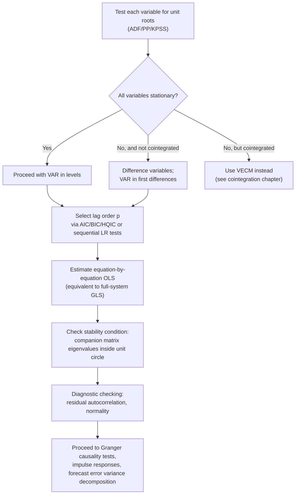

## VAR Model Specification and Estimation

### Overview

The Vector Autoregression (VAR) model, introduced to macroeconomics by Sims (1980) as a critique of large-scale structural simultaneous-equations models, treats all variables in a system symmetrically as jointly endogenous, with each variable modeled as a linear function of its own lags and the lags of every other variable in the system. VARs form the foundation for a broad range of empirical macroeconomic and financial applications: forecasting, Granger causality testing, impulse response analysis, and — with additional identifying restrictions — structural analysis of the transmission of economic shocks.

### The Reduced-Form VAR

For an $n \times 1$ vector of variables $Y_t = (y_{1t}, y_{2t}, \dots, y_{nt})'$, a VAR of order $p$, denoted VAR($p$), is:

$$Y_t = c + A_1 Y_{t-1} + A_2 Y_{t-2} + \dots + A_p Y_{t-p} + \varepsilon_t$$

where $c$ is an $n\times1$ vector of intercepts, each $A_i$ is an $n\times n$ matrix of coefficients, and $\varepsilon_t$ is an $n\times 1$ vector of **reduced-form errors** with $E[\varepsilon_t]=0$, $E[\varepsilon_t\varepsilon_t']=\Sigma$ (generally non-diagonal — contemporaneous correlation across equations is expected and unrestricted), and $E[\varepsilon_t\varepsilon_s']=0$ for $t\neq s$.

**Key Points**

- Every equation in the system has the **same set of regressors** — lags of all variables in the system — which is what permits equation-by-equation OLS estimation to be fully efficient (see Estimation below), a major practical advantage over general simultaneous-equations systems.
- The reduced-form errors $\varepsilon_t$ are generally **contemporaneously correlated** across equations (off-diagonal elements of $\Sigma$ nonzero) but are **not** structural shocks with direct economic interpretation — this distinction motivates the separate structural VAR (SVAR) framework for shock identification.
- VARs are inherently **atheoretical** in their reduced form: no variable is designated exogenous *a priori*, reflecting Sims's original critique that traditional simultaneous-equations models imposed incredible identifying restrictions (which variables belong in which equation) without adequate justification.

### Stationarity Requirement and Pre-Testing

Standard VAR estimation and inference assume all variables in $Y_t$ are **covariance-stationary**. This requires pre-testing each series (via ADF, PP, KPSS — covered under unit root testing) before specifying the VAR.

**Key Points**

- If variables are individually $I(1)$ and **not cointegrated**, the standard approach is to difference each series and estimate a VAR in first differences, $\Delta Y_t$, avoiding the unit-root complications and non-standard asymptotic distributions that arise with levels VARs on non-stationary data.
- If variables are $I(1)$ **and cointegrated**, differencing discards the long-run equilibrium information; the appropriate specification is instead a **Vector Error Correction Model (VECM)**, which nests the VAR-in-differences as a special (restricted) case.
- A VAR in **levels** with non-stationary variables can still be estimated by OLS and remains consistent, but standard asymptotic theory for hypothesis testing (e.g., Wald tests on individual coefficients) is invalid without correction — motivating either differencing, a VECM, or specialized inference procedures (e.g., the lag-augmented VAR approach of Toda-Yamamoto, which restores standard asymptotics for Granger causality testing specifically).

### The Stability Condition

A VAR($p$) is **stable** (its stationary solution exists and the process is covariance-stationary given stationary inputs) if all roots of the characteristic equation

$$\det\left(I_n - A_1 z - A_2 z^2 - \dots - A_p z^p\right) = 0$$

lie **outside** the unit circle — equivalently, all eigenvalues of the VAR's companion matrix have modulus less than 1.

**Key Points**

- Stability is a **necessary condition** for standard VAR-based impulse response and forecast error variance analysis to be well-defined (impulse responses must eventually decay to zero for a stable system).
- Estimated eigenvalues close to (but just inside) the unit circle indicate a **near-unit-root** system, where finite-sample inference may be poorly approximated by standard asymptotic theory even though the stability condition is formally satisfied — a common practical concern with persistent macroeconomic data.
- Software typically reports the modulus of the largest eigenvalue of the companion matrix as a standard post-estimation diagnostic.

### Lag Order Selection

Choosing $p$ is a central specification decision, balancing the bias-variance tradeoff: too few lags risk omitted dynamics (residual serial correlation, biased impulse responses); too many lags consume degrees of freedom rapidly, since the number of estimated parameters grows with $n^2 p$.

**Information criteria** (each computed for a range of candidate lag orders, typically choosing the minimizing $p$):

$$AIC(p) = \ln|\hat\Sigma(p)| + \frac{2}{T}pn^2$$

$$BIC/SIC(p) = \ln|\hat\Sigma(p)| + \frac{\ln T}{T}pn^2$$

$$HQIC(p) = \ln|\hat\Sigma(p)| + \frac{2\ln\ln T}{T}pn^2$$

where $\hat\Sigma(p)$ is the estimated residual covariance matrix for lag order $p$.

**Key Points**

- **AIC** tends to select **longer** lag lengths than BIC/HQIC, since its penalty term grows more slowly with $T$; BIC is asymptotically consistent for the true lag order under standard conditions (selects the correct $p$ with probability approaching 1 as $T\to\infty$, if a finite true order exists), while AIC is not consistent in this sense (asymptotically over-selects with positive probability).
- **Sequential likelihood ratio (LR) testing:** starting from a maximum lag $p_{max}$, test $H_0: p = p_{max}-1$ against $H_1: p=p_{max}$ via a likelihood ratio statistic, reducing $p$ until rejection; requires the standard LR asymptotic chi-squared distribution, valid for stationary VARs.
- In small samples relative to the number of variables ($n$ large relative to $T$), even modest lag orders can consume a large share of available degrees of freedom — a practical consideration sometimes leading applied researchers to favor BIC's parsimony or to impose additional structure (e.g., Bayesian shrinkage, covered under BVAR topics) rather than rely solely on unrestricted lag-order selection criteria.

### Estimation: Equation-by-Equation OLS

Because every equation shares the identical set of regressors (lags of all variables), the reduced-form VAR can be estimated **equation by equation via OLS**, and this is numerically and asymptotically **equivalent to full-system Generalized Least Squares (GLS)** — a direct consequence of the "seemingly unrelated regressions" (SUR) efficiency result when regressors are identical across equations.

**Key Points**

- No iterative or system-wide estimation procedure is required for the reduced-form VAR; simple OLS on each equation, applied to the common set of lagged regressors, delivers the maximum likelihood estimates under the assumption of jointly normal errors (and remains consistent, though not necessarily efficient in exactly the same sense, under non-normality).
- The residual covariance matrix is estimated as $\hat\Sigma = \frac{1}{T-k}\hat{E}'\hat{E}$ (or with a small-sample degrees-of-freedom adjustment $k = np+1$ accounting for the number of parameters per equation), where $\hat E$ is the $T\times n$ matrix of stacked residuals.
- Standard errors on individual coefficients are valid under standard OLS assumptions (applied equation-by-equation); however, joint hypotheses spanning multiple equations (e.g., Granger causality tests, described below) require the full estimated covariance structure and are typically implemented via Wald or likelihood ratio tests using the complete VAR system output.

### Granger Causality Testing

A central diagnostic use of estimated VARs: testing whether the lags of one variable (or block of variables) help predict another, in the specific (and often misunderstood) Granger sense of statistical predictability, not necessarily true causal influence.

$$H_0: \text{lags of } x_t \text{ do not Granger-cause } y_t \quad \Leftrightarrow \quad H_0: A_1^{(y,x)} = A_2^{(y,x)} = \dots = A_p^{(y,x)} = 0$$

where $A_i^{(y,x)}$ denotes the coefficient(s) on lagged $x_{t-i}$ in the equation for $y_t$. Tested via a standard Wald or $F$-test (for stationary VARs) on the relevant coefficient block.

**Key Points**

- "Granger causality" is a statement about **incremental predictive content**, not structural/economic causality — $x_t$ Granger-causing $y_t$ means past $x$ improves the forecast of $y$ beyond what past $y$ alone provides, which can arise from genuine causal mechanisms, common driving factors, or other statistical associations.
- When variables are $I(1)$ and potentially cointegrated, the standard Wald test for Granger causality has a **non-standard asymptotic distribution** in a levels VAR; the **Toda-Yamamoto (1995)** procedure — estimating a VAR with $p + d_{max}$ lags (where $d_{max}$ is the maximum suspected order of integration) and testing only the original $p$ coefficients — restores standard asymptotic chi-squared inference without requiring pre-testing for cointegration.
- Bidirectional Granger causality (each variable Granger-causes the other) is common and not contradictory — it simply indicates mutual predictive feedback, consistent with many genuine economic feedback relationships (e.g., between output and employment).

### Diagram: VAR Specification and Estimation Workflow

### Model Diagnostics

After estimation, standard practice includes:

- **Residual autocorrelation:** multivariate Portmanteau (Ljung-Box-type) or LM tests on the VAR residuals, checking that the chosen lag order $p$ adequately captures the system's dynamics.
- **Normality:** multivariate Jarque-Bera-type tests on residuals — relevant for exact finite-sample inference and Cholesky-based structural identification, though large-sample inference is often reasonably robust to moderate non-normality.
- **Stability:** as discussed above, checking the companion matrix eigenvalue condition, often visualized as a plot of eigenvalue moduli relative to the unit circle.
- **Parameter stability over time:** recursive estimation, CUSUM tests, or formal structural break tests (Chow, Bai-Perron) applied to the VAR coefficients, checking for regime changes that a single fixed-coefficient VAR would miss.

### Example: A Three-Variable Macroeconomic VAR

Suppose specifying a standard monetary VAR with GDP growth $g_t$, inflation $\pi_t$, and a short-term interest rate $r_t$ — a canonical specification in monetary transmission mechanism studies.

**Step 1:** Confirm via ADF/KPSS that all three series are stationary (or use standard transformations — e.g., first-differencing price levels to obtain inflation — to achieve stationarity before entering the VAR).

**Step 2:** Lag order selection: AIC suggests $p=4$ (quarterly data, consistent with roughly a one-year monetary transmission horizon), BIC suggests $p=2$; given the well-documented tendency of AIC to over-select, and given the standard applied practice of favoring parsimony absent strong contrary evidence, $p=2$ is adopted as the baseline, with $p=4$ reported as a robustness check.

**Step 3:** Estimate via equation-by-equation OLS.

**Output (illustrative):**

- Stability check: largest companion matrix eigenvalue modulus $\approx 0.91$ — inside the unit circle, confirming stability, though the value's proximity to 1 signals a highly persistent (though formally stationary) system.
- Granger causality test: lagged interest rate significantly Granger-causes GDP growth ($p$-value $<0.01$), consistent with a standard monetary transmission channel; GDP growth does not significantly Granger-cause the interest rate at conventional levels, broadly consistent with (though not proof of) a policy-reaction-function interpretation where the central bank does not solely react to contemporaneous growth via a lagged univariate channel captured in this simple specification.

### VAR Order (n, p) Parameter Proliferation

**Key Points**

- The number of estimated coefficients in a VAR($p$) with $n$ variables is $n^2 p$ (plus $n$ intercepts), growing **quadratically in $n$** and linearly in $p$ — a 6-variable VAR with 4 lags already involves 144 autoregressive coefficients, a substantial parameter count relative to typical macroeconomic sample sizes (often only a few hundred quarterly observations).
- This "curse of dimensionality" is the primary practical motivation for **Bayesian VAR (BVAR)** approaches, which impose shrinkage priors (e.g., the Minnesota prior) to stabilize estimation in larger systems — a natural extension once the unrestricted VAR framework's parameter-proliferation limitation is recognized.

### Software Implementation Notes

- **Stata:** `var` command for estimation, `varsoc` for lag order selection (reports AIC/BIC/HQIC/LR side by side), `varstable` for the stability/eigenvalue check, `vargranger` for Granger causality tests.
- **R:** `vars` package — `VAR()` for estimation, `VARselect()` for lag order selection, `roots()` for stability check, `causality()` for Granger causality tests.
- **Python:** `statsmodels.tsa.api.VAR` — `.select_order()` for lag selection, `.fit()` for estimation, `.is_stable()` for the stability check, and `.test_causality()` for Granger causality testing.

### Limitations

- Reduced-form VARs are **not directly interpretable in structural/causal terms** — the contemporaneous correlation in $\Sigma$ reflects an unresolved mix of genuine contemporaneous causal links and common unobserved shocks, requiring additional identifying assumptions (structural VAR methods) before impulse responses or variance decompositions can be given a causal economic interpretation.
- Parameter proliferation limits the number of variables that can be included in an unrestricted VAR given typical macroeconomic sample sizes, creating tension between wanting a comprehensive system (avoiding **omitted variable bias** from excluding relevant channels) and maintaining estimable degrees of freedom.
- Lag order selection criteria can disagree substantially (AIC vs. BIC), and results — particularly impulse responses at longer horizons — can be sensitive to this choice in ways not always transparent from standard diagnostic output alone.
- **[Inference]** The assumption of constant (time-invariant) coefficients throughout the sample is a strong maintained hypothesis for long macroeconomic time series spanning multiple policy regimes or structural changes; time-varying-parameter VAR extensions relax this at the cost of substantially increased estimation complexity, and the choice between fixed-coefficient and time-varying specifications is not purely a statistical question but also reflects judgment about the underlying economic stability of the sample period.

**Related Topics**

- Structural VAR identification (Cholesky, sign restrictions, long-run restrictions)
- Impulse response functions and forecast error variance decomposition
- Granger causality testing and the Toda-Yamamoto procedure
- Vector Error Correction Models (VECM)
- Bayesian VAR and the Minnesota prior
- Lag order selection criteria (AIC, BIC, HQIC)