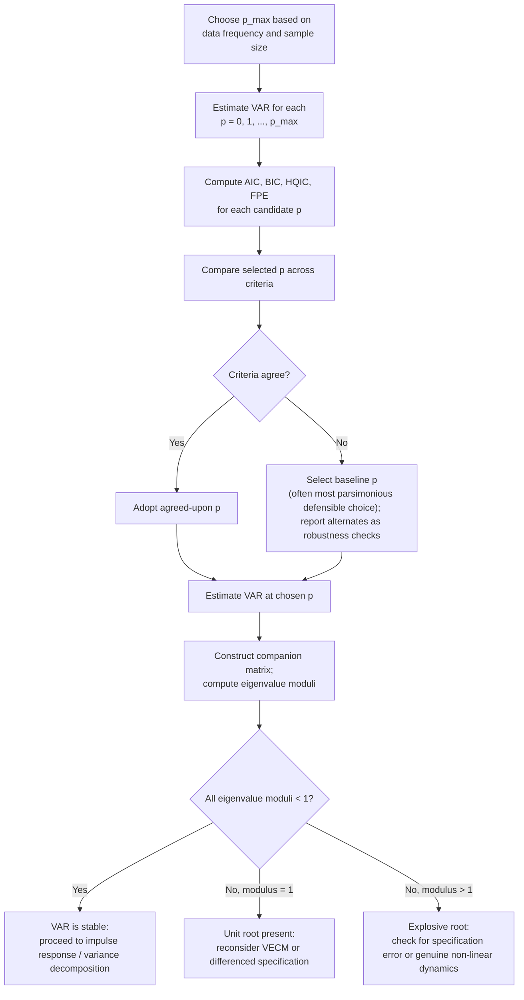

## Lag Length Selection and Stability

### Overview

Lag length selection and stability checking are two closely linked specification tasks that must precede any credible VAR-based analysis. Choosing the number of lags $p$ determines the model's ability to capture genuine dynamics without excessive parameter proliferation, while verifying stability confirms the estimated system produces a well-behaved, mean-reverting stochastic process suitable for standard impulse response and variance decomposition analysis. Though covered briefly in general VAR specification, this entry treats both topics in depth, since misspecification here propagates into every downstream VAR-based result.

### The Bias-Variance Tradeoff in Lag Selection

Choosing $p$ involves a fundamental tradeoff:

- **Too few lags:** the model fails to capture the true dynamics, leaving **residual serial correlation** — a clear violation of the white-noise error assumption that invalidates standard inference (t-tests, F-tests, impulse response standard errors) and can bias coefficient estimates if the omitted dynamics correlate with included regressors.
- **Too many lags:** the number of estimated parameters, $n^2p + n$ (for an $n$-variable VAR), grows rapidly, consuming degrees of freedom, inflating parameter estimation variance, and — in datasets with limited time-series length — potentially exceeding the number of available observations entirely if $p$ is set carelessly high relative to $T$.

This tradeoff is directly analogous to bandwidth and lag-order choices elsewhere in time series econometrics (e.g., ADF augmentation lags, HAC bandwidth selection), reflecting a general principle: dynamic model specification always balances fit against parsimony.

### Information Criteria

The standard formal approach computes an information criterion across a range of candidate lag orders $p = 0, 1, \dots, p_{max}$ and selects the minimizing value:

$$AIC(p) = \ln|\hat\Sigma(p)| + \frac{2}{T}\,pn^2$$

$$BIC/SIC(p) = \ln|\hat\Sigma(p)| + \frac{\ln T}{T}\,pn^2$$

$$HQIC(p) = \ln|\hat\Sigma(p)| + \frac{2\ln\ln T}{T}\,pn^2$$

$$FPE(p) = \left(\frac{T+k}{T-k}\right)^n |\hat\Sigma(p)|$$

where $\hat\Sigma(p)$ is the residual covariance matrix estimated under lag order $p$, and $k=np+1$ is the number of regressors per equation. The **Final Prediction Error (FPE)** criterion is asymptotically equivalent to AIC and is reported by some software packages as an additional option.

**Key Points**

- The penalty terms differ in how strongly they penalize additional lags as $T$ grows: $BIC$'s penalty ($\ln T$) grows faster than $AIC$'s (constant, $=2$), meaning **BIC will always select a lag order less than or equal to AIC's** in sufficiently large samples, and typically selects a more parsimonious model in practice.
- $BIC$ is **consistent**: if a true finite lag order exists, $BIC$ selects it with probability approaching 1 as $T\to\infty$. $AIC$ is **not consistent** in this sense — it has positive asymptotic probability of over-selecting the lag order, though it has other desirable properties (asymptotic efficiency for prediction under certain conditions where no finite true order exists).
- $HQIC$ (Hannan-Quinn) sits between $AIC$ and $BIC$ in its penalty stringency, offering a compromise that is also asymptotically consistent, though with a slower rate of convergence than $BIC$.
- When criteria disagree — a common occurrence in applied work — there is no universally correct resolution; standard practice is to report the range of criteria, select a baseline (often the most parsimonious defensible choice, or a criterion favored by convention in the specific subfield), and check robustness of key results (impulse responses, Granger causality conclusions) across the disputed range.

### Sequential Likelihood Ratio Testing

An alternative (or complementary) approach: starting from a generously specified maximum lag $p_{max}$, test $H_0: p = p_{max}-1$ against $H_1: p=p_{max}$ using a likelihood ratio statistic:

$$LR = (T-c)\left(\ln|\hat\Sigma_{p-1}| - \ln|\hat\Sigma_p|\right) \sim \chi^2_{n^2}$$

where $c$ is a small-sample degrees-of-freedom correction (commonly the number of regressors per equation in the larger model), and the test is applied sequentially, reducing $p$ by one each time the null is rejected, stopping at the first non-rejection.

**Key Points**

- This procedure requires the VAR to be estimated with **stationary** variables for the standard chi-squared asymptotic distribution to apply; with non-stationary (unit-root) variables, the distribution is non-standard unless the Toda-Yamamoto lag-augmentation approach (adding extra lags equal to the suspected maximal integration order) is used.
- Sequential testing at a fixed significance level (e.g., 5% at each step) does not control the overall (family-wise) size of the combined testing procedure across all the sequential comparisons — a standard multiple-testing caveat that applies to sequential lag-order testing as it does elsewhere.
- In practice, sequential LR testing and information criteria are often reported together, with convergence across methods lending more confidence to the selected lag order, and disagreement prompting closer inspection of the specific dynamics driving the discrepancy.

### Choosing $p_{max}$

The maximum candidate lag order $p_{max}$ over which information criteria or sequential tests search must itself be chosen, typically based on:

- **Data frequency:** e.g., for quarterly data, $p_{max}=8$ (two years) is a common starting choice; for monthly data, $p_{max}=12$ or $24$; annual data, often $p_{max}=2$ to $4$ given typically shorter annual samples.
- **Sample size constraints:** $p_{max}$ should not be so large that the resulting parameter count approaches or exceeds available degrees of freedom — a rule of thumb sometimes cited is keeping $n^2 p_{max}$ well below $T$.
- **Economic/institutional priors:** e.g., known seasonal patterns, policy transmission horizons, or contractual/reporting cycles can motivate a specific $p_{max}$ a priori.

**Key Points**

- Setting $p_{max}$ too low forecloses the possibility of detecting genuinely longer dynamics; setting it too high (relative to $T$) can produce unstable or non-estimable models at the upper end of the search range, and can also distort information-criterion comparisons if the highest-order models are poorly estimated.
- Results, particularly for impulse responses at longer horizons, can be sensitive to the choice of $p_{max}$ even when the *selected* $p$ (via AIC/BIC) is well within the search range — a robustness check varying $p_{max}$ itself is a useful diagnostic supplement.

### The Stability Condition

Once a lag order $p$ is chosen and the VAR estimated, the **stability condition** must be verified before proceeding to impulse response analysis, forecast error variance decomposition, or other standard VAR-based inference.

**Companion form:** any VAR($p$) can be rewritten as a VAR(1) in a stacked $(np)\times 1$ vector $Z_t = (Y_t', Y_{t-1}', \dots, Y_{t-p+1}')'$:

$$Z_t = C + \mathbf{A}\,Z_{t-1} + U_t$$

where $\mathbf{A}$ is the $np\times np$ **companion matrix**:

$$\mathbf{A} = \begin{pmatrix} A_1 & A_2 & \cdots & A_{p-1} & A_p \\ I_n & 0 & \cdots & 0 & 0 \\ 0 & I_n & \cdots & 0 & 0 \\ \vdots & & \ddots & & \vdots \\ 0 & 0 & \cdots & I_n & 0 \end{pmatrix}$$

**Stability condition:** all eigenvalues of $\mathbf{A}$ must have modulus strictly less than 1 (equivalently, all roots of the VAR's characteristic polynomial lie outside the unit circle).

**Key Points**

- Stability is **necessary** for the VAR to have a valid covariance-stationary, purely non-deterministic (Wold) moving-average representation — the basis for impulse response functions, which require shocks' effects to eventually decay to zero.
- An eigenvalue modulus **equal to 1** indicates a unit root within the system — consistent with the variables being (individually or jointly, via cointegration) non-stationary, in which case a levels VAR is misspecified and either differencing or a VECM specification is required (see the VECM and cointegration entries).
- An eigenvalue modulus **greater than 1** indicates an **explosive** root, rare in standard macroeconomic applications and often a signal of a coding or specification error (e.g., a variable entered in the wrong units, or a genuinely mis-specified model) rather than a substantive economic finding, though it can occasionally reflect genuine local explosiveness (e.g., asset price bubbles) that would require specialized non-linear or regime-switching treatment beyond the standard linear VAR framework.

### Diagram: Lag Selection and Stability Checking Workflow

### Post-Selection Residual Diagnostics

Lag order selection via information criteria or sequential testing should always be followed by direct residual diagnostic checks, since a criterion-minimizing $p$ does not guarantee adequate whitening in every application:

- **Multivariate Portmanteau/Ljung-Box test** on VAR residuals, checking for remaining serial correlation at the chosen lag order.
- **LM test for residual autocorrelation** (Breusch-Godfrey-type, extended to the VAR/multivariate setting), often preferred over Portmanteau tests for its better small-sample properties.
- If diagnostics indicate remaining serial correlation despite information-criterion-based selection, increasing $p$ beyond the criterion-selected value, or reconsidering the model specification (e.g., missing variables, seasonal effects), is standard remedial practice.

### Example: Lag Selection for a Quarterly Macro VAR

Suppose specifying a VAR with three quarterly macro variables (output growth, inflation, policy rate) over a sample of $T=120$ observations (30 years).

**Step 1:** Set $p_{max}=8$ (two years), given quarterly frequency and standard practice in the monetary VAR literature.

**Output (illustrative):**

| $p$ | AIC | BIC | HQIC |
| --- | --- | --- | --- |
| 1 | -12.10 | -11.85 | -12.00 |
| 2 | -12.45 | -11.98 | -12.26 |
| 3 | -12.52 | -11.83 | -12.24 |
| 4 | -12.58 | -11.67 | -12.21 |
| 5 | -12.55 | -11.42 | -12.09 |

**Step 2:** AIC is minimized at $p=4$; BIC and HQIC are both minimized at $p=2$, reflecting BIC's stronger parsimony penalty as sample size and parameter count grow.

**Step 3:** Given the well-documented tendency of AIC to over-select in finite samples, and given BIC/HQIC agreement, $p=2$ is adopted as the baseline specification, with $p=4$ reported as an AIC-consistent robustness check.

**Step 4 — Stability check:** companion matrix (dimension $6\times 6$ for $n=3$, $p=2$) eigenvalue moduli: largest $=0.89$, all others smaller — confirms stability, with the largest eigenvalue's proximity to 1 flagged as indicating a highly persistent (though formally stationary) estimated system, warranting caution in interpreting very long-horizon impulse responses.

### Software Implementation Notes

- **Stata:** `varsoc` reports AIC, BIC/SIC, HQIC, FPE, and sequential LR test results side-by-side for a specified range of lag orders, with the selected $p$ under each criterion flagged (`*`); `varstable` computes and plots companion matrix eigenvalue moduli relative to the unit circle after estimation.
- **R:** `vars::VARselect(y, lag.max, type)` reports all four standard criteria across candidate lags; `vars::roots(varmodel)` returns companion matrix eigenvalue moduli after estimation with `VAR()`.
- **Python:** `statsmodels.tsa.api.VAR(data).select_order(maxlags)` returns a summary table of AIC/BIC/HQIC/FPE-selected orders; `.fit(p).is_stable()` returns a boolean stability check, with the underlying eigenvalues accessible via the fitted results object.

### Limitations

- Information criteria disagreement (AIC vs. BIC/HQIC) is common and has no universally accepted resolution; the choice of which criterion to prioritize is partly a matter of field convention rather than a settled statistical question, and results should be checked for robustness across the plausible range.
- Sequential LR testing at conventional significance levels does not control family-wise error across the full sequence of tests, a standard but often under-acknowledged caveat in applied lag-selection practice.
- Lag order selection procedures assume the true dynamics are well-approximated by a **finite-order linear VAR**; if the true data-generating process involves genuinely richer dynamics (e.g., long memory, regime-switching, or structural breaks in the autoregressive structure), no finite lag order will fully resolve residual misspecification, and lag-order search alone cannot substitute for broader model specification checks.
- Stability, while necessary, is not sufficient for a well-specified VAR — a stable but poorly fitting model (e.g., failing residual autocorrelation diagnostics) still requires respecification even after the eigenvalue condition is satisfied.
- **[Inference]** Given typical macroeconomic sample sizes, information-criterion-based lag selection can exhibit non-trivial sampling variability itself (the selected $p$ can differ across similar but not identical samples or subperiods), a source of model uncertainty that is rarely propagated into reported confidence intervals for downstream VAR-based quantities like impulse responses.

**Related Topics**

- VAR model specification and estimation
- Structural VAR identification and impulse response analysis
- Vector Error Correction Models (VECM)
- Granger causality testing and the Toda-Yamamoto procedure
- Bayesian VAR and shrinkage priors for high-dimensional systems
- Residual diagnostic testing (Portmanteau, LM tests) in multivariate time series