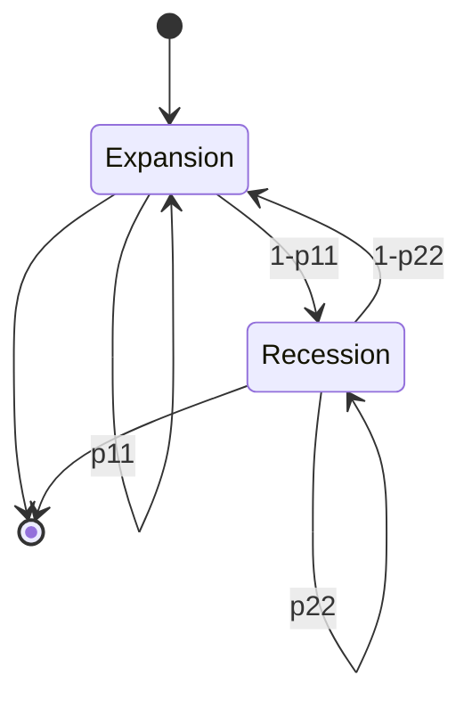

## Markov-Switching Models

### Overview

Markov-switching models allow the parameters of a time series process to change according to an unobserved discrete state variable that follows a Markov chain. Introduced to econometrics by Hamilton (1989) for modeling business cycle turning points, they provide a data-driven mechanism for capturing regime shifts — such as expansions/recessions, high/low volatility periods, or bull/bear markets — without requiring the researcher to specify break dates in advance.

### Core Structure

The model consists of two components:

**Observation equation** (regime-dependent process): conditional on the unobserved state $S_t \in \{1, \ldots, K\}$, the observed series follows a process whose parameters depend on $S_t$. For an autoregressive example:

$$y_t = \mu_{S_t} + \phi_{S_t}(y_{t-1} - \mu_{S_{t-1}}) + \varepsilon_t, \quad \varepsilon_t \sim N(0, \sigma_{S_t}^2)$$

**State transition equation**: $S_t$ evolves as a first-order Markov chain with transition probabilities:

$$P(S_t = j \mid S_{t-1} = i) = p_{ij}$$

collected into a $K \times K$ transition matrix $\mathbf{P}$, where each row sums to one. The Markov property means the current regime depends only on the immediately preceding regime, not the full history: $P(S_t \mid S_{t-1}, S_{t-2}, \ldots) = P(S_t \mid S_{t-1})$.

### Common Model Variants

- **Markov-switching mean/intercept model**: only the mean or intercept term switches across regimes, with common autoregressive dynamics and variance.
- **Markov-switching AR (MS-AR)**: Hamilton's (1989) original specification, where the autoregressive intercept switches to capture asymmetric growth rates over the business cycle, applied to U.S. real GNP growth.
- **Markov-switching variance/volatility (MS-ARCH, MS-GARCH)**: the conditional variance switches across regimes, capturing regime-dependent volatility clustering, often combined with GARCH-type dynamics within each state.
- **Markov-switching VAR (MS-VAR)**: multivariate extension where entire coefficient matrices, intercepts, and/or covariance matrices switch, allowing joint regime shifts across multiple series (Krolzig, 1997).
- **Time-varying transition probability (TVTP) models**: $p_{ij,t}$ depends on exogenous or lagged endogenous variables via a logistic link, relaxing the assumption of constant transition probabilities (Filardo, 1994).
- **Markov-switching dynamic factor models**: combine a common latent factor with regime-switching dynamics, used for coincident business cycle indicators (Chauvet, 1998; the basis of the Chicago Fed's CFNAI-adjacent methodology).

### Filtering: Hamilton's Recursive Filter

Because $S_t$ is unobserved, inference relies on a recursive filter analogous in spirit to the Kalman filter but operating over a discrete state space. Let $\xi_{t|t-1}$ denote the vector of predicted regime probabilities and $\xi_{t|t}$ the filtered (updated) probabilities, each a $K \times 1$ vector.

**Prediction step:**

$$\xi_{t|t-1} = \mathbf{P}' \xi_{t-1|t-1}$$

**Update step** (Bayes' rule applied to the observation density in each regime):

$$\xi_{t|t} = \frac{\xi_{t|t-1} \odot \eta_t}{\mathbf{1}' (\xi_{t|t-1} \odot \eta_t)}$$

where $\eta_t$ is the $K \times 1$ vector of conditional densities $f(y_t \mid S_t = j, \Psi_{t-1})$ for each regime $j$, $\odot$ denotes element-wise multiplication, and the denominator is a normalizing scalar equal to the time-$t$ contribution to the likelihood.

**Likelihood contribution:**

$$f(y_t \mid \Psi_{t-1}) = \mathbf{1}'(\xi_{t|t-1} \odot \eta_t)$$

The full sample log-likelihood is:

$$\log L(\theta) = \sum_{t=1}^{n} \log\left[\mathbf{1}'(\xi_{t|t-1} \odot \eta_t)\right]$$

This is maximized numerically over $\theta$, which includes the regime-specific parameters ($\mu_j, \phi_j, \sigma_j^2$ for each $j$) and the transition probabilities $p_{ij}$ (reparameterized, e.g., via logistic transforms, to stay in $[0,1]$ with rows summing to one).

### Smoothing

The filtered probabilities $\xi_{t|t}$ use only information up to time $t$. **Smoothed probabilities** $\xi_{t|n}$, using the full sample, are obtained via Kim's (1994) smoothing algorithm, a backward recursion:

$$\xi_{t|n} = \xi_{t|t} \odot \left\{ \mathbf{P} \left[ \xi_{t+1|n} (\div) \xi_{t+1|t} \right] \right\}$$

where $(\div)$ denotes element-wise division. This recursion runs backward from $t = n-1$ down to $t=1$ and gives the best available (full-sample) inference on which regime was likely active at each historical date — the basis for the shaded recession bars often seen in business-cycle dating charts.

### Estimation via EM Algorithm

Direct numerical maximization of $\log L(\theta)$ is feasible but the EM algorithm (Hamilton, 1990) is commonly used because closed-form M-step updates are available:

1. **E-step**: run the Hamilton filter and Kim smoother given current parameter estimates to obtain smoothed regime probabilities $\hat\xi_{t|n}$ and smoothed transition probabilities $\hat\xi_{t,t-1|n}$ (joint probability of being in regime $i$ at $t-1$ and $j$ at $t$).
2. **M-step**: update parameters using probability-weighted formulas, e.g., for regime-specific means:

   $$\hat\mu_j = \frac{\sum_t \hat\xi_{t|n}(j) \, y_t}{\sum_t \hat\xi_{t|n}(j)}$$

   and transition probabilities:

   $$\hat p_{ij} = \frac{\sum_t \hat\xi_{t,t-1|n}(i,j)}{\sum_t \hat\xi_{t-1|n}(i)}$$
3. Iterate E- and M-steps until log-likelihood convergence.

[Confirmed] EM is popular here because, unlike generic gradient-based optimizers, it guarantees a monotonic increase in the likelihood at each iteration and handles the constrained transition-probability parameter space naturally.

### Regime Classification and Interpretation

Once smoothed probabilities are obtained, a **regime classification** is typically assigned by $\hat S_t = \arg\max_j \hat\xi_{t|n}(j)$, or probabilities are reported directly as a continuous indicator of regime confidence. The **expected duration** of regime $j$ under a constant transition matrix is:

$$E[D_j] = \frac{1}{1 - p_{jj}}$$

derived from the geometric distribution of a Markov chain's sojourn time in a given state, and is a standard diagnostic for whether estimated regimes correspond to plausible economic durations (e.g., NBER-dated recessions).

### Practical Example: Two-Regime Business Cycle Model

**Example** (Hamilton-style specification for GDP growth $y_t$):

$$y_t - \mu_{S_t} = \phi(y_{t-1} - \mu_{S_{t-1}}) + \varepsilon_t, \quad \varepsilon_t \sim N(0,\sigma^2)$$

with $S_t \in \{1,2\}$: regime 1 = expansion ($\mu_1 > 0$), regime 2 = recession ($\mu_2 < 0$), and transition matrix:

$$\mathbf{P} = \begin{pmatrix} p_{11} & 1-p_{11} \\ 1-p_{22} & p_{22} \end{pmatrix}$$

Typical estimated values in Hamilton's original application show $p_{11}, p_{22}$ both close to but below 1 (e.g., in the range of 0.9 or higher), reflecting the empirical persistence of business cycle phases — expansions and recessions are both self-reinforcing, but recessions are typically shorter, so $p_{22} < p_{11}$ in most estimated vintages of this class of model. [Unverified] Exact numerical estimates are sample- and specification-dependent and should be re-estimated on the vintage of data being used rather than assumed.

### Model Selection: Choosing the Number of Regimes

Standard information criteria (AIC, BIC) are used but require caution: [Confirmed] the null hypothesis of a single regime (i.e., $K=1$ vs. $K=2$) involves nuisance parameters unidentified under the null (the transition probabilities and regime-2 parameters are meaningless when there is truly only one regime), so standard likelihood ratio test asymptotics (chi-squared) do not apply. Formal testing requires specialized procedures such as Hansen's (1992) test via inequality-constrained optimization and simulated critical values, or Garcia's (1998) supremum-based tests, rather than a naive LR test.

### Diagram: Two-Regime Switching Process

### Filtering and Smoothing Data Flow (SVG)

<svg xmlns="http://www.w3.org/2000/svg" viewBox="0 0 820 300">
<text x="410" y="25" font-size="16" font-weight="bold" text-anchor="middle" fill="#1a1a1a">Hamilton Filter and Kim Smoother (svg_diagram)</text>
<rect x="30" y="60" width="160" height="55" rx="6" fill="#e3f2fd" stroke="#1565c0" />
<text x="110" y="83" font-size="12" text-anchor="middle" fill="#1a1a1a">xi(t-1|t-1)</text>
<text x="110" y="100" font-size="11" text-anchor="middle" fill="#1a1a1a">filtered probs</text>
<rect x="240" y="60" width="160" height="55" rx="6" fill="#e8f5e9" stroke="#2e7d32" />
<text x="320" y="83" font-size="12" text-anchor="middle" fill="#1a1a1a">xi(t|t-1) = P' xi(t-1|t-1)</text>
<text x="320" y="100" font-size="11" text-anchor="middle" fill="#1a1a1a">predicted probs</text>
<rect x="450" y="60" width="160" height="55" rx="6" fill="#fff3e0" stroke="#e65100" />
<text x="530" y="83" font-size="12" text-anchor="middle" fill="#1a1a1a">Bayes update w/ eta(t)</text>
<text x="530" y="100" font-size="11" text-anchor="middle" fill="#1a1a1a">xi(t|t)</text>
<rect x="660" y="60" width="130" height="55" rx="6" fill="#fce4ec" stroke="#ad1457" />
<text x="725" y="83" font-size="12" text-anchor="middle" fill="#1a1a1a">log L += log</text>
<text x="725" y="100" font-size="11" text-anchor="middle" fill="#1a1a1a">f(y_t|Psi_t-1)</text>
<line x1="190" y1="87" x2="240" y2="87" stroke="#555" stroke-width="2" marker-end="url(#arrow2)" />
<line x1="400" y1="87" x2="450" y2="87" stroke="#555" stroke-width="2" marker-end="url(#arrow2)" />
<line x1="610" y1="87" x2="660" y2="87" stroke="#555" stroke-width="2" marker-end="url(#arrow2)" />
<path d="M 530 115 C 530 150 110 150 110 115" fill="none" stroke="#555" stroke-width="2" stroke-dasharray="4,2" marker-end="url(#arrow2)" />
<text x="320" y="140" font-size="11" text-anchor="middle" fill="#555">forward recursion t=1..n</text>
<rect x="240" y="200" width="340" height="60" rx="6" fill="#ede7f6" stroke="#4527a0" />
<text x="410" y="225" font-size="12" text-anchor="middle" fill="#1a1a1a">Kim backward smoother</text>
<text x="410" y="242" font-size="11" text-anchor="middle" fill="#1a1a1a">xi(t|n) uses full sample, t=n-1 down to 1</text>
<line x1="410" y1="115" x2="410" y2="200" stroke="#555" stroke-width="2" marker-end="url(#arrow2)" />
</svg>

### Extensions and Related Frameworks

- **Duration dependence / semi-Markov models**: relax the geometric-duration implication of first-order Markov chains by allowing the hazard of switching regimes to depend on time already spent in the current regime.
- **Markov-switching GARCH**: combines regime switching with conditional heteroskedasticity, though exact likelihood evaluation is complicated by path dependence (the conditional variance at $t$ depends on the entire regime history), typically addressed via approximations (Gray, 1996; Klaassen, 2002) or particle filtering.
- **Bayesian estimation via Gibbs sampling**: treats $S_t$ as an additional set of parameters to be sampled (Albert & Chib, 1993), often preferred for small samples or when full posterior uncertainty over regime classification is desired.
- **Comparison with threshold and smooth-transition models**: unlike Markov-switching models, threshold autoregressive (TAR) and smooth-transition autoregressive (STAR) models make the regime a deterministic (or smooth deterministic) function of an observed variable rather than a latent stochastic process — a key conceptual distinction often tested in coursework.

### Common Pitfalls

- **Label switching**: regimes are identified only up to permutation of labels; without an identifying restriction (e.g., $\mu_1 < \mu_2$), the numerical optimizer or MCMC sampler may converge to an equivalent but relabeled solution across runs.
- **Convergence to degenerate solutions**: $p_{ii} \to 1$ for one regime with near-zero probability mass in the other regime can indicate the model is not finding meaningful switching behavior, often due to too many regimes for the sample size or an overly flexible regime-dependent specification.
- **Ignoring parameter uncertainty in transition probabilities**: standard errors on $p_{ij}$ require using the appropriate transformed-parameter delta method, since raw probability estimates are constrained to $[0,1]$.
- **Treating filtered probabilities as final classification**: analysts sometimes report $\xi_{t|t}$ when $\xi_{t|n}$ (smoothed) is more appropriate for retrospective regime dating, and vice versa when real-time, information-consistent classification is required (e.g., for out-of-sample forecasting evaluation).

**Related Topics**

- Hamilton (1989) business cycle model and NBER recession dating comparisons
- Kim's (1994) smoothing algorithm derivation
- Markov-switching GARCH and regime-dependent volatility
- Threshold autoregressive (TAR) and smooth-transition autoregressive (STAR) models
- Hansen's (1992) and Garcia's (1998) tests for the number of regimes
- Time-varying transition probability (TVTP) models
- Markov-switching VAR and structural regime-dependent impulse responses
- Bayesian Markov-switching estimation via Gibbs sampling
- Duration dependence and semi-Markov extensions