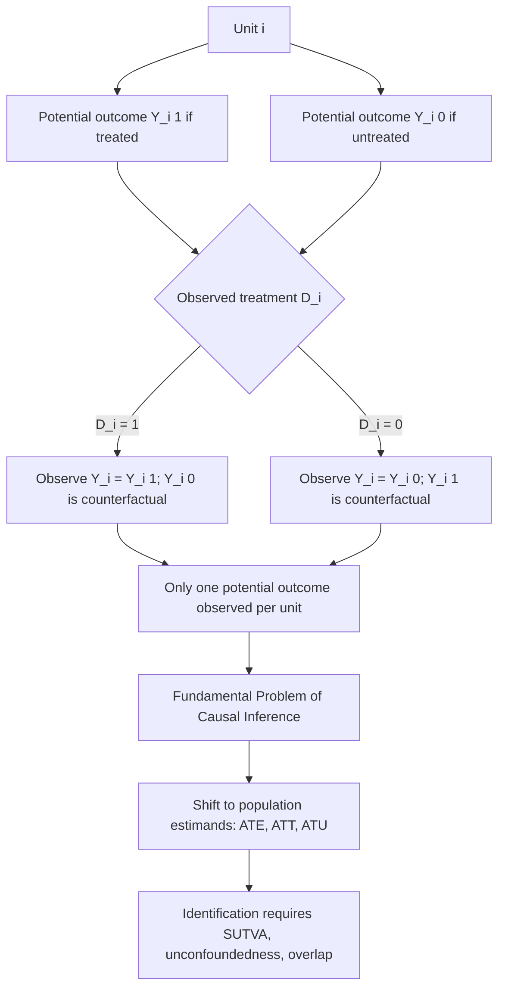

## The Rubin Causal Model

### Overview

The Rubin Causal Model (RCM), developed principally by Donald Rubin beginning in the mid-1970s and building on Neyman's (1923) work on randomized experiments, provides the formal statistical framework underlying modern causal inference. It defines causal effects as comparisons between **potential outcomes** — the outcome an individual unit would experience under alternative treatment conditions — and reframes causal inference as a missing data problem, since only one potential outcome is ever observed for each unit. This framework underlies the interpretation of virtually every modern causal inference method: matching, instrumental variables, regression discontinuity, difference-in-differences, and randomized experiments alike.

### Potential Outcomes Notation

For each unit $i$ in a population, and a binary treatment indicator $D_i \in \{0,1\}$, define two potential outcomes:

$$Y_i(1) = \text{outcome for unit } i \text{ if treated}$$

$$Y_i(0) = \text{outcome for unit } i \text{ if untreated}$$

The **individual (unit-level) causal effect** is:

$$\tau_i = Y_i(1) - Y_i(0)$$

The observed outcome is linked to the potential outcomes via the **switching equation**:

$$Y_i = D_i Y_i(1) + (1-D_i) Y_i(0)$$

This single equation is the crux of the framework: it makes explicit that $Y_i(1)$ and $Y_i(0)$ both exist conceptually for every unit as fixed (or random, depending on formulation) quantities, but only the one corresponding to the realized treatment status $D_i$ is ever observed. The unobserved potential outcome is termed the **counterfactual**.

### The Fundamental Problem of Causal Inference

Holland (1986), synthesizing Rubin's work, termed this the **Fundamental Problem of Causal Inference**: for any given unit, at most one of $Y_i(1), Y_i(0)$ can ever be observed, so the individual treatment effect $\tau_i$ is never directly identified from data on that unit alone. [Confirmed] This is a definitional/logical impossibility rather than a limitation of sample size or measurement precision — no amount of additional data on unit $i$ alone resolves it, since $i$ cannot simultaneously be treated and untreated at the same point in time.

Causal inference therefore necessarily shifts from estimating individual effects to estimating **population-level (aggregate) causal parameters**, most commonly:

$$\text{ATE} = E[Y_i(1) - Y_i(0)] = E[Y_i(1)] - E[Y_i(0)]$$

the **Average Treatment Effect**, along with related estimands such as the **Average Treatment Effect on the Treated** (ATT):

$$\text{ATT} = E[Y_i(1) - Y_i(0) \mid D_i = 1]$$

and on the untreated (ATU/ATC).

### The Naive Comparison and Selection Bias

A naive comparison of observed outcomes by treatment status decomposes as:

$$E[Y_i \mid D_i=1] - E[Y_i \mid D_i=0] = \underbrace{E[Y_i(1) \mid D_i=1] - E[Y_i(0) \mid D_i=1]}_{\text{ATT}} + \underbrace{E[Y_i(0) \mid D_i=1] - E[Y_i(0) \mid D_i=0]}_{\text{selection bias}}$$

The first term is the causal effect of interest (ATT); the second term, **selection bias**, is the difference in the untreated potential outcome between the treated and untreated groups — i.e., how the two groups would have differed even absent treatment. [Confirmed] This decomposition is the formal justification for why raw observational comparisons cannot generally be given a causal interpretation: selection bias is zero only under specific identifying assumptions (most simply, randomization).

### Key Identifying Assumptions

**1. Stable Unit Treatment Value Assumption (SUTVA)**

SUTVA has two components, both required for the potential outcomes $Y_i(d)$ to be well-defined single-valued quantities:

- **No interference**: unit $i$'s potential outcomes depend only on $i$'s own treatment assignment, not on the treatment assignment of other units: $Y_i(D_1, \ldots, D_n) = Y_i(D_i)$. Violated in settings with spillovers, general equilibrium effects, or social interactions (e.g., vaccination — one person's vaccination status affects others' infection risk).
- **No hidden variations of treatment (consistency)**: there is only one version of "treatment" and one version of "control," so $Y_i(1)$ is the same regardless of *how* treatment was administered. Violated when treatment is heterogeneous in unmodeled ways (e.g., "job training" that differs substantially in intensity/quality across providers).

**2. Unconfoundedness (Ignorability / Conditional Independence Assumption)**

$$\{Y_i(0), Y_i(1)\} \perp D_i \mid X_i$$

Conditional on observed covariates $X_i$, treatment assignment is independent of the potential outcomes — i.e., there is no confounding remaining after conditioning on $X_i$. This assumption is fundamentally **untestable** from observed data because it is a statement about the joint distribution of $D_i$ with the unobserved counterfactual outcome. It is the workhorse assumption behind regression, matching, and propensity score methods.

**3. Overlap (Common Support)**

$$0 < P(D_i = 1 \mid X_i = x) < 1 \quad \text{for all } x \text{ in the support of } X$$

Every covariate stratum must contain both treated and untreated units with positive probability; otherwise there exist values of $X_i$ for which no valid comparison group exists, and the ATE (or ATT within that stratum) is not identified without extrapolation.

**4. Random Assignment (in experiments)**

When $D_i$ is randomized (e.g., by coin flip), unconfoundedness holds unconditionally (without needing to condition on any $X_i$), since $D_i \perp \{Y_i(0), Y_i(1)\}$ by construction of the randomization mechanism. [Confirmed] This is why randomized controlled trials are considered the "gold standard" in the RCM framework: randomization guarantees the assumption that observational studies must instead argue for.

### Connection to the Statistical Estimation Problem

Under SUTVA and unconfoundedness, the ATE is identified as:

$$\text{ATE} = E_X\big[E[Y_i \mid D_i=1, X_i] - E[Y_i \mid D_i=0, X_i]\big]$$

which is estimable from observed data because both conditional expectations on the right-hand side involve only observed $(Y_i, D_i, X_i)$ — the potential-outcomes notation on the left has been converted into an observable-data expression on the right via the identifying assumptions. This identity is the formal bridge connecting the RCM's counterfactual language to estimators such as regression adjustment, matching, inverse probability weighting, and doubly robust estimation.

### Assignment Mechanism and Rubin's Bayesian Perspective

Rubin's fuller treatment emphasizes the **assignment mechanism** $P(D \mid X, Y(0), Y(1))$ as the object that must be understood or controlled for valid causal inference, classifying designs by:

- **Unconfounded assignment mechanism**: $P(D \mid X, Y(0), Y(1)) = P(D \mid X)$ — assignment depends only on observables, not on potential outcomes directly.
- **Probabilistic assignment mechanism**: every unit has $0 < P(D_i=1) < 1$, connecting directly to the overlap condition.
- **Known assignment mechanism**: the functional form of $P(D\mid X)$ is known by design (as in a randomized experiment or regression discontinuity with a known threshold rule), versus unknown (as in most observational studies), which affects how confidently the identifying assumptions can be defended.

[Inference] This assignment-mechanism-centric framing is often presented as the more Bayesian-flavored complement to the frequentist "identification strategy" language more common in applied econometrics; both describe the same underlying object but with different emphasis on design versus estimation.

### Worked Example: Job Training Program

**Example**: consider evaluating a job training program's effect on earnings.

- $D_i = 1$ if individual $i$ enrolls in training, $0$ otherwise.
- $Y_i(1)$ = earnings individual $i$ would have if trained; $Y_i(0)$ = earnings if not trained.
- Observed data: $(Y_i, D_i, X_i)$ where $X_i$ includes pre-program earnings, education, age, etc.

If enrollment is **self-selected** (individuals choose to enroll based on expected benefit), then likely $E[Y_i(0) \mid D_i=1] \neq E[Y_i(0) \mid D_i=0]$ — trainees may differ systematically in unobserved motivation or ability from non-trainees, producing selection bias in the naive comparison. A randomized encouragement design, a credible instrument (e.g., random program capacity/lottery, as in the National Supported Work Demonstration studied by LaLonde, 1986), or a rich enough $X_i$ to plausibly satisfy unconfoundedness are the standard routes to a defensible causal estimate in this framework. [Unverified] The specific magnitude of selection bias in any real training-program study is an empirical, context-dependent question; the LaLonde (1986) study is frequently cited precisely because it demonstrated that common non-experimental estimators diverged substantially from the experimental benchmark, but exact figures should be drawn from the primary study rather than assumed to generalize.

### Diagram: Fundamental Problem and Decomposition

### Potential Outcomes Schema (SVG)

<svg xmlns="http://www.w3.org/2000/svg" viewBox="0 0 780 320">
<text x="390" y="25" font-size="16" font-weight="bold" text-anchor="middle" fill="#1a1a1a">Potential Outcomes and the Switching Equation (svg_diagram)</text>
<rect x="40" y="60" width="180" height="50" rx="6" fill="#e3f2fd" stroke="#1565c0" />
<text x="130" y="90" font-size="13" text-anchor="middle" fill="#1a1a1a">Unit i, covariates X_i</text>
<rect x="300" y="30" width="200" height="50" rx="6" fill="#e8f5e9" stroke="#2e7d32" />
<text x="400" y="60" font-size="13" text-anchor="middle" fill="#1a1a1a">Y_i(1): outcome if treated</text>
<rect x="300" y="100" width="200" height="50" rx="6" fill="#fff3e0" stroke="#e65100" />
<text x="400" y="130" font-size="13" text-anchor="middle" fill="#1a1a1a">Y_i(0): outcome if untreated</text>
<line x1="220" y1="80" x2="300" y2="55" stroke="#555" stroke-width="2" marker-end="url(#arrow3)" />
<line x1="220" y1="90" x2="300" y2="125" stroke="#555" stroke-width="2" marker-end="url(#arrow3)" />
<rect x="580" y="65" width="180" height="50" rx="6" fill="#fce4ec" stroke="#ad1457" />
<text x="670" y="88" font-size="12" text-anchor="middle" fill="#1a1a1a">Switching equation:</text>
<text x="670" y="105" font-size="12" text-anchor="middle" fill="#1a1a1a">Y_i = D_i Y_i(1)+(1-D_i)Y_i(0)</text>
<line x1="500" y1="55" x2="580" y2="80" stroke="#555" stroke-width="2" marker-end="url(#arrow3)" />
<line x1="500" y1="125" x2="580" y2="100" stroke="#555" stroke-width="2" marker-end="url(#arrow3)" />
<rect x="150" y="220" width="480" height="70" rx="6" fill="#ede7f6" stroke="#4527a0" />
<text x="390" y="245" font-size="12" text-anchor="middle" fill="#1a1a1a">Only ONE of Y_i(1), Y_i(0) observed per unit</text>
<text x="390" y="265" font-size="12" text-anchor="middle" fill="#1a1a1a">The other is the missing counterfactual</text>
<text x="390" y="282" font-size="11" text-anchor="middle" fill="#1a1a1a">(Fundamental Problem of Causal Inference)</text>
<line x1="670" y1="115" x2="450" y2="220" stroke="#555" stroke-width="2" stroke-dasharray="4,2" marker-end="url(#arrow3)" />
</svg>

### Common Pitfalls

- **Treating unconfoundedness as testable**: because it is a statement involving the *unobserved* potential outcome, unconfoundedness can never be directly verified with data; researchers instead assess its plausibility via covariate balance checks, placebo/falsification tests, and sensitivity analysis (e.g., Rosenbaum bounds), none of which constitute direct proof.
- **Confusing ATE with ATT**: these estimands coincide only under additional assumptions (e.g., homogeneous treatment effects, or random assignment ensuring $E[Y(1)-Y(0)\mid D=1] = E[Y(1)-Y(0)]$); in observational studies with effect heterogeneity, matching-based or IV-based estimators often identify ATT (or local variants like LATE) rather than the ATE, and conflating them misstates the population to which the result applies.
- **SUTVA violations from spillovers**: applying the RCM machinery unmodified in settings with substantial interference (e.g., general equilibrium market effects, peer effects in a classroom) produces "potential outcomes" that are not actually well-defined, since $Y_i$ then depends on other units' treatment status too.
- **Ignoring overlap in practice**: extreme propensity scores near 0 or 1 for some covariate strata make ATE estimates in that region highly sensitive to model extrapolation (regression) or produce extreme weights (IPW), even when unconfoundedness formally holds.

**Related Topics**

- The Fundamental Problem of Causal Inference (Holland, 1986) and its implications for estimand choice
- Randomized controlled trials as the design-based benchmark for unconfoundedness
- Propensity score methods (matching, weighting, stratification)
- Selection bias decomposition and observational study design
- Instrumental variables and Local Average Treatment Effects (LATE)
- SUTVA violations: interference, spillovers, and general equilibrium effects
- Sensitivity analysis for unconfoundedness (Rosenbaum bounds)
- Difference-in-differences and regression discontinuity as alternative identification strategies
- Directed acyclic graphs (DAGs) as a complementary causal framework (Pearl's structural causal model)