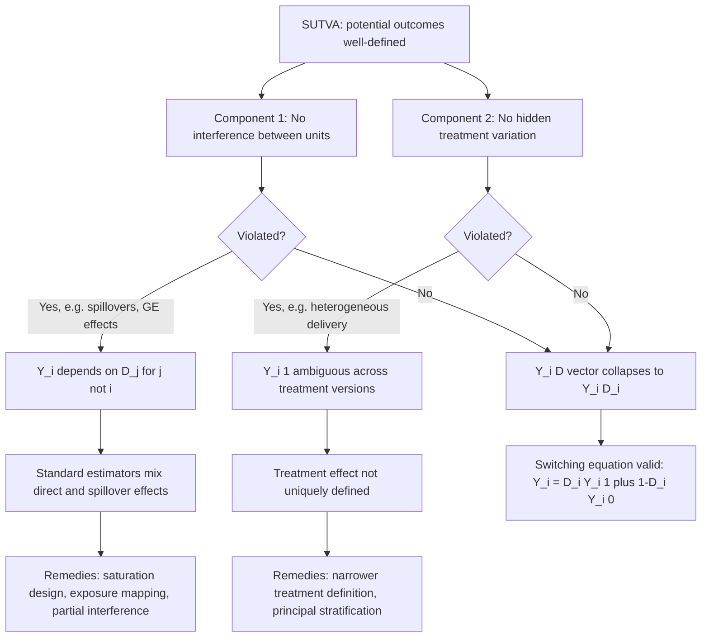

## The Stable Unit Treatment Value Assumption

### Overview

The Stable Unit Treatment Value Assumption (SUTVA) is a foundational identifying condition in the Rubin Causal Model that must hold before potential outcomes $Y_i(1)$ and $Y_i(0)$ can even be treated as well-defined, single-valued quantities for each unit. It is logically prior to unconfoundedness and overlap: those assumptions concern how treatment relates to the potential outcomes, whereas SUTVA concerns whether the potential outcomes are coherently defined objects in the first place. Coined and formalized by Rubin (1980, 1986), SUTVA is often glossed over in introductory treatments but is a frequent and consequential source of bias in applied causal inference, particularly in social, economic, and epidemiological settings characterized by interaction between units.

### Formal Definition

SUTVA states that the potential outcome for unit $i$ depends only on the treatment assigned to unit $i$ itself, and that there is a single, well-defined version of each treatment level:

$$Y_i(D_1, D_2, \ldots, D_n) = Y_i(D_i) \quad \text{for all } i$$

That is, unit $i$'s potential outcome is a function of the entire vector of treatment assignments $\mathbf{D} = (D_1, \ldots, D_n)$ across all $n$ units in the population, but SUTVA asserts this function collapses to depend on only the $i$-th component, $D_i$. Without this collapsing, the notation $Y_i(1)$ and $Y_i(0)$ used throughout potential-outcomes causal inference is simply not well-defined, because unit $i$ could have many different potential outcomes under $D_i=1$ depending on what treatments everyone else received.

### The Two Components of SUTVA

**1. No Interference (Between Units)**

Formally: $Y_i(\mathbf{D}) = Y_i(D_i)$ for all possible assignment vectors $\mathbf{D}$ that share the same $D_i$. This rules out any channel by which one unit's treatment status affects another unit's outcome — no spillovers, no externalities, no general equilibrium feedback, no social interaction effects.

**Common violations:**

- **Epidemiological/vaccination settings**: vaccinating individual $i$ reduces disease transmission risk to individual $j$ (herd immunity), so $j$'s potential outcome depends on $i$'s treatment status.
- **Educational interventions**: a scholarship or tutoring program for some students in a classroom may affect peer learning outcomes for untreated classmates (positive or negative peer effects).
- **Labor market programs**: a job-training program that improves participants' employment prospects may crowd out job opportunities for non-participants competing in the same local labor market — a general equilibrium displacement effect (Crépon et al., 2013, documented this directly in a large-scale randomized experiment in France).
- **Market-level interventions**: any policy that operates through price or quantity adjustments in a market (e.g., a subsidy to some firms) mechanically affects the outcomes of untreated competitors through market clearing.

**2. No Hidden Variations of Treatment (Consistency / Treatment Variation Irrelevance)**

Formally: there is only one version of "treatment" (and one version of "control"), so that $Y_i(1)$ represents the same counterfactual outcome regardless of *how* treatment was delivered or which specific version of the treatment protocol was received.

**Common violations:**

- **Heterogeneous program delivery**: "job training" administered by different providers, with different curricula, intensities, or instructor quality, does not correspond to a single well-defined $Y_i(1)$ — a unit assigned to Provider A's version of training may have systematically different potential outcomes than the same unit assigned to Provider B's version.
- **Dosage ambiguity**: a "treated" drug regimen that in practice varies in dosage or compliance across patients blurs the treatment definition; $Y_i(1)$ conflates several distinct underlying treatments.
- **Variation in encouragement or take-up**: in an encouragement design, being "encouraged" is not identical to being "treated," and treating the two as the same binary condition without further structure can violate consistency if encouragement operates partly through channels other than actual treatment receipt.

### Why SUTVA Matters for Identification

Both unconfoundedness and overlap are stated in terms of $Y_i(1), Y_i(0)$ — but these expressions presuppose SUTVA already holds. If interference or hidden treatment variation is present:

- The switching equation $Y_i = D_i Y_i(1) + (1-D_i)Y_i(0)$ breaks down, since $Y_i$ may depend on other units' $D_j$ as well.
- Standard estimators (difference-in-means, regression, matching, IPW) that implicitly assume SUTVA will estimate a **mixture of the direct causal effect and spillover/general-equilibrium effects**, which is generally uninterpretable as either the "individual treatment effect" or a clean population parameter without further structure.
- Even a perfectly randomized experiment does not by itself guarantee an interpretable causal estimate if SUTVA fails: randomization solves the identification problem for **unconfoundedness**, but it does nothing to fix a violation of **no interference** or **no hidden treatment variation**. [Confirmed] This is a common misconception — randomization and SUTVA address different, independent identification threats.

### Detecting and Addressing SUTVA Violations

**Diagnosing plausibility:**

- **Institutional/contextual reasoning**: assessing whether the mechanism of treatment plausibly operates only through the treated unit (e.g., is there a market, social network, or biological transmission channel connecting units?).
- **Randomization at a higher level (cluster/saturation designs)**: deliberately varying the *fraction* of treated units within randomly assigned clusters (a "saturation design") allows spillover effects to be directly estimated and separated from direct effects (Miguel & Kremer, 2004, on deworming, is a canonical example combining school-level randomization with saturation variation to detect and quantify externalities).
- **Randomization inference and network data**: when a social or geographic network structure is observed, interference can be modeled explicitly rather than assumed away.

**Modeling approaches when interference is present:**

- **Partial interference / clustered SUTVA**: relax full "no interference" to interference *within* well-defined clusters (e.g., households, villages, classrooms) but assume no interference *across* clusters. This is the standard relaxation used in most applied work with clustered treatment assignment, and permits identification of within-cluster direct and spillover (indirect) effects.
- **Exposure mapping frameworks** (Aronow & Samii, 2017; Manski, 2013): define a unit's "exposure" as a function of the full treatment vector (e.g., fraction of treated neighbors) rather than assuming a scalar $D_i$ suffices, generalizing potential outcomes to $Y_i(\mathbf{d})$ indexed by exposure level rather than by own-treatment alone.
- **General equilibrium / structural modeling**: when interference operates through markets (prices, wages), a structural economic model of market clearing is sometimes used to separate partial-equilibrium treatment effects from equilibrium feedback, rather than relying on the reduced-form potential outcomes framework alone.

**Modeling approaches when treatment variation is the concern:**

- **Redefining/narrowing the treatment**: specifying a more precise, homogeneous treatment definition (e.g., "training program X delivered by provider Y at intensity Z") restores a well-defined $Y_i(1)$, at the cost of narrowing external validity of the resulting estimate.
- **Principal stratification**: used especially with noncompliance/encouragement designs, to define causal effects within latent subpopulations defined by their pattern of treatment receipt (compliers, always-takers, never-takers), sidestepping some consistency concerns by conditioning on the *realized* treatment pathway.

### Worked Example: Vaccination Trial with Herd Immunity

**Example**: consider a randomized vaccine trial where $D_i = 1$ indicates vaccination.

- **Direct effect** (the effect the naive analysis targets): $Y_i(1) - Y_i(0)$ holding others' vaccination status fixed — the individual's own biological protection.
- **SUTVA violation**: if vaccination reduces disease transmission in the population, an unvaccinated individual $j$ living in a highly vaccinated community has a lower true infection probability than an otherwise identical unvaccinated individual $j'$ in a low-vaccination community — i.e., $Y_j(D_j=0)$ is not fixed but depends on the vaccination rate around $j$.
- **Consequence**: naive individually randomized trial estimates of vaccine efficacy computed via simple SUTVA-assuming comparisons will typically *understate* the vaccine's total value to the population, because the comparison group (unvaccinated individuals in a partially-vaccinated trial population) is itself indirectly benefiting from herd immunity relative to a fully unvaccinated counterfactual population.
- **Solution used in practice**: cluster-randomized (e.g., village-level) or saturation-randomized designs, where the *proportion* vaccinated is varied across clusters, allow the **direct effect**, **indirect (herd immunity) effect**, **total effect**, and **overall effect** to each be separately defined and estimated (Halloran & Struchiner, 1995, provide the formal typology of these estimands in the vaccine-efficacy literature). [Confirmed] This decomposition of causal effect types under interference is standard in the vaccine and infectious disease epidemiology literature specifically because SUTVA violations are the empirical norm rather than the exception in that domain.

### Diagram: SUTVA Components and Consequences

### Interference Structure Across Study Designs (SVG)

<svg xmlns="http://www.w3.org/2000/svg" viewBox="0 0 800 320">
<text x="400" y="25" font-size="16" font-weight="bold" text-anchor="middle" fill="#1a1a1a">SUTVA: No-Interference vs. Interference Structures (svg_diagram)</text>
<text x="180" y="55" font-size="13" font-weight="bold" text-anchor="middle" fill="#1a1a1a">SUTVA holds</text>
<circle cx="100" cy="100" r="20" fill="#e3f2fd" stroke="#1565c0" />
<text x="100" y="105" font-size="10" text-anchor="middle">i</text>
<circle cx="180" cy="100" r="20" fill="#e8f5e9" stroke="#2e7d32" />
<text x="180" y="105" font-size="10" text-anchor="middle">j</text>
<circle cx="260" cy="100" r="20" fill="#e3f2fd" stroke="#1565c0" />
<text x="260" y="105" font-size="10" text-anchor="middle">k</text>
<text x="180" y="150" font-size="11" text-anchor="middle" fill="#555">No links: Y_i depends only on D_i</text>

<text x="600" y="55" font-size="13" font-weight="bold" text-anchor="middle" fill="`#1a1a1a`">SUTVA violated (interference)</text>

<circle cx="520" cy="100" r="20" fill="`#fff3e0`" stroke="`#e65100`" />

<text x="520" y="105" font-size="10" text-anchor="middle">i</text>

<circle cx="600" cy="100" r="20" fill="`#fce4ec`" stroke="`#ad1457`" />

<text x="600" y="105" font-size="10" text-anchor="middle">j</text>

<circle cx="680" cy="100" r="20" fill="`#fff3e0`" stroke="`#e65100`" />

<text x="680" y="105" font-size="10" text-anchor="middle">k</text>

<line x1="540" y1="100" x2="580" y2="100" stroke="`#ad1457`" stroke-width="2" marker-end="url(#arrow4)" />

<line x1="620" y1="100" x2="660" y2="100" stroke="`#ad1457`" stroke-width="2" marker-end="url(#arrow4)" />

<path d="M 520 120 C 560 160 640 160 680 120" fill="none" stroke="`#ad1457`" stroke-width="2" stroke-dasharray="4,2" marker-end="url(#arrow4)" />

<text x="600" y="150" font-size="11" text-anchor="middle" fill="#555">Spillover links: Y_j depends on D_i, D_k</text>

<rect x="130" y="220" width="540" height="70" rx="6" fill="#ede7f6" stroke="#4527a0" />
<text x="400" y="245" font-size="12" text-anchor="middle" fill="#1a1a1a">Remedy for interference: partial interference within clusters,</text>
<text x="400" y="262" font-size="12" text-anchor="middle" fill="#1a1a1a">saturation designs, or exposure mapping Y_i(exposure level)</text>
<text x="400" y="279" font-size="11" text-anchor="middle" fill="#1a1a1a">rather than assuming a scalar D_i suffices</text>
</svg>

### Common Pitfalls

- **Assuming randomization implies SUTVA**: randomizing treatment assignment addresses confounding, not interference; a beautifully randomized experiment can still yield biased estimates of the intended causal parameter if spillovers are present and unaccounted for.
- **Ignoring general equilibrium effects in scaled-up policy evaluation**: an intervention validated in a small-scale randomized pilot where SUTVA plausibly holds (too small to move market prices or wages) may violate SUTVA entirely once implemented at national scale, because the very channel that was negligible at pilot scale (e.g., market price effects) becomes first-order at scale — a well-documented external validity concern separate from, but related to, SUTVA.
- **Treating heterogeneous "bundled" interventions as a single treatment**: policy interventions that combine multiple components administered inconsistently across sites should be interpreted cautiously as a single $D_i$, since the consistency component of SUTVA is implicitly assumed by doing so.
- **Failing to distinguish direct, indirect, and total effects**: when interference is present but modeled via a saturation or cluster design, conflating the direct effect with the total effect (direct + spillover) misstates the estimand actually being computed.

**Related Topics**

- The Rubin causal model and potential outcomes notation
- Partial interference and cluster-randomized designs
- Saturation designs for estimating spillover effects (Miguel & Kremer, 2004)
- Exposure mapping and generalized potential outcomes under interference (Aronow & Samii, 2017)
- General equilibrium effects in program evaluation (Crépon et al., 2013)
- Direct, indirect, total, and overall causal effects in vaccine efficacy studies (Halloran & Struchiner, 1995)
- Principal stratification for noncompliance and treatment variation
- External validity and scaling of randomized interventions