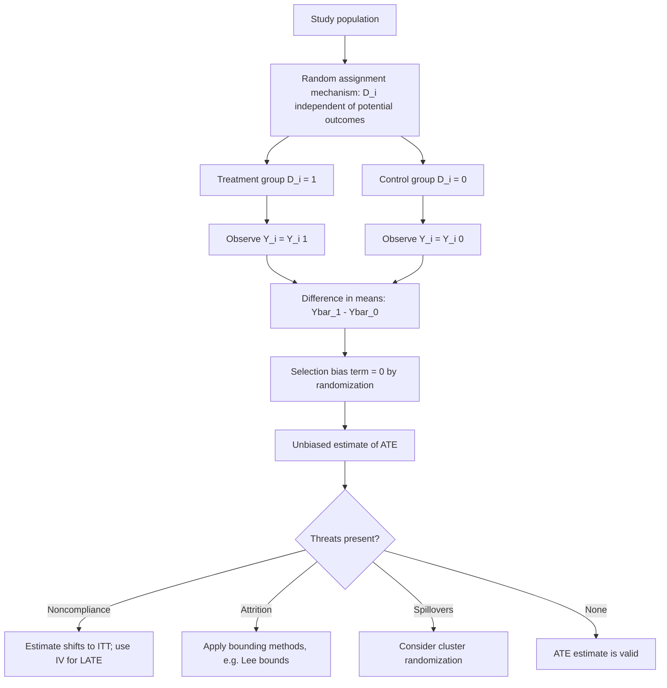

## Randomized Controlled Trials

### Overview

Randomized controlled trials (RCTs) assign units to treatment and control conditions through a known, exogenous randomization mechanism, making them the design-based benchmark for causal identification within the Rubin Causal Model. By construction, random assignment guarantees the unconfoundedness assumption without requiring the researcher to argue for it, converting the naive comparison of group means into an unbiased estimator of the average treatment effect. RCTs are the methodological foundation of clinical medicine, and since the 1990s–2000s "credibility revolution," they have become a central tool in applied microeconomics, development economics, and policy evaluation.

### Why Randomization Identifies Causal Effects

Recall the selection bias decomposition of the naive comparison:

$$E[Y_i \mid D_i=1] - E[Y_i \mid D_i=0] = \text{ATT} + \underbrace{\big(E[Y_i(0)\mid D_i=1] - E[Y_i(0)\mid D_i=0]\big)}_{\text{selection bias}}$$

Under random assignment, $D_i$ is generated independently of the potential outcomes:

$$\{Y_i(0), Y_i(1)\} \perp D_i$$

which implies $E[Y_i(0) \mid D_i=1] = E[Y_i(0)\mid D_i=0] = E[Y_i(0)]$, so the selection bias term vanishes identically. The naive difference-in-means estimator then equals the ATE in expectation:

$$E[Y_i \mid D_i=1] - E[Y_i \mid D_i=0] = E[Y_i(1)] - E[Y_i(0)] = \text{ATE}$$

[Confirmed] This result requires only random assignment and SUTVA — it does **not** require any assumption about the functional form of the outcome model, linearity, or homoskedasticity, which is precisely why RCTs are described as "nonparametrically" identifying the ATE.

### Estimation: The Neyman-Rubin Difference-in-Means Estimator

Given $n_1$ treated and $n_0$ control units, the standard estimator is:

$$\hat\tau = \bar{Y}_1 - \bar{Y}_0 = \frac{1}{n_1}\sum_{i: D_i=1} Y_i - \frac{1}{n_0}\sum_{i: D_i=0} Y_i$$

Under the **Neyman repeated sampling** framework (treating potential outcomes as fixed and randomization as the sole source of variation), this estimator is unbiased for the ATE, and its variance is:

$$V(\hat\tau) = \frac{\sigma_1^2}{n_1} + \frac{\sigma_0^2}{n_0} - \frac{\sigma_{\tau}^2}{n}$$

where $\sigma_1^2 = \text{Var}(Y_i(1))$, $\sigma_0^2 = \text{Var}(Y_i(0))$, and $\sigma_\tau^2 = \text{Var}(\tau_i)$ is the variance of individual treatment effects. [Confirmed] The conventional variance estimator that ignores the covariance term (using $\hat\sigma_1^2/n_1 + \hat\sigma_0^2/n_0$) is **conservative** — it weakly overestimates the true sampling variance whenever treatment effects are heterogeneous — because the unobservable $\sigma_\tau^2$ term cannot be estimated without further assumptions (it would require observing both potential outcomes for the same unit) and is dropped, which biases the variance estimate upward rather than downward.

### Randomization Inference

An alternative, design-based approach to inference — **Fisher's randomization inference** (also called permutation inference) — computes exact p-values by directly using the known randomization distribution, without relying on large-sample normal approximations:

1. Specify a **sharp null hypothesis**, most commonly $H_0: \tau_i = 0$ for all $i$ (no treatment effect for any unit whatsoever), which allows both potential outcomes to be filled in for every unit under the null (since $Y_i(1) = Y_i(0) = Y_i$ for all $i$).
2. Enumerate (or simulate via Monte Carlo) all possible treatment assignment vectors consistent with the actual randomization procedure.
3. Compute the test statistic (e.g., difference-in-means) under each hypothetical assignment.
4. The p-value is the proportion of hypothetical assignments yielding a test statistic at least as extreme as the one actually observed.

[Confirmed] Randomization inference is exact in finite samples under the sharp null and does not rely on asymptotic approximations, making it particularly valuable in small-sample experiments (common in development economics field experiments with a limited number of clusters).

### Design Variants

- **Simple (Bernoulli) randomization**: each unit independently assigned to treatment with probability $p$. Simple to implement but can produce chance imbalance in $n_1$ vs. $n_0$ or in covariates, especially in small samples.
- **Complete randomization**: exactly $n_1$ of $n$ units assigned to treatment (fixed group sizes), removing sampling variability in the realized treatment fraction.
- **Stratified (blocked) randomization**: randomization performed separately within strata defined by baseline covariates (e.g., by gender, region, baseline severity), guaranteeing covariate balance on the stratifying variables and typically improving statistical power by removing between-stratum variance from the estimator.
- **Cluster randomization**: entire groups (schools, villages, clinics) are randomized rather than individuals, often necessary when treatment cannot be administered at the individual level or to limit interference/contamination between treatment and control units within the same cluster (directly relevant to SUTVA). Requires clustering standard errors and typically substantially larger sample sizes to achieve equivalent power, due to intra-cluster correlation.
- **Stepped-wedge and staggered rollout designs**: all units eventually receive treatment, but the *timing* is randomized, allowing within-unit before/after comparisons alongside cross-sectional variation — useful when withholding treatment entirely is not ethically or logistically feasible.
- **Encouragement designs**: random assignment is to an *encouragement* to take up treatment (e.g., a randomized offer, subsidy, or information campaign) rather than to treatment directly, used when direct mandated assignment is infeasible; analyzed via instrumental variables (the randomized encouragement serves as the instrument).

### Threats to Internal Validity in RCTs

Even with valid randomization, several practical threats can undermine identification:

- **Noncompliance**: units assigned to treatment do not take it up (or control units access treatment anyway). This does not bias randomization itself, but shifts the naturally identified estimand from the ATE to the **Intention-to-Treat (ITT)** effect (the effect of assignment, not receipt), with the **Local Average Treatment Effect (LATE)** for compliers recoverable via instrumental variables using assignment as an instrument for actual receipt.
- **Attrition**: differential loss of subjects from follow-up correlated with treatment status and potential outcomes reintroduces selection bias, since the analyzed sample is no longer the originally randomized sample. Addressed via bounding approaches (Lee, 2009, trimming bounds) or by demonstrating attrition is unrelated to treatment/outcome.
- **Spillovers and SUTVA violations**: contamination between treatment and control units within the same study population (see SUTVA); mitigated by cluster randomization or explicit modeling of interference.
- **Hawthorne and John Henry effects**: behavior changes purely from being observed/studied (Hawthorne) or from control units exerting extra effort because they know they are the comparison group (John Henry effect), both of which distort the interpretation of the estimated effect relative to a "natural" treatment effect outside the study context.
- **Imperfect blinding**: in settings where blinding of subjects and/or administrators is feasible (as in clinical drug trials) but not implemented, placebo effects or differential care can bias results; **double-blind** designs (neither subject nor administrator/assessor knows assignment) are the standard remedy where technically possible, though often infeasible for economic/social interventions.

### Balance Checks and Pre-Analysis

Standard practice in modern applied RCTs (particularly in economics, following the credibility-revolution emphasis on pre-registration):

- **Balance tables**: comparing baseline covariate means across treatment arms, typically via t-tests or an omnibus F-test of joint orthogonality, to provide evidence (not proof) that randomization was implemented correctly — note that by construction, roughly 5% of covariates will show a "significant" imbalance at the 5% level purely by chance even under perfect randomization, so isolated imbalances are not necessarily concerning.
- **Pre-analysis plans (PAPs)**: publicly registering the outcome variables, subgroups, and specifications to be analyzed *before* seeing outcome data, to guard against specification searching / p-hacking across the many possible outcome and subgroup combinations available in a typical trial.
- **Multiple hypothesis testing corrections**: when testing effects across many outcomes or subgroups, applying corrections (e.g., Bonferroni, Holm, or the Benjamini-Hochberg false discovery rate procedure) to control the overall false positive rate.

### Worked Example: Two-Arm Trial with Regression Adjustment

**Example**: consider a simple two-arm RCT testing a cash transfer program's effect on household consumption, with baseline covariates $X_i$ (household size, baseline consumption).

**Unadjusted estimator:**

$$\hat\tau_{\text{unadj}} = \bar{Y}_1 - \bar{Y}_0$$

**Regression-adjusted estimator** (Lin, 2013, building on Freedman's critique of naive ANCOVA):

$$Y_i = \alpha + \tau D_i + \beta'(X_i - \bar{X}) + \gamma' D_i (X_i - \bar{X}) + \varepsilon_i$$

Centering covariates at their sample mean and fully interacting them with $D_i$ ensures $\hat\tau$ remains a consistent estimator of the ATE regardless of whether the linear model is correctly specified, while typically improving precision by removing covariate-driven residual variance. [Confirmed] This "Lin adjustment" is now standard applied practice specifically because naive regression adjustment without full interaction can, in finite samples, introduce bias when treatment and control group sizes are unequal (Freedman, 2008) — the fully interacted specification avoids this problem.

### Diagram: RCT Identification Logic

### Sampling Distribution Under Randomization (SVG)

<svg xmlns="http://www.w3.org/2000/svg" viewBox="0 0 780 300">
<text x="390" y="25" font-size="16" font-weight="bold" text-anchor="middle" fill="#1a1a1a">Randomization Distribution of the Test Statistic (svg_diagram)</text>
<line x1="60" y1="250" x2="720" y2="250" stroke="#333" stroke-width="1.5" />
<line x1="60" y1="250" x2="60" y2="60" stroke="#333" stroke-width="1.5" />
<text x="390" y="275" font-size="12" text-anchor="middle" fill="#1a1a1a">difference-in-means under hypothetical reassignments</text>
<path d="M 100 245 Q 200 245 250 200 Q 300 100 390 80 Q 480 100 530 200 Q 580 245 680 245" fill="none" stroke="#1565c0" stroke-width="2.5" />
<line x1="390" y1="250" x2="390" y2="80" stroke="#999" stroke-width="1" stroke-dasharray="3,3" />
<text x="390" y="70" font-size="11" text-anchor="middle" fill="#555">0 (sharp null)</text>
<line x1="580" y1="250" x2="580" y2="130" stroke="#e65100" stroke-width="2" />
<text x="600" y="125" font-size="11" fill="#e65100">observed statistic</text>
<path d="M 580 250 L 680 250 L 680 245 Q 620 245 580 200 Z" fill="#e6510033" stroke="none" />
<text x="600" y="220" font-size="10" fill="#e65100">tail area = p-value</text>
</svg>

### Common Pitfalls

- **Assuming randomization guarantees SUTVA**: as with any causal design, random assignment addresses confounding but not interference or hidden treatment variation, both of which require separate design or modeling solutions.
- **Interpreting ITT as if it were the effect of treatment receipt**: with imperfect compliance, the ITT understates the per-protocol effect proportionally to the compliance rate; conflating the two overstates or understates the "true" effect of treatment itself depending on the direction of noncompliance.
- **Underpowered cluster designs**: failing to account for intra-cluster correlation when computing required sample size for a cluster-randomized trial routinely leads to severely underpowered studies, since the effective sample size is driven by the number of independent clusters, not total individuals.
- **Multiple testing without correction**: examining many outcome variables or subgroups without pre-registration or correction inflates the true false-positive rate well above the nominal 5% level, a documented problem in the applied RCT literature sometimes termed "fishing" for significant results.
- **External validity overreach**: a well-identified internal ATE from one specific population, time, and implementation context does not automatically generalize to other populations or at-scale implementation (see general equilibrium concerns under SUTVA) — internal validity and external validity are separate properties.

**Related Topics**

- The Rubin causal model and potential outcomes framework
- SUTVA and interference in experimental design
- Instrumental variables and the Local Average Treatment Effect (LATE)
- Regression adjustment in experiments (Lin's covariate-adjustment estimator)
- Cluster-randomized trials and intra-cluster correlation
- Randomization inference and Fisher's exact test
- Pre-analysis plans and multiple hypothesis testing corrections
- Attrition bias and Lee (2009) trimming bounds
- External validity and scaling of experimental results