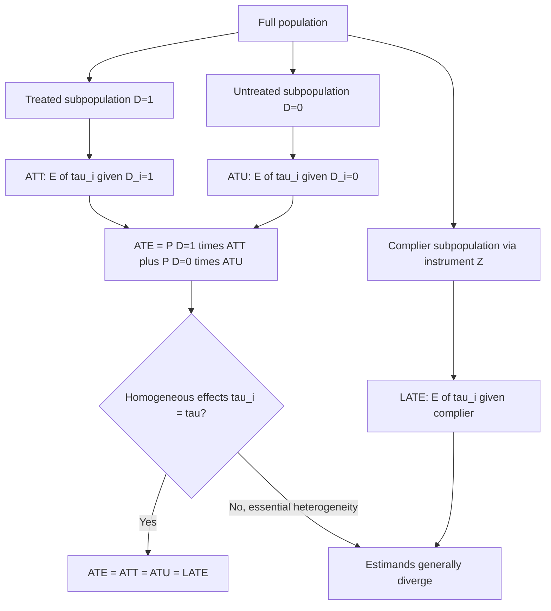

## Average Treatment Effects and Heterogeneity

### Overview

Once individual causal effects $\tau_i = Y_i(1) - Y_i(0)$ are acknowledged as fundamentally unobservable, causal inference proceeds by targeting well-defined population summary parameters. Different estimands — ATE, ATT, ATU, LATE — answer different policy-relevant questions and are generally **not numerically equal** whenever treatment effects vary across units, a phenomenon called **treatment effect heterogeneity**. Understanding which estimand a given research design actually identifies, and how heterogeneity should be characterized rather than assumed away, is central to correctly interpreting applied causal inference results.

### Core Population Estimands

**Average Treatment Effect (ATE):**

$$\text{ATE} = E[Y_i(1) - Y_i(0)]$$

The effect of treatment averaged over the entire population of interest, including both those who would and would not, in practice, select into treatment. Answers: "what would be the average effect of treating a randomly selected member of this population?"

**Average Treatment Effect on the Treated (ATT):**

$$\text{ATT} = E[Y_i(1) - Y_i(0) \mid D_i = 1]$$

The average effect among those who actually received treatment. Answers: "how much did treatment help the people who actually got it?" — the natural estimand for evaluating an existing, non-mandatory program.

**Average Treatment Effect on the Untreated (ATU / ATC):**

$$\text{ATU} = E[Y_i(1) - Y_i(0) \mid D_i = 0]$$

The average effect *if* those who did not receive treatment had received it. Relevant for assessing the potential impact of expanding a program to a currently untreated population.

**Local Average Treatment Effect (LATE):**

$$\text{LATE} = E[Y_i(1) - Y_i(0) \mid \text{complier}]$$

Identified by instrumental variables under monotonicity (Imbens & Angrist, 1994), this is the average effect specifically among **compliers** — units whose treatment status is causally moved by the instrument. It is a well-defined, internally valid estimand but applies only to the (typically unidentifiable, in terms of individual identity) complier subpopulation, not to the full population, always-takers, or never-takers.

### The Relationship Between Estimands

The ATE decomposes as a weighted average of ATT and ATU:

$$\text{ATE} = P(D=1) \cdot \text{ATT} + P(D=0) \cdot \text{ATU}$$

This identity makes explicit that **ATE = ATT = ATU only under treatment effect homogeneity** (constant $\tau_i = \tau$ for all $i$) or under specific conditions such as random assignment combined with no differential selection on effect size. In observational settings with self-selection into treatment based on expected gains (a pattern termed **essential heterogeneity** by Heckman, Urzua & Vytlacil, 2006), ATT and ATU can diverge substantially, and neither generally equals the LATE identified by a particular instrument.

[Confirmed] This divergence is not a technical curiosity — it is the standard interpretation offered for why different credible research designs applied to the *same underlying causal question* (e.g., returns to schooling, effects of job training) frequently produce numerically different point estimates: each design may be correctly identifying a different, genuinely distinct estimand rather than one of them being "wrong."

### Sources and Forms of Treatment Effect Heterogeneity

**Observed heterogeneity**: effects vary systematically with observed covariates $X_i$, captured by the **Conditional Average Treatment Effect (CATE)**:

$$\text{CATE}(x) = E[Y_i(1) - Y_i(0) \mid X_i = x]$$

The ATE recovers as $\text{ATE} = E_X[\text{CATE}(X)]$. Estimating CATE functions — rather than a single scalar ATE — is the objective of the modern causal machine learning literature (causal forests, Wager & Athey, 2018; meta-learners such as the T-learner, S-learner, and X-learner), which use flexible nonparametric methods to characterize how effects vary across the covariate space while retaining valid statistical inference on the resulting estimates.

**Unobserved heterogeneity**: effects vary due to unobserved factors (e.g., unmeasured ability, motivation, or match quality) not captured by any $X_i$ in the data. This is the source of the divergence between ATT/ATU/LATE discussed above when individuals select into treatment partly based on their own anticipated (unobserved) gain — the canonical **Roy model** (Roy, 1951) of self-selection formalizes this: individuals choose the sector/treatment yielding higher expected personal payoff, which mechanically induces $E[Y_i(1)-Y_i(0)\mid D_i=1] > E[Y_i(1)-Y_i(0)\mid D_i=0]$ whenever selection is on gains.

**Quantile treatment effects**: rather than the difference in conditional means, the **Quantile Treatment Effect (QTE)** at quantile $q$ compares the $q$-th quantile of $Y(1)$'s marginal distribution to the $q$-th quantile of $Y(0)$'s marginal distribution:

$$\text{QTE}(q) = F_{Y(1)}^{-1}(q) - F_{Y(0)}^{-1}(q)$$

[Confirmed] The QTE is generally **not** the effect for any single individual at that quantile (since the individual at the $q$-th quantile of $Y(1)$'s distribution need not be the same individual at the $q$-th quantile of $Y(0)$'s distribution) — it is a comparison of marginal distributions, informative about distributional/inequality impacts of treatment even though it does not answer an individual-level counterfactual question.

### Identification of Heterogeneous Effects

- **Under unconfoundedness**: CATE$(x)$ is identified via $E[Y\mid D=1,X=x] - E[Y\mid D=0,X=x]$ for each $x$ in the region of common support, estimable via flexible regression, matching within covariate cells, or machine-learning-based conditional mean estimation.
- **Under random assignment**: heterogeneity can be explored by pre-specified subgroup analysis (interacting $D_i$ with baseline covariates), subject to the multiple-testing caveats discussed for RCTs — subgroup effects are more prone to false discovery than the overall ATE.
- **Under instrumental variables with heterogeneous effects**: the LATE framework requires the **monotonicity assumption** (no "defiers": the instrument does not induce anyone to do the opposite of its intended direction) to be well-defined; different instruments for the same treatment can identify different LATEs corresponding to different complier populations, so IV estimates using different instruments are not generally comparable even when targeting "the same" treatment variable.

### Worked Example: Returns to a Training Program with Selection on Gains

**Example**: suppose a job training program's effect on earnings, $\tau_i = Y_i(1) - Y_i(0)$, is heterogeneous, and individuals with the largest anticipated gains are most likely to enroll (Roy-type selection):

- The **ATT** will exceed the **ATE**, since the treated group is composed disproportionately of high-gain individuals.
- The **ATU** will fall below the ATE, since the untreated group disproportionately consists of individuals who would gain little (which is partly *why* they did not enroll).
- If eligibility for the program was expanded via a lottery among applicants (an instrument for enrollment among the applicant pool), the resulting **LATE** — the effect among applicants whose enrollment was moved by winning the lottery — would generally differ from all three of ATE, ATT, and ATU, since lottery compliers are a specific subpopulation (applicants on the margin of enrollment) distinct from the full population, the always-enrolled, or the never-eligible.

[Unverified] Whether selection is actually on gains (as opposed to on levels, e.g., low-earnings individuals self-selecting into training regardless of expected treatment effect) is an empirical question specific to each program and cannot be assumed a priori; the sign and magnitude of ATT-versus-ATE divergence in any real dataset should be estimated rather than presumed from theory alone.

### Diagram: Estimand Relationships

### CATE and Distribution of Effects (SVG)

<svg xmlns="http://www.w3.org/2000/svg" viewBox="0 0 800 300">
<text x="400" y="25" font-size="16" font-weight="bold" text-anchor="middle" fill="#1a1a1a">Heterogeneous Treatment Effects Across Covariates (svg_diagram)</text>
<line x1="60" y1="250" x2="740" y2="250" stroke="#333" stroke-width="1.5" />
<line x1="60" y1="250" x2="60" y2="60" stroke="#333" stroke-width="1.5" />
<text x="400" y="275" font-size="12" text-anchor="middle" fill="#1a1a1a">covariate X (e.g., baseline earnings)</text>
<text x="30" y="160" font-size="12" text-anchor="middle" fill="#1a1a1a" transform="rotate(-90 30 160)">CATE(x)</text>
<path d="M 80 100 C 200 80 300 180 400 190 C 500 200 600 140 720 110" fill="none" stroke="#1565c0" stroke-width="2.5" />
<line x1="60" y1="150" x2="740" y2="150" stroke="#e65100" stroke-width="2" stroke-dasharray="6,3" />
<text x="700" y="140" font-size="11" fill="#e65100">ATE (population average)</text>
<circle cx="200" cy="90" r="4" fill="#2e7d32" />
<circle cx="400" cy="190" r="4" fill="#2e7d32" />
<circle cx="600" cy="130" r="4" fill="#2e7d32" />
<text x="200" y="75" font-size="10" fill="#2e7d32">high-X: larger effect</text>
<text x="400" y="210" font-size="10" fill="#2e7d32">mid-X: smaller effect</text>
</svg>

### Testing for Heterogeneity

- **Interaction-based tests**: including $D_i \times X_i$ interaction terms and testing joint significance, though this approach can be underpowered relative to the overall ATE test and is sensitive to functional form choices for continuous $X_i$.
- **Variance-based tests**: comparing $\text{Var}(Y_i \mid D_i=1)$ to $\text{Var}(Y_i\mid D_i=0)$ can provide indirect evidence of heterogeneity, since constant treatment effects imply the variance of $Y$ should be unaffected in a specific way, though this test has limited power and relies on additional assumptions.
- **Machine-learning-based approaches**: causal forests and related methods provide formal honest-inference procedures for testing whether estimated CATE functions vary significantly across the covariate space, rather than being constant (Athey & Imbens, 2016, on "honest" splitting for valid post-selection inference).

### Common Pitfalls

- **Reporting an ATE as if it applies to every individual**: a positive and statistically significant ATE is consistent with the treatment harming a meaningful subset of the population, provided it helps others enough on average — the ATE alone cannot rule this out, and policy conclusions drawn from ATE alone can be misleading when effects are heterogeneous and some units are harmed.
- **Comparing ATT, ATE, and LATE estimates across studies as if they measured the same thing**: differing point estimates for "the effect of X" across papers using different identification strategies (RCT vs. IV vs. matching) may simply reflect that each identifies a different well-defined but distinct estimand, not that one study is more "correct."
- **Overinterpreting QTEs as individual-level statements**: a QTE showing the treatment raised the 90th percentile of the outcome distribution does not imply any specific individual moved to that percentile because of treatment — rank-preservation is an additional, generally untestable assumption.
- **Data-mined subgroup effects**: post-hoc discovery of a subgroup with a large, "significant" treatment effect, without pre-registration or correction for the (often very large) number of subgroups implicitly searched over, is a well-documented source of non-replicable heterogeneity claims.

**Related Topics**

- The Rubin causal model and potential outcomes framework
- Instrumental variables and the LATE / monotonicity framework (Imbens & Angrist, 1994)
- The Roy model of self-selection and essential heterogeneity (Heckman, Urzua & Vytlacil, 2006)
- Causal forests and machine-learning estimation of CATE (Wager & Athey, 2018)
- Quantile treatment effects and distributional impacts
- Meta-learners for heterogeneous effects: S-learner, T-learner, X-learner
- Honest inference and sample-splitting in causal machine learning (Athey & Imbens, 2016)
- Multiple hypothesis testing in subgroup analysis