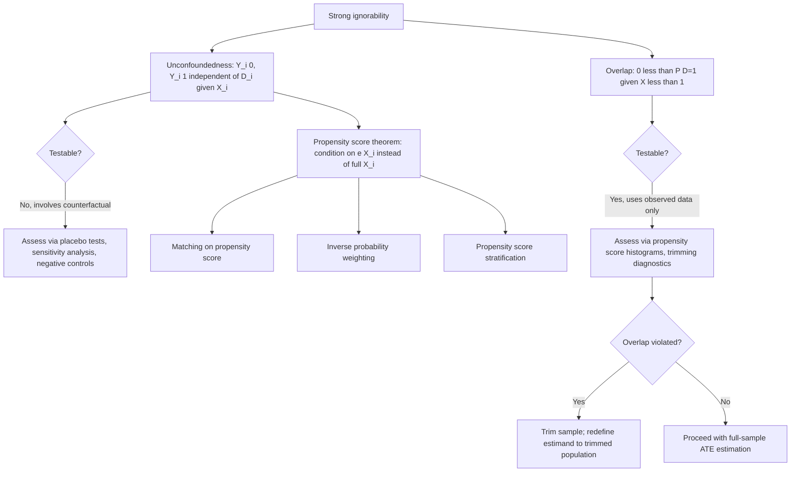

## Identification Assumptions: Ignorability and Overlap

### Overview

Ignorability (also called unconfoundedness or the conditional independence assumption) and overlap (also called common support) are the two identifying assumptions that jointly permit causal effects to be recovered from observational data via **conditioning on observed covariates**, without requiring random assignment. Together they are often referred to as **strong ignorability** (Rosenbaum & Rubin, 1983), and they form the foundation for the entire family of matching, regression-adjustment, propensity score, and inverse probability weighting estimators. Unlike randomization, which delivers these properties by design, observational studies must argue for them using domain knowledge, since neither assumption is directly testable from the observed data.

### Ignorability (Unconfoundedness)

**Formal statement:**

$$\{Y_i(0), Y_i(1)\} \perp D_i \mid X_i$$

Conditional on the observed covariate vector $X_i$, treatment assignment is statistically independent of the potential outcomes. Equivalently, all confounders — variables that causally affect both treatment assignment and the outcome — are fully captured in $X_i$. This is also called the **selection-on-observables** assumption, distinguishing it from settings (addressed by instrumental variables, difference-in-differences, or regression discontinuity) where confounding is believed to operate partly through **unobserved** variables.

**Weaker variant — mean independence**, sufficient for identifying the ATE without requiring the full distributional independence:

$$E[Y_i(0) \mid D_i, X_i] = E[Y_i(0) \mid X_i], \qquad E[Y_i(1)\mid D_i, X_i] = E[Y_i(1)\mid X_i]$$

**Why it is untestable:** unconfoundedness is a joint statement involving $D_i$ and the *counterfactual* outcome $Y_i(1-D_i)$, which is never observed for any unit. No amount of data on the joint distribution of $(Y_i, D_i, X_i)$ — all observable quantities — can directly confirm or refute a claim about the unobserved counterfactual's relationship with $D_i$. [Confirmed] This is a structural, not merely practical, limitation: even with infinite sample size, unconfoundedness remains an assumption imposed by the researcher based on institutional knowledge of the assignment process, not a testable statistical hypothesis in the usual sense.

### Assessing the Plausibility of Ignorability

Because it cannot be directly tested, applied researchers rely on indirect evidence and sensitivity analysis:

- **Placebo/falsification tests**: testing whether treatment "predicts" an outcome that it should have no causal effect on (e.g., a pre-treatment/lagged outcome, or a variable known to be causally unrelated to treatment). A significant "effect" on a placebo outcome is evidence *against* unconfoundedness (it suggests remaining confounding), though a null placebo result does not prove ignorability holds for the actual outcome of interest.
- **Covariate balance checks**: after conditioning (matching, weighting), verifying that treated and control groups are balanced on observed $X_i$. This validates only that observed confounders are balanced — it says nothing about unobserved confounders.
- **Sensitivity analysis / bounding**: quantifying how large an unobserved confounder would need to be (in its association with both treatment and outcome) to overturn the estimated effect. The classic approach is **Rosenbaum bounds**, which report how large a hidden bias (parameterized by an odds-ratio sensitivity parameter $\Gamma$) would need to be to render the estimated effect statistically insignificant. More recent approaches (Cinelli & Hazlett, 2020, "sensitivity analysis via partial R²") reframe this in terms of how much residual variance an unobserved confounder would need to explain in both treatment and outcome to nullify the result, expressed in units comparable to the observed covariates already in the model (a "robustness value").
- **Negative control outcomes/exposures**: using variables known a priori to be unaffected by treatment (negative control outcomes) or known to be unrelated to the true confounding structure (negative control exposures) as an indirect empirical check, a technique borrowed from epidemiology (Lipsitch, Tchetgen Tchetgen & Cohen, 2010).

### Overlap (Common Support)

**Formal statement:**

$$0 < P(D_i = 1 \mid X_i = x) < 1 \quad \text{for (almost) all } x \text{ in the support of } X$$

Also called the **positivity assumption**. Every covariate configuration observed in the population must have a positive probability of appearing in both the treatment and control groups. If some value $x^*$ exists such that $P(D=1\mid X=x^*) = 0$ or $1$, the ATE (or the relevant conditional treatment effect at $x^*$) is not identified at that point without extrapolation, because there is no empirical comparison group available at that covariate value.

**Why it matters mechanically:** the identification formula

$$\text{ATE} = E_X\big[E[Y\mid D=1,X] - E[Y\mid D=0,X]\big]$$

requires both conditional expectations $E[Y\mid D=1,X=x]$ and $E[Y\mid D=0,X=x]$ to be well-defined (i.e., estimable from actual data) for every $x$ over which the outer expectation integrates. Without overlap at some $x$, one of these conditional expectations has no supporting data at that $x$, and any estimate there relies entirely on model-based extrapolation rather than empirical comparison.

### Assessing and Addressing Overlap Violations

**Diagnosing overlap:**

- **Propensity score histograms**: plotting the estimated propensity score $\hat{e}(X_i) = \hat{P}(D_i=1\mid X_i)$ separately for treated and control units; substantial non-overlapping regions (e.g., control units concentrated near $\hat e \approx 0$ with no corresponding treated units) signal poor common support.
- **Extreme propensity score trimming**: dropping observations with $\hat e(X_i)$ near 0 or 1 (e.g., outside $[0.1, 0.9]$ or using more principled trimming rules such as Crump et al., 2009, which minimizes the asymptotic variance of the ATE estimator subject to a trimming rule) — this changes the estimand from the full-population ATE to the ATE on the (better-overlapping) trimmed subpopulation, which must be reported transparently as a different, narrower population of inference.

**Consequences of poor overlap for estimators:**

- **Inverse probability weighting (IPW)**: weights of the form $1/\hat e(X_i)$ or $1/(1-\hat e(X_i))$ become extremely large as $\hat e(X_i) \to 0$ or $1$, producing estimator variance that can be enormous and estimates dominated by a handful of observations with extreme weights.
- **Regression-based estimators**: with poor overlap, the linear (or other parametric) regression model is effectively **extrapolating** into regions with no data of one treatment arm, so estimates in low-overlap regions are highly sensitive to functional form assumptions that would otherwise be innocuous where overlap is good.
- **Matching estimators**: units without adequate matches within a specified caliper are typically dropped, which is matching's built-in (if implicit) way of enforcing overlap, at the cost of again redefining the estimand to the matched subsample.

### Strong Ignorability and Its Role in Estimator Derivation

Rosenbaum and Rubin's (1983) foundational result establishes that under strong ignorability (both unconfoundedness and overlap), conditioning on the scalar **propensity score** $e(X_i) = P(D_i=1\mid X_i)$ is sufficient to achieve the same identification as conditioning on the full covariate vector $X_i$:

$$\{Y_i(0), Y_i(1)\} \perp D_i \mid X_i \quad \implies \quad \{Y_i(0), Y_i(1)\} \perp D_i \mid e(X_i)$$

[Confirmed] This **propensity score theorem** is the formal justification for the entire family of propensity-score-based methods (matching on the propensity score, propensity score stratification, inverse probability weighting) — it allows a potentially high-dimensional covariate-conditioning problem to be reduced to conditioning on a single scalar summary, at the cost of needing to estimate $e(X_i)$ itself (typically via logistic regression or more flexible machine learning methods), which introduces its own estimation-error considerations (e.g., motivating doubly robust estimators).

### Worked Example: Estimating Returns to Education

**Example**: suppose the goal is to estimate the causal effect of a college degree ($D_i=1$) on earnings, using survey data with covariates $X_i$ (parental education, high school GPA, standardized test scores, family income).

- **Ignorability concern**: individuals with unobserved characteristics correlated with both earnings potential and college attendance (e.g., unmeasured ability, family social capital, personal motivation) would violate unconfoundedness — this is the classic "ability bias" concern in the returns-to-education literature, and is a primary reason this literature relies heavily on instrumental variables (e.g., distance to college, compulsory schooling law changes) rather than selection-on-observables designs alone.
- **Overlap concern**: individuals from the very highest-income, highest-parental-education families may have $P(D_i=1\mid X_i) \approx 1$ (virtually everyone in that stratum attends college), making it impossible to estimate a control-group counterfactual in that stratum from the observed data — any regression-based extrapolation into that region relies entirely on functional-form assumptions rather than direct comparison.
- **Practical resolution**: a matching or weighting estimator restricted to the region of common covariate support (e.g., excluding the very highest-income stratum) can credibly estimate the ATT for the population where meaningful non-college comparison cases exist, while an instrumental variables design targeting the LATE among compliers induced by a specific policy change avoids the ignorability concern entirely by using a different identification strategy. [Unverified] The specific magnitude of ability bias correction (i.e., how much OLS estimates of returns to schooling overstate the causal effect due to omitted ability) varies substantially across studies, datasets, and time periods, and should not be treated as a fixed, universally applicable adjustment factor.

### Diagram: Strong Ignorability and Estimator Family

### Overlap Diagnostics (SVG)

<svg xmlns="http://www.w3.org/2000/svg" viewBox="0 0 800 300">
<text x="400" y="25" font-size="16" font-weight="bold" text-anchor="middle" fill="#1a1a1a">Propensity Score Distributions: Good vs. Poor Overlap (svg_diagram)</text>
<text x="180" y="55" font-size="13" font-weight="bold" text-anchor="middle" fill="#1a1a1a">Good overlap</text>
<line x1="60" y1="180" x2="320" y2="180" stroke="#333" stroke-width="1.5" />
<path d="M 70 178 Q 130 100 190 178 Q 250 100 310 178" fill="#e3f2fd" stroke="#1565c0" stroke-width="2" opacity="0.7" />
<path d="M 90 178 Q 150 130 210 178 Q 270 130 305 178" fill="#fce4ec" stroke="#ad1457" stroke-width="2" opacity="0.6" />
<text x="180" y="200" font-size="10" text-anchor="middle" fill="#555">propensity score e(X)</text>
<text x="100" y="120" font-size="10" fill="#1565c0">control</text>
<text x="230" y="150" font-size="10" fill="#ad1457">treated</text>

<text x="600" y="55" font-size="13" font-weight="bold" text-anchor="middle" fill="`#1a1a1a`">Poor overlap</text>

<line x1="470" y1="180" x2="730" y2="180" stroke="#333" stroke-width="1.5" />

<path d="M 480 178 Q 520 100 560 178" fill="`#e3f2fd`" stroke="`#1565c0`" stroke-width="2" opacity="0.7" />

<path d="M 640 178 Q 680 100 720 178" fill="`#fce4ec`" stroke="`#ad1457`" stroke-width="2" opacity="0.6" />

<text x="600" y="200" font-size="10" text-anchor="middle" fill="#555">propensity score e(X)</text>

<text x="500" y="120" font-size="10" fill="`#1565c0`">control only</text>

<text x="700" y="120" font-size="10" fill="`#ad1457`">treated only</text>

<rect x="560" y="60" width="80" height="130" fill="`#ffebee`" opacity="0.5" />

<text x="600" y="245" font-size="11" text-anchor="middle" fill="`#c62828`">no common support region</text>

</svg>

### Common Pitfalls

- **Treating "controlling for X" as automatically sufficient**: including covariates in a regression does not itself establish unconfoundedness — it only helps if the included $X_i$ genuinely captures *all* confounding, an assumption that must be justified substantively, not just implemented mechanically.
- **Confusing statistical balance with causal sufficiency**: achieving balance on observed covariates via matching or weighting says nothing about balance on unobserved confounders, which remains the binding (and untestable) concern.
- **Ignoring overlap diagnostics before reporting an ATE**: reporting a population-wide ATE without checking or reporting the overlap region silently substitutes model-based extrapolation for empirical comparison in poorly-overlapping strata, without flagging this to the reader.
- **Estimating the propensity score with an overly flexible or overly rigid model**: an overly flexible propensity score model can produce extreme, unstable weights even in regions of genuine overlap; an overly rigid (e.g., low-order polynomial) specification can fail to capture true nonlinearities in the true assignment mechanism, leading to residual imbalance.
- **Reporting sensitivity analysis results as proof of robustness**: a sensitivity analysis showing "a confounder would need to be very strong to overturn this result" is evidence in favor of the conclusion's robustness, not a substitute for a substantive argument about what specific confounders might plausibly exist and how strong they could be.

**Related Topics**

- The Rubin causal model and potential outcomes framework
- Propensity score matching, weighting, and stratification methods
- Doubly robust estimation (augmented inverse probability weighting)
- Rosenbaum bounds and sensitivity analysis for hidden bias
- Cinelli-Hazlett sensitivity analysis via partial R²
- Trimming rules for propensity score overlap (Crump et al., 2009)
- Instrumental variables as an alternative to selection-on-observables designs
- Negative control outcomes and exposures in observational epidemiology