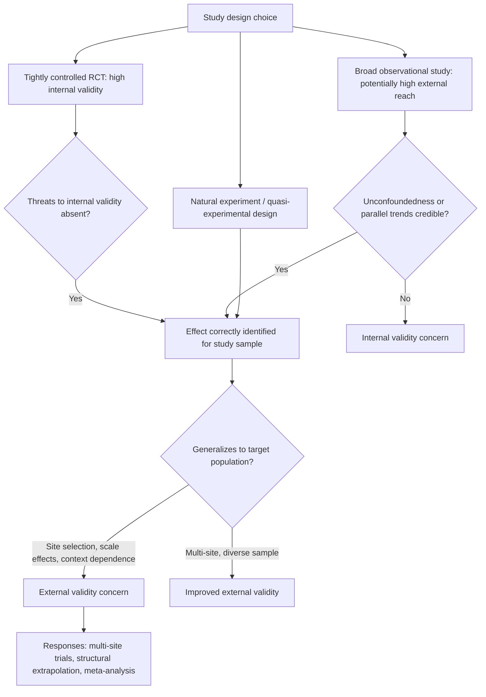

## Internal Versus External Validity

### Overview

Internal and external validity are two distinct, largely independent properties a causal estimate can possess. **Internal validity** concerns whether a study correctly identifies the causal effect *for the specific population, setting, and time period actually studied*. **External validity** concerns whether that correctly identified effect *generalizes* to other populations, settings, implementations, or time periods of interest. A study can be highly internally valid (a well-executed RCT with perfect randomization) while having limited external validity (a small pilot in one region that may not predict effects at national scale), and conversely, an observational study drawing on broad, representative data may have good external reach but questionable internal validity if its identifying assumptions are weak. Distinguishing the two is essential for correctly interpreting what a given causal estimate does and does not license the researcher to claim.

### Internal Validity

**Definition:** a study has internal validity if the estimated effect can be attributed to the treatment itself, within the sample and context studied, rather than to confounding, selection bias, measurement error, or other threats to identification.

**Primary threats to internal validity** (drawing on the identification concepts developed throughout the Rubin causal model framework):

- **Confounding / violation of unconfoundedness**: omitted variables that affect both treatment assignment and the outcome.
- **Selection bias**: non-random selection into treatment or into the analyzed sample (including differential attrition).
- **SUTVA violations**: interference between units or hidden variation in treatment delivery, both of which undermine the very definition of the potential outcomes being compared.
- **Reverse causality**: the outcome (or anticipation of it) causally affects treatment assignment rather than, or in addition to, the reverse.
- **Measurement error**: especially **non-classical** measurement error correlated with treatment status, which can bias estimated effects in either direction (classical, non-differential measurement error in a continuous regressor typically attenuates estimated effects toward zero, but this attenuation result does not generally hold once error is differential or the regressor is discrete/binary).
- **Post-treatment bias**: conditioning on a variable that is itself affected by treatment (a "collider" or mediator) when the estimand of interest is the total effect, which can induce bias of unpredictable sign and magnitude.

Randomized controlled trials, when properly implemented (adequate randomization, low differential attrition, minimal noncompliance, no interference), are the design most directly associated with strong internal validity, because random assignment mechanically rules out confounding by construction. Well-executed observational designs (regression discontinuity near the threshold, difference-in-differences under a credible parallel trends assumption, instrumental variables with a strong and plausibly exogenous instrument) can also achieve strong internal validity for their specific local estimand, even without randomization.

### External Validity

**Definition:** a study has external validity if the estimated causal effect — even if internally valid within the study sample — can be expected to hold (approximately) in a different target population, setting, time period, or scaled implementation.

**Primary threats to external validity:**

- **Sample selection / non-representativeness**: study participants (especially in RCTs, which often rely on volunteers or specific eligible populations) may differ systematically from the broader population of policy interest, and treatment effects may be correlated with the very characteristics that determined study participation.
- **Site-selection bias**: when implementing organizations or pilot locations are not randomly chosen but instead selected based on factors correlated with likely program success (e.g., NGOs choosing to pilot in favorable administrative environments), a documented concern in the development economics RCT literature (Allcott, 2015, "Site Selection Bias in Program Evaluation," demonstrates this formally using data on energy conservation programs run across many sites).
- **General equilibrium / scale effects**: an intervention's effect estimated at small (partial equilibrium) scale may not hold when implemented at large scale, because price, wage, or capacity-constraint effects that were negligible in a small pilot become first-order at scale (directly connected to SUTVA's no-interference assumption, which is far more likely to hold in a small pilot than in a scaled national program).
- **Implementation fidelity and context dependence**: treatment effects can depend on complementary local institutions, implementer quality, or cultural context in ways not captured by the original study's setting, so replication in a different context may implement a subtly different "version" of the treatment (connecting to SUTVA's consistency component).
- **Temporal validity / effect drift**: an effect estimated in one time period may not hold in a different economic or technological environment (e.g., estimated returns to a specific job-training curriculum may not generalize once labor market conditions or required skills change substantially).
- **Hawthorne/experimenter effects**: behavior in a monitored study setting may differ from behavior under a routine, non-experimental scaled implementation of the same nominal policy.

### The Trade-off in Practice

There is a widely observed (though not strictly universal) **tension** between internal and external validity in study design choices:

- **Lab experiments and tightly controlled field experiments** often maximize internal validity (precise control over randomization and treatment delivery) at some cost to external validity (artificial settings, self-selected or narrow participant pools, small implementation scale).
- **Large observational studies using broad administrative or survey data** often have superior external reach (large, more representative samples, real-world implementation conditions) but must rely on weaker, harder-to-verify identifying assumptions for internal validity (unconfoundedness or parallel trends assumptions that cannot be guaranteed by design).
- **Natural experiments and quasi-experimental designs** (regression discontinuity, difference-in-differences using existing policy variation) attempt to combine reasonably strong internal validity (arising from a credible source of "as-if" random variation) with somewhat improved external validity relative to a bespoke small-scale RCT, since they typically study a policy already implemented at real-world scale — though the resulting estimand (e.g., a LATE local to the discontinuity threshold, or an effect local to the specific policy change exploited) may itself have limited generalizability to different intensities or populations.

[Confirmed] This is generally presented as a matter of *degree and trade-off* rather than a strict impossibility theorem — well-designed multi-site RCTs, structural modeling that extrapolates estimated parameters to new counterfactual scenarios, and systematic replication across contexts are all active methodological responses aimed at improving external validity without abandoning strong internal-validity designs.

### Methodological Responses to External Validity Concerns

- **Multi-site and generalizability-focused trial designs**: deliberately implementing the same intervention across a purposively diverse or randomly selected set of sites (rather than one or a few convenience sites) to directly estimate how effects vary with site characteristics, rather than assuming a single-site estimate generalizes.
- **Structural modeling and extrapolation**: estimating a structural economic model (with parameters that plausibly represent deep behavioral primitives, such as preferences or technology) from a specific experimental or quasi-experimental variation, then using the calibrated model to simulate counterfactual policies or scales not directly observed in the original data — trading the "black box" credibility of reduced-form causal estimates for explicit, falsifiable extrapolation assumptions.
- **Meta-analysis and systematic replication**: aggregating internally valid estimates across many studies, contexts, and populations to characterize the *distribution* of effects and how it correlates with observable context characteristics, rather than relying on any single study's external validity claim.
- **Explicit characterization of the local/target population**: careful reporting of the estimand actually identified (e.g., LATE for compliers with a specific instrument, ATT for a specific self-selected population) and the population/context to which the researcher believes the results plausibly extend, rather than an implicit or unstated generalization.

### Worked Example: Microfinance Impact Evaluation

**Example**: consider a series of randomized evaluations of microcredit access conducted across several countries (a well-known example being the coordinated set of studies summarized in Banerjee, Karlan & Zinman, 2015, "Six Randomized Evaluations of Microcredit").

- **Internal validity**: each individual RCT, properly randomized within its specific study site, provides internally valid estimates of microcredit's effect *for that specific population and lender's specific loan product*.
- **External validity concern**: the studies found effects that were, in general, more modest than earlier, more optimistic non-experimental claims about microcredit — but even across these several rigorously randomized studies conducted deliberately as a coordinated multi-site effort specifically to address generalizability concerns, effect estimates varied by context, loan product design, and population, illustrating that even a well-executed internally valid design in one context does not straightforwardly transfer its point estimate to a different microfinance context. [Unverified] The specific numerical magnitude of effects (or lack thereof) found in any individual one of these studies is specific to that study's population, loan terms, and time period, and should be sourced directly from the specific paper rather than treated as a single generalized "the effect of microcredit."

### Diagram: Internal vs. External Validity Trade-off Space

### Validity Trade-off Space (SVG)

<svg xmlns="http://www.w3.org/2000/svg" viewBox="0 0 780 320">
<text x="390" y="25" font-size="16" font-weight="bold" text-anchor="middle" fill="#1a1a1a">Internal vs. External Validity: Study Design Positioning (svg_diagram)</text>
<line x1="80" y1="270" x2="700" y2="270" stroke="#333" stroke-width="1.5" />
<line x1="80" y1="270" x2="80" y2="60" stroke="#333" stroke-width="1.5" />
<text x="390" y="295" font-size="12" text-anchor="middle" fill="#1a1a1a">External validity</text>
<text x="35" y="165" font-size="12" text-anchor="middle" fill="#1a1a1a" transform="rotate(-90 35 165)">Internal validity</text>
<circle cx="180" cy="100" r="10" fill="#1565c0" />
<text x="180" y="85" font-size="11" text-anchor="middle" fill="#1565c0">Small lab / tight field RCT</text>
<circle cx="580" cy="220" r="10" fill="#e65100" />
<text x="580" y="245" font-size="11" text-anchor="middle" fill="#e65100">Broad observational study</text>
<circle cx="400" cy="140" r="10" fill="#2e7d32" />
<text x="400" y="125" font-size="11" text-anchor="middle" fill="#2e7d32">Natural experiment / RD / DiD</text>
<circle cx="480" cy="90" r="10" fill="#4527a0" />
<text x="480" y="75" font-size="11" text-anchor="middle" fill="#4527a0">Multi-site RCT</text>
<circle cx="620" cy="110" r="10" fill="#ad1457" />
<text x="620" y="95" font-size="11" text-anchor="middle" fill="#ad1457">Structural model + extrapolation</text>
</svg>

### Common Pitfalls

- **Assuming a well-identified internal estimate automatically informs policy at scale**: an internally valid RCT estimate showing a program "works" in one pilot context provides no automatic guarantee about its effect if scaled nationally, particularly when general equilibrium channels are plausible.
- **Dismissing internally weaker but broader observational evidence entirely**: while observational studies face harder-to-verify identifying assumptions, dismissing all such evidence in favor of narrow RCT results can itself introduce an external-validity blind spot if the RCT population is unusual.
- **Treating "the effect" of an intervention as a single fixed number**: given both treatment effect heterogeneity and external validity concerns, presenting a single point estimate from one study as "the" universal effect of an intervention category (e.g., "the effect of microcredit," "the effect of class size reduction") overstates the generalizability that any single well-identified study can provide.
- **Ignoring site-selection bias in program evaluation**: treating the specific sites or implementing partners chosen for an evaluation as representative of where the program might be deployed more broadly, when in practice such partners are frequently selected precisely because they are unusually capable or motivated implementers.

**Related Topics**

- The Rubin causal model and identification assumptions
- SUTVA and general equilibrium effects at scale
- Site-selection bias in program evaluation (Allcott, 2015)
- Multi-site randomized trials and generalizability-focused designs
- Structural estimation and policy counterfactual simulation
- Meta-analysis methods for aggregating causal estimates across studies
- Regression discontinuity and local average treatment effects
- Difference-in-differences and the parallel trends assumption