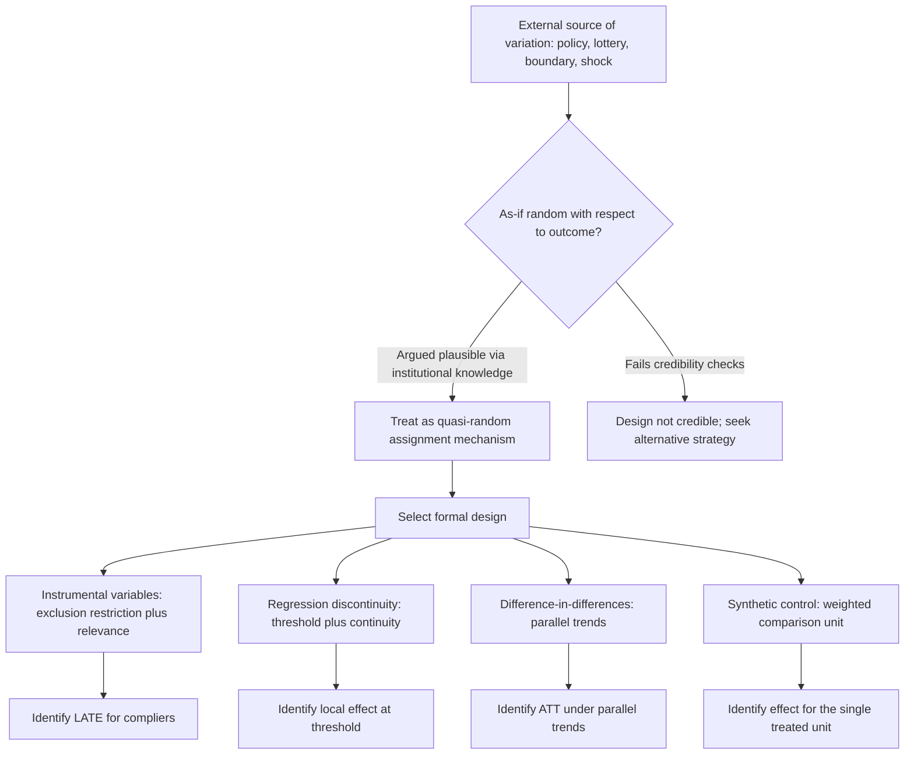

## Natural Experiments

### Overview

Natural experiments exploit variation in treatment assignment that arises from external forces — policy changes, administrative rules, geographic boundaries, historical accidents, weather, lotteries — that are not under the researcher's control but plausibly mimic the "as-if random" assignment that would occur in a designed experiment. They occupy a middle ground between fully controlled RCTs and purely observational studies: the researcher does not design or implement the treatment variation, but argues that the naturally occurring source of variation is exogenous with respect to the outcome of interest, permitting causal identification without direct experimental manipulation. The term encompasses the source variation exploited by several formal identification strategies (instrumental variables, regression discontinuity, difference-in-differences), and is often used more loosely to describe the underlying quasi-random event itself.

### The Core Logic

A natural experiment identification strategy generally follows this structure:

1. Identify a source of variation in treatment status that is plausibly **unrelated to the potential outcomes** except through its effect on treatment (i.e., it satisfies an exogeneity or "as-if randomness" condition).
2. Argue, using institutional knowledge, historical detail, or statistical checks, that this variation is not itself driven by the same unobserved factors that would confound a naive treatment-outcome comparison.
3. Use the natural experiment's structure to construct a formal estimator (difference-in-differences, instrumental variables, regression discontinuity, or a direct comparison across the naturally varying groups) that isolates the causal effect.

[Confirmed] The credibility of any natural experiment design rests entirely on the plausibility of step 2 — since the "randomization" is not literally designed or verified by the researcher, unlike a true RCT, the argument for exogeneity must be made using substantive, non-statistical evidence about the mechanism generating the natural variation, supplemented by statistical checks (balance tests, placebo tests) that provide indirect corroborating evidence.

### Common Sources of Natural Experimental Variation

- **Policy discontinuities and administrative rules**: eligibility cutoffs based on age, income, test scores, or date of birth that create sharp or discontinuous treatment assignment near a threshold — the foundation of regression discontinuity designs.
- **Legislative changes with differential timing or geographic scope**: a policy implemented in some states/countries but not others, or at different times, exploited via difference-in-differences.
- **Lotteries and randomized allocation embedded in real-world institutions**: military draft lotteries (Angrist, 1990, on the effect of Vietnam-era draft eligibility on earnings, using randomly assigned draft lottery numbers as an instrument for military service), school choice lotteries (oversubscribed charter schools using lotteries to allocate limited seats), and housing voucher lotteries (Moving to Opportunity).
- **Geographic and administrative boundaries**: discontinuities in policy, jurisdiction, or program eligibility at a geographic border (e.g., minimum wage differences across neighboring state or county lines, as in Card & Krueger, 1994; Dube, Lester & Reich, 2010, using contiguous county-pairs straddling state borders).
- **Weather, natural disasters, and other exogenous shocks**: rainfall variation, earthquakes, or other events plausibly unrelated to the economic outcome of interest except through the channel of interest (e.g., rainfall as an instrument for agricultural income or civil conflict).
- **Historical accidents and arbitrary administrative decisions**: colonial-era boundary decisions, arbitrarily drawn administrative lines, or historical settlement patterns used as sources of exogenous variation in modern outcomes (a substantial literature in comparative development economics, e.g., Acemoglu, Johnson & Robinson's use of historical settler mortality as an instrument for institutional quality).
- **Compulsory schooling laws and age-based cutoffs**: date-of-birth-driven variation in years of schooling due to school-entry-age cutoffs interacting with compulsory attendance laws (Angrist & Krueger, 1991, quarter-of-birth instrument for years of education).

### Formal Designs Built on Natural Experiments

Natural experiments are typically operationalized through one of several formal econometric designs, each imposing its own specific identifying assumptions beyond generic "as-if randomness":

- **Instrumental variables**: the natural experiment provides an instrument $Z_i$ that affects treatment $D_i$ but is argued to affect the outcome $Y_i$ only through $D_i$ (the exclusion restriction), combined with relevance ($Z_i$ meaningfully predicts $D_i$) and monotonicity, identifying the LATE for compliers.
- **Regression discontinuity**: the natural experiment creates a sharp (or fuzzy) discontinuity in treatment probability at a known threshold of a running variable, identifying a local effect at the threshold under continuity of potential outcomes across it.
- **Difference-in-differences**: the natural experiment (a policy change) affects some units (states, firms) but not others at a specific point in time, identifying the effect under a parallel trends assumption between treated and comparison groups.
- **Synthetic control methods**: when only a single (or very few) treated unit(s) experience the natural experiment (e.g., one state adopts a policy), a weighted combination of untreated units is constructed to approximate the counterfactual trajectory of the treated unit absent treatment (Abadie, Diamond & Hainmueller, 2010).

### Evaluating Credibility: Checks and Falsification Tests

- **Balance/covariate smoothness checks**: verifying that observed pre-treatment covariates do not jump discontinuously at an RD threshold, or are similar across DiD treatment/comparison groups pre-policy, as indirect evidence that the "assignment" was not manipulated or systematically related to other confounding factors.
- **Placebo cutoffs / placebo timing**: testing for spurious "effects" at values of the running variable or time periods where no actual treatment change occurred, which should show null effects if the design is valid.
- **McCrary density test / manipulation tests**: in RD designs specifically, testing whether the density of the running variable is continuous at the threshold — a discontinuity in density suggests units are manipulating their value of the running variable to sort into or out of treatment, undermining the "as-if random" assumption locally.
- **Institutional narrative and historical detail**: unlike purely statistical designs, natural experiments derive much of their credibility from a detailed, qualitative argument about *why* the specific source of variation is unrelated to confounding factors — this qualitative case is often as important to the paper's persuasiveness as any statistical test.
- **Robustness to alternative specifications and bandwidths**: showing the estimated effect is stable across different functional form choices, bandwidths (in RD), or control group definitions (in DiD), reducing concern that a specific arbitrary choice is driving the result.

### Distinguishing Natural Experiments from True (Designed) Experiments

| Aspect | True RCT | Natural Experiment |
| --- | --- | --- |
| Who controls assignment | Researcher | External force (policy, nature, institution) |
| Randomization verifiable | Yes, by design | No — must be argued, not verified |
| Balance on unobservables | Guaranteed in expectation | Assumed, supported only indirectly |
| Typical estimand | ATE (or ATT with imperfect compliance) | Often LATE or a local effect specific to the design |
| Ethical/practical constraints | Can be substantial (withholding treatment) | Bypassed — treatment already occurred |

[Confirmed] This comparison is the standard way applied econometrics courses frame the trade-off: natural experiments sacrifice the *design-based certainty* of randomization for the ability to study interventions, policies, and populations that could never be ethically or logistically randomized by a researcher (national policy changes, historical events, large-scale program eligibility rules).

### Worked Example: Vietnam Draft Lottery and Returns to Military Service

**Example** (Angrist, 1990): the U.S. Vietnam-era draft used a lottery based on randomly assigned birth-date numbers to determine draft eligibility, creating quasi-random variation in the probability of military service that was unrelated to individual characteristics correlated with later earnings.

- **Treatment**: military service, $D_i$.
- **Instrument**: draft-eligible lottery number, $Z_i$ — randomly assigned by construction (a genuine lottery), satisfying relevance (eligible men were substantially more likely to serve) and a plausible exclusion restriction (the lottery number itself should not affect later earnings except through its effect on the probability of serving).
- **Identification**: because $Z_i$ is randomly assigned, it is unconfounded by construction, converting what would otherwise be an endogenous self-selection problem (who chooses/is selected for military service) into a valid instrumental variables design identifying the LATE — the effect of military service for the subpopulation whose service was determined by their draft eligibility status (compliers).
- **Finding**: this design was influential in demonstrating that naive OLS comparisons of veterans versus non-veterans substantially understated the negative earnings effect of military service found via the (arguably more credible) lottery-based instrument, a divergence attributed to positive selection into (voluntary, non-lottery-driven) military service among individuals with otherwise lower expected civilian earnings. [Unverified] The exact magnitude of the earnings effect reported is specific to the sample, cohort, and time period studied in the original paper and later replications, and should be sourced from those specific studies rather than treated as a universal constant.

### Diagram: Natural Experiment Identification Pathway

### Sources of Natural Experimental Variation (SVG)

<svg xmlns="http://www.w3.org/2000/svg" viewBox="0 0 800 320">
<text x="400" y="25" font-size="16" font-weight="bold" text-anchor="middle" fill="#1a1a1a">Natural Experiment Sources Mapped to Designs (svg_diagram)</text>
<rect x="30" y="60" width="160" height="50" rx="6" fill="#e3f2fd" stroke="#1565c0" />
<text x="110" y="90" font-size="11" text-anchor="middle" fill="#1a1a1a">Lotteries (draft, school choice)</text>
<rect x="30" y="130" width="160" height="50" rx="6" fill="#e8f5e9" stroke="#2e7d32" />
<text x="110" y="160" font-size="11" text-anchor="middle" fill="#1a1a1a">Eligibility cutoffs</text>
<rect x="30" y="200" width="160" height="50" rx="6" fill="#fff3e0" stroke="#e65100" />
<text x="110" y="230" font-size="11" text-anchor="middle" fill="#1a1a1a">Policy timing/geography</text>
<rect x="30" y="270" width="160" height="30" rx="6" fill="#fce4ec" stroke="#ad1457" />
<text x="110" y="290" font-size="11" text-anchor="middle" fill="#1a1a1a">Historical accidents</text>
<rect x="330" y="60" width="160" height="50" rx="6" fill="#ede7f6" stroke="#4527a0" />
<text x="410" y="90" font-size="11" text-anchor="middle" fill="#1a1a1a">Instrumental Variables</text>
<rect x="330" y="130" width="160" height="50" rx="6" fill="#ede7f6" stroke="#4527a0" />
<text x="410" y="160" font-size="11" text-anchor="middle" fill="#1a1a1a">Regression Discontinuity</text>
<rect x="330" y="200" width="160" height="50" rx="6" fill="#ede7f6" stroke="#4527a0" />
<text x="410" y="230" font-size="11" text-anchor="middle" fill="#1a1a1a">Difference-in-Differences</text>
<rect x="330" y="270" width="160" height="30" rx="6" fill="#ede7f6" stroke="#4527a0" />
<text x="410" y="290" font-size="11" text-anchor="middle" fill="#1a1a1a">Instrumental Variables</text>
<line x1="190" y1="85" x2="330" y2="85" stroke="#555" stroke-width="2" marker-end="url(#arrow5)" />
<line x1="190" y1="155" x2="330" y2="155" stroke="#555" stroke-width="2" marker-end="url(#arrow5)" />
<line x1="190" y1="225" x2="330" y2="225" stroke="#555" stroke-width="2" marker-end="url(#arrow5)" />
<line x1="190" y1="285" x2="330" y2="285" stroke="#555" stroke-width="2" marker-end="url(#arrow5)" />
</svg>

### Common Pitfalls

- **Asserting "as-if randomness" without institutional support**: a purely statistical balance check showing no imbalance is weaker evidence than a substantive institutional argument for why the mechanism generating the variation is unrelated to confounders; balance checks can pass by chance or fail to detect confounding on unmeasured dimensions.
- **Overlooking that natural experiments often identify local, not global, effects**: the estimand from a specific natural experiment (LATE for a specific complier population, an RD effect local to a specific threshold) is frequently narrower than "the effect of the treatment" broadly, and generalizing beyond that local population requires additional (often untestable) assumptions.
- **Ignoring the possibility of confounding legislative/policy bundling**: a policy change exploited in a DiD or natural experiment design is often bundled with other simultaneous policy changes, making it difficult to attribute the entire estimated effect to the specific policy of interest.
- **Data mining natural experiments post hoc**: searching across many possible natural experiments or specifications until a "significant" and publishable result emerges undermines the credibility that natural experiments are meant to provide, and is a documented concern motivating pre-registration even in quasi-experimental (not just RCT) work.

**Related Topics**

- Instrumental variables and the exclusion restriction
- Regression discontinuity design and the McCrary density test
- Difference-in-differences and the parallel trends assumption
- Synthetic control methods (Abadie, Diamond & Hainmueller, 2010)
- The Rubin causal model and the LATE framework
- Historical natural experiments in comparative development economics
- Border discontinuity designs (Card & Krueger; Dube, Lester & Reich)
- Pre-registration and specification search concerns in quasi-experimental research