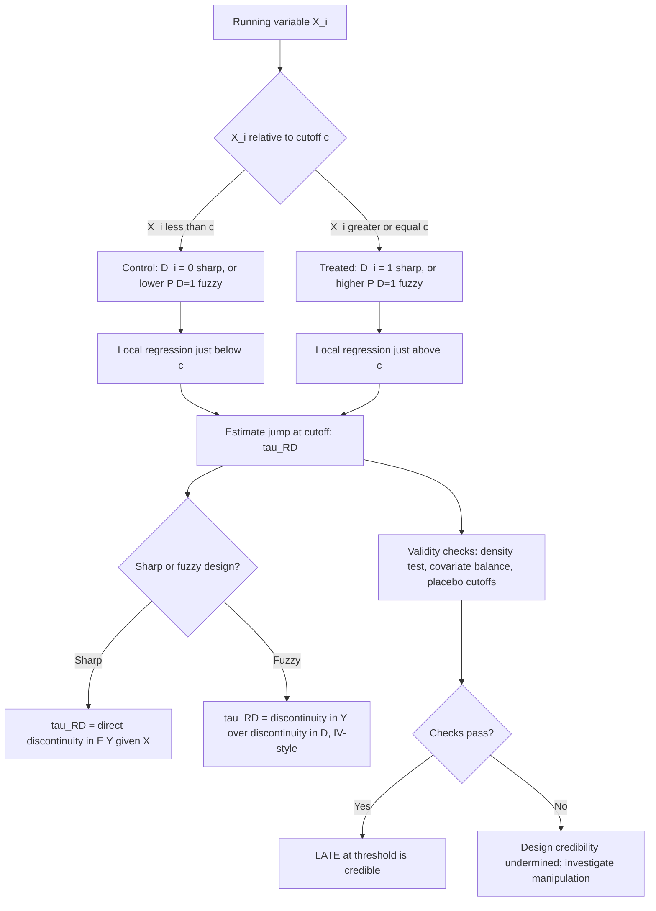

## Regression Discontinuity Design

### Overview

Regression discontinuity design (RDD) identifies causal effects by exploiting a known, deterministic (or near-deterministic) rule that assigns treatment based on whether a continuous **running variable** crosses a fixed threshold. Introduced by Thistlethwaite and Campbell (1960) and formalized in modern econometric practice by Hahn, Todd and Van der Klaauw (2001), RDD is considered one of the most credible quasi-experimental designs precisely because the identifying assumption — continuity of potential outcomes across the threshold — is both intuitively plausible in many settings and partially testable.

### Sharp RDD: Setup and Identification

In the **sharp RDD**, treatment is a deterministic function of the running variable $X_i$ relative to a known cutoff $c$:

$$D_i = \mathbb{1}[X_i \geq c]$$

Every unit with $X_i \geq c$ is treated; every unit with $X_i < c$ is not. The identifying assumption is **continuity of conditional expectation functions** at the threshold:

$$\lim_{x \downarrow c} E[Y_i(1) \mid X_i = x] = E[Y_i(1) \mid X_i = c], \qquad \lim_{x \uparrow c} E[Y_i(0) \mid X_i = x] = E[Y_i(0) \mid X_i = c]$$

Under this assumption, units just above and just below the cutoff are, in the limit, comparable in all respects except treatment status, so the discontinuity in the observed outcome regression function at $c$ identifies a local causal effect:

$$\tau_{\text{RD}} = \lim_{x \downarrow c} E[Y_i \mid X_i=x] - \lim_{x \uparrow c} E[Y_i \mid X_i=x] = E[Y_i(1) - Y_i(0) \mid X_i = c]$$

This is the **Local Average Treatment Effect at the cutoff** — a causal effect defined only for the subpopulation with $X_i = c$, not the full population, since units far from the threshold are not directly compared.

### Fuzzy RDD

In many applications, crossing the threshold changes the *probability* of treatment but does not deterministically assign it (e.g., eligibility for a program based on a test score, but with imperfect take-up). The **fuzzy RDD** allows:

$$\lim_{x\downarrow c} P(D_i=1\mid X_i=x) \neq \lim_{x\uparrow c} P(D_i=1\mid X_i=x)$$

without requiring the jump to go from 0 to 1. Identification then proceeds via an instrumental variables argument, using $\mathbb{1}[X_i \geq c]$ as an instrument for actual treatment receipt $D_i$:

$$\tau_{\text{fuzzy RD}} = \frac{\lim_{x\downarrow c} E[Y_i\mid X_i=x] - \lim_{x\uparrow c} E[Y_i\mid X_i=x]}{\lim_{x\downarrow c} E[D_i\mid X_i=x] - \lim_{x\uparrow c} E[D_i\mid X_i=x]}$$

the ratio of the "reduced-form" jump in the outcome to the "first-stage" jump in treatment probability, structurally analogous to a Wald IV estimator, identifying the LATE for **compliers at the threshold** — units whose treatment status is causally altered by crossing $c$.

### Local Randomization Interpretation

An influential alternative framing (Lee, 2008; Lee & Lemieux, 2010) interprets RDD not merely as a continuity-based extrapolation argument but as **local randomization**: if units cannot precisely manipulate their exact value of the running variable around the threshold (due to some idiosyncratic randomness in $X_i$ near $c$, e.g., imprecise control over an exact test score or exact date of birth), then treatment assignment is "as good as randomly assigned" for units in a small neighborhood of $c$, closely paralleling the logic of a genuine randomized experiment restricted to that neighborhood. [Confirmed] This local randomization framing is the standard intuitive justification given for why RDD, despite being fundamentally observational, is often regarded as nearly as credible as an RCT specifically in the neighborhood immediately around the cutoff.

### Estimation

**Local linear (or local polynomial) regression**, restricted to a bandwidth $h$ around the cutoff, is the standard estimator:

$$\hat\tau_{\text{RD}} = \hat\alpha_+ - \hat\alpha_-$$

where $\hat\alpha_+$, $\hat\alpha_-$ are the intercepts from separate weighted regressions of $Y_i$ on $(X_i - c)$ estimated on each side of the cutoff, using observations within $[c-h, c+h]$:

$$Y_i = \alpha_+ + \beta_+(X_i - c) + \varepsilon_i \quad \text{for } X_i \geq c$$

$$Y_i = \alpha_- + \beta_-(X_i - c) + \varepsilon_i \quad \text{for } X_i < c$$

**Kernel weighting**: observations are typically weighted by a kernel function (triangular kernel is standard and optimal in a minimax MSE sense per Cheng, Fan & Marron, 1997) that downweights observations farther from $c$ within the bandwidth.

**Bandwidth selection**: the choice of $h$ trades off bias (larger $h$ includes more distant, less comparable observations, increasing bias from the true discontinuity if the underlying relationship is nonlinear) against variance (smaller $h$ uses less data, increasing estimator variance). Data-driven optimal bandwidth selectors (Imbens & Kalyanaraman, 2012; Calonico, Cattaneo & Titiunik, 2014, the "CCT" or "rdrobust" approach) are standard modern practice, along with **robust bias-corrected confidence intervals** (Calonico, Cattaneo & Titiunik, 2014) that account for the first-order bias introduced by the bandwidth choice, rather than relying on the (typically undersized) confidence intervals from a naive local linear regression.

**Local polynomial order**: [Confirmed] the applied econometrics literature has moved strongly toward **local linear or local quadratic** specifications restricted to a data-driven bandwidth, and away from high-order global polynomial fits across the entire running-variable range (Gelman & Imbens, 2019, present formal arguments against high-order global polynomials, showing they can produce noisy estimates with poor properties, including excess sensitivity to the polynomial order chosen and to observations far from the cutoff).

### Validity Checks and Diagnostics

- **McCrary density test / manipulation testing** (McCrary, 2008; a widely used more recent alternative is Cattaneo, Jansson & Ma, 2020): tests whether the density of the running variable is continuous at the threshold. A discontinuity in density (e.g., a "bunching" of units just above the cutoff) suggests manipulation or precise sorting around the threshold, directly threatening the local randomization/continuity assumption.
- **Covariate balance / placebo outcome tests**: testing whether observed pre-determined covariates (which should not be affected by treatment) show a discontinuity at the cutoff; a significant jump in a covariate that treatment should not affect is evidence against the design's validity.
- **Placebo cutoff tests**: re-estimating the "effect" at arbitrarily chosen fake cutoffs (away from the true threshold) within the observed data range, which should show no discontinuity if the design is correctly specified.
- **Bandwidth/specification sensitivity**: reporting how the estimate changes across a range of bandwidths and polynomial orders, since a result that appears only for one specific, seemingly arbitrary bandwidth choice raises credibility concerns.
- **Donut-hole RDD**: excluding observations extremely close to the cutoff (which are most susceptible to precise manipulation) and re-estimating using only slightly more distant observations, as a robustness check against fine manipulation immediately at the threshold.

### RDD Variants

- **Sharp vs. fuzzy RDD**: as described above, depending on whether the treatment probability jumps from 0 to 1 exactly or by some smaller discrete amount.
- **Multi-cutoff / multi-score RDD**: settings with several different cutoffs across sub-populations (e.g., different test-score thresholds by school), pooled by normalizing each unit's running variable relative to its own applicable cutoff.
- **Regression kink design (RKD)**: rather than a discontinuity in the *level* of treatment assignment, exploits a discontinuity in the *slope* (kink) of a policy rule as a function of the running variable — for example, benefit formulas that change their marginal rate at a threshold rather than jumping from ineligible to eligible (Card, Lee, Pei & Weber, 2015).
- **Geographic RDD**: the running variable is spatial location relative to an administrative or jurisdictional boundary, requiring specific care about multi-dimensional distance-to-boundary specification and two-dimensional local regression.
- **Dynamic RDD / RD in a time-series context**: where the running variable is time itself relative to a policy implementation date, closely related to (and sometimes difficult to distinguish from) an interrupted time series design.

### Worked Example: Class Size and Test Scores (Maimonides' Rule)

**Example** (Angrist & Lavy, 1999): Israeli public schools historically followed "Maimonides' Rule," capping class size at 40 students — a class with 41 enrolled students must be split into two classes of roughly 20-21, creating sharp, mechanically-determined discontinuities in class size as a function of total grade enrollment.

- **Running variable**: total enrollment in the grade cohort.
- **Cutoff(s)**: multiples of 40 (40, 80, 120, ...), each triggering a predictable jump down in average class size.
- **Treatment**: class size (technically a fuzzy/multi-valued treatment determined near-deterministically by the enrollment rule).
- **Identification logic**: schools with enrollment just above versus just below a multiple-of-40 threshold are argued to be otherwise similar in unobserved characteristics affecting student achievement, so the resulting discontinuous jump down in class size at the threshold can be used (via a 2SLS-style RDD/IV combination) to estimate the causal effect of class size on test scores, addressing the standard endogeneity concern that class sizes are often correlated with unobserved school quality or student composition in non-random ways.
- [Unverified] The specific numerical estimates of the class-size effect on test scores from this and related studies are sample- and grade-specific; the design's methodological significance (as an early, influential, and highly credible application of RDD/IV logic to a canonically endogenous education policy question) is the point emphasized here, not any single point estimate that should be treated as universally applicable.

### Diagram: RDD Identification Logic

### RDD Estimation Visualization (SVG)

<svg viewBox="0 0 780 320" xmlns="http://www.w3.org/2000/svg">
<text x="390" y="25" font-size="16" font-weight="bold" text-anchor="middle" fill="#1a1a1a">Sharp Regression Discontinuity (svg_diagram)</text>
<line x1="60" y1="270" x2="720" y2="270" stroke="#333" stroke-width="1.5"/>
<line x1="60" y1="270" x2="60" y2="50" stroke="#333" stroke-width="1.5"/>
<text x="390" y="295" font-size="12" text-anchor="middle" fill="#1a1a1a">Running variable X_i</text>
<text x="25" y="160" font-size="12" text-anchor="middle" fill="#1a1a1a" transform="rotate(-90 25 160)">Outcome Y_i</text>
<line x1="390" y1="270" x2="390" y2="50" stroke="#999" stroke-width="1.5" stroke-dasharray="4,3"/>
<text x="390" y="45" font-size="11" text-anchor="middle" fill="#555">cutoff c</text>
<line x1="100" y1="220" x2="390" y2="170" stroke="#1565c0" stroke-width="2.5"/>
<line x1="390" y1="120" x2="680" y2="80" stroke="#e65100" stroke-width="2.5"/>
<circle cx="100" cy="220" r="3" fill="#1565c0"/>
<circle cx="200" cy="205" r="3" fill="#1565c0"/>
<circle cx="300" cy="185" r="3" fill="#1565c0"/>
<circle cx="500" cy="105" r="3" fill="#e65100"/>
<circle cx="600" cy="90" r="3" fill="#e65100"/>
<circle cx="680" cy="80" r="3" fill="#e65100"/>
<line x1="390" y1="170" x2="390" y2="120" stroke="#ad1457" stroke-width="2" stroke-dasharray="2,2"/>
<text x="440" y="145" font-size="12" fill="#ad1457" font-weight="bold">tau_RD (jump at c)</text>
<text x="150" y="255" font-size="11" fill="#1565c0">control (X &lt; c)</text>
<text x="600" y="255" font-size="11" fill="#e65100">treated (X &ge; c)</text>
</svg>

### Common Pitfalls

- **Extrapolating the RD estimate to the full population**: $\tau_{\text{RD}}$ is a strictly local estimand at $X_i=c$; treating it as representative of the effect for units far from the threshold (e.g., very high or very low values of the running variable) requires additional, generally untestable extrapolation assumptions.
- **Using global high-order polynomials instead of local linear/quadratic fits**: high-order polynomial fits across the full range of the running variable can produce erratic behavior near the boundary and are now generally discouraged in favor of local, bandwidth-restricted estimation.
- **Ignoring manipulation of the running variable**: if agents can precisely control their value of $X_i$ near the cutoff (e.g., strategic timing, score manipulation, or gaming of an administrative rule), the continuity/local-randomization assumption fails, and the density test is essential to check for this before proceeding.
- **Conflating sharp and fuzzy design formulas**: applying the sharp RDD's direct-difference formula when treatment take-up is imperfect (fuzzy design) overstates or understates the true effect; the IV-style ratio formula must be used whenever compliance at the threshold is not perfect.
- **Insufficient bandwidth/specification robustness reporting**: presenting only a single bandwidth/polynomial-order specification without demonstrating stability across reasonable alternatives raises legitimate concerns about specification search.

**Related Topics**

- Instrumental variables and the LATE framework
- Natural experiments and sources of quasi-random variation
- McCrary density test and manipulation testing (Cattaneo, Jansson & Ma, 2020)
- Local polynomial regression and optimal bandwidth selection (Calonico, Cattaneo & Titiunik, 2014)
- Regression kink design (Card, Lee, Pei & Weber, 2015)
- Difference-in-differences as an alternative quasi-experimental design
- Angrist & Lavy (1999) Maimonides' Rule and class-size research
- Geographic and multi-cutoff RDD extensions