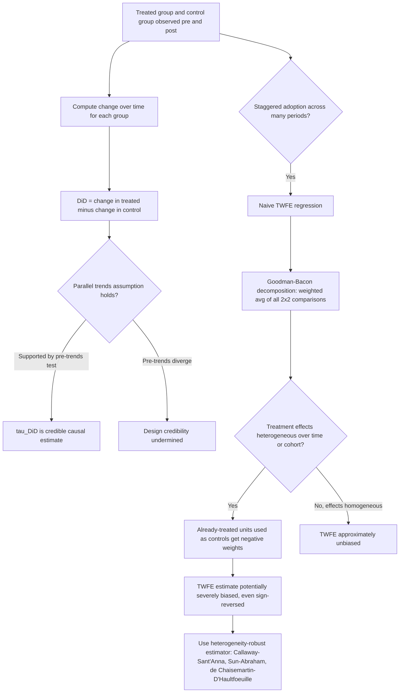

## Difference-in-Differences Estimation

### Overview

Difference-in-differences (DiD) identifies causal effects by comparing the *change* in outcomes over time for a group exposed to a treatment or policy against the *change* over the same period for an unexposed comparison group. By differencing out both time-invariant differences between groups and common time trends affecting all groups, DiD isolates the treatment effect under the key identifying assumption that, absent treatment, the two groups would have followed **parallel trends**. It is one of the most widely used quasi-experimental designs in applied economics, particularly for evaluating policy changes that affect some jurisdictions, firms, or individuals but not others at a specific point in time.

### Canonical 2x2 Setup

Consider two groups (treated, $g=1$; control, $g=0$) observed at two time periods (pre-period, $t=0$; post-period, $t=1$), where only the treated group receives treatment starting in the post-period. The DiD estimator is:

$$\hat\tau_{\text{DiD}} = \big(\bar{Y}_{1,1} - \bar{Y}_{1,0}\big) - \big(\bar{Y}_{0,1} - \bar{Y}_{0,0}\big)$$

where $\bar{Y}_{g,t}$ is the mean outcome for group $g$ at time $t$. Equivalently, this is estimated via OLS on the regression:

$$Y_{i,t} = \alpha + \beta \cdot \text{Treat}_i + \gamma \cdot \text{Post}_t + \tau \cdot (\text{Treat}_i \times \text{Post}_t) + \varepsilon_{i,t}$$

where $\hat\tau$, the coefficient on the interaction term, is numerically identical to the 2x2 difference-in-differences computed directly from group means.

### The Parallel Trends Assumption

**Formal statement:** absent treatment, the average outcome for the treated group would have evolved over time exactly as it did for the control group:

$$E[Y_{i,1}(0) - Y_{i,0}(0) \mid \text{Treat}_i=1] = E[Y_{i,1}(0) - Y_{i,0}(0) \mid \text{Treat}_i=0]$$

This is a statement about the **counterfactual trend** of the treated group — an inherently unobservable quantity, since the treated group is (by definition) observed only under treatment in the post-period. [Confirmed] Like unconfoundedness in the selection-on-observables framework, parallel trends is fundamentally **untestable** in the post-treatment period itself; it can only be assessed indirectly, most commonly by checking whether **pre-treatment** trends were parallel across groups, under the (additional, itself untestable) assumption that pre-trend similarity is informative about what would have happened post-treatment absent the policy.

**Important nuance**: unlike the level of the outcome, which can differ arbitrarily between treated and control groups (DiD explicitly allows for fixed, time-invariant differences between groups — this is exactly what the first-differencing removes), parallel trends requires that the group-specific unobserved factors driving outcome differences be **time-invariant** in their effect (an additive fixed-effects structure), not that the groups be identical in levels.

### Event-Study / Dynamic Specification

Extending beyond the simple 2x2 case to settings with multiple pre- and post-treatment periods, the **event-study specification** estimates treatment effects separately for each period relative to treatment timing:

$$Y_{i,t} = \alpha_i + \lambda_t + \sum_{k \neq -1} \delta_k \cdot \mathbb{1}[t - T_i^* = k] + \varepsilon_{i,t}$$

where $T_i^*$ is unit $i$'s treatment timing, $\alpha_i$ are unit fixed effects, $\lambda_t$ are time fixed effects, and $k=-1$ (the period immediately before treatment) is typically the omitted reference category. The estimated $\hat\delta_k$ for $k < 0$ (pre-treatment periods) provide a direct visual and statistical **pre-trends test**: if $\hat\delta_k \approx 0$ and statistically insignificant for all pre-treatment $k$, this is taken as supportive (though not conclusive) evidence for parallel trends, while $\hat\delta_k$ for $k \geq 0$ trace out the dynamic path of the treatment effect over time since treatment.

### Two-Way Fixed Effects (TWFE) and the Staggered Adoption Problem

The generalized DiD regression with multiple groups and multiple time periods, unit fixed effects $\alpha_i$, and time fixed effects $\lambda_t$:

$$Y_{i,t} = \alpha_i + \lambda_t + \tau \cdot D_{i,t} + \varepsilon_{i,t}$$

is the classic **two-way fixed effects (TWFE)** DiD estimator. For decades this was treated as the natural generalization of the 2x2 case to settings with staggered treatment timing (different units adopting treatment at different dates). However, a major methodological development beginning around 2018-2021 (Goodman-Bacon, 2021; Callaway & Sant'Anna, 2021; Sun & Abraham, 2021; de Chaisemartin & D'Haultfœuille, 2020) demonstrated that:

[Confirmed] **The TWFE estimator with staggered adoption is a weighted average of all possible 2x2 DiD comparisons between every pair of groups and time periods**, including comparisons that use **already-treated units as controls for later-treated units** (Goodman-Bacon's decomposition). When treatment effects are heterogeneous over time or across cohorts (i.e., **not constant**), these "forbidden" already-treated-as-control comparisons can receive **negative weights**, and the overall TWFE coefficient can be badly biased — in documented extreme cases even having the **opposite sign** from the true underlying effect for every single unit, despite being a seemingly reasonable regression specification.

**Modern heterogeneity-robust estimators** developed in response:

- **Callaway & Sant'Anna (2021)**: estimates group-time average treatment effects $ATT(g,t)$ for each treatment cohort $g$ and time period $t$, using only **not-yet-treated** or **never-treated** units as valid comparison groups, then aggregates these into overall or dynamic summary parameters as desired, explicitly avoiding the problematic already-treated comparisons.
- **Sun & Abraham (2021)**: proposes an interaction-weighted estimator specifically correcting the event-study specification for the negative-weighting problem under staggered adoption with heterogeneous treatment timing.
- **de Chaisemartin & D'Haultfœuille (2020)**: proposes an alternative estimator explicitly built to remain valid under heterogeneous and dynamic treatment effects, along with diagnostic tools to detect when standard TWFE is likely to be severely biased.
- **Borusyak, Jaravel & Spiess (2024)**: an imputation-based estimator that explicitly constructs the counterfactual $\hat{Y}_{i,t}(0)$ for treated observations using only untreated observations, then compares to observed outcomes.

[Confirmed] As of current applied econometric practice, using naive static TWFE with staggered treatment timing without at minimum checking robustness against one of these heterogeneity-robust alternatives is now widely regarded as poor practice in top applied economics journals, given the demonstrated potential for severe, sign-reversing bias.

### Standard Error Considerations

- **Clustering**: standard errors should generally be clustered at the level of treatment assignment (e.g., state, if policy varies by state), not at the individual observation level, since outcomes within a treated unit are typically correlated over time (serial correlation) and the policy varies only at the cluster level (Bertrand, Duflo & Mullainathan, 2004, demonstrate that failing to account for this can lead to severely understated standard errors and spuriously "significant" placebo effects even when none should exist).
- **Small number of clusters**: when the number of treated (or total) clusters is small, standard cluster-robust asymptotic inference can be unreliable; wild cluster bootstrap methods (Cameron, Gelbach & Miller, 2008) or randomization inference are recommended alternatives.

### Diagnostics and Robustness Checks

- **Pre-trends visualization and testing**: plotting raw or regression-adjusted outcome trends for treated and control groups in the pre-treatment period, supplemented by formal joint significance tests on pre-treatment event-study coefficients.
- **Placebo/falsification tests**: applying the DiD estimator to an outcome that should not be affected by treatment, or to a fake treatment date before the actual policy change, both of which should show null effects if the design is valid.
- **Synthetic control as an alternative/complement**: when there are few treated units (particularly a single treated unit, such as one state adopting a policy), synthetic control methods construct a data-driven weighted comparison unit rather than relying on a simple average of available control units, often providing a more credible counterfactual when a natural, well-matched control group is not obvious.
- **Triple-differences (DDD)**: adding a third source of variation (e.g., an additional demographic group not eligible for the policy even within treated states) to further difference out group-specific and state-specific time trends that a simple 2x2 DiD cannot separate from the treatment effect.

### Worked Example: Minimum Wage and Employment

**Example** (Card & Krueger, 1994): a canonical DiD application compares fast-food employment in New Jersey (which raised its minimum wage) to neighboring Pennsylvania (which did not), before and after the policy change.

$$\hat\tau_{\text{DiD}} = (\bar{E}_{NJ,\text{after}} - \bar{E}_{NJ,\text{before}}) - (\bar{E}_{PA,\text{after}} - \bar{E}_{PA,\text{before}})$$

- **Parallel trends assumption**: absent the minimum wage increase, employment in New Jersey fast-food restaurants would have evolved similarly to Pennsylvania's over the same period — plausible given geographic proximity and similar regional economic conditions, though not directly testable in the post-period.
- **Contribution to the literature**: this study, along with the broader "new minimum wage research" it helped launch, famously challenged the then-conventional view (from standard competitive labor market theory) that minimum wage increases straightforwardly reduce employment, illustrating DiD's role in generating empirical evidence that reshaped theoretical and policy debates. [Unverified] The minimum wage employment effects literature remains an active area of empirical and methodological debate (including debates about appropriate comparison groups, geographic scope, and dynamic effects); specific point estimates from this or related studies are sample- and period-specific and should not be treated as a settled universal parameter.

### Diagram: DiD Identification and Staggered Adoption Pitfall

### Parallel Trends Visualization (SVG)

<svg xmlns="http://www.w3.org/2000/svg" viewBox="0 0 780 320">
<text x="390" y="25" font-size="16" font-weight="bold" text-anchor="middle" fill="#1a1a1a">Difference-in-Differences: Parallel Trends Logic (svg_diagram)</text>
<line x1="70" y1="270" x2="720" y2="270" stroke="#333" stroke-width="1.5" />
<line x1="70" y1="270" x2="70" y2="50" stroke="#333" stroke-width="1.5" />
<text x="395" y="295" font-size="12" text-anchor="middle" fill="#1a1a1a">Time</text>
<line x1="390" y1="270" x2="390" y2="50" stroke="#999" stroke-width="1.5" stroke-dasharray="4,3" />
<text x="390" y="45" font-size="11" text-anchor="middle" fill="#555">treatment starts</text>
<line x1="100" y1="220" x2="390" y2="180" stroke="#1565c0" stroke-width="2.5" />
<line x1="390" y1="180" x2="690" y2="140" stroke="#1565c0" stroke-width="2.5" stroke-dasharray="5,3" />
<text x="700" y="135" font-size="10" fill="#1565c0">control (observed)</text>
<line x1="100" y1="200" x2="390" y2="160" stroke="#e65100" stroke-width="2.5" />
<line x1="390" y1="160" x2="690" y2="120" stroke="#e65100" stroke-width="2.5" stroke-dasharray="5,3" opacity="0.5" />
<text x="700" y="115" font-size="10" fill="#e65100" opacity="0.7">treated counterfactual</text>
<line x1="390" y1="160" x2="690" y2="80" stroke="#ad1457" stroke-width="2.5" />
<text x="700" y="75" font-size="10" fill="#ad1457">treated (observed)</text>
<line x1="670" y1="140" x2="670" y2="88" stroke="#333" stroke-width="1.5" />
<text x="620" y="105" font-size="11" fill="#333" font-weight="bold">tau_DiD</text>
</svg>

### Common Pitfalls

- **Treating parallel pre-trends as proof of the identifying assumption**: pre-trend similarity is supportive but not conclusive evidence — it is entirely possible for pre-trends to be parallel while post-treatment counterfactual trends would have diverged for reasons unrelated to any pre-existing pattern.
- **Using naive TWFE in staggered adoption settings without robustness checks**: given the well-documented negative-weighting problem, presenting only a standard TWFE coefficient in a staggered-timing setting with plausibly heterogeneous effects is now considered methodologically outdated without at least a Goodman-Bacon decomposition or comparison to a heterogeneity-robust estimator.
- **Underestimating standard errors via inappropriate clustering**: computing standard errors at the individual level (rather than the level of treatment variation) in panel DiD settings routinely overstates statistical significance due to ignored serial correlation.
- **Ignoring anticipation effects**: if units alter behavior in anticipation of a known future policy change (before the nominal treatment date), the pre-treatment periods immediately preceding implementation may not represent a valid untreated baseline, biasing both the naive DiD estimate and pre-trends tests.
- **Comparing treated units to an inappropriate control group**: control units whose own outcomes are indirectly affected by the treated group's policy (e.g., cross-border spillovers, as in some minimum wage or tax policy settings) violate the implicit "clean control" requirement, connecting to SUTVA-style interference concerns.

**Related Topics**

- Two-way fixed effects and the Goodman-Bacon decomposition
- Callaway & Sant'Anna (2021) heterogeneity-robust group-time estimators
- Event-study specifications and dynamic treatment effects
- Synthetic control methods for single-treated-unit settings
- Triple-differences (DDD) designs
- Clustering standard errors and the wild cluster bootstrap
- Card & Krueger (1994) minimum wage natural experiment
- Parallel trends assumption and pre-trends testing