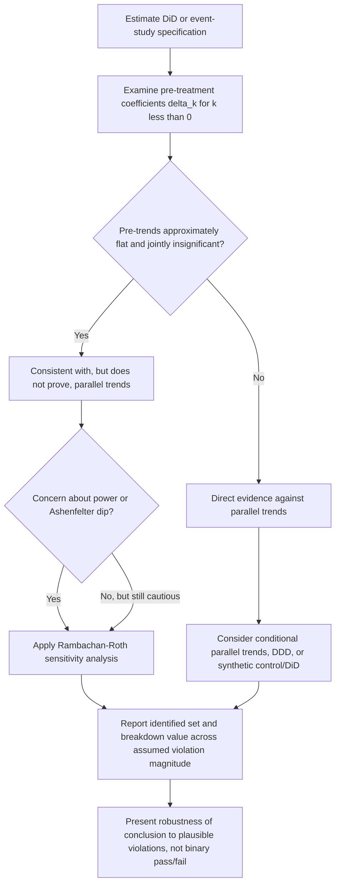

## Parallel Trends and Its Violations

### Overview

The parallel trends assumption is the central identifying condition underlying difference-in-differences estimation: absent treatment, the treated group's average outcome would have evolved over time in the same way as the control group's. This entry focuses specifically on the assumption's precise formulation, the mechanisms by which it can fail, and the modern econometric responses to violations, extending beyond the general DiD introduction to treat this assumption as the object of direct scrutiny.

### Formal Statement and What It Does Not Require

**Parallel trends (in the 2x2 case):**

$$E[Y_{i,1}(0) - Y_{i,0}(0) \mid \text{Treat}_i=1] = E[Y_{i,1}(0) - Y_{i,0}(0) \mid \text{Treat}_i=0]$$

This says the **counterfactual change** (in the untreated potential outcome) would be equal across groups — it says nothing about the **levels** of $Y_i(0)$ being equal across groups. A DiD design can be entirely valid even when treated and control groups have persistently different outcome levels (e.g., New Jersey and Pennsylvania fast-food employment levels can differ for many structural reasons), provided those level differences are constant over time (an additive fixed-effect structure). [Confirmed] This distinction — parallel *trends*, not parallel *levels* — is one of the most common points of confusion for students newly encountering the assumption, and is worth stating explicitly: DiD does not require treated and control units to be "similar" in levels, only that their trajectories would have moved together absent treatment.

**Corresponding regression representation:** in the two-way fixed effects framework, parallel trends is equivalent to assuming that omitted, time-varying confounders are **not correlated** with treatment timing, once additive unit fixed effects ($\alpha_i$) and time fixed effects ($\lambda_t$) have been removed:

$$Y_{i,t}(0) = \alpha_i + \lambda_t + \varepsilon_{i,t}, \qquad E[\varepsilon_{i,t} \mid \text{treatment timing}] = 0$$

### Why It Is Fundamentally Untestable

Parallel trends is a claim about the **post-treatment counterfactual path** of the treated group — the trajectory $Y_{i,1}(0)$ that would have occurred for treated units absent treatment. Because treated units are observed only under treatment in the post-period, this counterfactual path is never directly observed for any treated unit, at any point in time after treatment begins. [Confirmed] This is structurally identical to the untestability of unconfoundedness in the selection-on-observables framework: both assumptions make a claim about an unobserved counterfactual quantity, and no amount of data on the *observed* joint distribution can, strictly speaking, confirm or refute a claim about what would have happened in a world that did not occur.

### Indirect Evidence: Pre-Trends as (Imperfect) Proxy Evidence

Because the post-treatment counterfactual cannot be directly checked, applied researchers instead examine **pre-treatment trends** — whether treated and control groups moved together *before* treatment began — as indirect, suggestive evidence:

$$\delta_k \text{ for } k < 0 \text{ (pre-treatment periods) in the event-study specification}$$

If the estimated pre-treatment coefficients $\hat\delta_k$ are close to zero and jointly statistically insignificant, this is typically interpreted as evidence *consistent with* (though not proof of) parallel trends.

**Why pre-trends similarity is not sufficient proof:**

- **The reason for treatment timing may itself violate parallel trends** even when historical pre-trends look similar: if treatment was adopted precisely *because* the treated group experienced (or was anticipated to experience) a divergent shock right around the treatment date — a phenomenon termed **Ashenfelter's dip** in the labor economics literature (Ashenfelter, 1978, documenting that individuals often experience an anomalous earnings dip immediately before enrolling in job training programs, precisely because that dip may have motivated their enrollment) — pre-trends measured further back in time can look perfectly parallel while the assumption fails exactly at the point that matters.
- **Low statistical power for pre-trends tests**: [Confirmed] failing to reject the null of parallel pre-trends is not the same as strong evidence *for* parallel trends — with a limited number of pre-treatment periods or noisy data, pre-trends tests can have low power to detect economically meaningful violations, a concern formalized and quantified by Roth (2022), who shows that conventional pre-trends testing procedures can have substantially lower power than researchers often assume, and that conditioning inference on having passed a pre-trends test can itself distort subsequent estimation and inference (a form of pre-testing bias).
- **Parallel pre-trends do not rule out differential trends beginning exactly at treatment**: nothing about historical parallel movement logically guarantees that an unrelated but simultaneous shock does not begin affecting only the treated group at (or near) the same time as the treatment itself.

### Sources of Parallel Trends Violations

- **Differential exposure to a concurrent shock**: an economic shock, unrelated to the treatment itself, that happens to coincide in timing with treatment and affects the treated group differently than the control group (e.g., a regional recession, industry-specific demand shock, or a separate concurrent policy change affecting only the treated jurisdiction).
- **Mean reversion / Ashenfelter's dip**: when treatment assignment is correlated with a transitory shock to the outcome itself (units select into treatment partly *because* of an anomalous recent outcome realization), the treated group's outcome will tend to mean-revert regardless of treatment, generating an apparent "treatment effect" that is actually reversion to the group's normal trend.
- **Differential secular trends unrelated to treatment**: treated and control groups may be on genuinely different long-run trajectories for structural reasons (different industry composition, different demographic trends, different growth rates) entirely independent of the treatment, which a short pre-period may fail to detect if the divergence is gradual.
- **Anticipation effects**: if agents can anticipate a forthcoming policy change and adjust behavior before its formal implementation date, the periods immediately preceding the nominal "treatment start" are contaminated, distorting both the pre-trends test and the estimated effect if the anticipation period is misclassified as untreated.
- **Composition changes**: if the composition of the treated or control group changes systematically over time (e.g., differential migration, entry, or exit correlated with treatment status), the group-level averages being compared may not represent a stable underlying population, generating spurious apparent divergence unrelated to a genuine causal effect.

### Methodological Responses to Potential Violations

- **Conditional parallel trends**: relaxing the assumption to hold only after conditioning on observed covariates $X_i$ — $E[Y_{i,1}(0)-Y_{i,0}(0) \mid \text{Treat}_i, X_i] = E[Y_{i,1}(0)-Y_{i,0}(0)\mid X_i]$ — implemented via regression adjustment, propensity-score reweighting within the DiD framework, or doubly-robust DiD estimators (Sant'Anna & Zhao, 2020), when unconditional parallel trends is implausible but conditioning on relevant covariates plausibly restores it.
- **Synthetic control and synthetic DiD**: rather than assuming a simple average of available control units satisfies parallel trends, constructing a data-driven weighted combination of control units specifically chosen to match the treated unit's **pre-treatment trajectory** closely, under the logic that units matched on realized pre-trends are more likely to share the same counterfactual post-trend (Abadie, Diamond & Hainmueller, 2010; Arkhangelsky et al., 2021, "synthetic difference-in-differences," combines the reweighting logic of synthetic control with the fixed-effects structure of DiD).
- **Sensitivity analysis for violations of parallel trends**: Rambachan & Roth (2023) propose a formal framework for reporting how robust a DiD estimate is to potential violations of parallel trends, by parameterizing plausible bounds on how much the post-treatment trend could deviate from the extrapolated pre-trend and reporting the resulting range of possible treatment effect estimates — an increasingly standard robustness exercise rather than a binary "pre-trends test passed/failed" framing.
- **Triple-differences (DDD)**: introducing a third comparison dimension (e.g., a subgroup within both treated and control areas that is not affected by the policy) to difference out an additional layer of group-specific or region-specific time trends that a simple 2x2 DiD cannot separate from the treatment effect, effectively relaxing the parallel trends requirement to a weaker, more plausible condition.
- **Longer pre-treatment windows and richer event-study evidence**: extending the pre-treatment observation window (where data permits) provides more statistical power to detect gradual pre-existing divergence that a short 1-2 period pre-window would miss entirely.

### Interpreting the Rambachan-Roth Sensitivity Framework

The Rambachan & Roth (2023) "HonestDiD" approach reframes the binary pass/fail pre-trends test as a continuous robustness exercise:

1. Rather than assuming the post-treatment counterfactual trend deviation is exactly zero, parameterize a set of plausible violations — e.g., bounding how much the post-treatment differential trend could deviate from a linear extrapolation of the estimated pre-trend, governed by a sensitivity parameter $\bar{M}$.
2. For each value of $\bar{M}$, compute the resulting **identified set** for the treatment effect (a range of point estimates consistent with that degree of assumed violation, rather than a single point estimate).
3. Report a "breakdown value" — the smallest degree of parallel trends violation that would be needed to overturn the qualitative conclusion (e.g., render a significant positive effect statistically indistinguishable from zero, or reverse its sign).

[Confirmed] This approach is increasingly adopted in applied work specifically because it replaces an unsatisfying binary "did the pre-trends test pass" framing (subject to the low-power concerns above) with an explicit, transparent statement about how much the paper's conclusions actually depend on the exact validity of parallel trends.

### Worked Example: State Policy Adoption with a Confounding Recession

**Example**: suppose a researcher wants to estimate the effect of a state-level minimum wage increase on employment, using neighboring states as controls, but the state that raised its minimum wage also happened to experience a state-specific negative demand shock (e.g., a decline in a locally dominant industry) beginning around the same time.

- **Naive DiD estimate**: would confound the minimum wage effect with the coincidental industry decline, likely biasing the estimated employment effect downward (appearing more negative than the true minimum-wage-specific effect) even if pre-trends in aggregate employment looked parallel in years prior to either shock.
- **Diagnostic**: an event-study plot might show a sharp divergence beginning exactly at (or even slightly before, if the industry decline preceded the exact policy date) the treatment period, distinguishable from a smooth, gradually accumulating treatment effect — a sudden, large jump concurrent with a known unrelated shock is a specific red flag warranting further investigation.
- **Response**: the researcher might exploit industry composition data to implement a triple-differences design (comparing minimum-wage-affected low-wage workers to unaffected high-wage workers, both within the same states), which would difference out the state-specific industry shock (assumed to affect low- and high-wage workers similarly) while retaining the minimum-wage-specific effect (assumed to affect primarily low-wage workers). [Unverified] Whether such a design successfully isolates the minimum-wage effect from the confounding shock depends on the specific empirical assumption that the industry shock affects both wage groups symmetrically, which itself would need independent justification in any real application rather than being guaranteed by the DDD structure alone.

### Diagram: Diagnosing and Responding to Parallel Trends Violations

### Ashenfelter's Dip Illustration (SVG)

<svg xmlns="http://www.w3.org/2000/svg" viewBox="0 0 780 300">
<text x="390" y="25" font-size="16" font-weight="bold" text-anchor="middle" fill="#1a1a1a">Ashenfelter's Dip: A Parallel Trends Threat (svg_diagram)</text>
<line x1="70" y1="250" x2="720" y2="250" stroke="#333" stroke-width="1.5" />
<line x1="70" y1="250" x2="70" y2="50" stroke="#333" stroke-width="1.5" />
<text x="395" y="275" font-size="12" text-anchor="middle" fill="#1a1a1a">Time</text>
<line x1="450" y1="250" x2="450" y2="50" stroke="#999" stroke-width="1.5" stroke-dasharray="4,3" />
<text x="450" y="45" font-size="11" text-anchor="middle" fill="#555">enrollment / treatment</text>
<line x1="100" y1="150" x2="700" y2="130" stroke="#1565c0" stroke-width="2.5" />
<text x="710" y="128" font-size="10" fill="#1565c0">control group (stable)</text>
<path d="M 100 145 L 300 148 Q 380 155 420 200 Q 440 220 450 190 L 550 145 L 700 130" fill="none" stroke="#e65100" stroke-width="2.5" />
<text x="710" y="128" font-size="10" fill="#e65100" transform="translate(0,20)" />
<text x="380" y="235" font-size="11" fill="#e65100" font-weight="bold">Ashenfelter's dip</text>
<text x="600" y="115" font-size="10" fill="#e65100">treated group (mean-reverts)</text>

<text x="150" y="270" font-size="10" fill="#555">apparently parallel earlier</text>

</svg>

### Common Pitfalls

- **Treating a passed pre-trends test as proof of validity**: this conflates "failed to reject the null of no pre-trend divergence" with "parallel trends definitely holds post-treatment" — a low-power test that fails to reject provides only weak reassurance, not confirmation.
- **Confusing parallel levels with parallel trends**: mistakenly believing DiD requires treated and control groups to have similar outcome *levels* before treatment, when the actual requirement concerns the parallelism of *changes* over time.
- **Ignoring Ashenfelter-dip-style selection into treatment timing**: failing to consider whether the treated group's or unit's decision to adopt treatment was itself triggered by a transitory shock to the outcome, which would violate parallel trends even with a seemingly clean pre-trends plot over a longer historical window.
- **Conditioning subsequent analysis on having passed a pre-trends test**: using the pre-trends test as a model-selection device (only proceeding with a specification if pre-trends "look good") introduces a pre-testing bias that distorts the properties of subsequent point estimates and standard errors, a concern formally addressed in Roth (2022).
- **Ignoring anticipation windows when defining the pre-period**: including periods where agents have already begun adjusting behavior in anticipation of a known future policy change within the "pre-treatment" window can bias both the pre-trends test and the treatment effect estimate itself.

**Related Topics**

- Difference-in-differences estimation and the two-way fixed effects framework
- Event-study specifications and dynamic treatment effect estimation
- Rambachan & Roth (2023) sensitivity analysis for parallel trends violations
- Roth (2022) on pre-testing bias and the power of pre-trends tests
- Ashenfelter's dip and selection into treatment timing
- Synthetic control and synthetic difference-in-differences (Arkhangelsky et al., 2021)
- Conditional parallel trends and doubly robust DiD estimators (Sant'Anna & Zhao, 2020)
- Triple-differences (DDD) designs for relaxing parallel trends