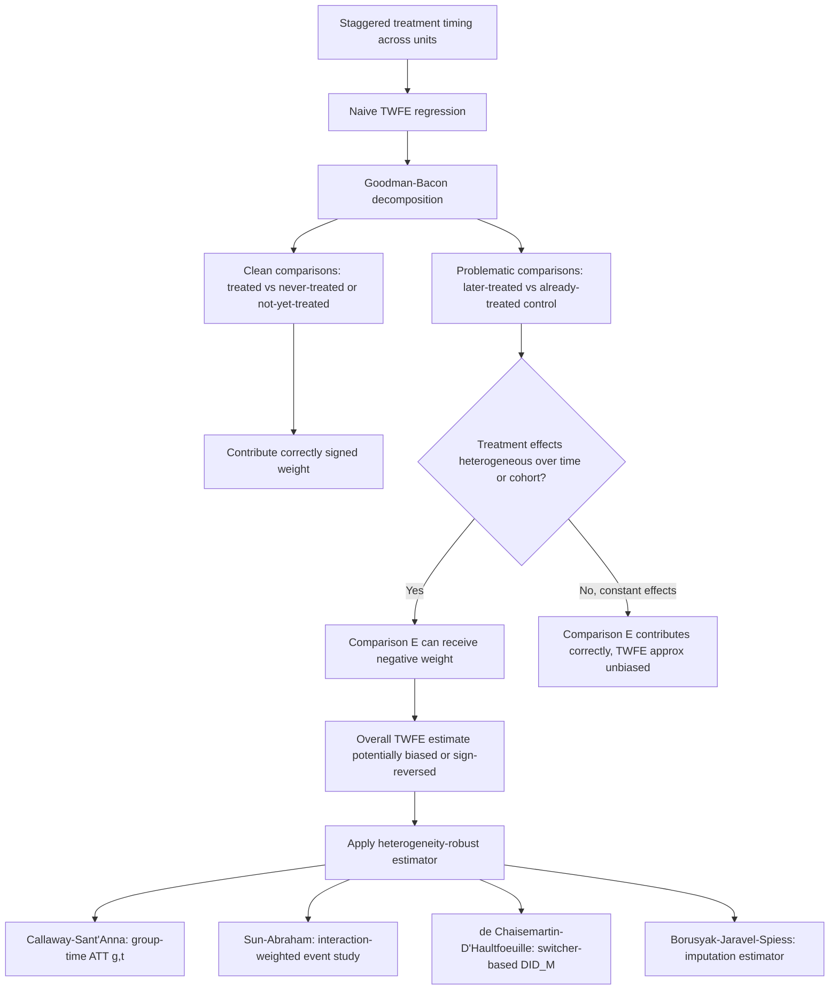

## Staggered Treatment Timing and Modern Estimators

### Overview

Staggered treatment timing refers to settings where different units adopt treatment at different points in time — states implementing a policy in different years, firms adopting a technology at different dates, individuals entering a program on different schedules — rather than all treated units switching status simultaneously. Until roughly 2018-2021, the standard approach was to apply the two-way fixed effects (TWFE) regression directly to this setting as a seemingly natural generalization of the 2x2 difference-in-differences case. A cluster of methodological papers demonstrated that this generalization is badly flawed under treatment effect heterogeneity, precipitating the rapid development and adoption of a new generation of "heterogeneity-robust" estimators now considered standard practice.

### The Naive TWFE Approach and Why It Was Trusted

The generalized TWFE specification for staggered adoption:

$$Y_{i,t} = \alpha_i + \lambda_t + \tau^{TWFE} \cdot D_{i,t} + \varepsilon_{i,t}$$

where $D_{i,t} = 1$ once unit $i$ has adopted treatment (and remains 1 thereafter, in the standard absorbing-treatment case). For decades, $\hat\tau^{TWFE}$ was interpreted as a straightforward generalization of the clean 2x2 DiD estimand, implicitly assuming a constant treatment effect across units and over time relative to adoption — an assumption rarely stated explicitly because the regression appeared to "just work" as a natural extension.

### The Goodman-Bacon Decomposition

Goodman-Bacon (2021) provides the formal result explaining what TWFE actually estimates under staggered adoption. The TWFE coefficient $\hat\tau^{TWFE}$ is shown to be a **weighted average of every possible 2x2 DiD comparison** obtainable from the panel:

$$\hat\tau^{TWFE} = \sum_{k} w_k \cdot \hat\tau_k^{2\times2}$$

where the comparisons include:

- **Earlier-treated vs. later-treated (using later-treated as control before it is treated)**: a valid, "clean" comparison in the spirit of standard DiD.
- **Later-treated vs. earlier-treated (using earlier-treated as control after it is treated)**: a **problematic** comparison, because the earlier-treated group is already-treated during the period it is being used as a "control" — its outcome already reflects the treatment effect, contaminating the comparison.
- **Treated vs. never-treated**: the standard, unambiguously clean comparison, present only if never-treated units exist in the sample.

The weights $w_k$ on each 2x2 comparison are proportional to the relative group sizes and the variance of treatment timing within each pairwise comparison. [Confirmed] Critically, when treatment effects are **not constant** — varying over calendar time or by the number of periods since treatment (a highly realistic scenario in almost any applied setting, e.g., an effect that grows or fades over time) — the already-treated-as-control comparisons can receive **negative weights**, meaning that comparison's contribution to the overall TWFE coefficient works in the *opposite* direction from what a positive-effect interpretation would suggest.

### Consequences of Negative Weighting

[Confirmed] The demonstrated consequence, formalized across this literature (Goodman-Bacon, 2021; de Chaisemartin & D'Haultfœuille, 2020; Borusyak, Jaravel & Spiess, 2024), is that under sufficiently heterogeneous treatment effects, $\hat\tau^{TWFE}$ can be:

- **Severely biased in magnitude** relative to any sensible summary of the true underlying (heterogeneous) treatment effects.
- **Of the wrong sign entirely** — de Chaisemartin & D'Haultfœuille (2020) construct and document illustrative cases where the TWFE coefficient is negative even though the treatment effect is positive for every single unit in every single period, purely as an artifact of the negative-weighting mechanism combined with a specific pattern of effect dynamics (e.g., effects that grow substantially over time since treatment).
- **Uninterpretable as any standard causal estimand** (not the ATE, not the ATT) once negative weights are present, since it is a weighted average with some negative weights rather than a proper convex combination of well-defined treatment effects.

This is now widely regarded as one of the most consequential applied econometrics findings of the past decade, prompting widespread re-examination and, in many cases, re-estimation of published staggered-DiD results using the newer estimators.

### Modern Heterogeneity-Robust Estimators

**Callaway & Sant'Anna (2021):** estimates disaggregated **group-time average treatment effects**:

$$ATT(g,t) = E[Y_{i,t}(g) - Y_{i,t}(0) \mid G_i = g]$$

for each treatment cohort $g$ (the period a unit first became treated) and each time period $t \geq g$, using **only not-yet-treated or never-treated units** as the valid comparison group for each specific $(g,t)$ pair — explicitly avoiding any already-treated-as-control comparison. These disaggregated $ATT(g,t)$ estimates can then be aggregated in flexible, researcher-chosen ways: an overall average effect, a dynamic "event-study" style aggregation by time-since-treatment, or a calendar-time aggregation, each with an explicit, transparent weighting scheme rather than the implicit and potentially perverse TWFE weights.

**Sun & Abraham (2021):** proposes an **interaction-weighted (IW) estimator** built directly on the event-study specification, replacing the standard pooled leads-and-lags TWFE event study (shown to also suffer from contamination across cohorts under heterogeneous dynamic effects) with cohort-specific estimates that are then aggregated using known, non-negative weights, restoring a valid dynamic treatment-effect interpretation to the event-study plot.

**de Chaisemartin & D'Haultfœuille (2020):** proposes the $DID_M$ estimator, built from comparisons between units that experience a treatment status *change* between consecutive periods (switchers) and units whose treatment status is *unchanged* over the same period, explicitly designed to remain a proper weighted average of unit-level treatment effects (with only non-negative weights) even under fully heterogeneous and dynamic effects, and to accommodate more general treatment structures (including non-binary or non-absorbing treatments).

**Borusyak, Jaravel & Spiess (2024):** proposes an **imputation-based estimator**: fit a model for $Y_{i,t}(0)$ (the untreated potential outcome) using only the untreated observations (never-treated units, and not-yet-treated periods for eventually-treated units), impute the counterfactual $\hat{Y}_{i,t}(0)$ for every treated observation, and compute treatment effects as $Y_{i,t} - \hat{Y}_{i,t}(0)$ for each treated observation, which can then be aggregated flexibly. This approach is notable for being both computationally efficient and conceptually direct — it explicitly separates the counterfactual-estimation step (using only clean, untreated data) from the effect-aggregation step.

**Gardner (2021) — the "two-stage" DiD (DID2S)**: a related and computationally simple approach that first estimates unit and time fixed effects using only untreated observations, then regresses the residualized outcome on treatment indicators in a second stage, achieving similar heterogeneity robustness to the imputation approach with an easily implementable two-step procedure.

### Comparing the Estimators

| Estimator | Comparison group used | Aggregation flexibility | Key strength |
| --- | --- | --- | --- |
| Naive TWFE | Any treated/untreated combination, including already-treated | Fixed, implicit weights | Simplicity (but unreliable under heterogeneity) |
| Callaway & Sant'Anna (2021) | Not-yet-treated / never-treated only | Highly flexible, explicit weights | Disaggregated $ATT(g,t)$, transparent aggregation |
| Sun & Abraham (2021) | Not-yet-treated, cohort-specific | Event-study focused | Restores valid dynamic event-study interpretation |
| de Chaisemartin & D'Haultfœuille (2020) | Status-unchanged units | Flexible; handles non-binary treatment | Generalizes beyond simple binary absorbing treatment |
| Borusyak, Jaravel & Spiess (2024) | All untreated observations (imputation) | Highly flexible | Computational efficiency; clean separation of steps |

[Confirmed] No single estimator in this set strictly dominates all others across every applied setting — the choice depends on the specific treatment structure (absorbing vs. non-absorbing, binary vs. continuous), whether never-treated units exist in the sample, and the specific aggregate estimand of interest, and current applied practice generally recommends **reporting results from at least one heterogeneity-robust estimator alongside, or instead of, naive TWFE** whenever staggered adoption is present.

### Diagnostics for Detecting the Problem

- **Goodman-Bacon decomposition plot**: directly visualizing the set of 2x2 comparisons contributing to the TWFE estimate, their individual estimated effects, and their weights — a large divergence between the "clean" (never-treated or not-yet-treated control) comparisons and the "problematic" (already-treated control) comparisons is a direct red flag.
- **Comparing naive TWFE to a heterogeneity-robust estimate**: a substantial divergence between $\hat\tau^{TWFE}$ and, say, the Callaway-Sant'Anna aggregated estimate is itself diagnostic evidence that treatment effect heterogeneity is empirically important in the specific application, warranting the heterogeneity-robust approach as the primary reported result.
- **Examining the estimated dynamic effect pattern**: if a Sun-Abraham- or Callaway-Sant'Anna-style event study shows substantial variation in the estimated effect across cohorts or over time-since-treatment, this directly confirms the heterogeneity that makes naive TWFE unreliable in that specific application.

### Worked Example: State Policy Adoption Over a Decade

**Example**: suppose 50 states adopt a policy at different years between 2005 and 2015, and the true effect of the policy grows over time since adoption (e.g., an effect that is small in year 1 but substantially larger by year 5).

- **Naive TWFE problem**: states that adopted early (e.g., in 2005) will, by 2015, have a large realized treatment effect embedded in their outcome. If these early-adopting states are used (implicitly, within the TWFE regression) as part of the comparison group for states adopting later (e.g., in 2012), the "control" group's outcome already reflects a substantial treatment effect, mechanically understating the estimated effect for the later-adopting comparison — precisely the already-treated-as-control contamination mechanism.
- **Callaway-Sant'Anna solution**: estimating $ATT(g,t)$ separately for the 2005 cohort, 2012 cohort, etc., using only states not-yet-treated (or never treated, if any remain untreated throughout the sample) as controls for each cohort-time pair, then aggregating into an event-study plot showing how the average effect evolves with years since adoption — directly recovering the true growing-effect pattern that naive TWFE would obscure or bias.
- [Unverified] The specific numerical magnitude of bias in any real re-analysis depends entirely on the actual pattern and degree of effect heterogeneity present in that specific application; the mechanism described is general, but its empirical importance varies case by case and should be assessed via the diagnostics described above rather than assumed to always be severe.

### Diagram: TWFE Contamination and Modern Estimator Response

### Goodman-Bacon Decomposition Weights (SVG)

<svg xmlns="http://www.w3.org/2000/svg" viewBox="0 0 800 300">
<text x="400" y="25" font-size="16" font-weight="bold" text-anchor="middle" fill="#1a1a1a">Goodman-Bacon Decomposition: Comparison Weights (svg_diagram)</text>
<line x1="80" y1="250" x2="720" y2="250" stroke="#333" stroke-width="1.5" />
<line x1="80" y1="250" x2="80" y2="60" stroke="#333" stroke-width="1.5" />
<text x="400" y="275" font-size="12" text-anchor="middle" fill="#1a1a1a">Individual 2x2 comparisons within TWFE</text>
<text x="35" y="160" font-size="12" text-anchor="middle" fill="#1a1a1a" transform="rotate(-90 35 160)">Weighted contribution</text>
<line x1="80" y1="150" x2="720" y2="150" stroke="#999" stroke-width="1" stroke-dasharray="4,3" />
<text x="700" y="145" font-size="10" fill="#555">zero line</text>
<rect x="120" y="100" width="60" height="50" fill="#1565c0" />
<text x="150" y="170" font-size="10" text-anchor="middle" fill="#1a1a1a">treated vs</text>
<text x="150" y="182" font-size="10" text-anchor="middle" fill="#1a1a1a">never-treated</text>
<rect x="240" y="110" width="60" height="40" fill="#2e7d32" />
<text x="270" y="170" font-size="10" text-anchor="middle" fill="#1a1a1a">early vs</text>
<text x="270" y="182" font-size="10" text-anchor="middle" fill="#1a1a1a">not-yet-treated</text>
<rect x="400" y="150" width="60" height="55" fill="#ad1457" />
<text x="430" y="222" font-size="10" text-anchor="middle" fill="#1a1a1a">later vs</text>
<text x="430" y="234" font-size="10" text-anchor="middle" fill="#1a1a1a">already-treated</text>
<text x="430" y="246" font-size="9" text-anchor="middle" fill="#ad1457">(negative weight)</text>
<rect x="520" y="120" width="60" height="30" fill="#1565c0" />
<text x="550" y="170" font-size="10" text-anchor="middle" fill="#1a1a1a">treated vs</text>
<text x="550" y="182" font-size="10" text-anchor="middle" fill="#1a1a1a">never-treated</text>
</svg>

### Common Pitfalls

- **Continuing to use naive TWFE as a default without justification**: given the well-documented negative-weighting problem, using standard TWFE in a staggered-adoption setting without at least checking a heterogeneity-robust alternative or a Goodman-Bacon decomposition is now considered a significant methodological gap in applied work.
- **Assuming the problem only matters with "extreme" heterogeneity**: even moderate, realistic patterns of effect dynamics (effects that simply grow or shrink smoothly over time since treatment, a highly common empirical pattern) are sufficient to generate meaningful bias — the issue is not confined to contrived edge cases.
- **Misinterpreting group-time ATT aggregations**: when using Callaway-Sant'Anna or similar estimators, failing to specify (and understand) which aggregation scheme (simple average, dynamic/event-study, calendar-time) is being reported can lead to comparing non-comparable summary numbers across studies or specifications.
- **Ignoring the "never-treated" requirement nuance**: several of these estimators require either never-treated units or a credible not-yet-treated comparison group at each relevant point; in settings where all units are eventually treated (a "staggered adoption with no never-treated group" design), estimator choice and identifying assumptions require particular care, since the class of valid comparisons shrinks correspondingly.
- **Treating the modern estimators as automatically solving all identification problems**: heterogeneity-robust estimators fix the mechanical TWFE weighting problem but still require the underlying (conditional) parallel trends assumption to hold for their respective comparison groups — they are not a substitute for the substantive identification argument, only for the specific mechanical flaw in naive TWFE aggregation.

**Related Topics**

- Difference-in-differences estimation and the two-way fixed effects framework
- Parallel trends assumption and its violations
- Callaway & Sant'Anna (2021) group-time average treatment effects
- Event-study specifications and dynamic treatment effect estimation
- Synthetic control and synthetic difference-in-differences methods
- Borusyak, Jaravel & Spiess (2024) imputation estimator
- Rambachan & Roth (2023) sensitivity analysis for parallel trends
- Software implementation considerations (did, csdid, staggered, and related packages)