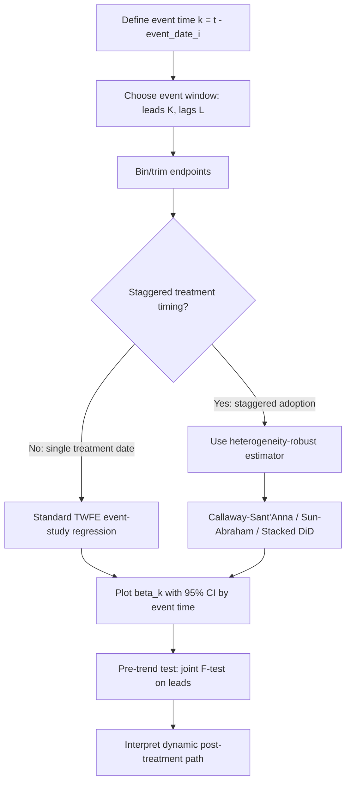

## Event-Study Designs

### Overview

Event-study designs estimate the dynamic causal effect of a treatment or intervention by tracing outcomes across time periods relative to the timing of the event, rather than collapsing pre- and post-periods into a single average effect. They generalize the standard two-period difference-in-differences (DiD) estimator into a fully dynamic specification, and are the primary empirical tool used to (1) visualize treatment effect dynamics and (2) test the parallel-trends assumption underlying DiD identification.

### Core Specification

The canonical event-study regression is:

$$Y_{it}=\alpha_i+\lambda_t+\sum_{k=-K,\,k\neq-1}^{L}\beta_k D_{it}^k+X_{it}'\gamma+\varepsilon_{it}$$

where:

- $Y_{it}$ is the outcome for unit $i$ at time $t$
- $\alpha_i$ is a unit fixed effect
- $\lambda_t$ is a time fixed effect
- $D_{it}^k$ is an indicator equal to 1 if unit $i$ is $k$ periods from its treatment event at time $t$
- $\beta_k$ is the dynamic treatment effect $k$ periods relative to treatment
- $K$ and $L$ are the number of leads (pre-treatment) and lags (post-treatment) included
- $X_{it}$ are optional time-varying controls

**Key Points**

- The period $k=-1$ (one period before treatment) is omitted and serves as the reference category; all $\beta_k$ are interpreted relative to this baseline.
- Leads ($k<0$) capture pre-trends. Coefficients on leads that are jointly statistically indistinguishable from zero support the parallel-trends assumption.
- Lags ($k\geq0$) capture the treatment effect's evolution — immediate impact, growth, decay, or persistence.
- Endpoints are typically "binned" (e.g., $D_{it}^{-K}$ includes all periods $\leq-K$, and $D_{it}^{L}$ includes all periods $\geq L$) to avoid sparse, noisy estimates at the tails of the event window.

### Identification Assumptions

1. **Parallel trends (conditional on covariates)**: absent treatment, treated and comparison units would have evolved along parallel paths.
2. **No anticipation**: units do not adjust behavior in advance of treatment in ways that bias pre-period estimates (formally, $E[Y_{it}(k)]=E[Y_{it}(\infty)]$ for all $k<-K_0$ for some anticipation window $K_0$).
3. **No confounding events**: no other shock coincides with the treatment timing and differentially affects treated units.
4. Under staggered adoption, a further set of assumptions is required regarding treatment effect homogeneity (see Heterogeneous Treatment Effects below) — this is where classical event-study estimation using two-way fixed effects (TWFE) can fail.

### The Staggered-Adoption / Negative-Weighting Problem

[Inference — reflects an active, evolving econometrics literature rather than settled consensus on best practice]

When treatment timing varies across units (a "staggered" design), the standard TWFE event-study estimator is a weighted average of many $2\times2$ DiD comparisons, some of which use **already-treated units as controls** for later-treated units. If treatment effects are heterogeneous over time or across cohorts, these "forbidden comparisons" can receive **negative weights**, causing the aggregate $\beta_k$ to be biased — potentially even reversing sign relative to the true average effect (Goodman-Bacon 2021; Sun and Abraham 2021; Callaway and Sant'Anna 2021; de Chaisemartin and D'Haultfœuille 2020).

**Modern robust estimators** address this by:

- Estimating cohort-by-period ATTs separately and aggregating with weights that avoid forbidden comparisons (Callaway–Sant'Anna `did`, Sun–Abraham interaction-weighted estimator)
- Using only "clean" comparisons (not-yet-treated or never-treated units) as controls
- Stacked regression designs that construct a separate clean $2\times2$ comparison for each treatment cohort and stack them

### Estimation Workflow



### Practical Example (R, `fixest`)

```r
library(fixest)

# Single treatment-date case
mod <- feols(
  outcome ~ i(event_time, treated, ref = -1) | unit_id + year,
  data = df,
  cluster = ~unit_id
)
iplot(mod)  # plots beta_k with confidence intervals

# Staggered adoption, heterogeneity-robust (Sun-Abraham)
mod_sa <- feols(
  outcome ~ sunab(cohort, year) | unit_id + year,
  data = df,
  cluster = ~unit_id
)
iplot(mod_sa)
```

### Practical Example (Python, `differences`/`csdid`-style workflow)

```python
import pandas as pd
import statsmodels.formula.api as smf

# Construct event-time dummies, omitting k = -1
df["event_time"] = df["year"] - df["event_year"]
event_dummies = pd.get_dummies(df["event_time"].clip(-5, 5), prefix="k")
event_dummies = event_dummies.drop(columns=["k_-1"])  # reference period

df = pd.concat([df, event_dummies], axis=1)
formula = "outcome ~ " + " + ".join(event_dummies.columns) + " + C(unit_id) + C(year)"
model = smf.ols(formula, data=df).fit(
    cov_type="cluster", cov_kwds={"groups": df["unit_id"]}
)
```

### Visualizing Results (SVG)

<svg xmlns="http://www.w3.org/2000/svg" viewBox="0 0 640 340">
<text x="320" y="20" font-size="14" text-anchor="middle" font-family="sans-serif" font-weight="bold">Event-Study Coefficient Plot (svg_diagram)</text>
<line x1="60" y1="280" x2="600" y2="280" stroke="black" stroke-width="1" />
<line x1="60" y1="40" x2="60" y2="280" stroke="black" stroke-width="1" />
<line x1="330" y1="40" x2="330" y2="280" stroke="#999" stroke-width="1" stroke-dasharray="4,3" />
<text x="330" y="295" font-size="11" text-anchor="middle" font-family="sans-serif">event time = 0</text>
<line x1="60" y1="200" x2="600" y2="200" stroke="#ccc" stroke-width="1" />
<text x="45" y="204" font-size="10" text-anchor="end" font-family="sans-serif">0</text>

<circle cx="120" cy="198" r="4" fill="#2563eb" />
<line x1="120" y1="185" x2="120" y2="211" stroke="#2563eb" />
<circle cx="185" cy="202" r="4" fill="#2563eb" />
<line x1="185" y1="189" x2="185" y2="215" stroke="#2563eb" />
<circle cx="250" cy="197" r="4" fill="#2563eb" />
<line x1="250" y1="184" x2="250" y2="210" stroke="#2563eb" />
<circle cx="330" cy="200" r="3" fill="#000" />
<text x="330" y="215" font-size="9" text-anchor="middle" font-family="sans-serif">(ref: k=-1)</text>

<circle cx="395" cy="170" r="4" fill="#dc2626" />
<line x1="395" y1="150" x2="395" y2="190" stroke="#dc2626" />
<circle cx="460" cy="130" r="4" fill="#dc2626" />
<line x1="460" y1="105" x2="460" y2="155" stroke="#dc2626" />
<circle cx="525" cy="100" r="4" fill="#dc2626" />
<line x1="525" y1="72" x2="525" y2="128" stroke="#dc2626" />
<text x="320" y="320" font-size="11" text-anchor="middle" font-family="sans-serif">Event time (k)</text>
<text x="20" y="160" font-size="11" text-anchor="middle" font-family="sans-serif" transform="rotate(-90 20 160)">Coefficient (β_k)</text>
</svg>

### Robustness Checks and Diagnostics

- **Pre-trend F-test**: joint significance test on all lead coefficients ($H_0:\beta_{-K}=\cdots=\beta_{-2}=0$); failure to reject supports parallel trends, though this test can be underpowered.
- **Placebo/falsification tests**: re-estimate using a fake treatment date prior to the true one.
- **Bacon decomposition**: for TWFE staggered designs, decompose the overall estimate into its constituent $2\times2$ comparisons to check the share of "bad" (already-treated-as-control) comparisons.
- **Sensitivity to window length**: check stability of $\beta_k$ estimates as $K$ and $L$ vary.
- **Honest DiD / Rambachan-Roth bounds** [Unverified — method requires researcher-specified smoothness restrictions and is sensitive to that choice]: construct confidence sets for post-treatment effects that remain valid under bounded violations of parallel trends, rather than assuming it holds exactly.

### Common Pitfalls

- Omitting only $k=-1$ without checking for collinearity when the panel is unbalanced or the window is not symmetric.
- Interpreting a "flat" pre-trend as proof of the parallel-trends assumption — it is a necessary, not sufficient, condition.
- Using naive TWFE with staggered timing and heterogeneous effects without checking robustness via a modern estimator.
- Failing to bin endpoints, leading to noisy, sparsely-identified tail coefficients that distort the visual pattern.
- Clustering standard errors at the wrong level (should typically match the level of treatment assignment).

**Next Steps**

- Difference-in-Differences (2x2 canonical case)
- Two-Way Fixed Effects (TWFE) and its limitations
- Callaway and Sant'Anna (2021) doubly-robust DiD estimator
- Sun and Abraham (2021) interaction-weighted estimator
- Goodman-Bacon Decomposition
- Synthetic Control Method
- Honest DiD / Rambachan-Roth Sensitivity Analysis
- Regression Discontinuity Designs