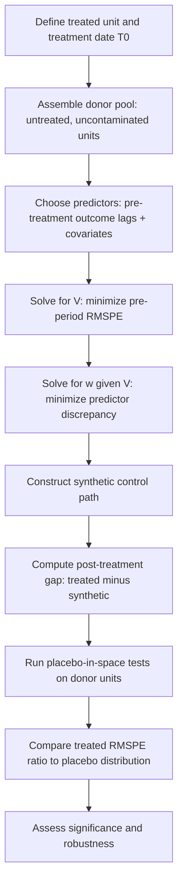

## Synthetic Control Methods

### Overview

The synthetic control method (SCM) constructs a weighted combination of untreated "donor pool" units — a synthetic counterfactual — designed to closely reproduce a treated unit's pre-treatment outcome trajectory. Post-treatment divergence between the treated unit and its synthetic counterpart is interpreted as the treatment effect. SCM was developed primarily for **comparative case studies** with a small number of treated units (often one), such as state- or country-level policy evaluations (Abadie and Gardeazabal 2003; Abadie, Diamond, and Hainmueller 2010, 2015).

### Core Setup

Let unit $1$ be treated starting at time $T_0$, with $J$ untreated donor units $j=2,\dots,J+1$. The synthetic control is a weighted average:

$$\hat{Y}_{1t}^{N}=\sum_{j=2}^{J+1}w_j Y_{jt}$$

subject to $w_j\geq0$ and $\sum_j w_j=1$. The estimated treatment effect at time $t>T_0$ is:

$$\hat{\tau}_{1t}=Y_{1t}-\hat{Y}_{1t}^{N}=Y_{1t}-\sum_{j=2}^{J+1}w_j Y_{jt}$$

### Weight Selection

Weights $\mathbf{w}=(w_2,\dots,w_{J+1})'$ are chosen to minimize the discrepancy between the treated unit and synthetic control on a set of pre-treatment predictors $X_1$ (a $k\times1$ vector: pre-treatment outcome values and/or covariates) and donor pool predictors $X_0$ (a $k\times J$ matrix):

$$\mathbf{w}^*=\arg\min_{\mathbf{w}}\;(X_1-X_0\mathbf{w})'V(X_1-X_0\mathbf{w})$$

where $V$ is a diagonal matrix of predictor importance weights, itself typically chosen to minimize pre-treatment root mean squared prediction error (RMSPE) of the outcome path.

**Key Points**

- The nonnegativity and sum-to-one constraints on $w_j$ prevent extrapolation outside the convex hull of donor units — a key contrast with regression-based counterfactuals, which allow negative weights and out-of-sample extrapolation.
- Good practice restricts the donor pool to units unaffected by the treatment and not subject to similar shocks ("no interference," "no contamination").
- A close pre-treatment fit (low pre-period RMSPE) is a prerequisite for a credible post-treatment comparison — a poor pre-fit undermines the entire exercise.

### Inference: Placebo Tests

Because there is often only one treated unit, conventional standard errors are not well-defined. Inference instead relies on **permutation/placebo tests** (Abadie, Diamond, and Hainmueller 2010):

1. Apply the identical synthetic control procedure to every donor-pool (untreated) unit, treating each *as if* it were treated at $T_0$.
2. Compute the distribution of placebo "effects" (gaps between actual and synthetic trajectories).
3. Compare the treated unit's post/pre RMSPE ratio to the distribution of placebo ratios; a treated-unit effect that is large relative to the placebo distribution is taken as evidence of a genuine effect.
4. Placebos with poor pre-treatment fit are typically discarded or down-weighted, since a poor-fitting placebo cannot be expected to track well post-treatment regardless of treatment status.

### Estimation Workflow



### Practical Example (R, `Synth` / `tidysynth`)

```r
library(tidysynth)

synth_out <- df |>
  synthetic_control(
    outcome = gdp_growth,
    unit = state,
    time = year,
    i_unit = "California",
    i_time = 1988,
    generate_placebos = TRUE
  ) |>
  generate_predictor(
    time_window = 1980:1988,
    avg_income = mean(income, na.rm = TRUE),
    avg_retail_price = mean(retail_price, na.rm = TRUE)
  ) |>
  generate_weights(optimization_window = 1980:1988) |>
  generate_control()

synth_out |> plot_trends()
synth_out |> plot_placebos()
synth_out |> plot_differences()
```

### Practical Example (Python, `pysyncon`)

```python
from pysyncon import Dataprep, Synth

dataprep = Dataprep(
    foo=df,
    predictors=["income", "retail_price"],
    predictors_op="mean",
    time_predictors_prior=range(1980, 1989),
    dependent="gdp_growth",
    unit_variable="state",
    time_variable="year",
    treatment_identifier="California",
    controls_identifier=donor_states,
    time_optimize_ssr=range(1980, 1989),
)

synth = Synth()
synth.fit(dataprep=dataprep)
synth.summary()
synth.path_plot()
synth.gaps_plot()
```

### Visualizing Results (SVG)

<svg xmlns="http://www.w3.org/2000/svg" viewBox="0 0 640 340">
<text x="320" y="20" font-size="14" text-anchor="middle" font-family="sans-serif" font-weight="bold">Treated Unit vs. Synthetic Control (svg_diagram)</text>
<line x1="60" y1="280" x2="600" y2="280" stroke="black" stroke-width="1" />
<line x1="60" y1="40" x2="60" y2="280" stroke="black" stroke-width="1" />
<line x1="330" y1="40" x2="330" y2="280" stroke="#999" stroke-width="1" stroke-dasharray="4,3" />
<text x="330" y="295" font-size="11" text-anchor="middle" font-family="sans-serif">treatment date (T0)</text>
<polyline points="60,220 140,205 220,190 300,178 330,172" fill="none" stroke="#2563eb" stroke-width="2" />
<polyline points="330,172 400,150 470,120 540,95 600,75" fill="none" stroke="#2563eb" stroke-width="2" />
<polyline points="60,222 140,206 220,189 300,177 330,173" fill="none" stroke="#dc2626" stroke-width="2" stroke-dasharray="5,3" />
<polyline points="330,173 400,168 470,163 540,160 600,158" fill="none" stroke="#dc2626" stroke-width="2" stroke-dasharray="5,3" />
<text x="480" y="70" font-size="10" fill="#2563eb" font-family="sans-serif">Treated unit</text>
<text x="480" y="175" font-size="10" fill="#dc2626" font-family="sans-serif">Synthetic control</text>
<text x="320" y="320" font-size="11" text-anchor="middle" font-family="sans-serif">Time</text>
<text x="20" y="160" font-size="11" text-anchor="middle" font-family="sans-serif" transform="rotate(-90 20 160)">Outcome</text>
</svg>

### Extensions

- **Generalized Synthetic Control (Xu 2017)**: combines interactive fixed-effects models with SCM-style counterfactual construction, allowing multiple treated units and providing standard errors via a factor-model framework.
- **Synthetic Difference-in-Differences (Arkhangelsky et al. 2021)**: combines SCM's unit-weighting with DiD's time-weighting and an additive fixed-effects structure, improving robustness and enabling formal large-sample inference.
- **Robust/penalized SCM variants** [Inference — an active area with multiple competing proposals rather than one dominant method]: address overfitting and interpolation bias, e.g., ridge-penalized or matrix-completion-based approaches (Doudchenko and Imbens 2016; Athey et al. 2021 "Matrix Completion Methods").
- **Multiple treated units / staggered SCM**: aggregating unit-specific synthetic controls across several treated units and treatment dates.

### Common Pitfalls

- Poor pre-treatment fit (large pre-period RMSPE) makes any post-treatment gap uninterpretable as a causal effect.
- Over-fitting with too many predictors relative to donor pool size, producing unstable or degenerate weights.
- Interpolation bias when the treated unit lies outside the convex hull of donor characteristics.
- Contaminated donor pool: including units that were themselves affected by the treatment, a related treatment, or spillovers.
- Treating a single significant-looking placebo comparison as definitive without considering the full permutation distribution.
- Small donor pools reduce the power of the placebo inference procedure.

**Next Steps**

- Synthetic Difference-in-Differences (Arkhangelsky et al.)
- Generalized Synthetic Control / Interactive Fixed Effects Models
- Matrix Completion Methods for Causal Panel Data
- Difference-in-Differences and Two-Way Fixed Effects
- Event-Study Designs
- Regression Discontinuity Designs
- Placebo and Permutation Inference Methods