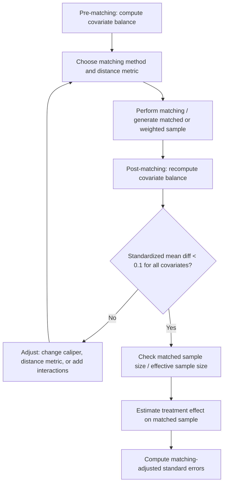

## Matching Methods and Covariate Balance


### Overview

Matching methods construct comparison groups by pairing treated units with control units that have similar observed covariates (or similar propensity scores), aiming to approximate the conditions of a randomized experiment within observational data. Unlike outcome-regression adjustment, matching is a **preprocessing step**: it reweights or subsets the data to achieve covariate balance before any outcome model is estimated, reducing model dependence (Ho, Imai, King, and Stuart 2007).

### Identification Assumptions

1. **Unconfoundedness (CIA)**: $\{Y_i(0),Y_i(1)\}\perp D_i\mid X_i$.
2. **Common support / overlap**: matched partners must exist within the covariate (or score) space.
3. **SUTVA**: no interference between units.

### Types of Matching

**Exact matching**

Pairs units with identical covariate values. Guarantees perfect balance on matched covariates but suffers from the curse of dimensionality — infeasible with many or continuous covariates.

**Nearest-neighbor (NN) matching on covariates**

Matches on a distance metric over $X$ directly, most commonly:

$$D(X_i,X_j)=\sqrt{(X_i-X_j)'\Sigma^{-1}(X_i-X_j)}$$

(Mahalanobis distance), which accounts for covariate correlation and scale.

**Propensity score matching (PSM)**

Matches on the scalar $\hat{e}(X)$ rather than the full covariate vector, alleviating dimensionality problems at the cost of relying on correct specification of the score model.

**Coarsened Exact Matching (CEM)** (Iacus, King, Porro 2012)

Coarsens each covariate into substantively meaningful bins (e.g., age into 5-year brackets), performs exact matching on the coarsened data, then prunes unmatched strata. Bounds the maximum imbalance ex ante by construction.

**Genetic Matching** (Diamond and Sekhon 2013)

Uses a genetic search algorithm to find weights for a generalized Mahalanobis distance that maximize post-matching covariate balance directly, combining features of Mahalanobis and propensity score matching.

**Key Points**

- Matching **with replacement** allows a control unit to serve as a match for multiple treated units — reduces bias (better matches available) but increases variance and requires careful standard-error adjustment (repeated use inflates effective weight).
- **Caliper matching** restricts matches to within a maximum distance threshold, discarding treated units with no acceptable match — trades sample size for match quality.
- $k$**-nearest-neighbor** matching (using $k>1$ controls per treated unit) reduces variance at some cost to bias relative to 1:1 matching.

### Estimand After Matching

Matching estimators typically target the **Average Treatment Effect on the Treated (ATT)**:

$$\widehat{ATT}=\frac{1}{N_1}\sum_{i:D_i=1}\left(Y_i-\frac{1}{|\mathcal{M}(i)|}\sum_{j\in\mathcal{M}(i)}Y_j\right)$$

where $\mathcal{M}(i)$ is the matched set of controls for treated unit $i$. This differs from the ATE because units without adequate matches (poor common support) are excluded — the estimand implicitly shifts to whichever population is matchable.

### Covariate Balance Assessment



**Key Points**

- **Standardized Mean Difference (SMD)**: $\dfrac{\bar{X}_{treated}-\bar{X}_{control}}{\sqrt{(s^2_{treated}+s^2_{control})/2}}$ — the primary balance metric; conventional thresholds target $|SMD|<0.1$, with $<0.25$ sometimes used as a looser criterion.
- Balance should be checked for **means, variances, and higher moments** (e.g., via QQ-plots or variance ratios), not means alone.
- **The "propensity score tautology"**: because PSM only targets balance on the scalar score, it can leave residual imbalance on specific covariates even when overall score distributions overlap well — direct covariate-based balance checks remain necessary regardless of matching method used.
- Mahalanobis and genetic matching directly target covariate balance in the matching step itself, often achieving tighter balance than PSM, particularly in small samples (King and Nielsen 2019 critique "propensity score matching paradox" — balance can *worsen* as approximate PSM matches are pruned toward exact ones).

### Practical Example (R, `MatchIt`)

```r
library(MatchIt)
library(cobalt)

# Nearest-neighbor matching on Mahalanobis distance, with caliper on PS
m_out <- matchit(
  treat ~ age + income + education + baseline_outcome,
  data = df,
  method = "nearest",
  distance = "mahalanobis",
  caliper = 0.2,
  ratio = 1,
  replace = TRUE
)

summary(m_out)             # balance table
love.plot(m_out, thresholds = c(m = 0.1))

matched_data <- match.data(m_out)
fit <- lm(outcome ~ treat, data = matched_data, weights = weights)
# Cluster/robust SEs on matched pairs recommended
```

### Practical Example (Python, `causalinference` / manual NN)

```python
from causalinference import CausalModel
import numpy as np

cm = CausalModel(
    Y=df["outcome"].values,
    D=df["treat"].values,
    X=df[["age", "income", "education", "baseline_outcome"]].values
)

cm.est_via_matching(matches=1, bias_adj=True)
print(cm.estimates)

cm.summary_stats  # pre-matching balance (normalized differences)
```

### Visualizing Balance (SVG)

<svg xmlns="http://www.w3.org/2000/svg" viewBox="0 0 640 320">
<text x="320" y="20" font-size="14" text-anchor="middle" font-family="sans-serif" font-weight="bold">Love Plot: Standardized Mean Differences (svg_diagram)</text>
<line x1="320" y1="45" x2="320" y2="290" stroke="#999" stroke-width="1" stroke-dasharray="3,3" />
<text x="320" y="305" font-size="10" text-anchor="middle" font-family="sans-serif">0</text>
<line x1="260" y1="45" x2="260" y2="290" stroke="#ccc" stroke-width="1" stroke-dasharray="2,2" />
<line x1="380" y1="45" x2="380" y2="290" stroke="#ccc" stroke-width="1" stroke-dasharray="2,2" />
<text x="260" y="305" font-size="9" text-anchor="middle" font-family="sans-serif">-0.1</text>
<text x="380" y="305" font-size="9" text-anchor="middle" font-family="sans-serif">0.1</text>

<text x="70" y="65" font-size="10" font-family="sans-serif">age</text>

<circle cx="430" cy="60" r="4" fill="`#dc2626`" />

<circle cx="335" cy="60" r="4" fill="`#2563eb`" />

<text x="70" y="105" font-size="10" font-family="sans-serif">income</text>

<circle cx="470" cy="100" r="4" fill="`#dc2626`" />

<circle cx="300" cy="100" r="4" fill="`#2563eb`" />

<text x="70" y="145" font-size="10" font-family="sans-serif">education</text>

<circle cx="220" cy="140" r="4" fill="`#dc2626`" />

<circle cx="340" cy="140" r="4" fill="`#2563eb`" />

<text x="70" y="185" font-size="10" font-family="sans-serif">baseline_outcome</text>

<circle cx="500" cy="180" r="4" fill="`#dc2626`" />

<circle cx="310" cy="180" r="4" fill="`#2563eb`" />

<circle cx="450" cy="240" r="4" fill="#dc2626" />
<text x="465" y="244" font-size="9" font-family="sans-serif" fill="#dc2626">Unadjusted</text>
<circle cx="450" cy="260" r="4" fill="#2563eb" />
<text x="465" y="264" font-size="9" font-family="sans-serif" fill="#2563eb">Matched</text>
</svg>

### Variance Estimation After Matching

- Matching introduces a **many-to-one / weighted-sample** structure that naive OLS standard errors do not account for.
- Abadie and Imbens (2006, 2016) derive matching-specific asymptotic variance estimators that account for the number of times each control unit is used and adjust for matching discrepancy via a bias-correction term.
- Bootstrap procedures are common in practice but are **not generally valid for nearest-neighbor matching estimators** with a fixed number of matches [Unverified — this is a known theoretical result (Abadie and Imbens 2008) but practitioner awareness and adherence vary]; the Abadie-Imbens variance formula or subsampling-based bootstrap are preferred alternatives.

### Common Pitfalls

- **"Propensity score matching paradox"**: iteratively improving mean PS balance can worsen balance on individual covariates if approximate matches are being discarded in a non-random way.
- Checking only propensity score overlap and not underlying covariate balance.
- Standard bootstrap SEs applied naively to nearest-neighbor matching estimators (known to be invalid in fixed-$k$ matching settings).
- Excessive pruning via tight calipers, shrinking the matched sample and estimand coverage without reporting how the target population has shifted.
- Comparing balance only via p-values from t-tests, which conflate balance with sample size rather than measuring standardized effect size (SMD is preferred).

**Next Steps**

- Propensity Score Estimation
- Coarsened Exact Matching (CEM)
- Genetic Matching
- Abadie-Imbens Matching Estimators and Variance
- Inverse Probability Weighting
- Doubly Robust Estimation
- Sensitivity Analysis for Unconfoundedness