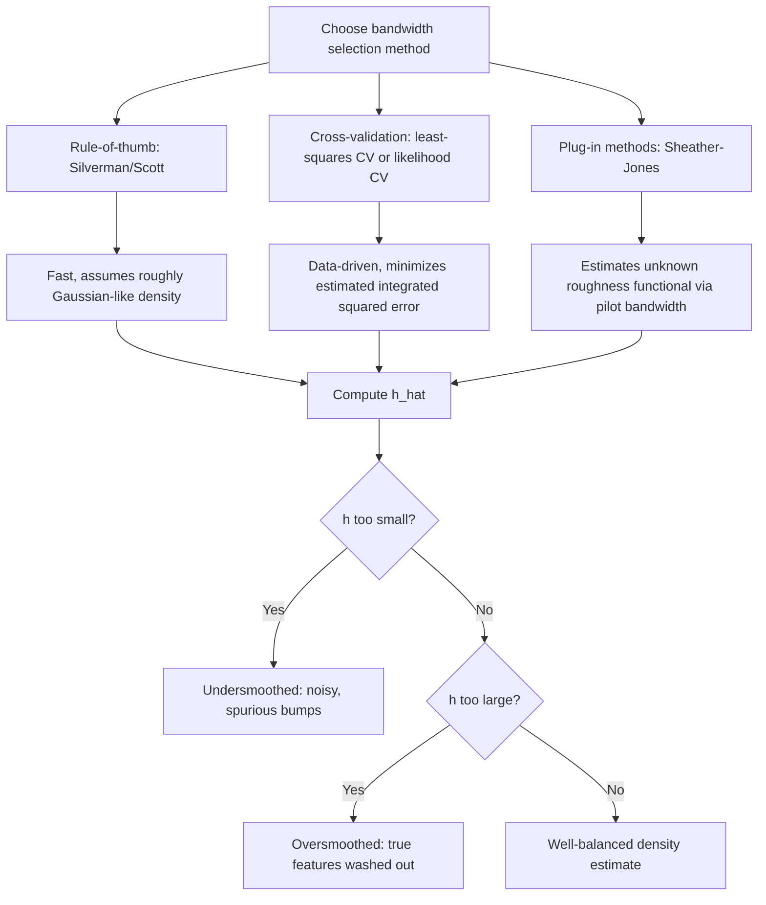

## Kernel Density Estimation

### Overview

Kernel density estimation (KDE) is a nonparametric method for estimating the probability density function of a random variable directly from data, without assuming a parametric functional form (e.g., normal, gamma). It replaces the histogram's discrete binning with a smooth, continuous estimate constructed by placing a weighting function ("kernel") at each observation and summing the results (Rosenblatt 1956; Parzen 1962).

### Core Estimator

For i.i.d. data $X_1,\dots,X_N$, the kernel density estimator at point $x$ is:

$$\hat{f}(x)=\frac{1}{Nh}\sum_{i=1}^N K\left(\frac{x-X_i}{h}\right)$$

where $K(\cdot)$ is the **kernel function** (a symmetric, integrable weighting function, typically a probability density itself) and $h>0$ is the **bandwidth** (smoothing parameter).

**Key Points**

- The estimator can be understood as a sum of $N$ scaled "bumps," one centered at each data point, whose width is controlled by $h$ — this is the direct nonparametric analog of a smoothed histogram, but without the arbitrary bin-edge placement and discontinuities of a histogram.
- $K(\cdot)$ must satisfy $\int K(u)\,du=1$ for $\hat{f}(x)$ to itself integrate to 1 (be a valid density).
- The bandwidth $h$, not the kernel shape, is overwhelmingly the dominant factor determining estimator quality — this is a well-established result in the nonparametric statistics literature.

### Common Kernel Functions

| Kernel | Formula $K(u)$ | Support |
| --- | --- | --- |
| Gaussian | $\frac{1}{\sqrt{2\pi}}e^{-u^2/2}$ | $(-\infty,\infty)$ |
| Epanechnikov | $\frac{3}{4}(1-u^2)$ | $[-1,1]$ |
| Uniform (boxcar) | $\frac{1}{2}$ | $[-1,1]$ |
| Triangular | $1- | u |
| Biweight (quartic) | $\frac{15}{16}(1-u^2)^2$ | $[-1,1]$ |

**Key Points**

- The **Epanechnikov kernel** is asymptotically MSE-optimal among second-order kernels (minimizes the asymptotic mean integrated squared error, AMISE) — a classical, well-established theoretical result (Epanechnikov 1969).
- In practice, kernel choice has **minimal impact** on estimation quality relative to bandwidth choice — the efficiency loss from using, say, a Gaussian kernel instead of the theoretically optimal Epanechnikov kernel is small (on the order of a few percent in AMISE), which is why the Gaussian kernel remains the most common default in software despite not being technically optimal.

### Bandwidth Selection

The bandwidth $h$ governs the classic **bias-variance trade-off**:

$$\text{AMISE}(h)=\underbrace{\frac{1}{Nh}R(K)}_{\text{variance term}}+\underbrace{\frac{h^4}{4}\mu_2(K)^2\int f''(x)^2\,dx}_{\text{squared bias term}}$$

where $R(K)=\int K(u)^2du$ and $\mu_2(K)=\int u^2K(u)\,du$.



**Key Points**

- **Undersmoothing** ($h$ too small): low bias but high variance — the estimate captures sampling noise as spurious modes/bumps in the density.
- **Oversmoothing** ($h$ too large): low variance but high bias — genuine features of the density (multimodality, sharp peaks) are smoothed away.
- **Silverman's rule of thumb** ($h=0.9\min(\hat\sigma,\text{IQR}/1.34)N^{-1/5}$) provides a fast, simple starting bandwidth assuming the underlying density is roughly unimodal and close to Gaussian — it can substantially oversmooth for multimodal or heavily skewed distributions.
- **Cross-validation** (least-squares/unbiased CV, or likelihood CV) selects $h$ by directly minimizing an estimate of integrated squared error computed via leave-one-out procedures — more computationally intensive but adapts to the actual shape of the underlying density rather than assuming near-normality.
- **Plug-in methods** (e.g., Sheather-Jones, Sheather and Jones 1991) estimate the unknown roughness functional $\int f''(x)^2dx$ appearing in the AMISE formula using a pilot bandwidth, then solve for the AMISE-optimal $h$ — widely regarded in the nonparametric statistics literature as providing good practical performance and is a common default choice (e.g., `bw.SJ` in R).

### Boundary Bias

**Key Points**

- When the support of $X$ has a natural boundary (e.g., $X\geq0$ for a nonnegative variable like income or waiting time), the standard KDE estimator is **biased near the boundary**, because the kernel places weight outside the support where no data can exist, systematically underestimating the density near the edge.
- Common corrections include the **reflection method** (reflecting data across the boundary before estimating), **boundary kernels** (specially constructed kernels that adapt their shape near the edge), and **local linear/polynomial estimators**, which have automatic boundary-bias-correcting properties as a byproduct of their construction (connecting directly to local polynomial regression methods).

### Multivariate Extension

For $d$-dimensional data, the product kernel estimator is:

$$\hat{f}(x)=\frac{1}{N\prod_{j=1}^d h_j}\sum_{i=1}^N\prod_{j=1}^d K\left(\frac{x_j-X_{ij}}{h_j}\right)$$

**Key Points**

- Multivariate KDE suffers acutely from the **curse of dimensionality**: the amount of data needed to achieve a given estimation accuracy grows rapidly with dimension $d$, since the effective local neighborhood around any point becomes sparse in high dimensions even with large $N$.
- This is a primary motivation for **semiparametric alternatives** in higher dimensions (e.g., single-index models, additive models) that avoid fully nonparametric estimation over the entire multivariate space.

### Practical Example (R, base + `ks`)

```r
# Base R: uses Sheather-Jones plug-in bandwidth by default option
dens <- density(x, bw = "SJ", kernel = "gaussian")
plot(dens, main = "Kernel Density Estimate")

# Multivariate KDE with the ks package
library(ks)
H <- Hpi(x = cbind(x1, x2))   # plug-in bandwidth matrix selector
kde_2d <- kde(x = cbind(x1, x2), H = H)
plot(kde_2d)

# Compare bandwidth selectors
bw.nrd0(x)   # Silverman's rule of thumb (scaled variant)
bw.SJ(x)     # Sheather-Jones plug-in
bw.ucv(x)    # unbiased cross-validation
```

### Practical Example (Python, `scipy` / `statsmodels`)

```python
from scipy.stats import gaussian_kde
import numpy as np

kde = gaussian_kde(x, bw_method="silverman")  # or "scott", or a custom scalar
x_grid = np.linspace(x.min(), x.max(), 200)
density_estimate = kde(x_grid)

# statsmodels offers more bandwidth options, including cross-validation
from statsmodels.nonparametric.kde import KDEUnivariate

kde_sm = KDEUnivariate(x)
kde_sm.fit(kernel="gau", bw="cv_ls")  # least-squares cross-validation
```

### Visualizing Bandwidth Sensitivity (SVG)

<svg xmlns="http://www.w3.org/2000/svg" viewBox="0 0 640 300">
<text x="320" y="20" font-size="14" text-anchor="middle" font-family="sans-serif" font-weight="bold">Effect of Bandwidth on KDE (svg_diagram)</text>
<line x1="60" y1="250" x2="600" y2="250" stroke="black" stroke-width="1" />
<line x1="60" y1="40" x2="60" y2="250" stroke="black" stroke-width="1" />
<text x="330" y="280" font-size="11" text-anchor="middle" font-family="sans-serif">x</text>
<text x="20" y="150" font-size="11" text-anchor="middle" font-family="sans-serif" transform="rotate(-90 20 150)">density</text>
<path d="M70,248 C90,150 100,60 120,120 C140,180 150,70 170,140 C190,210 210,90 230,160 C250,230 270,100 290,170 C310,235 330,150 350,190 C380,235 420,220 460,235 C500,245 550,248 580,249" fill="none" stroke="#dc2626" stroke-width="1.5" />
<text x="130" y="55" font-size="10" fill="#dc2626" font-family="sans-serif">h too small (noisy)</text>
<path d="M70,249 C150,240 200,180 280,120 C330,90 370,90 420,120 C480,165 540,225 580,248" fill="none" stroke="#16a34a" stroke-width="2" />
<text x="380" y="80" font-size="10" fill="#16a34a" font-family="sans-serif">h well-chosen</text>
<path d="M70,249 C200,220 300,180 400,175 C480,172 540,200 580,235" fill="none" stroke="#2563eb" stroke-width="2" stroke-dasharray="5,3" />
<text x="450" y="195" font-size="10" fill="#2563eb" font-family="sans-serif">h too large (oversmoothed)</text>
</svg>

### Applications

**Key Points**

- KDE underlies numerous downstream methods: **density-based clustering** (e.g., mean-shift), **nonparametric regression via kernel smoothers** (Nadaraya-Watson estimator), **propensity score density overlap diagnostics** in causal inference, and **visualizing distributions** as a smoother alternative to histograms in exploratory data analysis.
- In econometrics specifically, KDE is commonly used for **visual overlap/common-support diagnostics** in matching and propensity score methods, and as a building block within semiparametric estimators (e.g., density-weighted average derivative estimation).

### Common Pitfalls

- **Using a fixed rule-of-thumb bandwidth (e.g., Silverman) without checking robustness**, especially for visibly multimodal, skewed, or heavy-tailed data where the underlying Gaussian-approximation assumption is poor.
- **Ignoring boundary bias** for variables with natural support boundaries (nonnegative quantities, proportions bounded in $[0,1]$), producing systematically distorted density estimates near the edge without applying boundary-correcting methods.
- **Over-reliance on visual inspection alone** to judge "the right amount of smoothing" — formal bandwidth selectors (cross-validation, plug-in) provide a more principled, reproducible choice than eyeballing a plot.
- **Applying full multivariate KDE in high dimensions** without recognizing the curse-of-dimensionality problem, leading to unreliable, extremely noisy estimates despite large nominal sample sizes.
- **Confusing kernel choice with bandwidth choice** as the primary lever for estimator quality — practitioners sometimes spend disproportionate effort selecting an "optimal" kernel shape when bandwidth selection is the far more consequential decision.

**Next Steps**

- Nonparametric Regression (Nadaraya-Watson, Local Polynomial)
- Bandwidth Selection Methods (Cross-Validation, Plug-In)
- Semiparametric Single-Index and Partially Linear Models
- Propensity Score Overlap Diagnostics
- Local Polynomial Regression
- Density-Based Clustering Methods