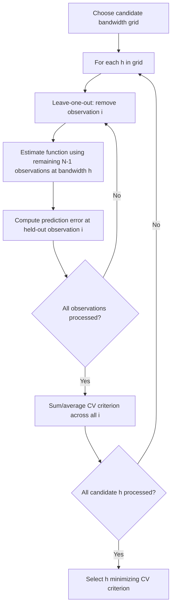

## Bandwidth Selection Methods

### Overview

Bandwidth selection is the central practical problem in nonparametric smoothing: the choice of smoothing parameter $h$ governs the bias-variance trade-off for any kernel-based estimator (density estimation, kernel regression, local polynomial regression) and, unlike kernel shape, has a first-order effect on estimation quality. This topic surveys the major classes of data-driven bandwidth selectors — rule-of-thumb, cross-validation, and plug-in methods — their theoretical motivations, relative strengths, and practical failure modes.

### The Bias-Variance Trade-off

For a generic kernel estimator with bandwidth $h$, the asymptotic mean integrated squared error (AMISE) decomposes as:

$$\text{AMISE}(h)=\underbrace{c_1\,N^{-1}h^{-1}}_{\text{variance}}+\underbrace{c_2\,h^4}_{\text{squared bias}}$$

where $c_1,c_2$ depend on the kernel and the unknown roughness of the target function. Minimizing over $h$ gives the theoretically optimal rate $h_{opt}\propto N^{-1/5}$ for standard kernel density/regression estimation.

**Key Points**

- This $N^{-1/5}$ rate is slower than the $N^{-1/2}$ rate achievable in parametric estimation — a direct manifestation of the **nonparametric price** paid for not assuming a functional form.
- The constants $c_1,c_2$ depend on unknown features of the true underlying function (its curvature/roughness), which is precisely what makes bandwidth selection a genuine estimation problem rather than a closed-form calculation.
- All bandwidth selectors are, at core, different strategies for estimating these unknown constants (or directly estimating the resulting optimal $h$) from the data itself.

### Rule-of-Thumb Selectors

**Silverman's rule of thumb** (for KDE):

$$\hat{h}=0.9\min(\hat\sigma,\,\widehat{IQR}/1.34)\,N^{-1/5}$$

**Key Points**

- Derived by assuming the true density is Gaussian and substituting the Gaussian's known roughness functional into the AMISE-minimizing formula — a fast, closed-form, "reference" bandwidth.
- Performs reasonably well for roughly unimodal, symmetric, near-Gaussian distributions, but can substantially **oversmooth** multimodal or heavily skewed distributions, since the roughness of a true multimodal density is typically much greater than that of a Gaussian with the same variance.
- Scott's rule is a closely related, slightly simpler variant ($\hat h=1.06\hat\sigma N^{-1/5}$ for KDE) — both are best understood as fast starting points or defaults, not final answers, particularly when the shape of the underlying function is unknown or suspected to be complex.

### Cross-Validation Methods



**Least-Squares Cross-Validation (LSCV / Unbiased CV)** for density estimation minimizes an estimate of integrated squared error:

$$LSCV(h)=\int\hat{f}_h(x)^2dx-\frac{2}{N}\sum_{i=1}^N\hat{f}_{-i,h}(X_i)$$

where $\hat{f}_{-i,h}$ is the leave-one-out density estimate excluding observation $i$.

**Key Points**

- Cross-validation is **fully data-driven**: it does not assume any particular reference distribution (unlike Silverman's rule), making it more adaptive to genuinely multimodal or irregular densities.
- The trade-off is **higher variance in the selected bandwidth itself** — LSCV bandwidths can be noisy from sample to sample, particularly in small samples, and the LSCV objective function can be relatively flat or have multiple local minima, complicating optimization.
- For kernel **regression** (rather than density estimation), analogous leave-one-out CV directly minimizes estimated out-of-sample prediction error — this is a close cousin of standard supervised-learning cross-validation, adapted to the bandwidth-selection problem.
- **Generalized Cross-Validation (GCV)** provides a computationally cheaper approximation to leave-one-out CV for kernel regression, avoiding the need to literally refit the estimator $N$ times.

### Plug-In Methods

Plug-in selectors directly estimate the unknown roughness functional in the AMISE formula (e.g., $\int f''(x)^2dx$ for KDE) using a **pilot bandwidth**, then substitute this estimate into the closed-form AMISE-minimizing expression for $h$.

**Key Points**

- The **Sheather-Jones (SJ) plug-in method** (Sheather and Jones 1991) is widely regarded, based on extensive simulation evidence in the nonparametric statistics literature, as one of the best-performing general-purpose bandwidth selectors for univariate KDE, and is a common software default (e.g., R's `bw.SJ`).
- Plug-in methods require a **pilot/reference bandwidth** to estimate the roughness functional in a first stage — introducing an additional tuning choice, though this choice is typically far less consequential than the choice of final bandwidth itself.
- Plug-in approaches generally exhibit **lower variance** than cross-validation-based selectors (the selected $h$ is more stable across repeated samples), which is a primary practical reason for their popularity, though they rely on asymptotic approximations that may be less accurate in very small samples.

### Comparison of Approaches

| Method | Data-driven | Assumes reference shape | Variance of selected h | Typical use case |
| --- | --- | --- | --- | --- |
| Silverman / Scott rule-of-thumb | No | Gaussian-like | Low (deterministic) | Fast default, roughly unimodal data |
| Least-Squares CV | Yes | None | High | Suspected multimodality, adaptivity needed |
| Likelihood CV | Yes | None | High | Similar to LSCV, alternative loss |
| Plug-in (Sheather-Jones) | Yes (via pilot) | Weak/asymptotic | Moderate | General-purpose univariate KDE default |

### Bandwidth Selection Beyond Density Estimation

**Key Points**

- **Kernel regression (Nadaraya-Watson)**: bandwidth selection follows the same bias-variance logic, but the roughness functional involves the unknown regression function's curvature rather than a density's curvature — leave-one-out CV directly targeting prediction error is especially natural and common here.
- **Local polynomial regression**: bandwidth selection interacts with the choice of polynomial order (local constant vs. local linear vs. local quadratic) — higher-order local polynomials have different bias properties (notably automatic boundary-bias correction for local linear and higher), which changes the optimal bandwidth's rate and the appropriate selection criterion.
- **Regression discontinuity designs**: bandwidth selection takes on special importance because estimation occurs only in a local neighborhood of the cutoff — specialized selectors (e.g., Imbens-Kalyanaraman, Calonico-Cattaneo-Titiunik) are designed specifically for this one-sided/boundary estimation context and are covered in their own right in RDD methodology.
- **Multivariate bandwidth selection**: extending any of the above (rule-of-thumb, CV, plug-in) to bandwidth *matrices* in the multivariate case (rather than a scalar) introduces substantial additional computational cost and estimation uncertainty, compounding the curse-of-dimensionality problem inherent to multivariate nonparametric estimation.

### Practical Example (R)

```r
# Univariate KDE: compare bandwidth selectors
h_silverman <- bw.nrd0(x)
h_sj        <- bw.SJ(x)
h_ucv       <- bw.ucv(x)   # least-squares/unbiased CV
h_bcv       <- bw.bcv(x)   # biased CV, a variance-reduced variant of UCV

densities <- lapply(
  list(silverman = h_silverman, sj = h_sj, ucv = h_ucv),
  function(h) density(x, bw = h)
)

# Kernel regression bandwidth via CV (np package)
library(np)
bw_reg <- npregbw(ydat = y, xdat = x, regtype = "ll", bwmethod = "cv.aic")
```

### Practical Example (Python)

```python
from sklearn.model_selection import GridSearchCV
from sklearn.neighbors import KernelDensity
import numpy as np

# Cross-validated bandwidth for KDE via grid search
bandwidths = np.linspace(0.05, 2.0, 40)
grid = GridSearchCV(
    KernelDensity(kernel="gaussian"),
    {"bandwidth": bandwidths},
    cv=10
)
grid.fit(x.reshape(-1, 1))
h_cv = grid.best_params_["bandwidth"]

# statsmodels: multiple built-in selectors for KDE
from statsmodels.nonparametric.kde import KDEUnivariate
kde_sj = KDEUnivariate(x); kde_sj.fit(bw="silverman")
kde_cv = KDEUnivariate(x); kde_cv.fit(bw="cv_ls")
```

### Visualizing the AMISE Trade-off (SVG)

<svg xmlns="http://www.w3.org/2000/svg" viewBox="0 0 640 300">
<text x="320" y="20" font-size="14" text-anchor="middle" font-family="sans-serif" font-weight="bold">Bias-Variance Trade-off in Bandwidth Selection (svg_diagram)</text>
<line x1="60" y1="250" x2="600" y2="250" stroke="black" stroke-width="1" />
<line x1="60" y1="40" x2="60" y2="250" stroke="black" stroke-width="1" />
<text x="330" y="280" font-size="11" text-anchor="middle" font-family="sans-serif">Bandwidth h</text>
<text x="20" y="150" font-size="11" text-anchor="middle" font-family="sans-serif" transform="rotate(-90 20 150)">Error</text>
<path d="M80,60 C150,90 250,160 580,235" fill="none" stroke="#dc2626" stroke-width="2" />
<text x="480" y="215" font-size="10" fill="#dc2626" font-family="sans-serif">Bias^2 (increases with h)</text>
<path d="M80,240 C150,220 250,130 580,55" fill="none" stroke="#2563eb" stroke-width="2" />
<text x="380" y="90" font-size="10" fill="#2563eb" font-family="sans-serif">Variance (decreases with h)</text>
<path d="M80,150 C200,90 260,75 330,80 C400,90 480,140 580,200" fill="none" stroke="#16a34a" stroke-width="2.5" />
<text x="360" y="65" font-size="10" fill="#16a34a" font-family="sans-serif">AMISE (sum)</text>
<line x1="330" y1="40" x2="330" y2="250" stroke="#999" stroke-width="1" stroke-dasharray="3,3" />
<text x="330" y="265" font-size="10" text-anchor="middle" font-family="sans-serif">h_opt</text>
</svg>

### Common Pitfalls

- **Defaulting to a rule-of-thumb bandwidth without checking sensitivity**, especially when the underlying function is suspected to be multimodal, sharply peaked, or otherwise non-Gaussian in shape.
- **Treating cross-validation-selected bandwidths as noise-free**: LSCV/UCV bandwidths can vary considerably across similar samples or even across random seeds in some implementations, warranting sensitivity checks (e.g., examining a range of nearby bandwidths, not just the single CV-minimizing value).
- **Applying a bandwidth selector designed for one estimation context to a different one** — e.g., using a density-estimation bandwidth selector's default logic for a regression discontinuity boundary-estimation problem, which has fundamentally different bias structure and calls for specialized selectors.
- **Ignoring boundary effects when selecting bandwidth** for bounded-support variables — the optimal bandwidth trade-off differs near boundaries, and standard interior-asymptotic selectors may not account for this.
- **Over-trusting a single "optimal" h** as if it were a fixed, known quantity — in practice, presenting results across a small range of reasonable bandwidths (a bandwidth sensitivity/robustness check) is good practice, paralleling robustness checks used elsewhere in applied econometrics (e.g., RDD bandwidth sensitivity).

**Next Steps**

- Kernel Density Estimation
- Nonparametric Regression (Nadaraya-Watson, Local Polynomial)
- Regression Discontinuity Bandwidth Selection (Imbens-Kalyanaraman, CCT)
- Local Polynomial Regression
- Semiparametric Estimation Methods
- Cross-Validation in Machine Learning Contexts