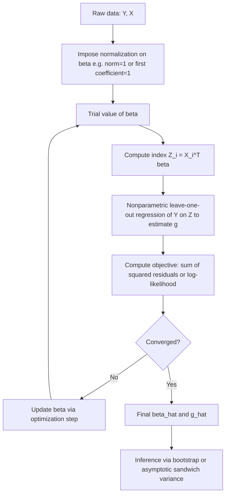

## Single-index models

### Overview

A single-index model (SIM) is a semiparametric regression model in which the conditional mean of a response variable depends on a vector of covariates only through a single linear combination (the "index"), which is then passed through an unknown, unspecified link function. The model is written as:

$$Y = g(X^\top\beta) + \varepsilon$$

where $X$ is a $p$-dimensional vector of regressors, $\beta$ is a finite-dimensional parameter vector (the index coefficients), $g(\cdot)$ is an unknown univariate function (the link function), and $\varepsilon$ is an error term satisfying $E[\varepsilon \mid X] = 0$.

The term $X^\top\beta$ is called the **single index**. The model is "semiparametric" because it combines a parametric component ($\beta$, finite-dimensional) with a nonparametric component ($g$, infinite-dimensional).

### Motivation

**Key Points**

- Fully nonparametric regression $E[Y\mid X] = m(X)$ suffers from the **curse of dimensionality**: nonparametric estimators (kernel, local polynomial, spline) converge at rates that deteriorate rapidly as the dimension $p$ of $X$ grows.
- Fully parametric models (e.g., linear regression, probit, logit) avoid the curse of dimensionality but impose potentially incorrect functional-form assumptions on $g$, risking misspecification bias.
- Single-index models offer a middle ground: by collapsing the $p$-dimensional covariate vector into a scalar index $X^\top\beta$, the nonparametric smoothing problem becomes effectively one-dimensional, so the estimator of $g$ achieves the univariate nonparametric convergence rate $n^{-2/5}$ (for twice-differentiable $g$) regardless of $p$, while $\hat\beta$ can often be estimated at the parametric $\sqrt{n}$ rate.

### Identification

Because both $\beta$ and $g$ are unknown, the model is not identified without normalization, since $g(X^\top\beta) = g^*((cX)^\top(\beta/c))$ for any nonzero scalar $c$, and adding a constant to the index can be absorbed into $g$. Standard identification conditions:

1. **Scale normalization**: fix the norm of $\beta$, e.g., $\|\beta\| = 1$, or fix one coefficient to unity (e.g., $\beta_1 = 1$), assuming that coefficient is nonzero.
2. **Location normalization**: if $X$ includes an intercept, it is typically dropped, since a location shift in the index is absorbed by $g$.
3. **No intercept in $\beta$**: because $g$ is unrestricted, any constant term is unidentified separately from $g$.
4. $X$ must contain at least one continuous regressor with nonzero coefficient, and there must be sufficient variation in $X^\top\beta$ relative to the support over which $g$ is estimated.
5. $g$ must be non-constant (otherwise $\beta$ is not identified at all) and, for many estimators, assumed smooth (continuously differentiable) over the relevant support.

### Special Cases

- **Binary choice models**: probit and logit are single-index models with known parametric link functions ($g = \Phi$ or $g = \Lambda$, the logistic CDF). SIM estimation nests these as special cases when the parametric form is relaxed.
- **Linear regression**: if $g$ is the identity function, the SIM reduces to standard OLS.
- **Generalized linear models (GLMs)**: SIMs generalize GLMs by leaving the link function $g$ unspecified rather than fixing it a priori (e.g., logit, probit, Poisson log-link).
- **Censored/truncated models**: Tobit-type models can be embedded in the single-index framework with $g$ left nonparametric to avoid distributional misspecification.

### Estimation Methods

#### 1. Average Derivative Estimation (ADE)

Proposed by Härdle and Stoker (1989), this approach exploits the fact that, up to scale, $\beta$ is proportional to the average gradient of the conditional mean function:

$$\delta = E\left[\frac{\partial E[Y\mid X]}{\partial X}\right] \propto \beta$$

**Procedure:**

1. Estimate $m(x) = E[Y \mid X = x]$ nonparametrically (typically via kernel regression).
2. Estimate $\nabla m(x)$ (the gradient) using the derivative of the kernel estimator, or use the density-weighted average derivative:

   $$\hat\delta = -\frac{2}{n}\sum_{i=1}^n \nabla \hat f(X_i) \, Y_i$$

   where $\hat f$ is a kernel density estimator of $X$'s density, and the weighting by $-\nabla \hat f$ avoids the need to estimate $\nabla m$ directly (integration by parts trick).
3. Normalize $\hat\delta$ to recover $\hat\beta$.

$\hat\delta$ is $\sqrt{n}$-consistent and asymptotically normal under regularity conditions on kernel bandwidth and smoothness of $f$ and $m$.

#### 2. Semiparametric Least Squares (Ichimura's Estimator)

Ichimura (1993) proposed profiling out $g$ via nonparametric regression conditional on a trial $\beta$, then optimizing over $\beta$:

$$\hat\beta = \arg\min_{\beta} \sum_{i=1}^n \left[Y_i - \hat g_{-i}(X_i^\top\beta; \beta)\right]^2$$

where $\hat g_{-i}(\cdot;\beta)$ is a leave-one-out Nadaraya–Watson kernel estimator of $g$ evaluated at $X_i^\top\beta$:

$$\hat g_{-i}(u;\beta) = \frac{\sum_{j\neq i} K_h(X_j^\top\beta - u)\, Y_j}{\sum_{j\neq i} K_h(X_j^\top\beta - u)}$$

**Key Points**

- The leave-one-out step is essential to avoid degenerate overfitting (without it, minimizing sum of squared residuals could trivially drive residuals to zero).
- Under regularity conditions (smoothness of $g$, appropriate bandwidth rate $h \to 0$, $nh \to \infty$), $\hat\beta$ is $\sqrt{n}$-consistent, asymptotically normal, and semiparametrically efficient for the least-squares objective.
- The nonparametric first-stage estimate of $g$ itself converges at the slower univariate nonparametric rate.

#### 3. Weighted Semiparametric Least Squares (Klein–Spady)

Klein and Spady (1993) developed an estimator specifically for **binary choice single-index models**, i.e., $P(Y=1\mid X) = g(X^\top\beta)$ with $Y \in \{0,1\}$, using quasi-maximum likelihood with a nonparametrically estimated link:

$$\hat\beta = \arg\max_\beta \sum_{i=1}^n \Big\{Y_i \ln \hat g_{-i}(X_i^\top\beta) + (1-Y_i)\ln[1-\hat g_{-i}(X_i^\top\beta)]\Big\}$$

This estimator achieves the semiparametric efficiency bound for binary response single-index models, a notable theoretical result since it matches the efficiency of models with the *correct* known parametric link.

#### 4. Density-Weighted Average Derivative Estimation

A variant of ADE that improves finite-sample performance by weighting observations according to estimated density, reducing sensitivity to sparse regions in the covariate space (Powell, Stock, and Stoker, 1989).

#### 5. Sliced Inverse Regression (SIR)

Li (1991) proposed a dimension-reduction technique closely related to single-index estimation, based on the inverse regression curve $E[X \mid Y]$. Under a linearity condition on the covariate distribution (satisfied, e.g., by elliptically symmetric $X$), the eigenvectors of a specific weighted covariance matrix (constructed by slicing the range of $Y$ and computing within-slice means of $X$) are proportional to $\beta$.

**Procedure:**

1. Standardize $X$.
2. Partition the range of $Y$ into $H$ slices.
3. Compute the within-slice sample mean of standardized $X$ for each slice.
4. Form the weighted covariance matrix of slice means and extract its leading eigenvector(s).

SIR is computationally simple ($\sqrt{n}$-consistent, closed-form via eigendecomposition) but relies on the linearity condition and can fail to recover $\beta$ in certain symmetric designs (e.g., when the index enters through an even function of $X^\top\beta$, SIR's first-moment-based construction can miss the direction — motivating SAVE, below).

#### 6. Sliced Average Variance Estimation (SAVE)

Cook and Weisberg (1991) extended SIR by using within-slice *variances* (not just means) of $X$, which recovers directions missed by SIR when the regression function is symmetric about zero (e.g., $g(u) = u^2$).

#### 7. Minimum Average Variance Estimation (MAVE)

Xia et al. (2002) proposed a local-linear-based method that estimates $\beta$ by minimizing a weighted sum of local residual variances, avoiding the linearity design condition required by SIR/SAVE and often exhibiting superior finite-sample efficiency. MAVE also extends naturally to **multiple-index models**.

### Comparison of Estimators

| Estimator | Target Model | Rate for $\hat\beta$ | Requires Design Condition? | Notes |
| --- | --- | --- | --- | --- |
| Average Derivative (Härdle–Stoker) | General SIM | $\sqrt{n}$ | No | Requires continuous $X$, density estimation |
| Ichimura SLS | Continuous $Y$, general $g$ | $\sqrt{n}$ | No | Nonlinear optimization, leave-one-out |
| Klein–Spady | Binary choice | $\sqrt{n}$, efficient | No | Semiparametric efficiency bound attained |
| SIR | General SIM (dimension reduction) | $\sqrt{n}$ | Yes (linearity) | Fast, eigen-based, can miss symmetric effects |
| SAVE | General SIM | $\sqrt{n}$ | Yes (linearity + constant variance) | Captures second-moment structure |
| MAVE | General/multiple-index | $\sqrt{n}$ | No | Local-linear based, flexible |

### Asymptotic Theory

**Key Points**

- Under standard regularity conditions (smoothness of $g$, existence of moments, bandwidth conditions such as $nh^4 \to 0$ and $nh^2 \to \infty$ for undersmoothing), semiparametric estimators of $\beta$ typically achieve:
  - $\sqrt{n}$-consistency: $\sqrt{n}(\hat\beta - \beta_0) \to_d N(0, V)$
  - Asymptotic normality with a sandwich-form variance $V$ that generally depends on the nonparametric first stage.
- The nonparametric estimate $\hat g(\cdot)$ converges at the slower rate $n^{-2/5}$ (assuming $g$ is twice continuously differentiable and using second-order kernels), the standard optimal univariate nonparametric rate, since after estimating $\beta$ consistently the problem becomes a one-dimensional smoothing problem.
- [Inference] The exact form of the asymptotic variance and the practicality of plug-in variance estimation is sensitive to bandwidth choice and the specific estimator; in practice, bootstrap methods are frequently used for inference on $\hat\beta$ to avoid deriving/estimating complex sandwich variances.

### Practical Implementation Considerations

**Key Points**

- **Bandwidth selection**: cross-validation (leave-one-out CV minimizing prediction error) is standard for choosing $h$ in the nonparametric first-stage; undersmoothing (choosing $h$ smaller than the rate optimal for estimating $g$ alone) is often required to achieve $\sqrt{n}$-consistency of $\hat\beta$.
- **Kernel choice**: second-order kernels (Gaussian, Epanechnikov) are standard; the specific kernel typically has a smaller effect on performance than bandwidth choice.
- **Optimization**: Ichimura's and Klein–Spady's objective functions are generally non-convex in $\beta$; good starting values (e.g., from OLS or a parametric probit/logit as a first pass) and careful optimization (e.g., Nelder–Mead, or gradient-based methods with numerical derivatives) are important in practice.
- **Normalization in implementation**: software often normalizes by setting one coefficient to 1 or normalizing $\|\hat\beta\|=1$, which affects the scale (but not qualitative interpretation) of remaining coefficients.
- **Software**: [Unverified] specific package availability changes over time and by version; commonly cited implementations include the `np` package in R (for kernel-based semiparametric regression), user-contributed R packages for SIR/SAVE/MAVE (e.g., `dr`, `MAVE`), and Stata's user-written commands for semiparametric single-index estimation. Users should consult current documentation for the exact syntax and estimator variants supported.

### Worked Example

**Example**

Consider a labor-supply application: $Y_i$ = hours worked, $X_i = (\text{education}_i, \text{experience}_i, \text{age}_i, \text{nonlabor income}_i)^\top$. A single-index specification posits:

$$Y_i = g(\beta_1 \cdot \text{educ}_i + \beta_2 \cdot \text{exper}_i + \beta_3 \cdot \text{age}_i + \beta_4 \cdot \text{income}_i) + \varepsilon_i$$

with $\beta_1 = 1$ imposed as the scale normalization. Using Ichimura's SLS:

1. Choose a grid or optimization routine over candidate $(\beta_2,\beta_3,\beta_4)$.
2. For each candidate, compute the index $Z_i(\beta) = \text{educ}_i + \beta_2\,\text{exper}_i + \beta_3\,\text{age}_i + \beta_4\,\text{income}_i$.
3. Nonparametrically regress $Y_i$ on $Z_i(\beta)$ using leave-one-out kernel regression to get $\hat g_{-i}(Z_i(\beta))$.
4. Compute sum of squared residuals $\sum_i [Y_i - \hat g_{-i}(Z_i(\beta))]^2$.
5. Update $(\beta_2,\beta_3,\beta_4)$ to minimize this sum; iterate to convergence.

The resulting $\hat g$ can then be plotted against the estimated index $\hat Z_i = X_i^\top\hat\beta$ to visualize the (potentially nonlinear) relationship — e.g., revealing a backward-bending labor supply curve that a linear specification would miss.

### Diagram: Estimation Workflow

### Diagram: Model Structure (svg_diagram)

<svg xmlns="http://www.w3.org/2000/svg" viewBox="0 0 700 260">
<text x="350" y="25" font-size="16" font-weight="bold" text-anchor="middle" fill="#222">Single-Index Model Structure (svg_diagram)</text>
<rect x="30" y="70" width="140" height="60" rx="6" fill="#e8f0fe" stroke="#4285f4" stroke-width="1.5" />
<text x="100" y="95" font-size="13" text-anchor="middle" fill="#222">Covariates</text>
<text x="100" y="113" font-size="13" text-anchor="middle" fill="#222">X (p-dim)</text>
<line x1="170" y1="100" x2="250" y2="100" stroke="#555" stroke-width="1.5" marker-end="url(#arrow)" />
<rect x="250" y="70" width="140" height="60" rx="6" fill="#fef3e0" stroke="#f4a742" stroke-width="1.5" />
<text x="320" y="90" font-size="13" text-anchor="middle" fill="#222">Linear Index</text>
<text x="320" y="108" font-size="13" text-anchor="middle" fill="#222">X^T beta (scalar)</text>
<line x1="390" y1="100" x2="470" y2="100" stroke="#555" stroke-width="1.5" marker-end="url(#arrow)" />
<rect x="470" y="70" width="150" height="60" rx="6" fill="#e6f4ea" stroke="#34a853" stroke-width="1.5" />
<text x="545" y="90" font-size="13" text-anchor="middle" fill="#222">Unknown Link</text>
<text x="545" y="108" font-size="13" text-anchor="middle" fill="#222">g( . ) nonparametric</text>
<line x1="545" y1="130" x2="545" y2="170" stroke="#555" stroke-width="1.5" marker-end="url(#arrow)" />
<rect x="470" y="170" width="150" height="50" rx="6" fill="#fce8e6" stroke="#ea4335" stroke-width="1.5" />
<text x="545" y="200" font-size="13" text-anchor="middle" fill="#222">E[Y|X] = g(X^T beta)</text>

<text x="100" y="160" font-size="11" text-anchor="middle" fill="#555">parametric</text>

<text x="100" y="175" font-size="11" text-anchor="middle" fill="#555">(finite-dim beta)</text>

<text x="545" y="150" font-size="11" text-anchor="middle" fill="#555">nonparametric</text>

<text x="545" y="20" font-size="1" />

</svg>

### Advantages and Limitations

**Key Points**

Advantages:

- Avoids curse of dimensionality relative to fully nonparametric regression.
- Robust to misspecification of the functional form of $g$ (unlike parametric GLMs).
- Nests common parametric models (linear, probit, logit) as special cases, allowing formal specification testing of the parametric form.
- Coefficients $\hat\beta$ retain interpretability up to scale (relative marginal effects/ratios of coefficients are often directly interpretable even without knowing $g$).

Limitations:

- Assumes covariates enter *only* through a single scalar index — rules out interactions or nonadditive dimension-specific effects unless explicitly built into $X$.
- Estimation requires nonparametric smoothing, hence bandwidth selection, boundary effects, and finite-sample sensitivity to tuning parameters.
- Absolute magnitude of $g$ (and thus of marginal effects in the original units of $Y$) requires estimating $g$ itself, which converges more slowly than $\hat\beta$.
- Some estimators (SIR, SAVE) require restrictive design conditions on the distribution of $X$ (e.g., elliptical symmetry) that may not hold in applied data.
- [Inference] Extending single-index models to more than one index (multiple-index models, projection pursuit regression) substantially increases estimation complexity and is an active area where practical guidance is less standardized.

### Relation to Multiple-Index Models

When a single index is insufficient to capture the conditional mean structure, the model generalizes to:

$$Y = g(X^\top\beta_1, X^\top\beta_2, \ldots, X^\top\beta_k) + \varepsilon$$

This is the **multiple-index model** (a generalization related to projection pursuit regression in the statistics literature). MAVE and its variants (e.g., refined MAVE, outer product of gradients — OPG) extend naturally to estimate multiple indices simultaneously, though identification and estimation become substantially more involved as $k$ grows.

### Specification Testing

**Key Points**

- Because parametric models (linear regression, probit, logit) are nested special cases of the SIM, one can test $H_0: g(\cdot) = g_0(\cdot;\theta)$ (a specific parametric form) against the nonparametric alternative using, e.g., a conditional moment test or a comparison of fitted values from the parametric vs. semiparametric fit.
- Common approaches include integrated conditional moment tests (Bierens-type) and $L_2$-distance tests comparing the parametric and nonparametric estimates of $g$, often requiring bootstrap-based critical values due to nonstandard asymptotic distributions under the null.

### Related Topics / Next Steps

- Multiple-index models and projection pursuit regression
- Generalized additive models (GAMs) as an alternative dimension-reduction strategy
- Partially linear models (semiparametric models combining a linear component with a nonparametric component)
- Sliced Inverse Regression (SIR) and Sliced Average Variance Estimation (SAVE) in depth
- Minimum Average Variance Estimation (MAVE) and local-linear smoothing
- Semiparametric efficiency bounds and the theory of efficient estimation in semiparametric models
- Binary choice models: parametric (probit/logit) vs. semiparametric (Klein–Spady, Manski's maximum score estimator)
- Bandwidth selection and cross-validation in nonparametric regression
- Bootstrap methods for semiparametric inference