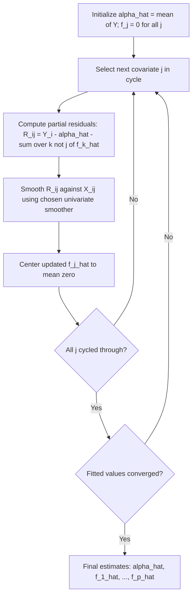

## Additive models

### Overview

An additive model (AM) is a semiparametric/nonparametric regression model in which the conditional mean of a response is modeled as a sum of unspecified univariate (or low-dimensional) smooth functions of the individual regressors, rather than a single multivariate smooth function. The generic additive model is:

$$Y = \alpha + \sum_{j=1}^{p} f_j(X_j) + \varepsilon$$

where $\alpha$ is an intercept, each $f_j(\cdot)$ is an unknown smooth (typically twice-differentiable) univariate function, $X_j$ is the $j$-th regressor, and $E[\varepsilon \mid X] = 0$. When the conditional distribution of $Y$ is modeled via a link function $h(\cdot)$ applied to a linear predictor, the extension is the **Generalized Additive Model (GAM)**:

$$h(E[Y\mid X]) = \alpha + \sum_{j=1}^p f_j(X_j)$$

### Motivation

**Key Points**

- Fully nonparametric multivariate regression $E[Y\mid X] = m(X_1,\ldots,X_p)$ suffers acutely from the **curse of dimensionality**: convergence rates for kernel/local polynomial estimators degrade as $n^{-2/(4+p)}$ (for twice-differentiable $m$), becoming impractically slow for even moderate $p$.
- Additive models sidestep this by restricting attention to functions that decompose additively across covariates. Each component $f_j$ is then estimable at the univariate nonparametric rate $n^{-2/5}$, **regardless of $p$** — this is the central appeal of the model class (Stone, 1985).
- Relative to a fully linear model, AMs allow flexible, data-driven nonlinearity in each covariate's effect while retaining the interpretability of additive, one-dimension-at-a-time effects (no forced linearity, but no uncontrolled interaction surface either).
- AMs are a compromise between fully nonparametric regression (flexible but high-dimensional and hard to estimate/interpret) and fully parametric regression (easy to estimate/interpret but risks functional-form misspecification).

### Identification

Because a constant can be shifted between $\alpha$ and any $f_j$, and because a linear trend in $X_j$ could be absorbed into either $f_j$ or an implicit slope, all additive components require **centering (location) normalization** for identification:

$$E[f_j(X_j)] = 0 \quad \text{for all } j = 1,\ldots,p$$

Equivalently, in the fitted sample, $\frac{1}{n}\sum_i \hat f_j(X_{ij}) = 0$. Under this normalization, $\alpha$ is identified as $E[Y]$ (estimated by $\bar Y$), and each $f_j$ is identified as a mean-zero function up to standard nonparametric regularity conditions (smoothness, sufficient variation in $X_j$, no perfect collinearity/concurvity among regressors — see below).

### Estimation Methods

#### 1. Backfitting Algorithm

The classical estimation method (Hastie and Tibshirani, 1990) is an iterative coordinate-descent-style procedure that exploits the fact that, holding all other $f_k$ fixed, the optimal $f_j$ solves a univariate smoothing problem on the **partial residuals**.

**Algorithm:**

1. Initialize $\hat\alpha = \bar Y$, and $\hat f_j^{(0)} \equiv 0$ for all $j$.
2. Cycle through $j = 1, \ldots, p$: compute partial residuals

   $$R_{ij} = Y_i - \hat\alpha - \sum_{k \neq j} \hat f_k(X_{ik})$$
3. Smooth $R_{ij}$ against $X_{ij}$ (using any univariate scatterplot smoother — kernel, local polynomial, smoothing spline) to obtain an updated $\hat f_j$.
4. Center the updated $\hat f_j$ (subtract its mean) to satisfy the identification constraint.
5. Repeat steps 2–4 (cycling over all $j$) until the estimates converge (e.g., until the change in fitted values falls below a tolerance).

**Key Points**

- Backfitting is a **Gauss–Seidel**-type algorithm; convergence is generally guaranteed under mild conditions but can be slow if regressors are highly correlated (**concurvity**, the nonparametric analogue of multicollinearity).
- Any univariate smoother can be "plugged in" at each step (kernel regression, local linear/polynomial regression, smoothing splines, regression splines), making backfitting a flexible, modular estimation framework.
- The final estimates depend on smoother choice and bandwidth/smoothing-parameter choice for each component, typically selected by cross-validation (often generalized cross-validation, GCV, for spline-based smoothers).

#### 2. Marginal Integration

An alternative to backfitting proposed by Linton and Nielsen (1995) and Tjøstheim and Auestad (1994), based on first estimating the full multivariate regression function $m(x)$ nonparametrically (e.g., via multivariate kernel regression) and then integrating out the other covariates:

$$f_j(x_j) = \int m(x_1,\ldots,x_p) \, \prod_{k\neq j} dF_k(x_k) - \text{const}$$

estimated empirically by averaging the multivariate kernel fit over the observed values of the other covariates. This approach yields explicit asymptotic theory (an asymptotic normal distribution with a known bias-variance expansion) but requires a preliminary multivariate smoothing step, which itself faces the curse of dimensionality (mitigated because only the bandwidth for the multivariate pilot estimate—not the final rate for $\hat f_j$—is affected).

#### 3. Penalized Regression Splines / Smoothing Splines (Penalized Least Squares)

Each $f_j$ is represented in a spline basis (e.g., B-splines, thin-plate regression splines, cubic smoothing splines) and the model is estimated by penalized least squares:

$$\min_{\alpha, f_1,\ldots,f_p} \sum_{i=1}^n \left[Y_i - \alpha - \sum_j f_j(X_{ij})\right]^2 + \sum_{j=1}^p \lambda_j \int \left[f_j''(x)\right]^2 dx$$

where $\lambda_j \geq 0$ is a smoothing parameter penalizing the roughness (curvature) of $f_j$; $\lambda_j \to \infty$ forces $f_j$ toward linearity, while $\lambda_j = 0$ yields an unpenalized (interpolating/rough) spline fit. This formulation underlies the modern implementation of GAMs (e.g., Wood's `mgcv` framework), where all $\lambda_j$ are chosen jointly via **generalized cross-validation (GCV)** or **restricted maximum likelihood (REML)**, treating the penalized spline as equivalent to a random-effects/mixed-model representation.

#### 4. Generalized Additive Models (GAM) via Penalized IRLS

For non-Gaussian responses, GAMs are estimated by combining **Iteratively Reweighted Least Squares (IRLS)** — as in GLM estimation — with a **backfitting/penalized-spline** step at each iteration:

1. Given current estimates, compute the working response (linearized pseudo-response) and iterative weights as in standard GLM IRLS.
2. Fit a weighted additive model (via penalized regression splines or weighted backfitting) to the working response.
3. Update the linear predictor and iterate until convergence.

This is the standard algorithm underlying software implementations such as R's `mgcv::gam()` and `gam::gam()`.

### Diagram: Backfitting Algorithm

### Diagram: Additive Structure vs. Fully Nonparametric (svg_diagram)

<svg xmlns="http://www.w3.org/2000/svg" viewBox="0 0 720 300">
<text x="360" y="25" font-size="16" font-weight="bold" text-anchor="middle" fill="#222">Additive Model Structure (svg_diagram)</text>
<rect x="30" y="60" width="120" height="50" rx="6" fill="#e8f0fe" stroke="#4285f4" stroke-width="1.5" />
<text x="90" y="90" font-size="12" text-anchor="middle" fill="#222">X1</text>
<rect x="30" y="130" width="120" height="50" rx="6" fill="#e8f0fe" stroke="#4285f4" stroke-width="1.5" />
<text x="90" y="160" font-size="12" text-anchor="middle" fill="#222">X2</text>
<rect x="30" y="200" width="120" height="50" rx="6" fill="#e8f0fe" stroke="#4285f4" stroke-width="1.5" />
<text x="90" y="230" font-size="12" text-anchor="middle" fill="#222">Xp</text>

<text x="200" y="235" font-size="20" text-anchor="middle" fill="#555">...</text>

<rect x="250" y="60" width="140" height="50" rx="6" fill="#fef3e0" stroke="#f4a742" stroke-width="1.5" />
<text x="320" y="90" font-size="12" text-anchor="middle" fill="#222">f1(X1) smooth</text>
<rect x="250" y="130" width="140" height="50" rx="6" fill="#fef3e0" stroke="#f4a742" stroke-width="1.5" />
<text x="320" y="160" font-size="12" text-anchor="middle" fill="#222">f2(X2) smooth</text>
<rect x="250" y="200" width="140" height="50" rx="6" fill="#fef3e0" stroke="#f4a742" stroke-width="1.5" />
<text x="320" y="230" font-size="12" text-anchor="middle" fill="#222">fp(Xp) smooth</text>
<line x1="150" y1="85" x2="250" y2="85" stroke="#555" stroke-width="1.5" marker-end="url(#arrow2)" />
<line x1="150" y1="155" x2="250" y2="155" stroke="#555" stroke-width="1.5" marker-end="url(#arrow2)" />
<line x1="150" y1="225" x2="250" y2="225" stroke="#555" stroke-width="1.5" marker-end="url(#arrow2)" />
<line x1="390" y1="85" x2="480" y2="150" stroke="#555" stroke-width="1.5" marker-end="url(#arrow2)" />
<line x1="390" y1="155" x2="480" y2="155" stroke="#555" stroke-width="1.5" marker-end="url(#arrow2)" />
<line x1="390" y1="225" x2="480" y2="160" stroke="#555" stroke-width="1.5" marker-end="url(#arrow2)" />
<circle cx="510" cy="155" r="30" fill="#e6f4ea" stroke="#34a853" stroke-width="1.5" />
<text x="510" y="150" font-size="16" text-anchor="middle" fill="#222">+</text>
<text x="510" y="167" font-size="10" text-anchor="middle" fill="#555">sum</text>
<line x1="540" y1="155" x2="600" y2="155" stroke="#555" stroke-width="1.5" marker-end="url(#arrow2)" />
<rect x="600" y="130" width="100" height="50" rx="6" fill="#fce8e6" stroke="#ea4335" stroke-width="1.5" />
<text x="650" y="160" font-size="12" text-anchor="middle" fill="#222">E[Y|X]</text>
</svg>

### Asymptotic Theory

**Key Points**

- Under standard smoothness assumptions (each $f_j$ twice continuously differentiable) and regularity conditions on the joint distribution of $X$, backfitting estimators $\hat f_j$ achieve the **univariate nonparametric convergence rate** $n^{-2/5}$ in terms of pointwise mean squared error — the same rate as if $X_j$ were the only regressor, i.e., additive models fully escape the curse of dimensionality for estimation of each component (in contrast to the $n^{-2/(4+p)}$ rate for fully nonparametric multivariate regression).
- Marginal integration estimators possess an established asymptotic normal distribution with explicit bias and variance expressions under standard bandwidth conditions, facilitating pointwise confidence intervals; [Inference] the practical finite-sample accuracy of these asymptotic approximations is sensitive to bandwidth and sample size, and bootstrap-based inference is commonly used as a robustness check.
- Backfitting's statistical properties (bias, variance, and the equivalence to a well-defined population projection) have been rigorously established (Opsomer and Ruppert, 1997; Mammen, Linton, and Nielsen, 1999) under conditions ensuring the backfitting operator is a contraction (related to bounding concurvity).

### Concurvity

**Key Points**

- **Concurvity** is the nonparametric analogue of multicollinearity: it arises when one covariate's effect can be approximately expressed as a smooth function of the other covariates (i.e., near-dependence among the $X_j$'s in a nonlinear sense).
- Concurvity inflates the variance of estimated component functions $\hat f_j$ and can slow or, in pathological cases, prevent convergence of the backfitting algorithm.
- Diagnosing concurvity typically involves regressing each smoothed covariate transformation against the others and examining the resulting $R^2$-like measure; [Inference] there is no single universally agreed diagnostic threshold, unlike the more standardized variance inflation factor (VIF) used for linear-model multicollinearity.

### Extensions

#### Generalized Additive Models (GAM)

$$g(\mu) = \alpha + \sum_j f_j(X_j), \quad \mu = E[Y\mid X]$$

with $g$ a known parametric link function (e.g., logit for binary $Y$, log for Poisson counts) — this nests **additive logistic regression**, **additive Poisson regression**, etc. Estimated via penalized IRLS as described above.

#### Additive Models with Interactions

Bivariate or low-dimensional smooth interaction terms can be added:

$$Y = \alpha + \sum_j f_j(X_j) + \sum_{j<k} f_{jk}(X_j, X_k) + \varepsilon$$

Each $f_{jk}$ is a bivariate smooth surface (e.g., a tensor-product spline or thin-plate spline), still estimated at a rate dictated by the *effective dimension* of that component (2, in the bivariate case), rather than the full dimension $p$ — this is the basis of the **functional ANOVA decomposition** underlying modern GAM software.

#### Generalized Additive Models for Location, Scale, and Shape (GAMLSS)

Extends GAMs by allowing not just the mean but also scale, skewness, and kurtosis parameters of the response distribution to depend additively (and nonparametrically) on covariates — useful when variance or higher moments are themselves functions of $X$ (heteroskedasticity, non-Gaussian shape).

#### Additive Models with Parametric Components (Semiparametric Additive Models)

$$Y = X^\top\gamma + \sum_j f_j(Z_j) + \varepsilon$$

combining a linear parametric index $X^\top\gamma$ with additive nonparametric components in a separate set of covariates $Z_j$ — a generalization of the **partially linear model**.

### Comparison with Related Methods

| Method | Functional Form Assumption | Handles $p$ Large? | Interpretability | Captures Interactions? |
| --- | --- | --- | --- | --- |
| Linear regression | Fully linear | Yes | High | No (unless specified) |
| Fully nonparametric regression | None (fully flexible) | No (curse of dimensionality) | Low | Yes (all orders) |
| Single-index model | Linear index + unknown link | Yes | Moderate (up to scale) | No (single index only) |
| Additive model (AM/GAM) | Additive, univariate smooth components | Yes | High (component-wise plots) | No (unless extended) |
| AM with interactions / GAM + tensor terms | Additive + low-order smooth interactions | Moderate | Moderate | Limited (specified low-order terms) |

### Practical Implementation Considerations

**Key Points**

- **Smoothing parameter selection**: generalized cross-validation (GCV), Akaike Information Criterion (AIC) variants, or REML (treating penalized splines as equivalent to random effects in a mixed model) are standard approaches; REML-based smoothness selection is the default in the widely used `mgcv` package in R and tends to be less prone to undersmoothing than GCV in some settings. [Unverified] Exact default behavior varies by software version; consult current documentation.
- **Basis choice for splines**: common choices include cubic regression splines, thin-plate regression splines, P-splines (penalized B-splines), and cyclic splines (for periodic covariates such as day-of-year).
- **Number of basis functions / knots**: typically set generously (with the penalty controlling effective smoothness) rather than tuned directly, following the "low-rank penalized spline" philosophy that separates basis dimension from effective degrees of freedom.
- **Model checking**: partial residual plots of $Y - \hat\alpha - \sum_{k\neq j}\hat f_k(X_k)$ against $X_j$ are the standard visual diagnostic for each component; concurvity diagnostics and checking effective degrees of freedom per term are also recommended.
- **Software**: [Unverified] exact function names, arguments, and defaults evolve across versions; commonly cited implementations include R's `mgcv::gam()` and `gam::gam()`, and Python's `pyGAM` and `statsmodels` (GAM support). Users should consult the current documentation for the specific package/version in use.

### Worked Example

**Example**

Consider modeling household electricity consumption $Y_i$ as a function of temperature ($T_i$), household income ($I_i$), and household size ($S_i$):

$$Y_i = \alpha + f_1(T_i) + f_2(I_i) + f_3(S_i) + \varepsilon_i$$

A linear model would force $f_1$ to be a straight line, missing the well-documented U-shaped relationship between temperature and electricity use (higher consumption for both heating in cold weather and cooling in hot weather). An additive model estimates $f_1$ nonparametrically, allowing it to reveal this U-shape directly, while still assuming income and household size act additively (without necessarily assuming these effects are linear either). Backfitting proceeds by:

1. Initializing $\hat f_1 = \hat f_2 = \hat f_3 = 0$, $\hat\alpha = \bar Y$.
2. Smoothing the partial residual $Y_i - \hat\alpha - \hat f_2(I_i) - \hat f_3(S_i)$ against $T_i$ to update $\hat f_1$ (typically revealing the U-shape).
3. Cycling similarly to update $\hat f_2$ and $\hat f_3$.
4. Iterating until convergence, then plotting each $\hat f_j$ against its covariate to interpret the shape of each effect separately.

### Related Topics / Next Steps

- Generalized Additive Models (GAM) for non-Gaussian responses (logistic, Poisson, etc.)
- Penalized regression splines and smoothing splines in depth
- Backfitting algorithm convergence theory and concurvity diagnostics
- Partially linear models and semiparametric additive models
- Functional ANOVA decomposition and tensor-product smooths for interactions
- GAMLSS (location, scale, and shape modeling)
- Single-index models (comparison of dimension-reduction strategies)
- Cross-validation and REML for smoothing parameter selection
- Bootstrap-based inference for nonparametric/semiparametric component estimates