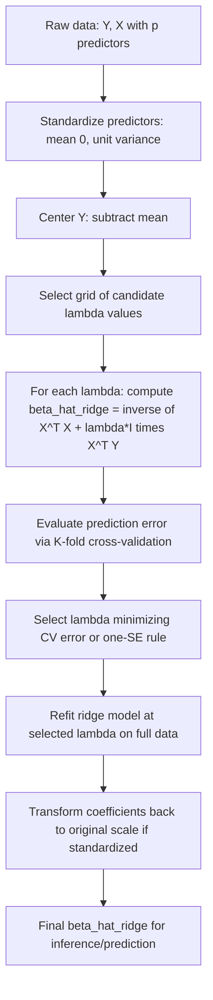

## Ridge regression

### Overview

Ridge regression is a penalized (regularized) least squares estimator for the linear regression model that shrinks coefficient estimates toward zero by adding an $L_2$-norm penalty on the coefficient vector to the ordinary least squares (OLS) objective function. It was introduced by Hoerl and Kennard (1970) as a remedy for multicollinearity and, more generally, as a bias–variance trade-off tool that can outperform OLS in mean squared error, particularly in high-dimensional or ill-conditioned settings.

Given the linear model $Y = X\beta + \varepsilon$, the ridge estimator solves:

$$\hat\beta^{\text{ridge}} = \arg\min_{\beta} \left\{ \sum_{i=1}^n (Y_i - X_i^\top\beta)^2 + \lambda \sum_{j=1}^p \beta_j^2 \right\} = \arg\min_\beta \left\{ \|Y - X\beta\|_2^2 + \lambda \|\beta\|_2^2 \right\}$$

where $\lambda \geq 0$ is the **tuning (penalty) parameter** controlling the amount of shrinkage.

### Closed-Form Solution

Because the ridge objective is a strictly convex quadratic function of $\beta$ (for $\lambda > 0$), it has a unique closed-form solution obtained by differentiating and setting the gradient to zero:

$$\hat\beta^{\text{ridge}} = (X^\top X + \lambda I_p)^{-1} X^\top Y$$

**Key Points**

- Adding $\lambda I_p$ to $X^\top X$ before inversion ensures $(X^\top X + \lambda I_p)$ is invertible even when $X^\top X$ is singular or near-singular (e.g., when $p > n$, or when regressors are perfectly/highly collinear) — this was the original motivating property in Hoerl and Kennard (1970).
- As $\lambda \to 0$, $\hat\beta^{\text{ridge}} \to \hat\beta^{\text{OLS}}$ (when OLS is well-defined).
- As $\lambda \to \infty$, $\hat\beta^{\text{ridge}} \to 0$ (complete shrinkage toward the origin).
- Ridge regression **does not perform variable selection**: for finite $\lambda$, coefficients are shrunk but generically remain nonzero (in contrast to the lasso, which can produce exact zeros).

### Standardization Requirement

**Key Points**

- Because the $L_2$ penalty $\sum_j \beta_j^2$ is not invariant to the scale of the regressors, it is standard practice to **standardize** all predictors (mean zero, unit variance) before fitting ridge regression, so that the penalty applies comparably across coefficients regardless of the original measurement units of each $X_j$.
- The intercept $\beta_0$ is typically **not penalized** and is estimated separately (e.g., by centering $Y$ and each $X_j$ to have mean zero, fitting the penalized model without an intercept, then recovering $\hat\beta_0 = \bar Y$).
- Coefficients estimated on the standardized scale must be transformed back to the original scale for interpretation if standardization was applied.

### Bayesian Interpretation

Ridge regression has an exact correspondence to the posterior mode under a Gaussian (normal) prior on $\beta$ in a Bayesian linear model with Gaussian errors:

$$Y \mid X, \beta \sim N(X\beta, \sigma^2 I_n), \qquad \beta \sim N(0, \tau^2 I_p)$$

The posterior mode (= posterior mean, by Gaussian conjugacy) of $\beta$ given $Y$ is:

$$\hat\beta^{\text{Bayes}} = (X^\top X + \tfrac{\sigma^2}{\tau^2} I_p)^{-1} X^\top Y$$

which coincides exactly with the ridge estimator under $\lambda = \sigma^2/\tau^2$. This provides an interpretation of $\lambda$ as encoding the relative strength of prior belief that coefficients are close to zero, and explains why ridge regression is sometimes described as "shrinking coefficients toward a Gaussian prior centered at zero."

### Geometric / Constrained Optimization Interpretation

The penalized form has an equivalent constrained-optimization formulation (by Lagrangian duality):

$$\hat\beta^{\text{ridge}} = \arg\min_\beta \|Y - X\beta\|_2^2 \quad \text{subject to} \quad \|\beta\|_2^2 \leq t$$

for some $t \geq 0$ in one-to-one correspondence with $\lambda$ (larger $\lambda$ corresponds to smaller $t$). Geometrically, the OLS solution is projected onto the boundary of an $L_2$-ball of radius $\sqrt{t}$ (a **sphere**) — the smooth, round shape of this constraint region is the key geometric reason ridge coefficients shrink smoothly toward zero without hitting exact zero (unlike the lasso's polyhedral $L_1$-ball, whose corners intersect the axes).

### Diagram: Ridge vs. Lasso Constraint Regions (svg_diagram)

<svg viewBox="0 0 640 320" xmlns="http://www.w3.org/2000/svg">
<text x="320" y="25" font-size="16" font-weight="bold" text-anchor="middle" fill="#222">Constraint Regions: Ridge vs. Lasso (svg_diagram)</text>

<text x="150" y="55" font-size="13" text-anchor="middle" fill="#222">Ridge (L2 penalty)</text>

<line x1="40" y1="180" x2="260" y2="180" stroke="#999" stroke-width="1"/>

<line x1="150" y1="70" x2="150" y2="290" stroke="#999" stroke-width="1"/>

<circle cx="150" cy="180" r="80" fill="`#e8f0fe`" stroke="`#4285f4`" stroke-width="2"/>

<text x="150" y="185" font-size="10" text-anchor="middle" fill="`#4285f4`">circle: sum beta_j^2 <= t</text>

<ellipse cx="200" cy="150" rx="90" ry="55" fill="none" stroke="#ea4335" stroke-width="1.5" transform="rotate(20 200 150)"/>
<circle cx="230" cy="120" r="3" fill="#ea4335"/>
<text x="245" y="115" font-size="10" fill="#ea4335">OLS estimate</text>
<circle cx="180" cy="150" r="3" fill="#34a853"/>
<text x="60" y="205" font-size="10" fill="#34a853">ridge_hat (tangent point)</text>

<text x="480" y="55" font-size="13" text-anchor="middle" fill="#222">Lasso (L1 penalty)</text>

<line x1="370" y1="180" x2="590" y2="180" stroke="#999" stroke-width="1"/>

<line x1="480" y1="70" x2="480" y2="290" stroke="#999" stroke-width="1"/>

<polygon points="480,100 560,180 480,260 400,180" fill="`#e8f0fe`" stroke="`#4285f4`" stroke-width="2"/>

<text x="480" y="185" font-size="10" text-anchor="middle" fill="`#4285f4`">diamond: sum |beta_j| <= t</text>

<ellipse cx="530" cy="150" rx="90" ry="55" fill="none" stroke="#ea4335" stroke-width="1.5" transform="rotate(20 530 150)"/>
<circle cx="560" cy="120" r="3" fill="#ea4335"/>
<text x="575" y="115" font-size="10" fill="#ea4335">OLS estimate</text>
<circle cx="480" cy="100" r="3" fill="#34a853"/>
<text x="420" y="90" font-size="10" fill="#34a853">lasso_hat (at corner, beta_1=0)</text>

<defs></defs>

</svg>

### Statistical Properties

#### Bias

$$E[\hat\beta^{\text{ridge}}] = (X^\top X + \lambda I_p)^{-1} X^\top X \, \beta_0 \neq \beta_0 \quad \text{for } \lambda > 0$$

Ridge regression is **biased** for any $\lambda > 0$ (unlike OLS, which is unbiased under standard exogeneity assumptions). The bias grows monotonically with $\lambda$.

#### Variance

$$\text{Var}(\hat\beta^{\text{ridge}}) = \sigma^2 (X^\top X + \lambda I_p)^{-1} X^\top X (X^\top X + \lambda I_p)^{-1}$$

This variance is smaller (in the positive semi-definite ordering) than the OLS variance $\sigma^2(X^\top X)^{-1}$ for all $\lambda > 0$, and variance is monotonically decreasing in $\lambda$.

#### Bias–Variance Trade-off and MSE Dominance

**Key Points**

- Hoerl and Kennard (1970) proved that there always exists some $\lambda > 0$ such that the ridge estimator has strictly lower mean squared error (MSE) than the OLS estimator, i.e., $\text{MSE}(\hat\beta^{\text{ridge}}(\lambda)) < \text{MSE}(\hat\beta^{\text{OLS}})$ for some range of $\lambda$ — this is the foundational theoretical justification for ridge regression.
- The optimal $\lambda$ minimizing MSE depends on the unknown true $\beta_0$ and $\sigma^2$, so it cannot be computed directly in practice and must be estimated (typically via cross-validation).
- Ridge is especially beneficial when regressors are highly collinear: multicollinearity inflates OLS variance dramatically (small eigenvalues of $X^\top X$ lead to large elements of $(X^\top X)^{-1}$), while the added $\lambda I_p$ term stabilizes these small eigenvalues directly.

### Singular Value Decomposition (SVD) View

Writing $X = UDV^\top$ (the singular value decomposition, with $D = \text{diag}(d_1,\ldots,d_p)$ the singular values), the ridge fitted values are:

$$X\hat\beta^{\text{ridge}} = \sum_{j=1}^p u_j \left(\frac{d_j^2}{d_j^2 + \lambda}\right) u_j^\top Y$$

**Key Points**

- Ridge regression shrinks each principal component direction of $X$ by the factor $\frac{d_j^2}{d_j^2+\lambda} \in (0,1)$, with **greater shrinkage applied to directions with smaller singular values** $d_j$ (i.e., directions in which the data carry less information / higher-variance OLS directions).
- This connects ridge regression closely to **principal components regression**: both address ill-conditioning by down-weighting low-variance directions of $X$, though ridge does so smoothly (continuously across all directions) rather than by hard truncation.

### Effective Degrees of Freedom

Ridge regression's "effective" model complexity is quantified by:

$$\text{df}(\lambda) = \text{tr}\left[X(X^\top X + \lambda I_p)^{-1}X^\top\right] = \sum_{j=1}^p \frac{d_j^2}{d_j^2 + \lambda}$$

This decreases continuously from $p$ (at $\lambda=0$, equivalent to OLS, assuming $X$ full column rank) to $0$ (as $\lambda \to \infty$), providing an interpretable, continuous measure of model complexity as a function of $\lambda$, used in some information-criterion-based tuning approaches (e.g., a ridge-adapted $C_p$ or AIC using $\text{df}(\lambda)$ in place of $p$).

### High-Dimensional Setting ($p > n$)

**Key Points**

- When $p > n$, $X^\top X$ is rank-deficient (rank at most $n$) and singular, so OLS is not unique/well-defined; ridge regression remains well-defined and unique for any $\lambda > 0$ because $X^\top X + \lambda I_p$ is invertible regardless of the relationship between $n$ and $p$.
- This makes ridge regression a standard baseline/benchmark method in high-dimensional statistics, genomics (e.g., gene expression data with $p \gg n$), and other "wide data" settings.
- Ridge regression can also be computed efficiently in the $p > n$ regime using the identity:

  $$\hat\beta^{\text{ridge}} = X^\top(XX^\top + \lambda I_n)^{-1} Y$$

  which requires inverting an $n \times n$ matrix rather than a $p \times p$ matrix — computationally advantageous when $n \ll p$.

### Choosing the Tuning Parameter $\lambda$

**Key Points**

- **K-fold cross-validation** is the standard data-driven approach: for a grid of candidate $\lambda$ values, fit ridge regression on $K-1$ folds and evaluate prediction error (typically mean squared error) on the held-out fold; select $\lambda$ minimizing average cross-validated error (the "$\lambda_{\min}$" rule), or a more parsimonious $\lambda$ within one standard error of the minimum (the "one-standard-error rule," common in the `glmnet` implementation).
- **Generalized Cross-Validation (GCV)**: an efficient approximation to leave-one-out cross-validation that avoids refitting the model $n$ times, using the effective degrees of freedom formula above.
- **Information criteria**: AIC/BIC-type criteria adapted using $\text{df}(\lambda)$ can also be used, though cross-validation is more common in modern applied practice.
- **Ridge trace**: Hoerl and Kennard's original graphical heuristic — plotting each $\hat\beta_j^{\text{ridge}}(\lambda)$ against $\lambda$ and choosing the smallest $\lambda$ beyond which coefficient estimates appear to stabilize. [Inference] This method is largely historical/pedagogical; cross-validation-based tuning is standard in contemporary applied work.

### Diagram: Coefficient Shrinkage Path (svg_diagram)

<svg xmlns="http://www.w3.org/2000/svg" viewBox="0 0 640 300">
<text x="320" y="25" font-size="16" font-weight="bold" text-anchor="middle" fill="#222">Ridge Coefficient Paths vs. log(lambda) (svg_diagram)</text>
<line x1="60" y1="260" x2="580" y2="260" stroke="#333" stroke-width="1.5" />
<line x1="60" y1="260" x2="60" y2="50" stroke="#333" stroke-width="1.5" />
<text x="320" y="285" font-size="12" text-anchor="middle" fill="#333">log(lambda) increasing -&gt;</text>
<text x="30" y="150" font-size="12" text-anchor="middle" fill="#333" transform="rotate(-90 30 150)">beta_j_hat</text>
<path d="M 80,80 C 200,90 350,180 560,255" fill="none" stroke="#4285f4" stroke-width="2" />
<path d="M 80,120 C 200,140 350,210 560,258" fill="none" stroke="#ea4335" stroke-width="2" />
<path d="M 80,60 C 200,80 350,190 560,256" fill="none" stroke="#34a853" stroke-width="2" />
<path d="M 80,180 C 200,190 350,225 560,259" fill="none" stroke="#f4a742" stroke-width="2" />

<text x="590" y="255" font-size="10" fill="#333">0</text>

<text x="65" y="45" font-size="10" fill="#333">all beta_j -&gt; 0 as lambda -&gt; infinity</text>

</svg>

### Comparison with Related Regularization Methods

| Method | Penalty | Variable Selection | Handles $p>n$ | Closed-Form Solution |
| --- | --- | --- | --- | --- |
| OLS | None | No | No | Yes (if $X^\top X$ invertible) |
| Ridge | $\lambda\sum\beta_j^2$ ($L_2$) | No | Yes | Yes |
| Lasso | $\lambda\sum | \beta_j | $ ($L_1$) | Yes (sparse solutions) |
| Elastic Net | $\lambda_1\sum | \beta_j | + \lambda_2\sum\beta_j^2$ | Yes |
| Principal Components Regression | Implicit (hard truncation of components) | No (component selection) | Yes | Yes (given number of components) |

### Practical Implementation Considerations

**Key Points**

- **Standardize predictors** before fitting (see above); most software implementations do this internally by default and report coefficients on the original scale, but conventions vary — [Unverified] the exact default standardization behavior depends on the specific software package and version in use.
- **Do not penalize the intercept**; standard implementations handle this automatically by centering $Y$ and $X$.
- **Software**: [Unverified] exact function signatures, default behaviors (e.g., whether $\lambda$ or its inverse is parameterized, whether coefficients are on the standardized or original scale), and available options change across versions; commonly cited implementations include R's `glmnet` package (`alpha = 0` for pure ridge) and `MASS::lm.ridge()`, and Python's `sklearn.linear_model.Ridge`. Consult current documentation for the exact syntax, parameterization of $\lambda$, and default settings.
- **Computational cost**: for a single $\lambda$, ridge regression costs $O(p^3)$ (or $O(n^3)$ via the alternate identity when $p>n$) for the matrix inversion; efficient path algorithms can compute solutions across a grid of $\lambda$ values without repeating the full inversion each time (leveraging the SVD of $X$ computed once).

### Worked Example

**Example**

Suppose a researcher regresses house prices on 10 highly correlated structural characteristics (square footage, number of rooms, lot size, etc.), where several predictors have pairwise correlations above 0.9. OLS produces wildly unstable coefficient estimates with signs that flip when small changes are made to the sample (a classic symptom of multicollinearity, reflected in a poorly conditioned $X^\top X$ with near-zero eigenvalues).

1. Standardize all 10 predictors to mean zero, unit variance.
2. Fit ridge regression across a grid of $\lambda$ values from very small to very large (e.g., $\lambda \in \{0.01, 0.1, 1, 10, 100, 1000\}$, often on a log scale).
3. Use 10-fold cross-validation to compute average out-of-sample MSE for each $\lambda$.
4. Select $\hat\lambda$ minimizing cross-validated MSE (or via the one-standard-error rule for a more parsimonious/stable model).
5. Refit ridge regression at $\hat\lambda$ on the full dataset to obtain final, more stable coefficient estimates — no longer flipping sign under small perturbations, though now biased toward zero relative to (unstable) OLS.

### Diagram: Ridge Regression Estimation Workflow

### Advantages and Limitations

**Key Points**

Advantages:

- Handles multicollinearity by stabilizing near-singular $X^\top X$.
- Well-defined and unique even when $p > n$.
- Can achieve strictly lower MSE than OLS via the bias–variance trade-off.
- Computationally simple: closed-form solution, no iterative optimization required for a fixed $\lambda$.
- Smooth, differentiable penalty makes theoretical analysis (bias, variance, degrees of freedom) tractable in closed form.

Limitations:

- Does not perform variable selection — all coefficients remain nonzero, which can hurt interpretability with many irrelevant predictors.
- Introduces bias, complicating causal/structural interpretation of coefficients (standard inferential theory, e.g., $t$-tests and confidence intervals from OLS, does not directly apply without adjustment).
- Requires choosing $\lambda$, introducing an additional layer of estimation uncertainty and a dependency on cross-validation procedure/fold structure.
- Sensitive to predictor scaling, requiring standardization as a preprocessing step.
- [Inference] In settings where the true underlying coefficient vector is genuinely sparse (only a few truly nonzero coefficients), lasso or elastic net may outperform ridge in both prediction and interpretability, since ridge's dense shrinkage does not match a sparse data-generating process.

### Related Topics / Next Steps

- Lasso regression and $L_1$ regularization
- Elastic net (combining $L_1$ and $L_2$ penalties)
- Principal components regression and partial least squares
- Bias–variance trade-off and MSE decomposition in estimation theory
- Cross-validation methodology (K-fold, leave-one-out, generalized CV)
- High-dimensional statistics: $p \gg n$ asymptotics and sparsity assumptions
- Bayesian linear regression and conjugate priors
- Ridge regression for generalized linear models (penalized IRLS)
- Post-selection inference and debiased/desparsified regularized estimators