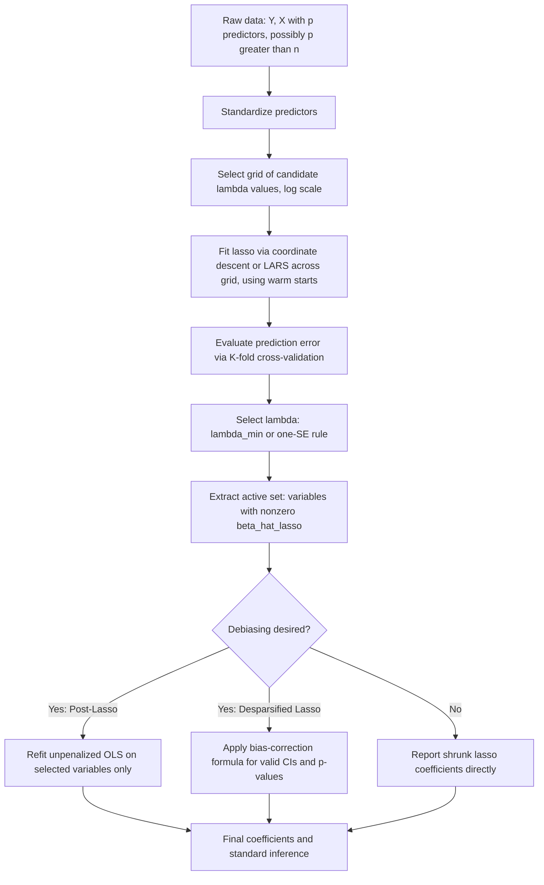

## LASSO and variable selection

### Overview

The Least Absolute Shrinkage and Selection Operator (LASSO), introduced by Tibshirani (1996), is a penalized least squares estimator for linear regression that adds an $L_1$-norm penalty on the coefficient vector to the ordinary least squares (OLS) objective. Unlike ridge regression's $L_2$ penalty, the $L_1$ penalty can shrink coefficients **exactly to zero**, making the lasso simultaneously a shrinkage estimator and an automatic variable-selection procedure.

$$\hat\beta^{\text{lasso}} = \arg\min_{\beta} \left\{ \sum_{i=1}^n (Y_i - X_i^\top\beta)^2 + \lambda \sum_{j=1}^p |\beta_j| \right\} = \arg\min_\beta \left\{ \|Y - X\beta\|_2^2 + \lambda \|\beta\|_1 \right\}$$

where $\lambda \geq 0$ is the tuning parameter controlling the strength of the penalty.

### Constrained Optimization Interpretation

Equivalent constrained form (by Lagrangian duality):

$$\hat\beta^{\text{lasso}} = \arg\min_\beta \|Y - X\beta\|_2^2 \quad \text{subject to} \quad \sum_{j=1}^p |\beta_j| \leq t$$

Geometrically, the $L_1$ constraint region is a **polytope** (a diamond in 2D, a cross-polytope in higher dimensions) with corners located on the coordinate axes. Because OLS contours (ellipses) are more likely to first touch this constraint region at a **corner** than at a face (a probability-one event under generic conditions), the lasso solution frequently sets one or more coefficients to exactly zero — this is the fundamental geometric reason the lasso performs variable selection while ridge regression does not (see the ridge-vs-lasso diagram logic in the ridge regression material for direct visual contrast).

### No Closed-Form Solution

**Key Points**

- Unlike ridge regression, the lasso objective is **not differentiable at $\beta_j = 0$** (due to the kink in $|\beta_j|$ at zero), so there is no general closed-form analytical solution for $\hat\beta^{\text{lasso}}$ when $p > 1$.
- **Exception**: in the special case of an orthonormal design ($X^\top X = I_p$), the lasso solution has a simple closed form via **soft-thresholding**:

  $$\hat\beta_j^{\text{lasso}} = \text{sign}(\hat\beta_j^{\text{OLS}}) \left( |\hat\beta_j^{\text{OLS}}| - \frac{\lambda}{2} \right)_+$$

  where $(z)_+ = \max(z,0)$. This closed form is the building block for the coordinate descent algorithm used in general (non-orthogonal) designs.
- For general $X$, the lasso must be computed via convex optimization algorithms: coordinate descent, Least Angle Regression (LARS), proximal gradient methods (ISTA/FISTA), or alternating direction method of multipliers (ADMM).

### Soft-Thresholding vs. Ridge Shrinkage (Comparison)

| Estimator | Shrinkage Rule (orthonormal design) | Produces exact zeros? |
| --- | --- | --- |
| OLS | $\hat\beta_j^{\text{OLS}}$ (no shrinkage) | No |
| Ridge | $\hat\beta_j^{\text{OLS}} / (1+\lambda)$ (proportional shrinkage) | No |
| Lasso | $\text{sign}(\hat\beta_j^{\text{OLS}})( | \hat\beta_j^{\text{OLS}} |
| Best subset selection | $\hat\beta_j^{\text{OLS}} \cdot \mathbb{1}( | \hat\beta_j^{\text{OLS}} |

**Key Points**

- Ridge shrinks all coefficients **proportionally** toward zero without setting any to exactly zero.
- Lasso applies **soft-thresholding**: coefficients below a threshold are set to exactly zero, and coefficients above the threshold are shrunk by a constant amount.
- Best subset selection applies **hard-thresholding**: coefficients above a threshold are left entirely unshrunk, and those below are set to zero — this is the (combinatorially expensive, NP-hard in general) benchmark that the lasso approximates efficiently via convex relaxation.

### Diagram: Thresholding Rules (svg_diagram)

<svg xmlns="http://www.w3.org/2000/svg" viewBox="0 0 640 300">
<text x="320" y="25" font-size="16" font-weight="bold" text-anchor="middle" fill="#222">Shrinkage Rules vs. OLS Coefficient (svg_diagram)</text>
<line x1="80" y1="150" x2="580" y2="150" stroke="#333" stroke-width="1" />
<line x1="330" y1="60" x2="330" y2="260" stroke="#333" stroke-width="1" />
<text x="590" y="155" font-size="11" fill="#333">beta_OLS</text>
<text x="330" y="275" font-size="11" text-anchor="middle" fill="#333">0</text>
<line x1="80" y1="260" x2="580" y2="60" stroke="#999" stroke-width="1" stroke-dasharray="4,3" />
<text x="500" y="90" font-size="10" fill="#999">45-degree (no shrinkage / OLS)</text>
<line x1="80" y1="210" x2="580" y2="110" stroke="#4285f4" stroke-width="2" />
<text x="480" y="115" font-size="10" fill="#4285f4">Ridge: proportional shrinkage</text>
<path d="M 80,225 L 300,150 L 330,150 L 360,150 L 580,75" stroke="#ea4335" stroke-width="2" fill="none" />
<text x="420" y="200" font-size="10" fill="#ea4335">Lasso: soft-threshold (flat zero zone)</text>
<path d="M 80,225 L 300,150 L 330,150 L 330,150 L 360,150 L 580,75" stroke="#34a853" stroke-width="2" fill="none" stroke-dasharray="2,2" />
<text x="130" y="255" font-size="10" fill="#34a853">Hard-threshold: jump (best subset)</text>
</svg>

### Estimation Algorithms

#### 1. Coordinate Descent

The dominant modern algorithm (Friedman, Hastie, and Tibshirani, 2010), underlying `glmnet`. Cycles through coordinates $j=1,\ldots,p$, updating each $\beta_j$ via soft-thresholding of the partial residual, holding all other coefficients fixed, and iterates to convergence:

$$\hat\beta_j \leftarrow \frac{S\left(\sum_i X_{ij}(Y_i - \hat Y_i^{(-j)}), \, \lambda/2\right)}{\sum_i X_{ij}^2}$$

where $S(z,\gamma) = \text{sign}(z)(|z|-\gamma)_+$ is the soft-thresholding operator and $\hat Y_i^{(-j)}$ is the fitted value excluding the contribution of predictor $j$. This is fast, scales well to large $p$, and is easily adapted to compute the full **regularization path** (solutions across a grid of $\lambda$ values) efficiently using warm starts.

#### 2. Least Angle Regression (LARS)

Efron, Hastie, Johnstone, and Tibshirani (2004) developed LARS as a computationally efficient algorithm that, with a simple modification, computes the **entire lasso solution path** exactly (not just at a grid of $\lambda$ values) in a number of steps comparable to the number of variables. LARS proceeds by adding variables to the active set incrementally, moving coefficients in a direction "equiangular" to the correlations of active predictors with the residual.

#### 3. Proximal Gradient Methods (ISTA / FISTA)

General-purpose convex optimization approaches applicable to the lasso and its many generalizations (e.g., group lasso, generalized lasso): iteratively take a gradient step on the smooth (squared-error) part of the objective, followed by a proximal (soft-thresholding) step for the nonsmooth $L_1$ penalty. FISTA (Fast ISTA, Beck and Teboulle, 2009) accelerates convergence using a momentum term.

### Statistical Properties

#### Bias

Like ridge, lasso is a **biased** estimator for any $\lambda > 0$. The soft-thresholding shrinkage biases nonzero coefficients toward zero even for variables correctly selected as nonzero, which has motivated debiasing procedures (see below).

#### Model Selection Consistency

**Key Points**

- Under the **irrepresentable condition** (a condition on the correlation structure between "relevant" and "irrelevant" predictors; Zhao and Yu, 2006) and appropriate scaling of $\lambda$ with $n$, the lasso is **sign-consistent**: it recovers the exact set of nonzero coefficients (and their correct signs) with probability tending to 1 as $n \to \infty$.
- If the irrepresentable condition fails (e.g., strong correlation between relevant and irrelevant predictors), the lasso may fail to achieve exact variable-selection consistency, even though it can still achieve good prediction accuracy.
- [Inference] The irrepresentable condition is a relatively strong, often untestable assumption in practice; applied researchers commonly treat lasso-based variable selection as a useful screening/exploratory tool rather than a guarantee of the "true" model, especially in observational (non-designed) data.

#### Prediction Consistency and Oracle Inequalities

Under weaker conditions (e.g., restricted eigenvalue conditions, compatibility conditions), the lasso achieves **prediction/estimation consistency** even when exact sign recovery fails, with non-asymptotic oracle inequalities bounding prediction error at rates comparable to knowing the true support size $s$ (the number of truly nonzero coefficients) in advance, typically of order $\frac{s \log p}{n}$ — the hallmark result justifying lasso's use in high-dimensional ($p \gg n$) settings under sparsity.

### The "Double Bias" Problem and Debiasing

**Key Points**

- Because lasso shrinks *all* coefficients (including those correctly identified as nonzero), standard practice for interpretation/inference often uses a **two-stage "Post-Lasso" or "LASSO + OLS" approach**: use lasso to select the active set of variables, then refit an unpenalized OLS regression on only the selected variables to remove the shrinkage bias for those coefficients (Belloni and Chernozhukov, 2013).
- **Debiased/desparsified lasso** (Zhang and Zhang, 2014; van de Geer et al., 2014; Javanmard and Montanari, 2014) provides an alternative approach that directly corrects the lasso estimator for bias, enabling asymptotically valid confidence intervals and hypothesis tests for individual coefficients even in high-dimensional settings — an active and important area connecting the lasso to modern high-dimensional inference theory.
- Standard lasso standard errors/confidence intervals (naively computed, e.g., via the bootstrap applied directly to $\hat\beta^{\text{lasso}}$) are generally **not valid** for inference because of the non-smooth selection event; this motivated the broader field of **post-selection inference**.

### Choosing the Tuning Parameter $\lambda$

**Key Points**

- **K-fold cross-validation** is standard: minimize average out-of-sample prediction error across folds over a grid of $\lambda$ (often on a log scale). The "$\lambda_{\min}$" rule picks the minimizer; the "one-standard-error rule" (common default in `glmnet`) picks the largest $\lambda$ whose CV error is within one standard error of the minimum, favoring a sparser, more parsimonious model.
- **Information criteria**: AIC, BIC, or extended BIC (adapted using the number of nonzero coefficients as the effective degrees of freedom) can also be used, particularly in settings emphasizing model selection over pure prediction accuracy.
- **Theoretically motivated choices**: for consistent variable selection under given assumptions, theory suggests $\lambda \asymp \sqrt{\log p / n}$ (up to constants depending on the noise variance and design), though practical implementations typically rely on cross-validation rather than plugging in theoretical constants directly.

### Extensions and Variants

#### Elastic Net

$$\hat\beta^{\text{EN}} = \arg\min_\beta \left\{\|Y-X\beta\|_2^2 + \lambda\left[\alpha\|\beta\|_1 + (1-\alpha)\|\beta\|_2^2\right]\right\}$$

Combines $L_1$ and $L_2$ penalties (Zou and Hastie, 2005), addressing two lasso limitations: (i) when $p > n$, the lasso can select at most $n$ variables; (ii) among groups of highly correlated predictors, the lasso tends to select only one variable somewhat arbitrarily, whereas the elastic net's ridge component encourages a "grouping effect," tending to select or shrink correlated predictors together.

#### Adaptive Lasso

$$\hat\beta^{\text{AL}} = \arg\min_\beta \left\{\|Y-X\beta\|_2^2 + \lambda \sum_j w_j |\beta_j|\right\}, \qquad w_j = 1/|\hat\beta_j^{\text{init}}|^\gamma$$

Zou (2006) proposed using data-dependent weights (typically from an initial OLS or ridge estimate) that penalize small initial coefficients more heavily, which can restore **oracle properties** (asymptotically correct variable selection AND asymptotically efficient/unbiased estimation of nonzero coefficients) under weaker conditions than plain lasso.

#### Group Lasso

For predictors naturally organized into groups (e.g., dummy variables for a categorical predictor, or basis functions for a nonparametric term):

$$\hat\beta^{\text{GL}} = \arg\min_\beta \left\{ \|Y-X\beta\|_2^2 + \lambda \sum_{g=1}^G \|\beta_g\|_2 \right\}$$

The group lasso (Yuan and Lin, 2006) selects or excludes entire groups of coefficients together, using an $L_2$ penalty within each group but an $L_1$-like (sum of norms) structure across groups.

#### Fused Lasso / Generalized Lasso

Adds a penalty on differences between adjacent coefficients (e.g., $\lambda_2 \sum_j |\beta_j - \beta_{j-1}|$), useful for ordered features (time series, spatial data) where piecewise-constant coefficient structure is expected.

#### Square-Root Lasso

$$\hat\beta^{\text{sqrt-lasso}} = \arg\min_\beta \left\{\|Y-X\beta\|_2 + \lambda\|\beta\|_1\right\}$$

Uses the (unsquared) $L_2$ norm of residuals, which makes the theoretically optimal choice of $\lambda$ **independent of the unknown noise variance** $\sigma^2$ (Belloni, Chernozhukov, and Wang, 2011) — practically useful because $\sigma^2$ is typically unknown and difficult to estimate reliably in high dimensions.

### Diagram: LASSO Estimation and Post-Selection Workflow

### Comparison: LASSO vs. Ridge vs. Elastic Net vs. Best Subset

| Property | Ridge | Lasso | Elastic Net | Best Subset |
| --- | --- | --- | --- | --- |
| Penalty | $L_2$ | $L_1$ | $L_1 + L_2$ | $L_0$ (count of nonzero coefficients) |
| Variable selection | No | Yes | Yes | Yes |
| Handles $p > n$ | Yes | Yes (selects at most $n$ variables alone) | Yes | Computationally, only for small $p$ |
| Grouping effect (correlated predictors) | Shrinks together | Selects one arbitrarily | Shrinks/selects together | N/A |
| Closed-form solution | Yes | No | No | No (combinatorial, NP-hard) |
| Computational cost | Low ($O(p^3)$ or $O(n^3)$) | Moderate (coordinate descent/LARS) | Moderate | Very high (exponential in $p$) unless approximated |

### Practical Implementation Considerations

**Key Points**

- **Standardize predictors** before fitting (as with ridge), since the $L_1$ penalty is scale-dependent; most software standardizes internally by default and reports coefficients on the original scale, but conventions vary by package.
- **Do not penalize the intercept**; handled by centering as in ridge.
- **Correlated predictors**: be aware that the lasso can be unstable in variable selection under high correlation (which variable gets selected among a correlated group can change with small data perturbations) — the elastic net or repeated resampling/**stability selection** (Meinshausen and Bühlmann, 2010) are common remedies for more robust variable-selection summaries.
- **Software**: [Unverified] exact function names, default $\alpha$/$\lambda$ parameterizations, and standardization defaults evolve across versions; commonly cited implementations include R's `glmnet` (`alpha = 1` for pure lasso), Python's `sklearn.linear_model.Lasso` and `LassoCV`, and specialized packages for debiased lasso (e.g., R's `hdi`). Consult current documentation for exact syntax and defaults.
- **Warm starts and path algorithms**: computing the lasso across a full grid of $\lambda$ is far more efficient using warm starts (initializing each fit from the solution at the adjacent $\lambda$) than fitting each $\lambda$ independently from scratch — standard in `glmnet` and similar implementations.

### Worked Example

**Example**

A researcher has gene expression data with $p = 5{,}000$ genes measured on $n = 200$ patients, aiming to identify which genes predict a continuous disease severity score, under the assumption that only a small number of genes are truly relevant (sparsity).

1. Standardize all 5,000 gene-expression predictors.
2. Fit lasso via coordinate descent across a log-scaled grid of $\lambda$ from very large (all coefficients zero) to very small (near-OLS, infeasible here since $p \gg n$).
3. Use 10-fold cross-validation to select $\hat\lambda$ (e.g., via the one-standard-error rule, favoring a sparser and more interpretable/robust gene set).
4. Extract the active set — say, 15 genes with nonzero $\hat\beta_j^{\text{lasso}}$ at $\hat\lambda$.
5. To obtain approximately unbiased effect-size estimates and valid inference for these 15 genes, refit unpenalized OLS using only these 15 selected predictors (Post-Lasso), or apply a desparsified lasso procedure for formal $p$-values/confidence intervals.
6. Interpret the 15 selected genes as candidate biomarkers for further experimental validation, while noting that lasso selection stability should ideally be checked via resampling (e.g., stability selection) before treating the selected set as definitive.

### Advantages and Limitations

**Key Points**

Advantages:

- Performs simultaneous shrinkage and variable selection in a single convex optimization problem.
- Computationally efficient and scalable to very high-dimensional data ($p$ in the thousands or more) via coordinate descent.
- Strong non-asymptotic theoretical guarantees (oracle inequalities) under sparsity and suitable design conditions.
- Produces sparse, more interpretable models compared to ridge when the true model is believed to be sparse.

Limitations:

- Selects at most $n$ variables when $p > n$ (a purely algebraic limitation of the optimization, addressed by the elastic net).
- Among groups of highly correlated predictors, tends to arbitrarily select one and zero out the others, which can be unstable and misleading for interpretation.
- Exact variable-selection consistency requires relatively strong, often untestable conditions (e.g., the irrepresentable condition).
- Naive inference (standard errors, $p$-values, confidence intervals) on lasso-selected coefficients is invalid without post-selection correction, due to the non-smooth, data-dependent nature of variable selection.
- [Inference] In dense-signal settings (many small but nonzero true effects rather than a few large ones), ridge or elastic net often outperform pure lasso in prediction accuracy, since lasso's sparsity assumption is then poorly matched to the underlying data-generating process.

### Related Topics / Next Steps

- Ridge regression and $L_2$ regularization (direct comparison)
- Elastic net, adaptive lasso, and group lasso
- Least Angle Regression (LARS) algorithm in depth
- Post-selection inference and the debiased/desparsified lasso
- Stability selection and resampling-based variable-selection robustness
- Oracle inequalities and restricted eigenvalue/compatibility conditions in high-dimensional theory
- Best subset selection and its modern mixed-integer optimization formulations
- Cross-validation methodology for tuning parameter selection
- High-dimensional statistics: sparsity, screening, and the $p \gg n$ regime
- Penalized generalized linear models (lasso-penalized logistic/Poisson regression)