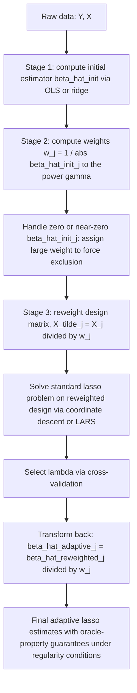

## Elastic net and adaptive LASSO

### Overview

Elastic net and adaptive lasso are both extensions of the lasso designed to address specific limitations of plain $L_1$-penalized regression: the elastic net (Zou and Hastie, 2005) combines $L_1$ and $L_2$ penalties to handle correlated predictors and the $p>n$ selection cap, while the adaptive lasso (Zou, 2006) uses data-dependent, coefficient-specific penalty weights to restore theoretical properties (oracle properties) that the plain lasso lacks under general conditions.

### Elastic Net

#### Formulation

$$\hat\beta^{\text{EN}} = \arg\min_\beta \left\{ \|Y - X\beta\|_2^2 + \lambda\left[\alpha \|\beta\|_1 + (1-\alpha)\|\beta\|_2^2 \right] \right\}$$

where $\alpha \in [0,1]$ is the **mixing parameter** controlling the balance between the $L_1$ (lasso) and $L_2$ (ridge) penalties, and $\lambda \geq 0$ controls overall penalty strength.

**Key Points**

- $\alpha = 1$ recovers the pure lasso; $\alpha = 0$ recovers pure ridge regression; intermediate $\alpha$ blends both penalties.
- Some parameterizations instead write the penalty as $\lambda_1\|\beta\|_1 + \lambda_2\|\beta\|_2^2$ with two separate tuning parameters $(\lambda_1,\lambda_2)$; this is equivalent to the $(\lambda,\alpha)$ parameterization via $\lambda_1 = \lambda\alpha$ and $\lambda_2 = \lambda(1-\alpha)$. Conventions differ across software, so the exact parameterization should always be checked against current documentation.

#### Motivation: Why Combine $L_1$ and $L_2$?

**Key Points**

- **The $p>n$ selection cap**: the plain lasso can select **at most $\min(n,p)$ nonzero coefficients** — a purely algebraic consequence of the convex optimization geometry when $p > n$. The elastic net's ridge component removes this cap, allowing more than $n$ variables to be selected when justified by the data.
- **Grouping effect**: among highly correlated predictors, the plain lasso tends to arbitrarily select one variable from the group and zero out the rest, which is unstable (small data perturbations can flip which variable is selected) and can obscure interpretation when several correlated variables are all scientifically relevant. The ridge component encourages **correlated predictors to be selected or shrunk together, with similar coefficient magnitudes** — this is the defining "grouping effect" of the elastic net.
- **Improved prediction under correlation**: empirically and theoretically, the elastic net often achieves better out-of-sample prediction accuracy than the plain lasso when predictors are highly correlated, because the ridge penalty stabilizes the estimation of correlated coefficients that the lasso alone would treat unstably.

#### Geometric Interpretation

The elastic net penalty's constraint region is a shape intermediate between the lasso's polytope (diamond) and ridge's sphere — a "rounded diamond" with singularities (corners, enabling sparsity) at the vertices but a convex, slightly bulging boundary along the edges (encouraging grouping of correlated coefficients), rather than the lasso's perfectly flat polytope faces.

### Diagram: Elastic Net Constraint Region vs. Ridge and Lasso (svg_diagram)

<svg viewBox="0 0 640 300" xmlns="http://www.w3.org/2000/svg">
<text x="320" y="25" font-size="16" font-weight="bold" text-anchor="middle" fill="#222">Constraint Region Shapes (svg_diagram)</text>

<text x="120" y="55" font-size="12" text-anchor="middle" fill="#222">Ridge (alpha=0)</text>

<line x1="40" y1="170" x2="200" y2="170" stroke="#999" stroke-width="1"/>

<line x1="120" y1="90" x2="120" y2="250" stroke="#999" stroke-width="1"/>

<circle cx="120" cy="170" r="65" fill="`#e8f0fe`" stroke="`#4285f4`" stroke-width="2"/>

<text x="320" y="55" font-size="12" text-anchor="middle" fill="#222">Elastic Net (0<alpha<1)</text>

<line x1="240" y1="170" x2="400" y2="170" stroke="#999" stroke-width="1"/>

<line x1="320" y1="90" x2="320" y2="250" stroke="#999" stroke-width="1"/>

<path d="M 320,105 C 370,105 385,150 385,170 C 385,190 370,235 320,235 C 270,235 255,190 255,170 C 255,150 270,105 320,105 Z" fill="`#fef3e0`" stroke="`#f4a742`" stroke-width="2"/>

<text x="520" y="55" font-size="12" text-anchor="middle" fill="#222">Lasso (alpha=1)</text>

<line x1="440" y1="170" x2="600" y2="170" stroke="#999" stroke-width="1"/>

<line x1="520" y1="90" x2="520" y2="250" stroke="#999" stroke-width="1"/>

<polygon points="520,105 585,170 520,235 455,170" fill="`#e6f4ea`" stroke="`#34a853`" stroke-width="2"/>

<text x="320" y="280" font-size="11" text-anchor="middle" fill="#555">Corners enable sparsity; curvature/flatness governs grouping behavior</text>

</svg>

#### Naive Elastic Net vs. Corrected Elastic Net

**Key Points**

- Zou and Hastie's original ("naive") elastic net estimator was shown to exhibit a **double shrinkage** problem: combining both penalties shrinks coefficients more than either alone, which can hurt prediction performance if uncorrected.
- The commonly implemented **corrected elastic net** rescales the naive solution by a factor of $(1+\lambda_2)$ (in the two-parameter notation) to undo the double shrinkage while retaining the grouping effect and sparsity properties: $\hat\beta^{\text{EN}} = (1+\lambda_2)\,\hat\beta^{\text{naive EN}}$.
- [Unverified] Whether a given software implementation applies this correction automatically, and the exact scaling convention used, depends on the specific package and version; consult current documentation.

#### Computation

The elastic net objective is a convex, piecewise-linear-plus-quadratic problem, efficiently solved by the same **coordinate descent** framework used for the lasso, with the per-coordinate update generalized to:

$$\hat\beta_j \leftarrow \frac{S\left(\sum_i X_{ij}(Y_i - \hat Y_i^{(-j)}), \, \lambda\alpha/2\right)}{\sum_i X_{ij}^2 + \lambda(1-\alpha)}$$

where $S(z,\gamma)$ is the soft-thresholding operator (as in the lasso). This generalization is the basis of the `glmnet` algorithm, which fits lasso, ridge, and elastic net within a single unified coordinate-descent framework by varying $\alpha$.

#### Tuning Parameters

**Key Points**

- The elastic net requires selecting **two** tuning parameters, $\lambda$ and $\alpha$ (or $\lambda_1,\lambda_2$), typically via a **two-dimensional cross-validation grid search**: for each candidate $\alpha$, compute the cross-validated error path over a grid of $\lambda$, then select the $(\alpha,\lambda)$ pair minimizing cross-validated prediction error (or applying a one-standard-error rule).
- This is computationally more expensive than tuning the single $\lambda$ of pure lasso or ridge, but remains tractable given coordinate descent's efficiency and the use of warm starts along each $\lambda$ path.
- In practice, a coarse grid for $\alpha$ (e.g., $\{0.1, 0.25, 0.5, 0.75, 0.9, 1\}$) combined with a finer $\lambda$ grid at each $\alpha$ is a common practical compromise. [Inference] The optimal grid density is data- and application-dependent, and no universal default is established across all use cases.

### Adaptive LASSO

#### Formulation

$$\hat\beta^{\text{AL}} = \arg\min_\beta \left\{ \|Y - X\beta\|_2^2 + \lambda \sum_{j=1}^p w_j |\beta_j| \right\}, \qquad w_j = \frac{1}{|\hat\beta_j^{\text{init}}|^{\gamma}}$$

where $\hat\beta^{\text{init}}$ is an initial consistent estimator of $\beta$ (commonly OLS when $p<n$, or ridge regression when $p \geq n$), and $\gamma > 0$ is a fixed constant (commonly $\gamma=1$).

**Key Points**

- The weights $w_j$ are **inversely proportional** to the magnitude of the initial coefficient estimates: variables with small initial estimated effect receive a **large** penalty weight (encouraging them toward exact zero), while variables with large initial estimated effect receive a **small** penalty weight (allowing them to remain largely unshrunk).
- This adaptivity directly targets the plain lasso's core weakness: uniform penalization of all coefficients regardless of their true magnitude, which forces a compromise between adequately shrinking noise variables and unnecessarily biasing large true effects.
- The adaptive lasso remains a **convex optimization problem** for fixed weights $w_j$ (since the weights are computed in a separate first stage and then held fixed), so it is computed with the same algorithms as the plain lasso (coordinate descent, LARS) applied to a reweighted design matrix $\tilde X_j = X_j / w_j$.

#### Oracle Properties

**Key Points**

- Fan and Li (2001) defined an estimator as having the **oracle property** if it (i) correctly identifies the true nonzero coefficients with probability tending to 1 (**selection consistency**) and (ii) achieves the same asymptotic distribution as the OLS estimator computed on the true (oracle-known) subset of relevant variables alone (**asymptotic efficiency/unbiasedness for nonzero coefficients**).
- Zou (2006) proved that the adaptive lasso possesses the oracle property under considerably weaker conditions than those required for the plain lasso to be sign-consistent (i.e., without needing the restrictive **irrepresentable condition**), provided the initial estimator $\hat\beta^{\text{init}}$ is root-$n$-consistent and $\lambda$ is scaled appropriately with $n$ (specifically, $\lambda_n/\sqrt{n} \to 0$ and $\lambda_n n^{(\gamma-1)/2} \to \infty$).
- This theoretical advantage — sparse, oracle-efficient estimation without the plain lasso's stringent design conditions — is the primary motivation for using the adaptive lasso when correct variable selection (rather than pure prediction accuracy) is the applied goal.

#### Two-Stage Procedure

1. **Stage 1**: compute an initial consistent estimator $\hat\beta^{\text{init}}$ (OLS if $p<n$ and well-conditioned; ridge regression, given ridge remains well-defined even for ill-conditioned or $p\geq n$ designs, is a common alternative first-stage estimator).
2. **Stage 2**: compute weights $w_j = 1/|\hat\beta_j^{\text{init}}|^\gamma$ (with a practical convention needed for $\hat\beta_j^{\text{init}} = 0$, e.g., setting $w_j$ to a very large finite value to force that coefficient to remain zero, since $1/0$ is undefined).
3. **Stage 3**: solve the weighted lasso problem using $w_j$ as fixed per-coefficient penalty multipliers, tuning the overall $\lambda$ via cross-validation as usual.

### Diagram: Adaptive Lasso Two-Stage Procedure

### Comparison: Elastic Net vs. Adaptive LASSO vs. Plain LASSO

| Property | Plain Lasso | Elastic Net | Adaptive Lasso |
| --- | --- | --- | --- |
| Penalty structure | Single $L_1$, uniform weight | $L_1 + L_2$, uniform weight | Weighted $L_1$, data-dependent weights |
| Addresses correlated predictors | No (arbitrary selection) | Yes (grouping effect) | Partially (depends on initial estimator's behavior under correlation) |
| Addresses $p>n$ selection cap | No | Yes | No (inherits lasso's cap, since it is a reweighted lasso) |
| Oracle property (selection consistency + efficiency) | Only under irrepresentable condition | [Inference] Generally requires conditions at least as strong as plain lasso's; not the primary design goal | Yes, under weaker conditions than plain lasso |
| Number of tuning parameters | 1 ($\lambda$) | 2 ($\lambda,\alpha$) | 1 ($\lambda$), plus choice of initial estimator and $\gamma$ |
| Requires a first-stage estimator | No | No | Yes |
| Convex optimization problem | Yes | Yes | Yes (for fixed weights) |

### Practical Implementation Considerations

**Key Points**

- **Elastic net**: standardize predictors as with lasso/ridge; tune $(\lambda,\alpha)$ via two-dimensional cross-validation; be aware of the naive-vs-corrected estimator distinction when interpreting coefficient magnitudes across software.
- **Adaptive lasso**: the choice of initial estimator matters — OLS is standard when $p<n$ and the design is reasonably well-conditioned, but **ridge regression is the more common and robust choice for the first stage when $p$ is large or predictors are collinear**, since OLS itself would be unstable or undefined in that regime; $\gamma=1$ is a common default, though other values (e.g., $\gamma=0.5$ or $\gamma=2$) appear in the literature.
- **Handling zero initial estimates**: since $w_j = 1/|\hat\beta_j^{\text{init}}|^\gamma$ is undefined at $\hat\beta_j^{\text{init}}=0$, implementations typically add a small numerical floor or explicitly assign a very large weight to such coefficients, effectively excluding them from the second-stage model.
- **Software**: [Unverified] neither elastic net nor adaptive lasso implementations are fully standardized in naming or parameterization across packages/versions; `glmnet` in R and Python's `sklearn.linear_model.ElasticNet`/`ElasticNetCV` are commonly cited for elastic net, while adaptive lasso is often implemented manually (as a two-stage procedure calling a standard lasso solver on a reweighted design) rather than via a dedicated built-in function, though some packages (e.g., R's `glmnet` via a `penalty.factor` argument, which directly supports per-coefficient weights) facilitate this. Consult current documentation for exact syntax and defaults.

### Worked Example

**Example**

Consider a marketing-mix model with $p=40$ advertising-channel spend variables (some highly correlated, e.g., "TV spend" and "cable spend" move together across regions), predicting sales, with $n=150$ observations.

**Elastic net approach**: because several channel-spend variables are highly correlated, a pure lasso might arbitrarily zero out "cable spend" while retaining "TV spend" (or vice versa) depending on minor data noise, an unstable and misleading result for a marketer trying to understand channel effectiveness. Fitting an elastic net with, say, $\alpha=0.5$ (found via 2D cross-validation) instead tends to retain both correlated channels with similar, moderately shrunk coefficients — a more stable and interpretable allocation of credit across correlated media channels.

**Adaptive lasso approach**: to prioritize correct identification of which channels have a genuinely nonzero effect (rather than just good prediction), fit an initial ridge regression across all 40 channels, compute weights inversely proportional to the ridge coefficient magnitudes, and refit a weighted lasso. Channels with small ridge coefficients (weak initial evidence of an effect) receive heavy penalization and are more aggressively driven to zero, while channels with strong initial ridge evidence are penalized lightly and retain close-to-OLS-sized effects, targeting the "oracle" set of truly relevant channels with reduced small-sample selection bias relative to plain lasso.

### Advantages and Limitations

**Key Points**

Elastic Net — Advantages:

- Removes the plain lasso's $p>n$ selection-count cap.
- Produces more stable variable selection and coefficient estimates under predictor correlation via the grouping effect.
- Often achieves superior out-of-sample prediction accuracy relative to pure lasso in correlated-predictor settings.

Elastic Net — Limitations:

- Requires tuning two parameters ($\lambda,\alpha$), increasing computational cost and the risk of overfitting the tuning process itself to a particular cross-validation split.
- The "naive" version's double-shrinkage problem requires a bias-correction step, and conventions for this correction are not perfectly uniform across software.
- Does not, by itself, restore oracle-property selection consistency under weak conditions the way the adaptive lasso does.

Adaptive Lasso — Advantages:

- Achieves the oracle property (correct selection + efficient estimation) under substantially weaker conditions than the plain lasso.
- Directly and interpretably down-weights the penalty for coefficients with strong initial evidence, addressing the plain lasso's uniform-penalty weakness.

Adaptive Lasso — Limitations:

- Requires a **consistent first-stage estimator**, which can itself be difficult or unstable to obtain in high dimensions (motivating the common but ad hoc practice of using ridge regression as the first stage).
- Inherits the plain lasso's $p>n$ selection-count cap (since the second stage is a reweighted lasso), unlike the elastic net.
- Adds an additional layer of estimator choice and hyperparameter ($\gamma$) that introduces its own sensitivity and researcher-degrees-of-freedom concerns.
- [Inference] The finite-sample performance advantage of the oracle property over plain lasso can be modest in practice, especially when the first-stage estimator is itself noisy (e.g., in genuinely high-dimensional, weak-signal settings), and depends heavily on how well-behaved the initial estimator is for the specific dataset at hand.

### Related Topics / Next Steps

- Lasso regression and $L_1$ regularization (foundational comparison)
- Ridge regression and $L_2$ regularization (foundational comparison)
- Oracle properties and the irrepresentable condition in variable-selection theory
- Group lasso and other structured-sparsity penalties
- Post-selection inference and the debiased/desparsified lasso
- Stability selection and resampling-based variable-selection robustness
- Cross-validation methodology for multi-parameter tuning
- SCAD and MCP penalties (alternative nonconvex approaches also achieving oracle properties)
- High-dimensional statistics: sparsity, screening, and the $p \gg n$ regime