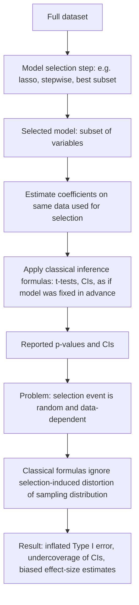
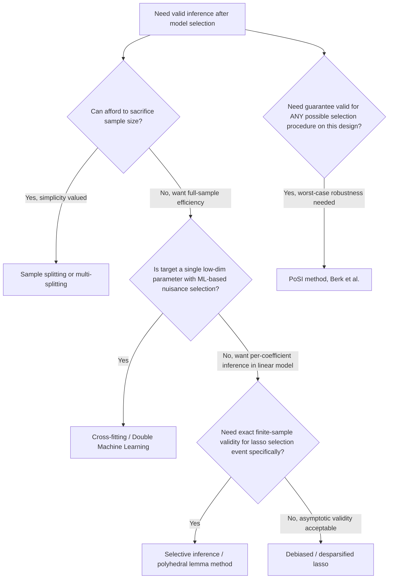

## Post-selection inference

### Overview

Post-selection inference (PoSI) refers to the body of statistical methodology addressing a fundamental problem: when a model (a set of variables, a functional form, or a specification) is **selected from the same data** used to estimate and perform inference on that model, standard inferential tools (confidence intervals, $p$-values, standard errors) computed **as if the model had been fixed in advance** are generally invalid — typically producing confidence intervals with actual coverage below their nominal level and hypothesis tests with inflated Type I error rates. Post-selection inference methods aim to restore valid inferential guarantees while still allowing data-driven model selection (e.g., via lasso, stepwise selection, or best subset selection).

### The Core Problem

**Key Points**

- Classical inference theory (e.g., the sampling distribution of the OLS estimator, and the resulting $t$-tests and confidence intervals) is derived **conditional on a fixed, pre-specified model**. It does not account for the randomness introduced by the model-selection step itself.
- When the same data are used both to select which variables enter the model and to estimate/test coefficients within that model, the selection event is a **random function of the data**, and conditioning on "the variables that happened to be selected" changes the sampling distribution of the resulting estimator in ways that classical formulas do not capture.
- This is sometimes summarized as the difference between the **unconditional** sampling distribution of an estimator (which averages over all possible model-selection outcomes) and the distribution **conditional on the particular selection event that occurred** — these generally differ, and it is the conditional distribution that governs the validity of inference on the specific model a researcher reports.
- The problem applies broadly: to stepwise regression, best subset selection, lasso-based selection, threshold-based screening, and even informal "researcher degrees of freedom" (e.g., trying several specifications and reporting the one that "looks best" or is most statistically significant).

### Illustrative Mechanism: Why Naive Inference Fails

**Key Points**

- Consider selecting a variable for inclusion in a model **because** it had a large estimated coefficient or a small $p$-value in a preliminary screen. Conditional on having been selected this way, that variable's estimated coefficient is **biased away from zero** (a **selection bias** or **winner's curse** effect) relative to its coefficient in a model where it was included regardless of its estimated magnitude.
- Equivalently, treating the post-selection $t$-statistic as following a standard $t$ or normal distribution (as it would under a model fixed in advance) ignores that the very act of conditioning on selection **truncates and distorts** the relevant reference distribution — the correct reference distribution is the sampling distribution *conditional on the selection event*, which is generally not a standard $t$ or normal distribution.
- This produces the empirically well-documented phenomenon that naive confidence intervals reported after model selection (e.g., "the model chosen by stepwise regression" or "the lasso-selected variables, refit by OLS") have **actual coverage substantially below the nominal level** (e.g., a nominal 95% interval might have true coverage well below 95%), and reported effect sizes for selected variables tend to be inflated in magnitude.

### Diagram: The Post-Selection Inference Problem

### Approaches to Valid Post-Selection Inference

#### 1. Sample Splitting

**Key Points**

- The conceptually simplest solution: split the data into two independent parts. Use one part (e.g., half the sample) exclusively for model selection, and the other part exclusively for estimation and inference on the selected model.
- Because the inference sample is independent of the selection sample, the selected model can be treated as **fixed** from the perspective of the inference sample, restoring the validity of classical inference formulas exactly.
- **Limitations**: reduces effective sample size for both selection and inference (potentially weakening the power of selection and precision of subsequent estimates); results can be sensitive to the particular random split used; a single split "wastes" information relative to using the full sample for both tasks. **Multi-splitting** (repeating the split many times and aggregating, e.g., via a suitable combination rule for $p$-values, as in Meinshausen, Meinshausen, and Bühlmann, 2009) mitigates split-sensitivity at additional computational cost.

#### 2. Sample Splitting with Cross-Fitting / Double Machine Learning

**Key Points**

- **Cross-fitting** (used across folds and swapping the roles of "selection" and "inference" samples, then averaging) recovers efficiency lost from a single split by using each observation for both tasks (on different folds), while preserving the independence needed for valid inference.
- This idea underlies the **Double/Debiased Machine Learning (DML)** framework (Chernozhukov et al., 2018), which combines cross-fitting with Neyman-orthogonal moment conditions (structured so that first-stage estimation error of nuisance parameters, e.g., from lasso-based variable selection, has a negligible effect on the asymptotic distribution of the parameter of interest) to obtain valid, $\sqrt{n}$-consistent, asymptotically normal inference for a low-dimensional target parameter even when high-dimensional nuisance functions are estimated via machine-learning/regularized methods as an intermediate step.

#### 3. Debiased / Desparsified Lasso

**Key Points**

- Developed independently by Zhang and Zhang (2014), van de Geer, Bühlmann, Ritov, and Dezeure (2014), and Javanmard and Montanari (2014), this approach directly corrects the lasso estimator's shrinkage bias using a bias-correction term based on a node-wise (or similarly constructed) approximate inverse of the design's Gram matrix:

  $$\hat b_j = \hat\beta_j^{\text{lasso}} + \frac{\hat z_j^\top (Y - X\hat\beta^{\text{lasso}})}{\hat z_j^\top X_j}$$

  (schematically; the exact construction of the projection direction $\hat z_j$ varies by method), producing an asymptotically normal, $\sqrt{n}$-consistent estimator $\hat b_j$ for each coefficient $\beta_j$, from which standard confidence intervals and $p$-values can be constructed even when $p$ is comparable to or larger than $n$, under a sparsity assumption on the true coefficient vector.
- **Advantage**: does not require sample splitting, using the full sample for both estimation and inference; directly targets individual-coefficient inference in high-dimensional linear (and, with extensions, generalized linear) models.
- **Limitation**: relies on the sparsity assumption and specific regularity conditions (e.g., restricted eigenvalue-type conditions on the design) for its asymptotic guarantees; [Inference] the practical accuracy of the resulting confidence intervals in moderate sample sizes and under real-data correlation structures is an active area of ongoing methodological refinement.

#### 4. Post-Lasso (Refit OLS on Selected Variables)

**Key Points**

- A common applied heuristic: use the lasso to select an active set of variables, then refit unpenalized OLS using only those variables, reporting standard OLS standard errors and confidence intervals from the refit.
- Belloni and Chernozhukov (2013) showed that Post-Lasso can perform at least as well as the lasso itself in terms of prediction/estimation rates under appropriate conditions, and removes the direct shrinkage bias for the selected coefficients.
- **Critical caveat**: Post-Lasso's OLS-based inference is still generally **not valid** in the classical sense, because the set of variables being conditioned on (the active set) was itself chosen using the same data — Post-Lasso addresses the *shrinkage bias* problem but does **not**, by itself, solve the *selection-conditional-inference* problem discussed above, unless combined with sample splitting, cross-fitting, or another formally valid PoSI correction.

#### 5. PoSI Method (Simultaneous/Universally Valid Inference)

**Key Points**

- Berk, Brown, Buja, Zhang, and Zhao (2013) introduced the "PoSI" framework, which constructs confidence intervals that are **simultaneously valid across every possible model that could have been selected** by any variable-selection procedure operating on the given design matrix $X$ — a conservative, "worst-case-over-selection-procedures" guarantee.
- This provides very general, procedure-agnostic validity (it does not need to know or assume the details of the selection algorithm used), but as a consequence tends to produce **wider, more conservative intervals** than methods tailored to a specific selection procedure (e.g., the lasso-specific polyhedral method below).
- Computationally, the original PoSI method's complexity grows rapidly with $p$, limiting practical use to moderate-dimensional settings; [Unverified] the current state of computational feasibility and available implementations should be checked against up-to-date software documentation.

#### 6. Selective Inference / Polyhedral Lemma (Lasso-Specific Conditional Inference)

**Key Points**

- Lee, Sun, Sun, and Taylor (2016) and related work (the broader "selective inference" literature, e.g., Taylor and Tibshirani) developed exact, finite-sample-valid conditional inference specifically for the lasso, exploiting the fact that the event "the lasso selects a particular active set with particular signs" can be characterized as a **polyhedral region** in the space of the outcome $Y$ (a set of linear inequalities on $Y$).
- Conditional on this polyhedral selection event, and under Gaussian errors with known (or estimated) variance, the relevant test statistic for a selected coefficient follows a **truncated normal distribution** (truncated to the polyhedral region), from which exact conditional $p$-values and confidence intervals can be derived — the **selective inference** framework.
- This approach is tailored to a specific, well-characterized selection procedure (the lasso, or other procedures inducing polyhedral or more general selection events) and can be less conservative than the fully generic PoSI method, at the cost of being procedure-specific and relying on distributional assumptions (commonly Gaussian errors, though extensions relax this).

### Comparison of Approaches

| Method | Uses full sample for inference? | Procedure-specific or generic? | Distributional assumptions | Typical use case |
| --- | --- | --- | --- | --- |
| Sample splitting | No (half sample) | Generic | Minimal (relies on independence from split) | Simple, robust baseline; any selection method |
| Cross-fitting / DML | Yes (via fold-swapping) | Generic (for a low-dim target parameter) | Neyman-orthogonality of moment conditions | Causal/structural parameter estimation with ML-based nuisance selection |
| Debiased/desparsified lasso | Yes | Lasso-specific (extends to related penalized estimators) | Sparsity, restricted eigenvalue-type conditions | High-dimensional linear/GLM coefficient inference |
| Post-Lasso (refit OLS) | Yes | Lasso-specific | None beyond standard OLS assumptions on the refit model (but does not fix the core selection problem) | Removing shrinkage bias only, not fixing selection bias |
| PoSI (Berk et al.) | Yes | Generic (any selection procedure) | Design-based, conservative | Worst-case/simultaneous guarantees, moderate $p$ |
| Selective inference (Lee et al.) | Yes | Lasso/polyhedral-selection-specific | Gaussian errors (extensions relax this) | Exact conditional inference tailored to lasso's selection event |

### Data-Splitting vs. Full-Sample Trade-off

**Key Points**

- There is a fundamental **efficiency–robustness trade-off** across these methods: sample splitting is the most broadly robust and conceptually simplest but sacrifices statistical power/precision by using only part of the data for each task; full-sample methods (debiased lasso, selective inference, PoSI) use all the data but rely on more specific structural or distributional assumptions to achieve validity.
- [Inference] There is no universally "best" method across all applications; the appropriate choice depends on sample size, the specific selection procedure used, tolerance for conservative (wide) intervals versus assumption-dependent (narrower but less robust) intervals, and whether the target of inference is a single coefficient, a set of coefficients, or a broader structural/causal parameter.

### Relation to Multiple Testing and the "Garden of Forking Paths"

**Key Points**

- Post-selection inference is conceptually related to, but distinct from, classical **multiple testing correction** (e.g., Bonferroni, false discovery rate control): multiple testing corrections typically address inflated error rates from testing many *pre-specified* hypotheses, whereas PoSI addresses inflated error rates from a *single* reported result that emerged from a *data-dependent* search over an implicit or explicit space of possible models.
- Gelman and Loken's "garden of forking paths" (2013) is a related informal framework describing how even a single analysis, without any formal multiple-testing procedure, can suffer from an analogous inferential distortion when the researcher's analytical choices (which variables to include, how to code them, which subgroup to examine) are contingent on patterns observed in the data — underscoring that the post-selection inference problem extends beyond formal algorithms like lasso or stepwise regression to general empirical practice.

### Practical Implementation Considerations

**Key Points**

- **Pre-registration and out-of-sample validation**: when feasible, pre-specifying the model (or the exact selection algorithm and its tuning parameters) before seeing the outcome data, or validating selected models on a genuinely held-out test set, sidesteps the formal post-selection inference problem entirely by ensuring the "selection" step and "inference" step are not both conducted on the same data used for the final reported inference.
- **Reporting practices**: when a selected model's coefficients are reported, it is standard best practice to explicitly state whether the accompanying standard errors/confidence intervals account for the selection process (e.g., via one of the methods above) or are naive post-selection OLS/lasso standard errors (which should be flagged as not formally valid for inference on the specific selected model).
- **Software**: [Unverified] exact function names, supported selection procedures, and default settings evolve across packages and versions; commonly cited implementations include R's `selectiveInference` package (for lasso-based selective inference), `hdi` (high-dimensional inference, including debiased lasso methods), and Python implementations of double/debiased machine learning (e.g., `DoubleML`). Consult current documentation for exact syntax, supported models, and assumptions required.

### Diagram: Decision Map for Choosing a PoSI Approach

### Worked Example

**Example**

A health economics researcher has $p=60$ candidate covariates (demographics, comorbidities, prior utilization measures) and wants to estimate the effect of a policy variable on healthcare spending, using lasso to select relevant controls from the 60 candidates before estimating the policy effect.

**Naive (invalid) approach**: fit lasso including the policy variable and all 60 controls, note which controls are selected, then refit OLS with the policy variable and only the selected controls, reporting the OLS standard error on the policy coefficient. This standard error does not account for the fact that the specific set of controls was chosen using the same data used to estimate the policy effect, and can understate the true uncertainty.

**Valid alternative (Double Machine Learning)**: (1) use cross-fitting — split the sample into $K$ folds; (2) on each training fold, use lasso to estimate the nuisance relationships (covariates predicting the outcome, and covariates predicting policy assignment/treatment) using regularized regression, deliberately allowing this first stage to use flexible machine-learning-based variable selection; (3) on the held-out fold, construct a Neyman-orthogonal residual-based moment condition combining both nuisance fits; (4) average the resulting orthogonalized estimating equation across folds to obtain a $\sqrt{n}$-consistent, asymptotically normal estimate of the policy effect with valid standard errors, robust to the specific variable-selection choices made by the lasso in the nuisance stage.

### Related Topics / Next Steps

- Lasso and variable selection (foundational context for the selection problem)
- Debiased/desparsified lasso in depth
- Double/Debiased Machine Learning (DML) and Neyman orthogonality
- Selective inference and the polyhedral lemma
- Sample splitting, cross-fitting, and cross-validation methodology
- Multiple testing correction (Bonferroni, false discovery rate) and its relation to PoSI
- The "garden of forking paths" and researcher degrees of freedom in applied research
- High-dimensional statistics: sparsity and restricted eigenvalue conditions
- Causal inference with high-dimensional controls (e.g., partialling-out approaches)