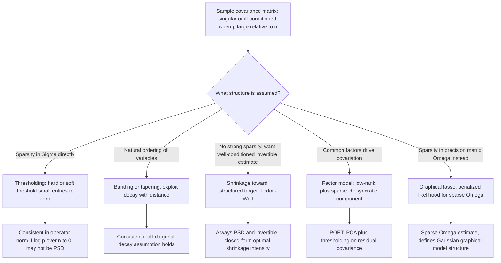

## High-dimensional covariance estimation

### Overview

High-dimensional covariance estimation concerns estimating the covariance matrix $\Sigma$ (or its inverse, the precision matrix $\Omega = \Sigma^{-1}$) of a $p$-dimensional random vector when the dimension $p$ is comparable to, or larger than, the sample size $n$. In this regime, the standard sample covariance matrix — the natural unbiased estimator in classical (fixed-$p$, $n\to\infty$) asymptotics — becomes a poor, often singular, and inconsistent estimator, motivating a range of regularization-based alternatives.

### The Sample Covariance Matrix and Why It Fails in High Dimensions

Given i.i.d. observations $X_1,\ldots,X_n \in \mathbb{R}^p$ with mean zero (or demeaned), the sample covariance matrix is:

$$\hat\Sigma = \frac{1}{n}\sum_{i=1}^n X_i X_i^\top$$

**Key Points**

- When $p > n$, $\hat\Sigma$ has rank at most $n$ and is therefore **singular** — it cannot be inverted, making it unusable directly for methods (e.g., linear discriminant analysis, Markowitz portfolio optimization, Gaussian graphical models) that require $\Sigma^{-1}$.
- Even when $p < n$ but $p/n$ is not negligible (i.e., $p$ grows proportionally with $n$), classical **random matrix theory** results (Marchenko–Pastur law) show that the eigenvalues of $\hat\Sigma$ are systematically **overdispersed** relative to the true eigenvalues of $\Sigma$: the largest sample eigenvalues are biased upward and the smallest are biased downward, even though $\hat\Sigma$ remains an unbiased estimator of $\Sigma$ entrywise ($E[\hat\Sigma] = \Sigma$).
- This eigenvalue distortion means that $\hat\Sigma$ (and especially $\hat\Sigma^{-1}$, which is far more sensitive to small eigenvalues) is a poor estimator of $\Sigma$ (or $\Omega$) in high dimensions **in matrix norm**, even though individual entries $\hat\Sigma_{jk}$ are each well-estimated in isolation — the accumulation of estimation error across $p^2$ entries is what causes the matrix-level breakdown.
- Consistency of $\hat\Sigma$ in operator/spectral norm generally requires $p/n \to 0$; when $p/n \to c > 0$ or $p \gg n$, $\hat\Sigma$ is **not** a consistent estimator of $\Sigma$ without additional structural assumptions.

### Structural Assumptions Enabling Consistent Estimation

Because unrestricted $p\times p$ covariance matrices have $O(p^2)$ free parameters — too many to estimate consistently from $n \ll p^2$ observations — essentially all high-dimensional covariance estimation methods impose a **structural assumption** that reduces the effective number of parameters. The major structural classes are:

1. **Sparsity** (in $\Sigma$ or, more commonly, in $\Omega = \Sigma^{-1}$): most entries are exactly or approximately zero.
2. **Low-rank / factor structure**: $\Sigma$ decomposes as a low-rank component (systematic/common factors) plus a diagonal or sparse component (idiosyncratic noise).
3. **Bandable/ordered structure**: entries decay as a function of the distance between indices (natural for time series or spatially ordered data).

### Method 1: Thresholding the Sample Covariance Matrix

**Key Points**

- Bickel and Levina (2008) proposed simply **thresholding** the entries of $\hat\Sigma$ toward zero, under the assumption that $\Sigma$ itself is (approximately) sparse:

  $$\hat\Sigma^{\text{thresh}}_{jk} = \hat\Sigma_{jk} \cdot \mathbb{1}(|\hat\Sigma_{jk}| > \tau)$$

  (hard thresholding), or a soft-thresholded/generalized shrinkage version.
- Under a sparsity assumption (each row/column of $\Sigma$ has at most $s$ nonzero off-diagonal entries) and with an appropriately chosen threshold $\tau$ (typically scaling with $\sqrt{\log p / n}$), the thresholded estimator is **consistent in operator norm** even when $p$ grows much faster than $n$ (specifically, consistency holds as long as $\log p / n \to 0$), a substantial improvement over the unregularized sample covariance matrix.
- **Limitation**: thresholding does not guarantee the resulting matrix $\hat\Sigma^{\text{thresh}}$ is **positive semi-definite**, which can be problematic for downstream applications (e.g., as a valid covariance matrix for simulation or portfolio variance calculations); positive-definite-preserving variants and projections exist but add complexity.

### Method 2: Banding and Tapering (Ordered/Structured Variables)

**Key Points**

- When variables have a natural ordering (e.g., time series lags, spatial distance), Bickel and Levina (2008) also proposed **banding**: setting $\hat\Sigma_{jk} = 0$ whenever $|j-k| > k_0$ for some bandwidth parameter $k_0$, exploiting an assumption that correlation decays with distance in the ordering.
- **Tapering** applies a smooth (rather than a hard cutoff) weighting function that decreases with $|j-k|$, generally yielding smoother, better-conditioned estimates than hard banding.
- These methods achieve consistency rates that depend on how quickly the true covariance matrix's off-diagonal entries decay with distance, and are natural for time-series covariance/autocovariance estimation but inapplicable when there is no meaningful ordering among the $p$ variables.

### Method 3: Shrinkage Estimators (Ledoit–Wolf and Related)

**Key Points**

- Ledoit and Wolf (2004) proposed shrinking the sample covariance matrix toward a structured, low-variance target (e.g., a scaled identity matrix or a single-factor/constant-correlation matrix), forming a convex combination:

  $$\hat\Sigma^{\text{shrink}} = \delta \, F + (1-\delta)\, \hat\Sigma$$

  where $F$ is the shrinkage target and $\delta \in [0,1]$ is a data-driven shrinkage intensity chosen to (asymptotically) minimize expected quadratic loss (Frobenius norm risk) between $\hat\Sigma^{\text{shrink}}$ and the true $\Sigma$.
- This is a **bias–variance trade-off** exactly analogous to ridge regression: the target $F$ (typically highly biased but very low variance) and the sample covariance $\hat\Sigma$ (unbiased but high variance in high dimensions) are combined so the resulting estimator has lower overall risk than either extreme.
- **Advantage**: the Ledoit–Wolf shrinkage estimator is **always well-conditioned and invertible** (as a convex combination with a positive-definite target, assuming $\delta>0$), unlike raw thresholding, making it directly usable in applications requiring $\hat\Sigma^{-1}$ (e.g., portfolio optimization), and the optimal shrinkage intensity has a closed-form asymptotic formula, avoiding cross-validation.
- Widely used in finance (portfolio risk estimation) given the well-conditioned inverse and the closed-form, computationally cheap shrinkage-intensity formula.

### Method 4: Factor Models (Low-Rank + Sparse Structure)

**Key Points**

- Motivated especially by financial and macroeconomic applications, factor models posit:

  $$\Sigma = B\,\Sigma_f\,B^\top + \Psi$$

  where $B$ is a $p \times K$ matrix of factor loadings ($K \ll p$ latent common factors), $\Sigma_f$ is the ($K\times K$) covariance of the factors, and $\Psi$ is a diagonal (or sparse) matrix of idiosyncratic variances.
- This decomposes $\Sigma$ into a **low-rank component** ($B\Sigma_f B^\top$, driven by a small number of pervasive common factors) plus a **sparse/diagonal component** ($\Psi$, idiosyncratic noise), dramatically reducing the effective number of free parameters from $O(p^2)$ to $O(Kp)$.
- Fan, Liao, and Mincheva (2013) developed **POET** (Principal Orthogonal complEment Thresholding), which estimates the factor structure via principal components analysis on $\hat\Sigma$, then applies thresholding to the residual (idiosyncratic) covariance to further exploit approximate sparsity in $\Psi$, achieving consistency even when $p \gg n$ under a "approximate factor model" assumption (allowing some cross-sectional correlation in $\Psi$ beyond strict diagonality).
- The **Sherman–Morrison–Woodbury formula** allows efficient inversion of the low-rank-plus-sparse structure:

  $$\Sigma^{-1} = \Psi^{-1} - \Psi^{-1}B\left(\Sigma_f^{-1} + B^\top\Psi^{-1}B\right)^{-1}B^\top\Psi^{-1}$$

  avoiding direct inversion of the full $p\times p$ matrix by instead inverting only $K\times K$ and diagonal matrices — computationally essential when $p$ is large.

### Diagram: Structural Approaches to High-Dimensional Covariance Estimation

### Method 5: Precision Matrix Estimation and the Graphical Lasso

**Key Points**

- In many applications (Gaussian graphical models, conditional independence structure), the object of primary interest is the **precision matrix** $\Omega = \Sigma^{-1}$ rather than $\Sigma$ itself, because for multivariate Gaussian data, $\Omega_{jk} = 0$ if and only if variables $j$ and $k$ are **conditionally independent** given all other variables — encoding a graph structure directly.
- The **graphical lasso** (Friedman, Hastie, and Tibshirani, 2008; building on Yuan and Lin, 2007) estimates a sparse $\Omega$ by maximizing the Gaussian log-likelihood with an $L_1$ penalty directly on the off-diagonal entries of $\Omega$:

  $$\hat\Omega^{\text{glasso}} = \arg\max_{\Omega \succ 0} \left\{ \log\det\Omega - \text{tr}(\hat\Sigma\,\Omega) - \lambda \sum_{j\neq k} |\Omega_{jk}| \right\}$$
- This is a convex optimization problem (in $\Omega$, over the positive-definite cone), efficiently solved via coordinate-descent-based algorithms that exploit a connection to a sequence of lasso regressions (each variable regressed on all others), analogous in spirit to how the standard lasso is solved via coordinate descent.
- Under a sparsity assumption on the true $\Omega$ (bounding the number of nonzero entries per row/column) and suitable conditions (analogous to the restricted eigenvalue/irrepresentable conditions in lasso theory), the graphical lasso achieves consistent estimation of both $\Omega$ and the underlying graph structure (edge recovery) even when $p \gg n$.
- **CLIME** (Constrained $L_1$-Minimization for Inverse Matrix Estimation; Cai, Liu, and Luo, 2011) is an alternative approach solving a linear-programming-based formulation for sparse precision matrix estimation, with somewhat different (in some cases weaker) theoretical conditions than the graphical lasso.

### Comparison of Methods

| Method | Target | Structural Assumption | Guarantees Invertibility? | Typical Application |
| --- | --- | --- | --- | --- |
| Sample covariance | $\Sigma$ | None | No (singular if $p>n$) | Baseline / low-dimensional only |
| Thresholding | $\Sigma$ | Sparsity in $\Sigma$ | Not guaranteed (may not be PSD) | Sparse covariance structure |
| Banding/tapering | $\Sigma$ | Decay with variable ordering | Yes, with appropriate tapering | Time series, spatial data |
| Ledoit–Wolf shrinkage | $\Sigma$ | None (regularization via target) | Yes (convex combination with PD target) | Portfolio optimization, general-purpose |
| Factor models (POET) | $\Sigma$ | Low-rank + sparse idiosyncratic | Yes (via Woodbury identity) | Finance, macroeconomics, large panels |
| Graphical lasso / CLIME | $\Omega = \Sigma^{-1}$ | Sparsity in $\Omega$ (conditional independence) | Yes ($\Omega \succ 0$ enforced) | Gaussian graphical models, network estimation |

### Choosing Tuning Parameters

**Key Points**

- **Thresholding**: the threshold $\tau$ (or bandwidth $k_0$ for banding) is commonly chosen via cross-validation, minimizing a held-out Frobenius-norm or likelihood-based loss across random sample splits, since covariance estimation does not have a single natural response variable for standard prediction-error-based CV.
- **Ledoit–Wolf shrinkage intensity** $\delta$: has a closed-form, analytically derived optimal value under quadratic (Frobenius) loss, computed directly from the data without cross-validation — a major practical advantage.
- **Graphical lasso** $\lambda$: commonly selected via cross-validation (held-out log-likelihood), BIC/extended BIC (using the number of estimated nonzero edges as effective degrees of freedom), or stability-based approaches (e.g., StARS — Stability Approach to Regularization Selection, Liu, Roeder, and Wasserman, 2010) that select $\lambda$ to control the variability of the selected graph structure across resampled subsamples.
- **Factor model rank $K$**: commonly chosen via information-criterion-based approaches (e.g., Bai and Ng, 2002) that trade off the reduction in idiosyncratic-covariance approximation error against the cost of estimating additional factors, or via eigenvalue "scree plot" heuristics (looking for a sharp drop-off in the ordered eigenvalues of $\hat\Sigma$).

### Loss Functions and Theoretical Evaluation Criteria

**Key Points**

- **Frobenius norm**: $\|\hat\Sigma - \Sigma\|_F$, penalizes squared entrywise error; corresponds to the loss function most directly targeted by shrinkage-based methods like Ledoit–Wolf.
- **Operator (spectral) norm**: $\|\hat\Sigma - \Sigma\|_{\text{op}} = \max$ singular value of the difference; the relevant norm for many downstream applications (e.g., bounding the error in principal component directions, or in $\Sigma^{-1}$ via matrix perturbation theory) and the norm typically used in the sparsity-based consistency theory of Bickel and Levina.
- **Stein's loss / entropy loss**: $\text{tr}(\hat\Sigma\Sigma^{-1}) - \log\det(\hat\Sigma\Sigma^{-1}) - p$, a loss function specifically well-suited to precision-matrix estimation and connected naturally to Gaussian likelihood-based methods like the graphical lasso.
- [Inference] The choice of loss function should generally reflect the downstream use of the estimated covariance/precision matrix (e.g., portfolio variance minimization naturally aligns with a quadratic-form loss tied to portfolio risk, whereas graphical model structure recovery is better served by edge-selection-accuracy metrics rather than a pure matrix-norm criterion).

### Practical Implementation Considerations

**Key Points**

- **Always verify positive semi-definiteness** of the final estimate before use in any downstream application requiring a valid covariance matrix (e.g., simulation, portfolio variance); thresholding-based estimators in particular may require an additional projection step (e.g., onto the nearest PSD matrix in Frobenius norm) if PSD is not guaranteed by construction.
- **Standardize variables** (to unit variance, forming the correlation matrix) before applying methods like thresholding or the graphical lasso when variables are on very different scales, since the penalty/threshold is not scale-invariant across differently-scaled variables.
- **Computational cost**: computing $\hat\Sigma$ itself is $O(np^2)$; graphical lasso and related sparse-precision-matrix methods have per-iteration costs that scale with $p^3$ in the worst case (matrix inversions within the coordinate-descent-style updates), motivating specialized large-scale solvers for very large $p$ (into the thousands or more).
- **Software**: [Unverified] exact function names, defaults, and available options evolve across versions; commonly cited implementations include R's `glasso` and `huge` packages (graphical lasso, including StARS-based tuning), `corpcor` (Ledoit–Wolf-type shrinkage), `POET` (factor-model-based covariance estimation), and Python's `sklearn.covariance` module (including `GraphicalLasso`, `LedoitWolf`, and `OAS` shrinkage estimators). Consult current documentation for exact syntax and defaults.

### Worked Example

**Example**

An asset manager wants to construct a minimum-variance portfolio from $p=500$ stocks using $n=250$ daily return observations (roughly two years of trading days) — a setting where $p > n$, so the sample covariance matrix $\hat\Sigma$ is singular and cannot be directly inverted for the standard Markowitz minimum-variance weights $w \propto \hat\Sigma^{-1}\mathbf{1}$.

1. **Option A — Ledoit–Wolf shrinkage**: shrink $\hat\Sigma$ toward a structured target (e.g., a constant-correlation matrix implied by the average pairwise correlation across all 500 stocks), using the closed-form optimal shrinkage intensity; invert the resulting well-conditioned $\hat\Sigma^{\text{shrink}}$ directly to compute portfolio weights.
2. **Option B — Factor model (POET)**: extract, say, $K=5$ common factors via PCA on the standardized returns (representing broad market/sector risk factors), estimate the sparse idiosyncratic covariance matrix $\hat\Psi$ via thresholding of the residual (non-factor) covariance, and reconstruct $\hat\Sigma = \hat B\hat\Sigma_f\hat B^\top + \hat\Psi$; invert efficiently via the Woodbury identity for portfolio weight computation.
3. Both approaches yield well-conditioned, invertible covariance estimates suitable for portfolio optimization, in contrast to the unusable singular sample covariance matrix; the choice between them often depends on whether a factor interpretation (useful for risk attribution to named economic factors) is desired, versus a purely statistical shrinkage correction.

### Advantages and Limitations

**Key Points**

Advantages of regularized high-dimensional covariance estimators (as a class):

- Restore invertibility and consistency in settings ($p \geq n$, or $p/n$ non-negligible) where the sample covariance matrix is unusable or badly distorted.
- Encode substantively meaningful structure (sparsity, factor structure, conditional independence) that can improve both statistical accuracy and interpretability relative to an unstructured estimate.
- Enable core downstream multivariate methods (portfolio optimization, discriminant analysis, graphical models) to be applied validly in modern high-dimensional data settings (genomics, finance, network data).

Limitations:

- Every method requires a structural assumption (sparsity, ordering, factor structure) that may be incorrect for a given application; misspecified structure can introduce substantial bias.
- Tuning parameter selection (threshold, shrinkage intensity, $\lambda$, factor number $K$) adds estimation uncertainty and computational cost, and different selection criteria (CV, information criteria, stability-based approaches) can produce different final structures.
- Sparsity-based methods (thresholding, graphical lasso) can be sensitive to the choice of variable ordering or basis when the true structure does not naturally align with sparsity in the original variable coordinates (e.g., strong sparsity in $\Omega$ but heavy density in $\Sigma$, or vice versa — the graphical lasso targets $\Omega$-sparsity specifically because it corresponds to conditional independence, not because $\Sigma$ itself is assumed sparse).
- [Inference] In practice, no single method dominates uniformly across applications; empirical comparisons in specific domains (e.g., finance vs. genomics vs. neuroimaging) often guide the preferred choice of structural assumption for a given class of problems.

### Related Topics / Next Steps

- Gaussian graphical models and network estimation
- Graphical lasso algorithmic details and StARS-based stability selection
- Factor models and principal components analysis in high dimensions
- Random matrix theory and the Marchenko–Pastur law
- Ridge regression and Ledoit–Wolf shrinkage (shared bias–variance shrinkage logic)
- Portfolio optimization and Markowitz mean-variance analysis
- Sparse precision matrix estimation: CLIME and neighborhood selection (Meinshausen–Bühlmann)
- High-dimensional statistics: sparsity, screening, and the $p \gg n$ regime more broadly
- Large covariance matrix estimation for time series (dynamic conditional correlation, multivariate GARCH)