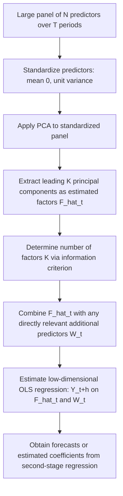

## Factor-augmented regression

### Overview

Factor-augmented regression is a two-step econometric approach for forecasting or estimating regression relationships when a very large number of predictors ($p$, potentially $p \gg n$) is available, by first extracting a small number of latent common factors that summarize the co-movement across the full predictor set, and then using these estimated factors (rather than the raw predictors) as regressors in a standard low-dimensional regression. The canonical framework is the **Factor-Augmented Vector Autoregression / Factor-Augmented Regression (FAR)** approach of Stock and Watson (2002) and Bernanke, Boivin, and Eliasz (2005).

### The Approximate Factor Model

The starting point is an **approximate factor model** for the large predictor panel $X_{it}$ ($i=1,\ldots,N$ predictors, $t=1,\ldots,T$ time periods, or $i=1,\ldots,p$ cross-sectional units):

$$X_{it} = \lambda_i^\top F_t + e_{it}$$

where $F_t$ is a $K$-dimensional vector of **latent common factors** (with $K \ll N$, typically $K$ fixed and small), $\lambda_i$ is the vector of **factor loadings** for series $i$, and $e_{it}$ is an idiosyncratic error term that is allowed to be weakly cross-sectionally and serially correlated (distinguishing the "approximate" factor model of Chamberlain and Rothschild, 1983, from the "strict/exact" factor model, which requires $e_{it}$ to be cross-sectionally uncorrelated).

**Key Points**

- The factors $F_t$ represent the small number of **pervasive, common sources of variation** driving co-movement across the entire large panel of predictors (e.g., broad macroeconomic conditions driving co-movement across hundreds of economic time series, or broad market/sector effects driving co-movement across hundreds of asset returns).
- The model is called "approximate" because it permits limited cross-sectional dependence in $e_{it}$ (as long as this dependence is "weak" in a precise technical sense — bounded eigenvalues of the idiosyncratic covariance matrix as $N\to\infty$), which is empirically far more realistic than assuming fully uncorrelated idiosyncratic errors.

### The Two-Step Factor-Augmented Regression Procedure

**Step 1 — Factor Estimation.** Estimate the latent factors $\hat F_t$ from the large panel $X_{it}$, most commonly via **principal components analysis (PCA)** applied to the (standardized) $T \times N$ data matrix $X$: the estimated factors $\hat F_t$ are (proportional to) the leading $K$ principal component scores, and the estimated loadings $\hat\lambda_i$ are the corresponding eigenvectors, chosen to minimize the sum of squared residuals:

$$(\hat F, \hat\Lambda) = \arg\min_{F,\Lambda} \sum_{i,t} \left(X_{it} - \lambda_i^\top F_t\right)^2$$

subject to a normalization (e.g., $\frac{1}{T}\hat F^\top \hat F = I_K$) needed because $F_t$ and $\lambda_i$ are identified only up to an invertible $K\times K$ rotation ($F_t\lambda_i^\top = (F_tH)(H^{-1}\lambda_i)^\top$ for any invertible $H$) — a rotation-indeterminacy that does not affect the fitted common component $\lambda_i^\top F_t$ or, ultimately, the forecasts produced by the second-stage regression.

**Step 2 — Augmented Regression.** Use the estimated factors $\hat F_t$ (and typically a small number of additional pre-selected predictors $W_t$ believed to be directly relevant, such as lagged values of the target variable itself) as regressors in a standard, low-dimensional regression for the target variable $Y_{t+h}$ (often a forecast $h$ periods ahead):

$$Y_{t+h} = \alpha + \beta^\top \hat F_t + \gamma^\top W_t + \varepsilon_{t+h}$$

estimated by ordinary least squares, since the number of regressors ($K$ plus the dimension of $W_t$) is now small relative to $T$.

### Diagram: Factor-Augmented Regression Workflow

### Why This Works: Dimension Reduction via Common Structure

**Key Points**

- The approach directly addresses the curse of dimensionality inherent in regressing $Y$ on hundreds or thousands of raw predictors $X_{it}$: rather than estimating $p$ (or $N$) separate coefficients, only $K$ factor loadings (plus the dimension of $W_t$) need to be estimated in the second stage.
- The key statistical justification (Stock and Watson, 2002; Bai, 2003) is that, under the approximate factor model, the **estimated factors $\hat F_t$ converge to the true (unobserved) factors $F_t$** (up to the unavoidable rotation) at a rate that improves as **both** $N$ and $T$ grow — specifically, the estimation error vanishes as $\min(N,T) \to \infty$, meaning that with a sufficiently large cross-section $N$ of predictors, the factors can be estimated very precisely even with a comparatively short time series $T$.
- This "blessing of dimensionality" is a hallmark result distinguishing factor-augmented approaches from standard high-dimensional regression: here, having **more** predictors (larger $N$) actually **improves** rather than worsens the ability to extract the signal, provided the predictors genuinely share common factor structure.
- Bai and Ng (2006) further showed that, under regularity conditions, treating $\hat F_t$ as if it were the true (observed) $F_t$ in the second-stage regression is asymptotically valid (standard OLS inference on $\beta$ applies without further correction for factor-estimation uncertainty) **provided** $\sqrt{T}/N \to 0$ (i.e., $N$ grows sufficiently fast relative to $T$) — otherwise, the estimation error in $\hat F_t$ can contaminate second-stage inference and generated-regressor-type corrections may be needed.

### Determining the Number of Factors $K$

**Key Points**

- Bai and Ng (2002) developed a set of **information criteria** specifically adapted to the factor-model setting, analogous in spirit to AIC/BIC but accounting for the two-dimensional ($N$ and $T$) asymptotics of the panel:

  $$IC(K) = \ln\left(\frac{1}{NT}\sum_{i,t}\hat e_{it}(K)^2\right) + K \cdot g(N,T)$$

  for various choices of the penalty function $g(N,T)$ (Bai and Ng propose several specific forms, denoted $IC_{p1}$, $IC_{p2}$, $IC_{p3}$ in their original paper), where $\hat e_{it}(K)$ are residuals from a $K$-factor PCA fit.
- The number of factors $\hat K$ is chosen to minimize $IC(K)$ over a range of candidate values; unlike standard AIC/BIC, these criteria are specifically designed to be consistent (recover the true $K$ with probability tending to 1) as **both** $N,T \to \infty$.
- **Eigenvalue-ratio and scree-plot methods**: informal/graphical approaches that look for a sharp drop-off in the ordered eigenvalues of the sample covariance matrix of $X$, or select $K$ to maximize the ratio of consecutive eigenvalues — used as a practical complement or cross-check to the formal Bai–Ng criteria. [Inference] In applied macroeconomic forecasting, the number of factors selected is often small (frequently just 1–5 factors) even when $N$ runs into the hundreds, reflecting the empirical finding that a small number of pervasive factors typically explain most co-movement in large economic panels — though this pattern is not a universal guarantee across all datasets or domains.

### Comparison: Factor-Augmented Regression vs. Alternative High-Dimensional Approaches

| Method | Dimension reduction mechanism | Handles $p \gg n$? | Variable selection (sparsity)? | Key assumption |
| --- | --- | --- | --- | --- |
| Factor-augmented regression | Extract $K \ll p$ common latent factors via PCA | Yes | No (uses all predictors implicitly via factors) | Approximate factor structure (pervasive common factors) |
| Lasso / regularized regression | Penalize and select/shrink individual coefficients | Yes | Yes | Sparsity in the true coefficient vector |
| Ridge regression | Shrink all coefficients via $L_2$ penalty | Yes | No | No sparsity required, but no dimension reduction of predictor space itself |
| Partial least squares (PLS) | Extract components maximizing covariance with $Y$ (supervised) | Yes | No (dense combination) | Low-dimensional predictive structure related to $Y$ |
| Principal components regression (PCR) | Extract components maximizing variance of $X$ (unsupervised) | Yes | No | Low-dimensional structure in $X$ itself, not necessarily aligned with $Y$ |

**Key Points**

- Factor-augmented regression and **principal components regression (PCR)** are closely related — both use unsupervised PCA on the predictor panel — but the factor-augmented framework's asymptotic theory (Bai and Ng, Stock and Watson) is specifically developed for the panel setting with $N,T\to\infty$ and explicitly connects to the approximate factor model's economic/structural interpretation (common macroeconomic or market factors), rather than being motivated purely as a numerical dimension-reduction device.
- Unlike lasso-based approaches, factor-augmented regression does **not** attempt to identify which individual raw predictors matter; instead, it assumes that the **relevant information across all predictors is well summarized by a small number of common factors**, making it best suited to settings where predictors are believed to share substantial common co-movement (as is typical in macroeconomic panels), rather than settings where the true signal is sparse across otherwise largely unrelated predictors.
- **Partial Least Squares (PLS)** differs from factor-augmented regression/PCR by using information about $Y$ during factor extraction (supervised dimension reduction, maximizing covariance between extracted components and $Y$), whereas standard factor-augmented regression's first-stage PCA is unsupervised (uses only the $X$ panel, ignoring $Y$ entirely) — [Inference] this can make PLS more efficient when predictive power is concentrated in directions of $X$ that have low variance but high covariance with $Y$, though PLS lacks the explicit approximate-factor-model asymptotic theory developed for the Stock–Watson/Bai–Ng framework.

### Extensions

#### Factor-Augmented VAR (FAVAR)

Bernanke, Boivin, and Eliasz (2005) embed estimated factors within a **vector autoregression (VAR)** framework, jointly modeling the dynamics of a small set of key observed macroeconomic variables (e.g., interest rates, inflation) together with estimated common factors extracted from a much larger panel of auxiliary series, enabling structural analysis (e.g., impulse response functions to a monetary policy shock) that incorporates a much richer information set than a small-scale VAR alone.

#### Targeted Predictors / Partial Least Squares Hybrids

**Key Points**

- Bai and Ng (2008) proposed "targeted predictors": pre-screening the large panel $X_{it}$ to retain only predictors with some minimal relationship to $Y$ before extracting factors (or using a supervised/PLS-style extraction), aiming to combine the dimension-reduction benefits of factor extraction with some of the targeting benefits of variable selection, potentially improving forecast accuracy when only a subset of the panel is truly relevant to the specific target variable $Y$.

#### Generalized Dynamic Factor Models

Forni, Hallin, Lippi, and Reichlin (2000) extended the static approximate factor model to allow factors to affect predictors with different **dynamic lag structures** (a "dynamic" factor model, as opposed to the simpler "static" factor model where the same contemporaneous $F_t$ loads onto all series), estimated via frequency-domain/spectral methods rather than simple contemporaneous PCA — offering potentially richer dynamics at the cost of additional estimation complexity.

#### Diffusion Index Forecasting

"Diffusion indexes" is Stock and Watson's (2002) original terminology for the estimated factors $\hat F_t$ used as regressors — the term reflects their intended use as summary indexes diffusing (aggregating) information broadly across the economy from a large panel of individual economic indicators, and remains common terminology in applied macroeconomic forecasting literature.

### Diagram: Factor-Augmented Regression vs. PCR vs. PLS (svg_diagram)

<svg xmlns="http://www.w3.org/2000/svg" viewBox="0 0 680 260">
<text x="340" y="25" font-size="16" font-weight="bold" text-anchor="middle" fill="#222">Unsupervised vs. Supervised Dimension Reduction (svg_diagram)</text>
<rect x="30" y="60" width="160" height="50" rx="6" fill="#e8f0fe" stroke="#4285f4" stroke-width="1.5" />
<text x="110" y="90" font-size="12" text-anchor="middle" fill="#222">Large panel X (N series)</text>
<line x1="190" y1="85" x2="270" y2="85" stroke="#555" stroke-width="1.5" marker-end="url(#arrow3)" />
<rect x="270" y="60" width="180" height="50" rx="6" fill="#fef3e0" stroke="#f4a742" stroke-width="1.5" />
<text x="360" y="82" font-size="11" text-anchor="middle" fill="#222">PCA on X only (unsupervised)</text>
<text x="360" y="98" font-size="10" text-anchor="middle" fill="#555">Factor-augmented / PCR</text>
<line x1="450" y1="85" x2="530" y2="85" stroke="#555" stroke-width="1.5" marker-end="url(#arrow3)" />
<rect x="530" y="60" width="120" height="50" rx="6" fill="#e6f4ea" stroke="#34a853" stroke-width="1.5" />
<text x="590" y="90" font-size="12" text-anchor="middle" fill="#222">F_hat_t (K factors)</text>
<line x1="590" y1="110" x2="590" y2="150" stroke="#555" stroke-width="1.5" marker-end="url(#arrow3)" />
<rect x="530" y="150" width="120" height="50" rx="6" fill="#fce8e6" stroke="#ea4335" stroke-width="1.5" />
<text x="590" y="180" font-size="12" text-anchor="middle" fill="#222">OLS: Y on F_hat_t</text>
<rect x="270" y="150" width="180" height="50" rx="6" fill="#f3e8fd" stroke="#a142f4" stroke-width="1.5" />
<text x="360" y="172" font-size="11" text-anchor="middle" fill="#222">PLS: extract using X and Y jointly</text>
<text x="360" y="188" font-size="10" text-anchor="middle" fill="#555">(supervised)</text>
<line x1="190" y1="130" x2="270" y2="175" stroke="#555" stroke-width="1" stroke-dasharray="3,2" marker-end="url(#arrow3)" />
<text x="150" y="145" font-size="9" fill="#555">also uses Y</text>
</svg>

### Practical Implementation Considerations

**Key Points**

- **Standardize the predictor panel** (each series to mean zero, unit variance) before applying PCA, since factor extraction via PCA is scale-sensitive and predictors in a large macroeconomic or financial panel are typically measured in very different units (e.g., percentage growth rates, interest rates, indexes).
- **Stationarity**: standard practice in macroeconomic applications is to transform each series in the panel (differencing, log-differencing, or other standard transformations) to approximate stationarity before extracting factors, since the factor model and its asymptotic theory are generally developed for stationary (or appropriately transformed) data.
- **Missing data / unbalanced panels**: real-world large panels often have missing values or different start dates across series (an unbalanced panel, or "ragged edge" in real-time forecasting applications); EM-algorithm-based extensions of PCA (Stock and Watson, 2002) handle this by iterating between imputing missing values and re-estimating factors.
- **Number of lags of factors**: in dynamic applications (e.g., forecasting), it is common to include not just $\hat F_t$ but also a small number of lags $\hat F_{t-1}, \hat F_{t-2}, \ldots$ in the second-stage regression to capture richer dynamic relationships between the common factors and the target variable.
- **Software**: [Unverified] exact function names and default behaviors evolve across packages and versions; commonly cited implementations include R's `factorstochvol`, general-purpose PCA functions (`prcomp`, `princomp`) combined with manual second-stage OLS, and specialized macroeconomic forecasting toolboxes (e.g., MATLAB-based replication codes associated with Stock and Watson's and Bai and Ng's original papers). Consult current documentation and package-specific vignettes for exact syntax and available built-in factor-selection criteria.

### Worked Example

**Example**

A central bank researcher wants to forecast next-quarter GDP growth using a large macroeconomic panel of $N=130$ monthly indicators (industrial production, employment measures, price indexes, financial market indicators, surveys, etc.) observed over $T=240$ months, following the Stock–Watson diffusion index approach:

1. Transform all 130 series to approximate stationarity (e.g., log-differencing levels, first-differencing rates) and standardize each to mean zero, unit variance.
2. Apply PCA to the resulting $240 \times 130$ standardized panel; use the Bai–Ng information criteria to select the number of factors, finding, say, $\hat K=4$ factors adequately summarize the panel's common variation.
3. Extract the $240 \times 4$ matrix of estimated factors $\hat F_t$.
4. Estimate the forecasting regression $\text{GDP growth}_{t+1} = \alpha + \beta^\top \hat F_t + \gamma \cdot \text{GDP growth}_t + \varepsilon_{t+1}$ via OLS, now with only 6 total regressors (4 factors, 1 lagged GDP growth term, 1 intercept) instead of the original 130 raw predictors.
5. Use the fitted regression to produce out-of-sample GDP growth forecasts, typically evaluated against simpler benchmark models (e.g., a univariate autoregression) via out-of-sample root mean squared forecast error, a standard evaluation approach in this literature given the well-documented empirical finding that diffusion-index-augmented forecasts often outperform small-scale models during periods with informative, broadly-shared macroeconomic co-movement.

### Advantages and Limitations

**Key Points**

Advantages:

- Directly resolves the dimensionality problem of using hundreds or thousands of raw predictors, reducing the effective regressor count to a small number of factors.
- Theoretically well-founded asymptotic properties (Bai, Bai and Ng, Stock and Watson) specifically developed for the large-$N$, large-$T$ panel setting common in macroeconomics and finance.
- The "blessing of dimensionality" property (more predictors can improve factor estimation precision) is a genuinely distinctive strength relative to sparsity-based high-dimensional methods, where more predictors generally increase estimation difficulty.
- Computationally simple: PCA plus a low-dimensional OLS regression, without complex regularization tuning (though the number of factors $K$ must still be chosen).

Limitations:

- Relies fundamentally on the **approximate factor model assumption** — that a small number of pervasive common factors drive most of the co-movement in the panel; this can fail if the true underlying data-generating structure is instead genuinely sparse/idiosyncratic (few individually important predictors rather than broad common factors), a setting better suited to lasso-type methods.
- Estimated factors are **unsupervised** with respect to the ultimate target variable $Y$ (in the standard Stock–Watson/Bai–Ng formulation): the extracted factors summarize variation across the predictor panel itself, which may not align well with the specific variation most predictive of $Y$, unlike supervised alternatives such as PLS or targeted predictors.
- The rotational indeterminacy of factors means individual estimated factors generally **lack direct structural/economic interpretation** on their own (though the fitted common component and forecasts are well-defined); interpreting "what factor 2 represents" typically requires auxiliary analysis (e.g., examining loadings on named series) and is not automatic.
- [Inference] Forecast performance gains from factor-augmented approaches relative to simpler benchmark models are not guaranteed in all applications or time periods; extensive empirical macroeconomic forecasting literature has documented that relative performance can vary across different sample periods and economic conditions (e.g., some studies note reduced relative advantage during certain periods such as the Great Moderation), so out-of-sample validation against simple benchmarks remains standard practice rather than an assumed guarantee.

### Related Topics / Next Steps

- Principal components analysis and principal components regression
- Partial least squares regression (supervised dimension reduction)
- Factor-Augmented VAR (FAVAR) and structural macroeconomic analysis
- Bai and Ng information criteria for factor number selection
- Dynamic factor models and spectral/frequency-domain estimation
- Ridge regression and lasso (alternative high-dimensional approaches based on shrinkage/sparsity rather than factor extraction)
- Panel data econometrics and large-$N$, large-$T$ asymptotics
- Nowcasting and mixed-frequency data (real-time forecasting extensions)
- High-dimensional covariance estimation (shared PCA/factor-structure foundations)