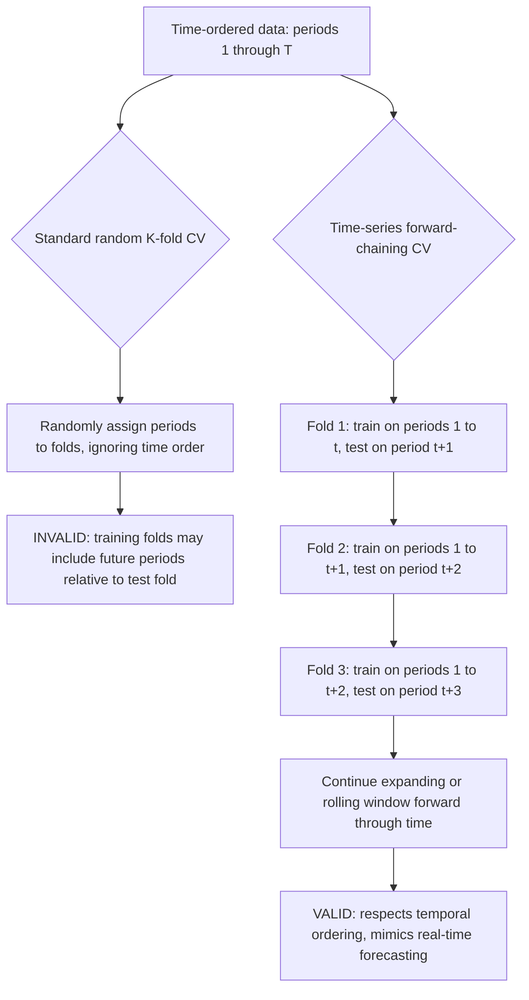
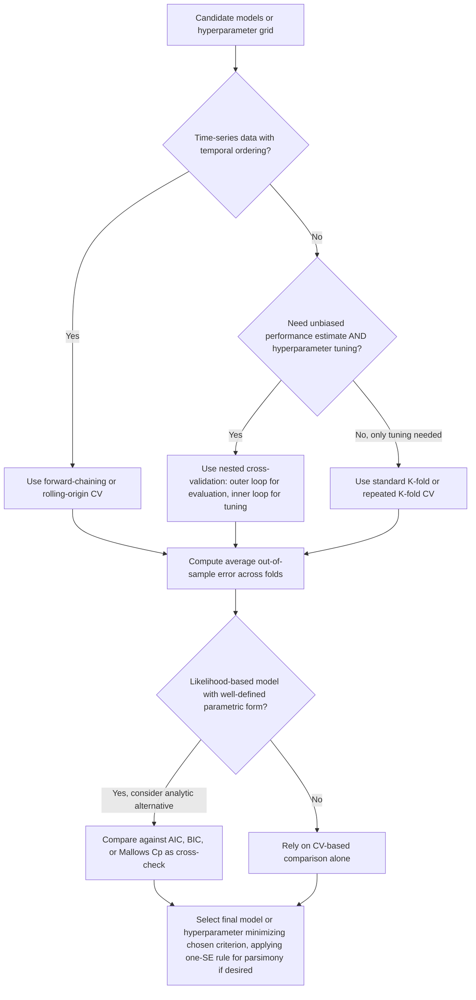

## Cross-validation and model selection

### Overview

Cross-validation (CV) is a resampling-based methodology for estimating the out-of-sample predictive performance of a statistical or machine learning model, and for selecting among competing models or tuning hyperparameters, using only the available training data. Model selection more broadly encompasses cross-validation as well as analytic alternatives (information criteria, penalized-likelihood approaches) for choosing among candidate models based on their expected generalization performance rather than their in-sample fit alone.

### The Core Problem: In-Sample Fit vs. Out-of-Sample Performance

**Key Points**

- A model's fit to the data it was trained on (**in-sample fit**, e.g., training $R^2$, training mean squared error) is a systematically **optimistic** estimate of how well the model will perform on new, unseen data, because model parameters (and, especially, any tuning/selection decisions) are chosen specifically to fit the observed training sample well.
- This **optimism** grows with model flexibility/complexity: a highly flexible model (many parameters, small penalty, high-degree polynomial, deep decision tree) can achieve near-perfect in-sample fit while generalizing poorly to new data — the phenomenon of **overfitting**.
- The goal of cross-validation and model selection more generally is to estimate (or explicitly penalize for) this optimism gap, enabling a fair comparison of candidate models' true **out-of-sample (generalization) performance**, and to select a model complexity/hyperparameter setting that minimizes expected out-of-sample error rather than in-sample error.

### The Bias–Variance Trade-off in Model Selection

**Key Points**

- Expected out-of-sample prediction error decomposes (for squared-error loss) as $\text{Bias}^2 + \text{Variance} + \text{Irreducible error}$: increasing model complexity typically **decreases bias** (the model can capture more of the true underlying relationship) but **increases variance** (the fitted model becomes more sensitive to the particular training sample drawn).
- Model selection procedures (cross-validation, information criteria) aim to find the complexity level that minimizes this bias–variance trade-off's total expected error, rather than minimizing bias alone (which would favor maximally complex/overfit models) or minimizing variance alone (which would favor maximally simple/underfit models).

### Diagram: Bias-Variance Trade-off Across Model Complexity (svg_diagram)

<svg xmlns="http://www.w3.org/2000/svg" viewBox="0 0 640 300">
<text x="320" y="25" font-size="16" font-weight="bold" text-anchor="middle" fill="#222">Error vs. Model Complexity (svg_diagram)</text>
<line x1="70" y1="260" x2="590" y2="260" stroke="#333" stroke-width="1.5" />
<line x1="70" y1="260" x2="70" y2="50" stroke="#333" stroke-width="1.5" />
<text x="330" y="285" font-size="12" text-anchor="middle" fill="#333">Model complexity increasing -&gt;</text>
<text x="35" y="150" font-size="12" text-anchor="middle" fill="#333" transform="rotate(-90 35 150)">Error</text>
<path d="M 90,80 C 200,150 350,220 570,245" fill="none" stroke="#4285f4" stroke-width="2" />
<text x="450" y="230" font-size="10" fill="#4285f4">Bias-squared (decreasing)</text>
<path d="M 90,250 C 200,240 350,150 570,70" fill="none" stroke="#ea4335" stroke-width="2" />
<text x="440" y="110" font-size="10" fill="#ea4335">Variance (increasing)</text>
<path d="M 90,150 C 200,110 280,90 340,95 C 420,105 500,160 570,220" fill="none" stroke="#34a853" stroke-width="3" />
<text x="330" y="80" font-size="10" fill="#34a853">Total expected out-of-sample error</text>
<line x1="340" y1="60" x2="340" y2="260" stroke="#999" stroke-width="1" stroke-dasharray="4,3" />
<text x="340" y="278" font-size="10" text-anchor="middle" fill="#555">optimal complexity</text>
</svg>

### Cross-Validation Methods

#### 1. The Validation Set Approach

The simplest method: randomly split data into a **training set** (used to fit the model) and a single **validation (hold-out) set** (used to evaluate performance), typically with a split such as 70/30 or 80/20.

**Key Points**

- Computationally cheap (only one model fit required per candidate model/hyperparameter setting) but **high variance**: performance estimates depend heavily on the particular random split, and results can differ substantially across different splits, especially with smaller sample sizes.
- Also **reduces effective training sample size** available for fitting the final model, which can worsen performance, particularly with limited data.

#### 2. K-Fold Cross-Validation

The data are randomly partitioned into $K$ roughly equal-sized folds. For each fold $k=1,\ldots,K$: fit the model on the remaining $K-1$ folds and evaluate prediction error on the held-out fold $k$. The cross-validated error estimate is the average across all $K$ folds:

$$CV_{(K)} = \frac{1}{K}\sum_{k=1}^K \text{Error}_k$$

**Key Points**

- **Common choices**: $K=5$ or $K=10$ are the most widely used in applied practice, balancing computational cost against variance of the error estimate; [Inference] the specific optimal choice of $K$ can depend on sample size and computational budget, and no single value is universally superior across all applications.
- Reduces the variance of the performance estimate relative to a single validation split (since the estimate is averaged over $K$ different held-out sets), while using nearly the full sample for training in each fold.
- **Stratified K-fold**: for classification problems (or continuous outcomes with important subgroups), folds can be constructed to preserve the class proportions (or a stratification variable's distribution) present in the full dataset, reducing additional variance from imbalanced fold composition.

#### 3. Leave-One-Out Cross-Validation (LOOCV)

The special case $K=n$: each observation is held out individually, with the model refit on all remaining $n-1$ observations.

$$CV_{(n)} = \frac{1}{n}\sum_{i=1}^n \text{Error}_i$$

**Key Points**

- Nearly **unbiased** for the true expected prediction error (uses almost the entire sample for each fit) but can have **higher variance** than K-fold CV with moderate $K$, because the $n$ training sets are highly overlapping/correlated with one another (each differs from the full sample by only one observation), making the $n$ error terms highly positively correlated.
- **Computationally expensive** in general (requires $n$ separate model fits), **except** for models with a closed-form "leave-one-out shortcut formula" — most notably ordinary least squares and ridge regression, where LOOCV error can be computed from a **single** full-sample fit via the "hat matrix" leverage values:

  $$CV_{(n)} = \frac{1}{n}\sum_{i=1}^n \left(\frac{Y_i - \hat Y_i}{1-h_{ii}}\right)^2$$

  where $h_{ii}$ is the $i$-th diagonal element of the hat/projection matrix $H = X(X^\top X)^{-1}X^\top$ — this shortcut avoids the need to refit the model $n$ times.

#### 4. Repeated K-Fold Cross-Validation

K-fold CV is repeated multiple times with different random fold assignments, and results are averaged, further reducing the variance of the CV performance estimate attributable to the particular random partition chosen, at a proportional increase in computational cost.

#### 5. Nested Cross-Validation

**Key Points**

- Used when cross-validation is needed **both** for hyperparameter tuning **and** for obtaining an unbiased estimate of the final selected model's generalization performance.
- An **outer loop** of K-fold CV estimates generalization performance; within each outer training fold, an **inner loop** of K-fold CV (or a validation split) is used purely to select hyperparameters. The inner loop's selected hyperparameters are then used to fit a model on the full outer training fold, evaluated on the outer test fold.
- This nested structure avoids the **optimistic bias** that results from using the *same* CV loop both to select hyperparameters and to report the resulting model's estimated performance (since simply reporting the minimum CV error across a hyperparameter grid is itself a form of selection that can overstate true generalization performance if reused as if it were an honest holdout estimate).

### Special Considerations for Time-Series Data

**Key Points**

- Standard K-fold CV (with random partitioning) is generally **invalid for time-series data** because it violates the temporal ordering: using future observations to predict/inform fitting for earlier observations (as happens when a "training fold" contains data from after the "test fold" in time) leaks future information and yields overly optimistic performance estimates that would be unachievable in a genuine real-time forecasting setting.
- **Time-series cross-validation** (also called "forward chaining," "rolling-origin evaluation," or "walk-forward validation") instead uses only **past** data to predict **future** data at each evaluation point: e.g., train on periods $1,\ldots,t$, evaluate on period $t+1$; then train on periods $1,\ldots,t+1$, evaluate on period $t+2$; and so on, expanding (or, alternatively, using a fixed-length rolling) the training window forward through time.
- **Blocked cross-validation**: an alternative for time-series or spatially correlated data that partitions data into contiguous temporal (or spatial) blocks rather than fully random folds, and may additionally introduce a "buffer" gap between training and test blocks to reduce leakage from short-range autocorrelation, though this remains a less standard/more heterogeneous practice across applications than the strict forward-chaining approach.

### Diagram: Time-Series Cross-Validation vs. Standard K-Fold

### Cross-Validation for Hyperparameter Tuning and Model Selection

**Key Points**

- CV is used pervasively to select tuning/regularization parameters (e.g., $\lambda$ in ridge/lasso regression, the mixing parameter $\alpha$ in elastic net, tree depth in decision trees, the number of neighbors $k$ in $k$-nearest-neighbors, the bandwidth in kernel regression) by choosing the value minimizing average CV error across a candidate grid.
- **The "one-standard-error rule"**: rather than selecting the hyperparameter value that exactly minimizes CV error, select the **simplest model** (e.g., largest $\lambda$, most heavily regularized) whose CV error is within one standard error of the observed minimum — favoring parsimony and reduced variance in the presence of CV estimation noise, common practice in lasso/ridge/elastic net tuning (e.g., as implemented in `glmnet`'s "lambda.1se").
- CV is also used directly for **model selection among qualitatively different model classes** (e.g., comparing a linear model, a random forest, and a neural network for the same prediction task) by comparing their CV-estimated out-of-sample errors on a common footing.

### Alternatives to Cross-Validation: Information Criteria

Information criteria provide **analytic** (non-resampling-based) approximations to out-of-sample prediction error, typically of the form: (negative log-likelihood, or residual sum of squares) plus a penalty term increasing in model complexity.

$$\text{AIC} = -2\ln(\hat L) + 2k, \qquad \text{BIC} = -2\ln(\hat L) + k\ln(n)$$

where $\hat L$ is the maximized likelihood and $k$ is the number of estimated parameters.

**Key Points**

- **AIC** (Akaike Information Criterion) is asymptotically equivalent to leave-one-out cross-validation under certain conditions, and is designed to select the model minimizing expected out-of-sample **prediction** error (Kullback–Leibler divergence-based), but is not, in general, consistent for selecting the "true" model as $n\to\infty$ (it can asymptotically select an overly complex model with positive probability, even when a simpler true model exists).
- **BIC** (Bayesian Information Criterion) imposes a heavier penalty for larger $n$ (via the $\ln(n)$ term) and is **consistent** for model selection under standard regularity conditions when the true model is among the candidates considered (it selects the true model with probability tending to 1 as $n\to\infty$), but this consistency property comes at the cost of potentially underfitting in finite samples relative to AIC when the goal is pure predictive accuracy rather than recovering a "true" parsimonious model.
- **Mallows' $C_p$**: closely related to AIC, developed specifically for linear regression under squared-error loss, using the number of predictors (or effective degrees of freedom, for penalized/regularized fits) as the complexity penalty.
- **Adjusted $R^2$**: a simpler, less formally justified complexity-penalized fit measure common in applied linear regression reporting, penalizing the addition of predictors that do not sufficiently improve fit, though it lacks the more rigorous asymptotic justification of AIC/BIC.

### Comparison: Cross-Validation vs. Information Criteria

| Property | Cross-validation | AIC | BIC |
| --- | --- | --- | --- |
| Computational cost | Higher (requires refitting model multiple times) | Low (single model fit, analytic formula) | Low (single model fit, analytic formula) |
| Requires likelihood specification | No (works with any loss/error metric) | Yes | Yes |
| Asymptotic goal | Estimate true out-of-sample error directly | Minimize expected prediction error (KL divergence) | Select the "true" model (consistency) |
| Consistent for true model selection | [Inference] Depends on CV variant and asymptotic regime; K-fold CV with fixed $K$ is generally not model-selection-consistent in the same sense as BIC | No (asymptotically inconsistent for true-model recovery) | Yes, under standard regularity conditions |
| Well-suited to non-standard loss functions or ML models (trees, neural nets) | Yes | No (requires a likelihood framework) | No (requires a likelihood framework) |

**Key Points**

- Cross-validation is generally **more broadly applicable**, since it requires only a well-defined loss/error function (not necessarily a probabilistic likelihood), making it the default choice for machine-learning models (random forests, gradient boosting, neural networks) that do not have a natural likelihood-based information criterion.
- Information criteria are computationally far cheaper (no refitting required) and remain widely used in classical statistical/econometric model comparison, particularly when models are nested within a likelihood framework (e.g., comparing ARIMA model orders, comparing sets of nested linear regression specifications).

### Model Selection Beyond Tuning: Comparing Model Classes and Specification Search

**Key Points**

- Cross-validation and information criteria can both be used not just to tune a single model's hyperparameters but to **compare fundamentally different candidate model specifications** (different functional forms, different sets of included variables, different model classes entirely).
- When model selection involves searching over many candidate specifications (e.g., stepwise variable selection, trying many functional forms), the **post-selection inference problem** applies directly: the final selected model's reported in-sample fit statistics, and even naive cross-validated error computed reusing the same selection process, can be overly optimistic if not handled carefully (e.g., via nested CV, as described above, or the formal post-selection inference methods discussed in the dedicated topic on that subject).
- **Data leakage** is a related and common practical pitfall: any preprocessing step that uses information from the full dataset (e.g., standardizing variables, imputing missing values, or performing feature selection using the *entire* dataset before splitting into CV folds) can leak test-set information into the training process, inflating apparent CV performance; the correct practice is to perform all such data-dependent preprocessing steps **separately within each CV fold's training data only**, being careful not to use test-fold information at any stage of that fold's model-fitting pipeline.

### Practical Implementation Considerations

**Key Points**

- **Choice of $K$**: $K=5$ or $K=10$ are standard defaults balancing bias, variance, and computational cost; LOOCV is generally reserved for very small samples or models with an available computational shortcut (e.g., ridge regression's hat-matrix formula).
- **Repeated CV** (repeating K-fold multiple times with different random partitions and averaging) is recommended when computational budget allows, to reduce the CV estimate's dependence on any single random fold assignment.
- **Random seed / reproducibility**: because K-fold CV involves a random partition, results should be reported alongside the random seed used (or averaged across multiple seeds/repeats) for reproducibility and to avoid over-interpreting noise from a single arbitrary partition.
- **Stratification**: for classification tasks or when a key covariate has an important, potentially imbalanced distribution, stratified K-fold (preserving class/subgroup proportions across folds) is recommended over plain random K-fold.
- **Time-series data**: always use forward-chaining/rolling-origin CV rather than standard random K-fold, to avoid look-ahead bias.
- **Software**: [Unverified] exact function names, default fold counts, and available CV variants evolve across packages and versions; commonly cited implementations include R's `caret` and `tidymodels` (`rsample`) packages and Python's `sklearn.model_selection` module (`KFold`, `StratifiedKFold`, `TimeSeriesSplit`, `GridSearchCV`, `cross_val_score`). Consult current documentation for exact syntax, defaults, and available cross-validation strategies.

### Diagram: General Model Selection Workflow

### Worked Example

**Example**

A researcher wants to select the optimal regularization parameter $\lambda$ for a lasso regression predicting firm-level investment from 50 financial and macroeconomic predictors, using $n=800$ firm-year observations, and separately wants to compare the tuned lasso against a random forest model for the same prediction task.

1. Standardize predictors (within-fold, not on the full dataset, to avoid data leakage).
2. Perform 10-fold cross-validation: for a grid of $\lambda$ values, fit lasso on 9 folds and compute mean squared prediction error on the 10th (held-out) fold; repeat across all 10 folds and average.
3. Select $\hat\lambda$ using the one-standard-error rule for a more parsimonious, stable model.
4. To compare the tuned lasso against a random forest fairly, use the **same** 10-fold partition for both models' evaluation (or, better, wrap both models' hyperparameter tuning in a **nested** CV structure): an outer 10-fold loop estimates each model class's generalization error, with an inner CV loop within each outer training fold used to tune each model's own hyperparameters ($\lambda$ for lasso; number of trees, tree depth, and features-per-split for the random forest).
5. Compare the two models' outer-loop-averaged out-of-sample errors on a common basis, selecting the model class with the lower average error as the final choice for producing investment predictions, while reporting the nested-CV error as an approximately unbiased estimate of that final model's expected real-world performance.

### Advantages and Limitations

**Key Points**

Advantages of cross-validation:

- Makes minimal assumptions about the underlying model or error distribution, applicable to essentially any predictive model and loss function.
- Directly targets the quantity of ultimate practical interest (expected out-of-sample predictive performance) rather than an analytic approximation.
- Well-suited to modern machine-learning models lacking a natural likelihood-based information criterion.

Limitations of cross-validation:

- Computationally more expensive than information criteria, especially for computationally intensive models (deep learning, large ensembles) or nested CV structures.
- Performance estimates retain some variance depending on the particular random fold partition, especially with small sample sizes (mitigated, but not eliminated, by repeated CV).
- Requires care to avoid data leakage (preprocessing/feature-selection steps must be performed within-fold) and, for time-series or clustered/grouped data, requires specialized variants (forward-chaining, grouped K-fold) rather than naive random partitioning.
- Using the same CV loop for both hyperparameter selection and final performance reporting produces an optimistically biased performance estimate; nested CV (or a fully separate final test set) is needed for an honest final performance report.
- [Inference] For very small sample sizes, no cross-validation variant can fully compensate for fundamentally limited information content in the data; in such settings, the variance of any CV-based performance estimate itself becomes large, and results should be interpreted with corresponding caution regardless of which specific CV scheme is used.

### Related Topics / Next Steps

- Bias–variance trade-off in statistical learning
- Ridge, lasso, and elastic net regularization (primary use case for CV-based tuning)
- Post-selection inference (implications for CV-based model selection)
- Information criteria: AIC, BIC, and Mallows' $C_p$ in depth
- Time-series forecasting evaluation and rolling-origin validation
- Data leakage and preprocessing pipelines in machine learning workflows
- Ensemble methods (random forests, gradient boosting) and their hyperparameter tuning
- Nested cross-validation and unbiased generalization-error estimation
- Bootstrap methods as an alternative resampling approach to performance estimation