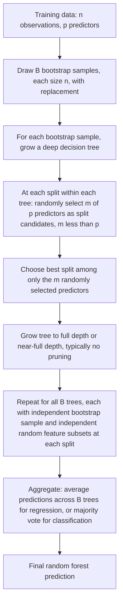

## Decision trees and random forests

### Overview

Decision trees are nonparametric supervised learning models that partition the covariate space into a set of rectangular regions via a sequence of binary splits, fitting a simple (typically constant) prediction within each resulting region. Random forests are an ensemble method that combines many decision trees, each trained on a randomized variant of the data, to produce a more accurate and stable aggregate predictor. Both are widely used in econometrics for flexible nonparametric prediction, heterogeneous treatment effect estimation, and as building blocks within causal machine learning frameworks.

### Decision Trees: Structure and Recursive Partitioning

A decision tree recursively splits the covariate space $X \in \mathbb{R}^p$ into disjoint rectangular regions $R_1,\ldots,R_M$, predicting a constant value within each region:

$$\hat f(x) = \sum_{m=1}^M c_m \, \mathbb{1}(x \in R_m)$$

where $c_m$ is typically the mean of $Y$ (for regression) or the majority class / class proportions (for classification) among training observations falling in region $R_m$.

**Key Points**

- Trees are built via **recursive binary splitting**: at each step, the algorithm considers every possible split (a predictor $X_j$ and a threshold $s$) and selects the split that most reduces a chosen **impurity** or **loss** criterion, then recurses on each of the two resulting child regions.
- This is a **greedy, top-down** procedure: at each step, the locally optimal split is chosen without looking ahead to how it will affect the quality of subsequent splits deeper in the tree — trees do not seek the globally optimal partition (finding the globally optimal tree of a given size is NP-hard in general), but the greedy heuristic is computationally efficient and works well in practice.
- The resulting model is naturally represented as a **binary tree**: internal nodes correspond to split decisions ("$X_j \leq s$?"), and terminal nodes ("leaves") correspond to the final regions $R_m$ and their associated predictions.

### Splitting Criteria

#### Regression Trees

The standard criterion is minimization of the **residual sum of squares (RSS)**: for a candidate split defined by variable $j$ and threshold $s$, creating regions $R_1(j,s) = \{x: x_j \leq s\}$ and $R_2(j,s) = \{x: x_j > s\}$:

$$\min_{j,s}\left[ \sum_{i: x_i \in R_1(j,s)} (y_i - \bar y_{R_1})^2 + \sum_{i: x_i \in R_2(j,s)} (y_i - \bar y_{R_2})^2 \right]$$

where $\bar y_{R_1}, \bar y_{R_2}$ are the within-region sample means. The split minimizing total RSS across both child regions is selected.

#### Classification Trees

Common impurity measures for a node with class proportions $\hat p_1, \ldots, \hat p_K$ (for $K$ classes):

- **Misclassification error**: $1 - \max_k \hat p_k$
- **Gini index**: $\sum_{k=1}^K \hat p_k(1-\hat p_k)$
- **Cross-entropy / deviance**: $-\sum_{k=1}^K \hat p_k \log \hat p_k$

**Key Points**

- The **Gini index** and **cross-entropy** are more sensitive to changes in class probabilities than misclassification error (they are differentiable and strictly concave), making them preferred for growing trees, even though misclassification error is often used for final pruning/evaluation since it directly corresponds to the ultimately reported error rate.
- Both Gini and cross-entropy achieve their minimum (zero) when a node is perfectly "pure" (all observations in the node belong to a single class) and their maximum when classes are perfectly balanced within the node.

### Tree Depth, Overfitting, and Pruning

**Key Points**

- A tree grown to full depth (splitting until each leaf contains a single observation, or some minimal stopping criterion) will achieve **zero training error** for regression or perfect classification of the training data — a clear symptom of **overfitting**, since such a fully-grown tree has effectively memorized the training sample and will generally generalize poorly.
- **Pre-pruning (early stopping)**: impose stopping rules during tree growth (e.g., minimum number of observations per leaf, maximum tree depth, minimum required decrease in impurity to justify a split) to prevent excessive complexity from the outset.
- **Post-pruning (cost-complexity pruning)**: grow a large tree first, then prune it back by minimizing a penalized criterion:

  $$\sum_{m=1}^{|T|} \sum_{i: x_i \in R_m} (y_i - \bar y_{R_m})^2 + \alpha |T|$$

  where $|T|$ is the number of terminal nodes (leaves) and $\alpha \geq 0$ is a complexity parameter controlling the trade-off between fit and tree size; $\alpha$ is typically chosen via cross-validation. This is the standard approach in Breiman, Friedman, Olshen, and Stone's (1984) original CART (Classification and Regression Trees) framework.
- Post-pruning is generally preferred over simple pre-pruning stopping rules because a greedy split that appears unhelpful in isolation may enable a very informative subsequent split (an interaction effect only visible after conditioning on the first split) — pre-pruning based on a myopic one-step-ahead impurity threshold can miss such structure, whereas growing a full tree and pruning back afterward avoids this myopia.

### Diagram: Single Decision Tree Structure (svg_diagram)

<svg xmlns="http://www.w3.org/2000/svg" viewBox="0 0 640 320">
<text x="320" y="25" font-size="16" font-weight="bold" text-anchor="middle" fill="#222">Decision Tree Structure (svg_diagram)</text>
<rect x="270" y="50" width="120" height="45" rx="6" fill="#e8f0fe" stroke="#4285f4" stroke-width="1.5" />
<text x="330" y="77" font-size="11" text-anchor="middle" fill="#222">X1 &lt;= s1 ?</text>
<line x1="300" y1="95" x2="180" y2="140" stroke="#555" stroke-width="1.5" />
<text x="220" y="115" font-size="10" fill="#555">Yes</text>
<line x1="360" y1="95" x2="480" y2="140" stroke="#555" stroke-width="1.5" />
<text x="440" y="115" font-size="10" fill="#555">No</text>
<rect x="120" y="140" width="120" height="45" rx="6" fill="#e8f0fe" stroke="#4285f4" stroke-width="1.5" />
<text x="180" y="167" font-size="11" text-anchor="middle" fill="#222">X2 &lt;= s2 ?</text>
<rect x="420" y="140" width="120" height="45" rx="6" fill="#fef3e0" stroke="#f4a742" stroke-width="1.5" />
<text x="480" y="167" font-size="11" text-anchor="middle" fill="#222">Leaf: c3 (R3)</text>
<line x1="150" y1="185" x2="90" y2="230" stroke="#555" stroke-width="1.5" />
<text x="105" y="205" font-size="10" fill="#555">Yes</text>
<line x1="210" y1="185" x2="270" y2="230" stroke="#555" stroke-width="1.5" />
<text x="250" y="205" font-size="10" fill="#555">No</text>
<rect x="30" y="230" width="120" height="45" rx="6" fill="#e6f4ea" stroke="#34a853" stroke-width="1.5" />
<text x="90" y="257" font-size="11" text-anchor="middle" fill="#222">Leaf: c1 (R1)</text>
<rect x="210" y="230" width="120" height="45" rx="6" fill="#e6f4ea" stroke="#34a853" stroke-width="1.5" />
<text x="270" y="257" font-size="11" text-anchor="middle" fill="#222">Leaf: c2 (R2)</text>
</svg>

### Strengths and Weaknesses of Individual Trees

**Key Points**

Strengths:

- Highly **interpretable**: the sequence of splits provides an explicit, human-readable decision rule, and can be visualized directly as a flowchart.
- Naturally handle **mixed data types** (continuous and categorical predictors) without requiring dummy-variable encoding for many implementations, and automatically capture **nonlinearities and interactions** among predictors (each split implicitly conditions on the path of prior splits, capturing interaction effects without needing to specify them).
- **Invariant to monotone transformations** of individual predictors (e.g., $\log X_j$ vs. $X_j$ produces the same tree, since only the relative ordering of $X_j$ values matters for choosing split thresholds).
- Robust to outliers in predictors (splits are based on ordering/thresholds rather than raw magnitudes) and require minimal data preprocessing (no need to standardize/scale variables).

Weaknesses:

- **High variance / instability**: small changes in the training data can lead to a completely different sequence of splits, producing substantially different-looking trees — a direct consequence of the greedy, hierarchical splitting procedure, where an early split near the top of the tree changes the entire subsequent partition.
- Tend to have relatively poor **predictive accuracy** compared to other flexible methods when used as a single tree (even after pruning), due to this high variance, motivating the ensemble methods discussed below.
- The **axis-aligned, rectangular** partitioning structure can be a poor approximation to true decision boundaries or regression surfaces that are not naturally aligned with the coordinate axes (e.g., a true boundary along a diagonal line requires many small steps to approximate with axis-aligned splits).

### Random Forests: Ensemble of Trees via Bagging Plus Feature Randomization

Breiman (2001) introduced random forests as an extension of **bootstrap aggregating (bagging)**, specifically adapted to decision trees with an additional source of randomization to further reduce correlation among the trees in the ensemble.

#### Bagging (Bootstrap Aggregating)

**Key Points**

- Bagging (Breiman, 1996) draws $B$ bootstrap samples from the training data (each of size $n$, sampled with replacement), fits a separate (typically deep, unpruned) tree to each bootstrap sample, and averages (for regression) or takes a majority vote (for classification) across the $B$ trees' predictions:

  $$\hat f_{\text{bag}}(x) = \frac{1}{B}\sum_{b=1}^B \hat f_b(x)$$
- Averaging over many high-variance, low-bias trees (each individually overfit to its own bootstrap sample) substantially **reduces variance** while leaving bias roughly unchanged, since averaging independent (or weakly correlated) unbiased-ish predictors reduces variance in proportion to their correlation, per the standard variance-of-an-average formula $\text{Var}(\bar X) = \rho\sigma^2 + \frac{(1-\rho)\sigma^2}{B}$ for average pairwise correlation $\rho$.

#### The Random Forest Modification: Random Feature Subsetting

**Key Points**

- Random forests add a **second layer of randomization** beyond bagging's bootstrap resampling of observations: at **each split** within each tree, only a random subset of $m < p$ predictors (rather than all $p$ predictors) is considered as candidates for that split.
- Common defaults: $m \approx \sqrt{p}$ for classification and $m \approx p/3$ for regression, though these can be tuned; using $m=p$ (considering all predictors at every split) recovers plain bagging as a special case.
- **Rationale**: this feature-subsetting step deliberately **decorrelates** the individual trees in the ensemble. Without it, if a single predictor is strongly dominant, nearly every bootstrap tree would select that same predictor for its top split (since it minimizes impurity most across nearly all bootstrap samples), making the trees highly correlated with each other and limiting the variance-reduction benefit of averaging (per the $\rho\sigma^2$ term above, which does not vanish as $B\to\infty$ if $\rho$ remains bounded away from zero). Forcing each split to consider only a random subset of predictors ensures the dominant predictor is sometimes unavailable, allowing other predictors to be used and producing more genuinely diverse (less correlated) trees.

### Diagram: Random Forest Construction Workflow

### Out-of-Bag (OOB) Error Estimation

**Key Points**

- Because each tree is trained on a bootstrap sample, on average roughly **37%** of the original observations ($e^{-1} \approx 0.368$) are **not** included in any given bootstrap sample (the "out-of-bag," or OOB, observations for that tree).
- The OOB error is computed by predicting each observation $i$ using only the subset of trees for which observation $i$ was OOB (not used in that tree's training), then aggregating these predictions and comparing to the true $y_i$ — this provides an estimate of generalization/test error **without requiring a separate cross-validation procedure or held-out test set**, since each observation is, in effect, validated using only trees that never saw it during training.
- The OOB error estimate has been shown to be a close approximation to K-fold cross-validation error for random forests in many settings, offering a computationally convenient built-in validation mechanism that comes essentially "for free" as a byproduct of the bagging procedure.

### Variable Importance Measures

**Key Points**

- **Mean Decrease in Impurity (MDI) / Gini importance**: for each predictor, sum the total decrease in impurity (RSS for regression, Gini index for classification) attributable to splits on that predictor, averaged across all trees in the forest — computationally cheap (a byproduct of tree construction) but can be **biased toward predictors with more possible split points** (e.g., continuous variables or categorical variables with many levels tend to receive inflated importance scores simply because they offer more candidate split thresholds to potentially exploit, even under the null of no true relationship).
- **Permutation importance**: for each predictor $X_j$, randomly permute (shuffle) the values of $X_j$ among the OOB observations, recompute OOB prediction error, and measure the **increase** in error caused by this permutation — a predictor whose permutation substantially degrades predictive accuracy is judged more important. This measure is generally considered **more reliable** than MDI/Gini importance (less biased toward high-cardinality predictors), though it is more computationally expensive to compute.
- **Key limitation of both measures**: importance scores can be **unreliable in the presence of highly correlated predictors** — importance may be "split" or diluted across a group of correlated variables that jointly carry similar information, understating the true importance of the group as a whole relative to what a single representative variable's importance would show if the correlated variables were removed.

### Comparison: Single Trees vs. Bagging vs. Random Forests

| Property | Single Tree | Bagged Trees | Random Forest |
| --- | --- | --- | --- |
| Randomization source | None (deterministic given data) | Bootstrap resampling of observations | Bootstrap resampling + random feature subsetting at each split |
| Variance | High | Reduced via averaging | Further reduced via decorrelation |
| Bias | Can be controlled via pruning | Similar to unpruned single tree | Similar to unpruned single tree |
| Interpretability | High (direct visualization) | Low (ensemble of many trees) | Low (ensemble of many trees) |
| Built-in validation | No (requires separate CV) | OOB error (approximate) | OOB error (approximate) |
| Handles correlated/dominant predictors well | N/A | Limited (trees remain correlated) | Better (feature subsetting decorrelates trees) |

### Extensions and Related Ensemble Methods

**Key Points**

- **Gradient boosted trees** (e.g., the general gradient boosting machine framework, and modern implementations such as XGBoost, LightGBM, CatBoost) build trees **sequentially**, with each new tree fit to the residuals (or negative gradient of the loss) of the current ensemble, rather than bagging's parallel, independent tree construction — boosting reduces **bias** primarily (starting from high-bias, shallow trees), whereas bagging/random forests primarily reduce **variance** (starting from high-variance, deep trees).
- **Causal forests** (Wager and Athey, 2018; part of the broader **generalized random forests** framework of Athey, Tibshirani, and Wager, 2019) adapt the random forest algorithm to estimate **heterogeneous treatment effects** in causal inference settings, using an "honest" sample-splitting approach (splitting each tree's training data into one part used to determine the splits and a separate part used to estimate leaf-level treatment effects) to enable valid asymptotic inference (confidence intervals) for estimated treatment effect heterogeneity — a substantial extension beyond the pure-prediction focus of standard random forests, of particular relevance to applied econometrics.
- **Extremely randomized trees (Extra-Trees)**: a further-randomized variant that also randomizes the **split threshold** (not just which predictors are considered) at each node, trading a modest increase in bias for a further reduction in variance and faster computation.

### Diagram: Bagging Reduces Variance via Decorrelation (svg_diagram)

<svg xmlns="http://www.w3.org/2000/svg" viewBox="0 0 640 260">
<text x="320" y="25" font-size="16" font-weight="bold" text-anchor="middle" fill="#222">Effect of Tree Correlation on Ensemble Variance (svg_diagram)</text>
<line x1="70" y1="220" x2="590" y2="220" stroke="#333" stroke-width="1.5" />
<line x1="70" y1="220" x2="70" y2="50" stroke="#333" stroke-width="1.5" />
<text x="330" y="245" font-size="12" text-anchor="middle" fill="#333">Number of trees B increasing -&gt;</text>
<text x="35" y="130" font-size="12" text-anchor="middle" fill="#333" transform="rotate(-90 35 130)">Ensemble variance</text>
<path d="M 90,80 C 200,90 350,100 570,105" fill="none" stroke="#ea4335" stroke-width="2" />
<text x="450" y="95" font-size="10" fill="#ea4335">High correlation (bagging alone, dominant predictor)</text>
<path d="M 90,150 C 200,110 350,70 570,60" fill="none" stroke="#34a853" stroke-width="2" stroke-dasharray="0" />
<text x="420" y="180" font-size="10" fill="#34a853">Low correlation (random forest: feature subsetting)</text>

<text x="580" y="103" font-size="9" fill="`#ea4335`">floor: rho*sigma^2</text>

<text x="580" y="58" font-size="9" fill="`#34a853`">floor: near 0</text>

</svg>

### Practical Implementation Considerations

**Key Points**

- **Number of trees $B$**: random forest performance generally **does not overfit as $B$ increases** (unlike boosting, where too many iterations can overfit); $B$ should be chosen large enough that OOB error stabilizes (commonly hundreds to a few thousand trees), with the main cost of larger $B$ being computation time rather than overfitting risk.
- **Tree depth / minimum leaf size**: random forests typically grow trees to be quite deep (large, largely unpruned trees) since the ensemble averaging handles the resulting high variance; minimum-leaf-size or maximum-depth hyperparameters are usually tuned via cross-validation or OOB error, though random forests tend to be relatively robust to these choices compared to a single tree.
- **Number of features per split ($m$)**: while common defaults exist ($\sqrt{p}$ for classification, $p/3$ for regression), tuning $m$ via cross-validation or OOB error can improve performance, particularly when there are few truly relevant predictors among many irrelevant ones.
- **Categorical predictors with many levels**: high-cardinality categorical variables can bias impurity-based (Gini/MDI) variable importance measures and, in some implementations, require care in encoding (e.g., one-hot encoding vs. native categorical splitting support, which varies by software).
- **Software**: [Unverified] exact function names, hyperparameter names/defaults, and available variable-importance options evolve across packages and versions; commonly cited implementations include R's `randomForest` and `ranger` packages, R's `grf` package for causal/generalized random forests, and Python's `sklearn.ensemble.RandomForestRegressor`/`RandomForestClassifier`. Consult current documentation for exact syntax and defaults.

### Worked Example

**Example**

An economist wants to predict county-level unemployment rates using $p=25$ demographic, industry-composition, and geographic predictors across $n=3{,}000$ U.S. counties, and also wants to understand which predictors matter most.

1. Fit a single regression tree first as a baseline, pruned via 10-fold cross-validation on the cost-complexity parameter $\alpha$, yielding a simple, interpretable but likely only moderately accurate model (e.g., splits primarily on manufacturing employment share and educational attainment).
2. Fit a random forest with $B=1{,}000$ trees, $m \approx 25/3 \approx 8$ predictors considered at each split, and no explicit pruning (deep trees).
3. Use the **out-of-bag error** to confirm the forest has stabilized (OOB error plateaus by a few hundred trees) without needing a separate cross-validation loop.
4. Compute **permutation importance** for all 25 predictors, finding that manufacturing employment share, educational attainment, and regional labor-market indicators rank highest — consistent with, but generally more nuanced than, the single tree's simpler split structure, since the forest captures more subtle interactions and nonlinearities that a single pruned tree could not represent as precisely.
5. Compare the random forest's OOB-estimated prediction accuracy against the single pruned tree's cross-validated accuracy, typically finding the forest achieves meaningfully lower prediction error, illustrating the standard trade-off: the single tree remains more directly interpretable (an explicit, visualizable decision rule), while the forest sacrifices this direct interpretability for improved predictive accuracy (partially recovered via permutation importance rankings and, if desired, partial dependence plots).

### Advantages and Limitations

**Key Points**

Advantages of random forests (relative to a single tree):

- Substantially improved predictive accuracy via variance reduction from ensemble averaging and decorrelation.
- Built-in OOB error estimation avoids the need for a separate cross-validation procedure.
- Retains most of a single tree's practical convenience: handles mixed data types, requires minimal preprocessing, robust to outliers in predictors, and captures nonlinearities/interactions automatically.
- Variable importance measures (particularly permutation importance) provide some interpretability despite the loss of the single tree's direct visualizability.

Limitations of random forests:

- Loses the direct, human-readable interpretability of a single decision tree; the ensemble as a whole functions largely as a "black box" relative to a single tree's explicit decision rules (partially mitigated by variable importance measures and post-hoc interpretability tools such as partial dependence plots or SHAP values).
- Variable importance measures can be unreliable or misleading in the presence of highly correlated predictors, or biased toward high-cardinality variables (for MDI-based importance specifically).
- Computationally more expensive than a single tree, though generally still tractable for moderate-to-large datasets given the embarrassingly parallel nature of independent tree construction across bootstrap samples.
- [Inference] Random forests, like most tree-based ensemble methods, can struggle with extrapolation beyond the range of training data (predictions outside the training covariate support tend to revert toward the nearest leaf's mean rather than extrapolating a trend), a limitation relevant when forecasting under conditions substantially different from the historical training sample.
- Standard random forests are designed for pure prediction rather than valid statistical inference; the extension to **causal/generalized random forests** (with honest sample-splitting) is specifically required when formal confidence intervals for estimated effects (e.g., heterogeneous treatment effects) are the object of interest, rather than point prediction alone.

### Related Topics / Next Steps

- Gradient boosting and boosted tree ensembles (XGBoost, LightGBM, CatBoost)
- Causal forests and generalized random forests (heterogeneous treatment effect estimation)
- Bagging and the bootstrap more generally
- Cross-validation and out-of-bag error estimation
- Variable importance measures and post-hoc model interpretability (partial dependence plots, SHAP values)
- Bias–variance trade-off in ensemble learning
- Extremely randomized trees (Extra-Trees) and other tree-randomization variants
- Double/debiased machine learning (use of random forests as flexible nuisance-function estimators)
- High-dimensional variable selection (comparison with lasso-based approaches)