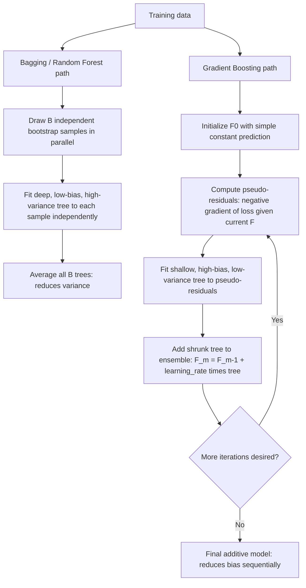

## Gradient boosting methods

### Overview

Gradient boosting is an ensemble learning technique that builds a strong predictive model by sequentially combining many "weak learners" (most commonly shallow decision trees), where each successive learner is trained to correct the errors of the current ensemble by fitting to the (negative) gradient of a chosen loss function. Unlike bagging/random forests, which build trees independently and in parallel primarily to reduce variance, boosting builds trees **sequentially and adaptively**, primarily to reduce **bias**, starting from simple, high-bias base learners.

### The General Gradient Boosting Framework

Friedman (2001) formalized gradient boosting as a numerical **steepest-descent optimization in function space**. The goal is to find a function $F(x)$ minimizing the expected loss $E[L(Y, F(X))]$, built up additively:

$$F_M(x) = \sum_{m=1}^M \nu \, h_m(x)$$

where each $h_m(x)$ is a weak learner (typically a shallow regression tree) and $\nu \in (0,1]$ is the **learning rate** (shrinkage parameter).

#### Algorithm (Generic Gradient Boosting)

1. Initialize $F_0(x) = \arg\min_c \sum_i L(y_i, c)$ (e.g., the mean of $Y$ for squared-error loss).
2. For $m = 1, \ldots, M$:

   a. Compute the **negative gradient** (pseudo-residuals) of the loss function with respect to the current fitted values:

   $$r_{im} = -\left[\frac{\partial L(y_i, F(x_i))}{\partial F(x_i)}\right]_{F=F_{m-1}}$$

   b. Fit a weak learner $h_m(x)$ (e.g., a shallow regression tree) to predict the pseudo-residuals $r_{im}$ from $x_i$.

   c. Determine the optimal step size $\gamma_m$ (or, for tree-based learners, optimal leaf-wise values) by line search: $\gamma_m = \arg\min_\gamma \sum_i L(y_i, F_{m-1}(x_i) + \gamma h_m(x_i))$.

   d. Update: $F_m(x) = F_{m-1}(x) + \nu \, \gamma_m \, h_m(x)$.
3. Output the final model $F_M(x)$.

**Key Points**

- For **squared-error loss** ($L(y,F) = \frac{1}{2}(y-F)^2$), the negative gradient $r_{im}$ is simply the ordinary residual $y_i - F_{m-1}(x_i)$, making this special case of gradient boosting directly interpretable as "iteratively fitting trees to the current residuals" — the intuitive description often used to introduce boosting.
- For other loss functions (e.g., logistic/deviance loss for classification, Huber loss for robust regression, quantile loss for quantile regression), the pseudo-residual takes a different, loss-specific form, but the algorithm's structure remains identical — this generality (any differentiable loss function can be plugged in) is a central strength of the gradient boosting framework relative to earlier, loss-specific boosting algorithms like AdaBoost.

### Diagram: Sequential Boosting vs. Parallel Bagging

### Why Shallow Trees? Bias Reduction vs. Variance Reduction

**Key Points**

- Gradient boosting typically uses **shallow trees** (often "stumps" with a single split, or trees with only 2–8 terminal nodes) as the weak learner, in sharp contrast to random forests' use of deep, largely unpruned trees.
- This reflects boosting's core mechanism: each individual weak learner is deliberately **high-bias, low-variance**, and the sequential, adaptive fitting process (each new tree targeting the current ensemble's remaining errors) is what drives bias down over successive iterations — the opposite emphasis from bagging, which starts with low-bias, high-variance trees and uses averaging to reduce variance.
- The **maximum depth (or number of terminal nodes) of each tree** controls the **order of interactions** the model can capture: a tree with $d$ terminal nodes can represent up to $(d-1)$-way interactions among predictors, so tree depth is itself an important tunable hyperparameter governing model complexity, distinct from the number of boosting iterations $M$.

### The Learning Rate (Shrinkage) and Number of Iterations

**Key Points**

- The **learning rate** $\nu$ (also called shrinkage) scales down the contribution of each successive tree; smaller $\nu$ (e.g., 0.01–0.1) requires **more boosting iterations $M$** to achieve a comparable level of fit, but generally yields **better generalization performance** for a given total training effort — a well-established empirical regularization effect sometimes summarized as "learning slowly."
- There is a direct trade-off between $\nu$ and $M$: smaller $\nu$ requires larger $M$ (more trees, more computation) to reach similar training loss, but the resulting ensemble tends to generalize better than a comparable-training-loss ensemble reached via a larger $\nu$ and smaller $M$.
- **Unlike random forests, boosting CAN overfit as $M \to \infty$**: because each new tree specifically targets the current residuals, sufficiently many iterations will eventually begin fitting noise in the training data rather than genuine signal, especially at higher learning rates — this makes $M$ (or an early-stopping rule based on validation performance) a critical tuning parameter for boosting, in direct contrast to random forests, where increasing $B$ is essentially costless with respect to overfitting.

### Regularization Techniques in Modern Gradient Boosting

**Key Points**

- **Shrinkage (learning rate)**: as described above, the primary and most fundamental regularization mechanism.
- **Subsampling (stochastic gradient boosting)**: Friedman (2002) proposed fitting each tree to a random subsample (without replacement) of the training data (and/or a random subset of features, analogous to random forests' feature subsetting) at each boosting iteration, introducing additional randomness that reduces variance and often improves generalization while also speeding up computation.
- **Tree complexity constraints**: limiting maximum tree depth, minimum samples per leaf, or minimum loss reduction required to justify a split (directly analogous to decision tree pruning/stopping rules), constraining each individual weak learner's capacity.
- **Explicit L1/L2 penalties on leaf weights**: modern implementations (notably XGBoost) add explicit regularization terms directly to the tree-fitting objective at each boosting round, penalizing the number of leaves and/or the magnitude of leaf output values, providing finer-grained control than tree-depth constraints alone.
- **Early stopping**: monitor performance on a held-out validation set during training and halt boosting once validation performance stops improving (or begins to degrade), directly addressing the overfitting-with-more-iterations concern in a data-driven way rather than fixing $M$ in advance.

### Modern Implementations: XGBoost, LightGBM, CatBoost

**Key Points**

- **XGBoost** (Chen and Guestrin, 2016) popularized several key engineering and algorithmic refinements over Friedman's original gradient boosting framework: a more rigorous **second-order** (Newton-step) approximation to the loss function at each iteration (using both the gradient and the Hessian, rather than gradient information alone), explicit regularization terms on tree complexity built directly into the split-finding objective, sparsity-aware split finding (efficiently handling missing values), and highly optimized, parallelized tree-building algorithms.
- **LightGBM** (Ke et al., 2017) introduced further computational innovations, including **histogram-based split finding** (binning continuous features into discrete buckets to dramatically speed up split search) and **leaf-wise (best-first) tree growth** (growing the leaf with the largest loss reduction next, rather than growing all leaves at a given depth level simultaneously as in level-wise growth), which can achieve comparable accuracy with substantially reduced training time, particularly on large datasets, though leaf-wise growth can be more prone to overfitting on smaller datasets without careful depth/leaf-count constraints.
- **CatBoost** (Prokhorenkova et al., 2018) specifically targets improved, more theoretically grounded handling of **categorical features** (via ordered target statistics/encoding schemes designed to reduce a specific form of target leakage inherent in naive mean-encoding of categorical variables) and introduces **ordered boosting**, a modification to the standard boosting procedure intended to reduce a subtle prediction-shift bias that can arise from using the same data to compute residuals and fit subsequent trees.
- [Unverified] The relative performance ranking among these three implementations (and their many configurable variants) depends substantially on the specific dataset, feature types (especially the prevalence of categorical variables), and computational constraints; no single implementation is universally superior across all applications, and current benchmarks/documentation should be consulted for up-to-date, task-specific comparisons.

### Diagram: Level-wise vs. Leaf-wise Tree Growth (svg_diagram)

<svg xmlns="http://www.w3.org/2000/svg" viewBox="0 0 640 280">
<text x="320" y="25" font-size="16" font-weight="bold" text-anchor="middle" fill="#222">Level-wise vs. Leaf-wise Tree Growth (svg_diagram)</text>

<text x="150" y="55" font-size="12" text-anchor="middle" fill="#222">Level-wise (e.g. XGBoost default)</text>

<circle cx="150" cy="80" r="15" fill="`#e8f0fe`" stroke="`#4285f4`" stroke-width="1.5" />

<circle cx="90" cy="130" r="15" fill="`#e8f0fe`" stroke="`#4285f4`" stroke-width="1.5" />

<circle cx="210" cy="130" r="15" fill="`#e8f0fe`" stroke="`#4285f4`" stroke-width="1.5" />

<circle cx="60" cy="180" r="12" fill="`#fef3e0`" stroke="`#f4a742`" stroke-width="1.5" />

<circle cx="120" cy="180" r="12" fill="`#fef3e0`" stroke="`#f4a742`" stroke-width="1.5" />

<circle cx="180" cy="180" r="12" fill="`#fef3e0`" stroke="`#f4a742`" stroke-width="1.5" />

<circle cx="240" cy="180" r="12" fill="`#fef3e0`" stroke="`#f4a742`" stroke-width="1.5" />

<line x1="150" y1="95" x2="90" y2="115" stroke="#555" />

<line x1="150" y1="95" x2="210" y2="115" stroke="#555" />

<line x1="90" y1="145" x2="60" y2="168" stroke="#555" />

<line x1="90" y1="145" x2="120" y2="168" stroke="#555" />

<line x1="210" y1="145" x2="180" y2="168" stroke="#555" />

<line x1="210" y1="145" x2="240" y2="168" stroke="#555" />

<text x="150" y="220" font-size="10" text-anchor="middle" fill="#555">All nodes at a depth split together</text>

<text x="480" y="55" font-size="12" text-anchor="middle" fill="#222">Leaf-wise (e.g. LightGBM default)</text>

<circle cx="480" cy="80" r="15" fill="`#e8f0fe`" stroke="`#4285f4`" stroke-width="1.5" />

<circle cx="420" cy="130" r="15" fill="`#e6f4ea`" stroke="`#34a853`" stroke-width="1.5" />

<circle cx="540" cy="130" r="15" fill="`#e8f0fe`" stroke="`#4285f4`" stroke-width="1.5" />

<circle cx="500" cy="180" r="12" fill="`#e6f4ea`" stroke="`#34a853`" stroke-width="1.5" />

<circle cx="580" cy="180" r="12" fill="`#e6f4ea`" stroke="`#34a853`" stroke-width="1.5" />

<line x1="480" y1="95" x2="420" y2="115" stroke="#555" />

<line x1="480" y1="95" x2="540" y2="115" stroke="#555" />

<line x1="540" y1="145" x2="500" y2="168" stroke="#555" />

<line x1="540" y1="145" x2="580" y2="168" stroke="#555" />

<text x="480" y="220" font-size="10" text-anchor="middle" fill="#555">Split leaf with largest loss reduction next</text>

<text x="480" y="235" font-size="9" text-anchor="middle" fill="#555">(green = not further split; asymmetric tree)</text>

</svg>

### Comparison: Gradient Boosting vs. Random Forests

| Property | Random Forest | Gradient Boosting |
| --- | --- | --- |
| Tree construction | Parallel, independent | Sequential, adaptive |
| Base tree depth | Deep (low bias, high variance) | Shallow (high bias, low variance) |
| Primary error reduction mechanism | Variance reduction (averaging/decorrelation) | Bias reduction (sequential error correction) |
| Overfits with more trees? | No (essentially) | Yes (requires tuning $M$ / early stopping) |
| Sensitivity to hyperparameter tuning | Relatively robust | More sensitive (learning rate, depth, $M$ jointly matter) |
| Built-in validation | OOB error | Requires explicit validation set / cross-validation for early stopping |
| Typical relative predictive accuracy | Strong, competitive baseline | [Inference] Often achieves state-of-the-art accuracy on tabular data with careful tuning, frequently outperforming random forests, though this advantage is task- and dataset-dependent rather than universal |
| Ease of parallelization | Highly parallel (trees independent) | Sequential dependency limits inter-tree parallelism (though within-tree split-finding is parallelized in modern implementations) |

### Loss Functions and Applications

**Key Points**

- **Regression**: squared-error loss (standard $L_2$ boosting), Huber loss (robust to outliers, combining $L_2$ behavior near zero residuals with $L_1$ behavior for large residuals), quantile loss (for **gradient boosted quantile regression**, estimating conditional quantiles rather than the conditional mean — useful for constructing prediction intervals or studying distributional heterogeneity).
- **Binary classification**: logistic/deviance loss (log-loss), directly analogous to logistic regression's loss function but optimized via the additive tree-ensemble framework rather than a single linear index.
- **Multi-class classification**: multinomial deviance loss, typically implemented via a one-vs-all or softmax-based extension of the binary case.
- **Ranking**: specialized pairwise or listwise ranking losses (e.g., LambdaMART, a boosting-based ranking algorithm), relevant for search/recommendation applications rather than typical econometric use cases.
- [Inference] In applied econometrics, gradient boosting is most commonly used for flexible nonparametric prediction and as a nuisance-function estimator within semiparametric/causal frameworks (e.g., estimating propensity scores or outcome regressions within double machine learning) rather than as the primary object of structural/causal interest itself, given its "black box" nature relative to purpose-built causal estimators.

### Variable Importance and Interpretability

**Key Points**

- Gradient boosting models support the same general variable-importance measures as random forests: **gain-based importance** (total reduction in the loss function attributable to splits on a given variable, analogous to MDI/Gini importance) and **permutation importance** (degradation in predictive accuracy when a variable's values are randomly shuffled), with the gain-based measure similarly subject to potential bias toward high-cardinality or frequently-split variables.
- **Partial dependence plots (PDPs)** and **SHAP (SHapley Additive exPlanations) values** are commonly used post-hoc interpretability tools for gradient boosting models (as for random forests), with SHAP values in particular having well-developed, computationally efficient exact algorithms specifically for tree-based ensembles (TreeSHAP), providing theoretically grounded, locally accurate feature attributions for individual predictions.
- As with random forests, gradient boosting models are fundamentally **black-box predictive models** relative to a single decision tree or a linear regression; their primary econometric use case emphasizes predictive accuracy and flexible nuisance-function estimation over direct structural interpretability of the fitted function's parameters.

### Practical Implementation Considerations

**Key Points**

- **Hyperparameter tuning**: gradient boosting has several interacting hyperparameters (learning rate, number of trees $M$, tree depth/leaf count, subsampling fraction, regularization terms) that are typically tuned jointly via cross-validation or a validation-set-based grid/random search, given their interdependence (e.g., the practically effective range of $M$ depends heavily on the chosen learning rate).
- **Early stopping** based on a validation set's performance is standard practice to determine $M$ automatically rather than fixing it in advance, monitoring a chosen metric (e.g., validation loss) across boosting rounds and halting once it fails to improve for a specified number of consecutive rounds.
- **Feature scaling**: as with decision trees and random forests, gradient boosted trees are generally **invariant to monotone transformations** of individual predictors and do not require feature standardization/scaling, unlike linear-model-based regularization methods (ridge, lasso).
- **Missing values**: modern implementations (particularly XGBoost and LightGBM) include native, often highly effective built-in handling of missing predictor values (learning an optimal default split direction for missing values at each node), removing the need for separate imputation in many applications, though [Unverified] the exact algorithm and effectiveness varies by implementation and version.
- **Software**: [Unverified] exact function/parameter names, defaults, and available options evolve rapidly across versions for all major implementations; commonly cited packages include Python/R implementations of `xgboost`, `lightgbm`, and `catboost`, as well as R's `gbm` package (implementing Friedman's original stochastic gradient boosting) and Python's `sklearn.ensemble.GradientBoostingRegressor`/`Classifier` and `HistGradientBoostingRegressor`/`Classifier`. Consult current documentation for exact syntax, defaults, and version-specific features.

### Worked Example

**Example**

An economist wants to predict individual-level wages from a large administrative dataset with $n=100{,}000$ observations and $p=40$ predictors (education, experience, occupation codes, industry codes, region, and various interactions), aiming for maximum predictive accuracy for a subsequent counterfactual wage-imputation exercise.

1. Split data into training (70%), validation (15%), and test (15%) sets.
2. Fit a gradient boosting model (e.g., via LightGBM, given the presence of several high-cardinality categorical predictors like detailed occupation codes) with an initial modest learning rate (e.g., $\nu=0.05$), shallow trees (e.g., maximum 6–8 leaves), and row/column subsampling (e.g., 80% of rows and 80% of columns per tree) for additional regularization.
3. Use the validation set for **early stopping**: monitor validation mean squared error across boosting rounds, halting training once validation error fails to improve for, say, 50 consecutive rounds, and retain the model from the best-performing round.
4. Evaluate final predictive accuracy on the held-out test set, comparing against simpler benchmarks (linear regression, random forest) to quantify gradient boosting's accuracy advantage (if any) for this specific application.
5. Compute **SHAP values** (via TreeSHAP) for the final model to understand which predictors (and predictor interactions) drive individual wage predictions, providing an interpretability layer despite the model's black-box ensemble structure — useful both for validating that the model's learned relationships are economically sensible and for communicating results to non-technical stakeholders.

### Advantages and Limitations

**Key Points**

Advantages:

- Frequently achieves state-of-the-art predictive accuracy on structured/tabular data, often outperforming random forests and simpler parametric models when carefully tuned.
- Highly flexible loss-function framework accommodates regression, classification, quantile regression, and ranking tasks within a unified algorithmic structure.
- Modern implementations (XGBoost, LightGBM, CatBoost) offer native handling of missing values and categorical features, efficient computation via histogram-based methods, and built-in regularization controls.
- Natural, computationally efficient integration with modern interpretability tools (TreeSHAP) despite the ensemble's inherent complexity.

Limitations:

- More hyperparameter-sensitive than random forests, requiring careful joint tuning of learning rate, tree depth, number of iterations, and regularization terms, typically via cross-validation or a dedicated validation set.
- Can overfit if the number of boosting iterations is too large relative to the learning rate and regularization strength, unlike random forests' near-immunity to overfitting via additional trees.
- Sequential tree construction limits opportunities for inter-tree parallelization (though modern implementations parallelize extensively within each tree's construction), and training can be slower than random forests for a comparable number of total trees, particularly at low learning rates requiring many iterations.
- Like random forests, fundamentally a black-box predictive model; direct structural/causal interpretation of the fitted function requires substantial post-hoc interpretability tooling (SHAP, partial dependence plots) rather than being immediate from the model's parameters, as it would be for a linear regression.
- [Inference] The relative predictive advantage of gradient boosting over random forests or other flexible methods is well-documented empirically on many benchmark tabular datasets but is not a mathematical guarantee for any specific application; careful empirical comparison (e.g., via the cross-validation and model-selection methodology discussed elsewhere) remains standard practice rather than assuming boosting is always the superior choice.

### Related Topics / Next Steps

- Decision trees and random forests (foundational comparison and shared building blocks)
- AdaBoost and the historical development of boosting algorithms
- Cross-validation, early stopping, and hyperparameter tuning methodology
- SHAP values and TreeSHAP for model interpretability
- Double/debiased machine learning (gradient boosting as a nuisance-function estimator)
- Quantile regression and gradient boosted quantile regression
- Stochastic gradient boosting and subsampling regularization
- Histogram-based and leaf-wise tree-growth algorithms (LightGBM-specific innovations)
- Categorical feature encoding in tree-based ensembles (target encoding, ordered boosting)