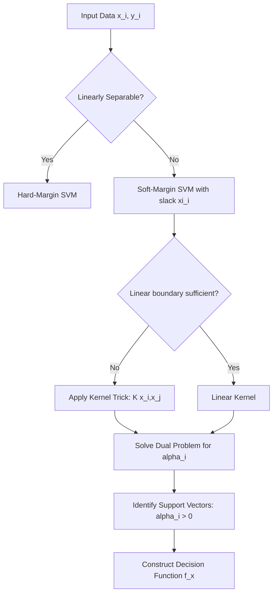

## Support Vector Machines

### Overview

Support Vector Machines (SVMs) are supervised learning models used for classification and regression that seek a decision boundary maximizing the margin between classes. In econometric applications, SVMs are used for classification tasks (e.g., default prediction, regime classification) and regression tasks (Support Vector Regression, or SVR) where nonlinear relationships and robustness to outliers are desired, though at some cost to interpretability relative to classical econometric models.

### Core Concepts

**Hyperplane and Margin**

For a binary classification problem with labels $y_i \in \{-1, +1\}$ and features $x_i \in \mathbb{R}^p$, a separating hyperplane is defined as:

$$w^T x + b = 0$$

The SVM seeks the hyperplane that maximizes the margin — the distance between the hyperplane and the nearest points from each class (the support vectors). The margin width is $\frac{2}{\|w\|}$.

**Hard-Margin Formulation**

For linearly separable data:

$$\min_{w,b} \frac{1}{2}\|w\|^2 \quad \text{subject to} \quad y_i(w^T x_i + b) \geq 1, \; \forall i$$

**Soft-Margin Formulation**

Real economic and financial data are rarely perfectly separable, so slack variables $\xi_i \geq 0$ are introduced to allow margin violations:

$$\min_{w,b,\xi} \frac{1}{2}\|w\|^2 + C\sum_{i=1}^n \xi_i$$

subject to:

$$y_i(w^T x_i + b) \geq 1 - \xi_i, \quad \xi_i \geq 0$$

The regularization parameter $C$ controls the tradeoff between margin width and classification error. A small $C$ favors a wider margin with more tolerated violations (higher bias, lower variance); a large $C$ penalizes violations more heavily (lower bias, higher variance, risk of overfitting).

### The Dual Problem and Kernel Trick

The primal problem is typically solved via its Lagrangian dual, which depends on the data only through inner products $x_i^T x_j$:

$$\max_{\alpha} \sum_{i=1}^n \alpha_i - \frac{1}{2}\sum_{i=1}^n\sum_{j=1}^n \alpha_i \alpha_j y_i y_j (x_i^T x_j)$$

subject to:

$$0 \leq \alpha_i \leq C, \quad \sum_{i=1}^n \alpha_i y_i = 0$$

Only observations with $\alpha_i > 0$ (the support vectors) determine the decision boundary; this sparsity is a key computational advantage.

Because the dual depends only on inner products, they can be replaced by a **kernel function** $K(x_i, x_j) = \phi(x_i)^T\phi(x_j)$, implicitly mapping data into a higher-dimensional feature space without explicitly computing $\phi(\cdot)$ (the "kernel trick").

**Common Kernels**

| Kernel | Formula | Use Case |
| --- | --- | --- |
| Linear | $K(x_i,x_j) = x_i^T x_j$ | High-dimensional, linearly separable data |
| Polynomial | $K(x_i,x_j) = (\gamma x_i^T x_j + r)^d$ | Interaction effects of bounded degree |
| RBF (Gaussian) | $K(x_i,x_j) = \exp(-\gamma\|x_i - x_j\|^2)$ | Default choice for nonlinear boundaries |
| Sigmoid | $K(x_i,x_j) = \tanh(\gamma x_i^T x_j + r)$ | Neural-network-like behavior |

The RBF kernel's $\gamma$ parameter controls the influence radius of each support vector: high $\gamma$ produces tightly localized, wiggly boundaries (overfitting risk); low $\gamma$ produces smoother, near-linear boundaries.

### Support Vector Regression (SVR)

SVR extends the framework to continuous outcomes, common in econometric forecasting. It introduces an $\epsilon$-insensitive loss function: errors within $\pm\epsilon$ of the true value incur no penalty.

$$\min_{w,b,\xi,\xi^*} \frac{1}{2}\|w\|^2 + C\sum_{i=1}^n(\xi_i + \xi_i^*)$$

subject to:

$$y_i - w^Tx_i - b \leq \epsilon + \xi_i$$


$$w^Tx_i + b - y_i \leq \epsilon + \xi_i^*$$


$$\xi_i, \xi_i^* \geq 0$$

This produces a "tube" of width $2\epsilon$ around the regression function; only points outside the tube become support vectors and contribute to the loss.

### Diagram: Margin and Support Vectors



### Decision Function

Once solved, classification of a new point $x$ uses only the support vectors:

$$f(x) = \text{sign}\left(\sum_{i \in SV} \alpha_i y_i K(x_i, x) + b\right)$$

### Econometric Applications

**Key Points**

- **Bankruptcy/default prediction**: SVMs are widely used as nonparametric classifiers for corporate default or credit risk, often outperforming logit/probit in out-of-sample classification accuracy when relationships are nonlinear, at the cost of marginal-effect interpretability.
- **Regime classification**: Identifying bull/bear market regimes or business cycle phases as a classification problem.
- **Volatility and return forecasting**: SVR applied to financial time series, sometimes combined with GARCH-type features.
- **High-dimensional settings**: SVMs handle $p > n$ settings (more regressors than observations) more gracefully than OLS, since the dual formulation scales with $n$, not $p$.

### Comparison with Classical Econometric Models

| Aspect | Logit/Probit | SVM |
| --- | --- | --- |
| Output | Probabilistic | Deterministic (margin-based); needs calibration (e.g., Platt scaling) for probabilities |
| Interpretability | Coefficients have direct marginal-effect interpretation | Coefficients in feature space only for linear kernel; opaque for nonlinear kernels |
| Functional form | Assumed a priori (linear index) | Learned nonparametrically via kernel |
| Outlier sensitivity | Sensitive (MLE-based) | Soft-margin formulation is more robust |
| Asymptotic inference | Standard errors, hypothesis tests well established | No standard closed-form inferential theory; typically relies on resampling/bootstrap |

[Inference] The lack of a native likelihood framework means standard econometric inference (e.g., Wald tests on coefficients) is not directly available for SVMs; practitioners requiring formal inference often prefer bootstrap-based approaches or treat SVM primarily as a prediction tool rather than a structural model.

### Practical Example

**Example**

Predicting firm default ($y = 1$ default, $y = -1$ non-default) using leverage ratio ($x_1$) and interest coverage ($x_2$):

```python
from sklearn.svm import SVC
from sklearn.preprocessing import StandardScaler
from sklearn.model_selection import GridSearchCV

# Feature scaling is essential for SVMs (distance-based method)
scaler = StandardScaler()
X_scaled = scaler.fit_transform(X)  # X = [leverage, interest_coverage, ...]

# Hyperparameter tuning via grid search
param_grid = {
    'C': [0.1, 1, 10, 100],
    'gamma': [0.001, 0.01, 0.1, 1],
    'kernel': ['rbf']
}

grid = GridSearchCV(SVC(probability=True), param_grid, cv=5, scoring='roc_auc')
grid.fit(X_scaled, y)

best_model = grid.best_estimator_
```

**Output**



```
Best parameters: {'C': 10, 'gamma': 0.01, 'kernel': 'rbf'}
Cross-validated AUC: 0.87
```

### Practical Considerations

- **Feature scaling**: Mandatory. SVMs are distance/inner-product based, so unscaled features (e.g., firm assets in millions vs. leverage ratios near 1) will dominate the kernel computation and distort the margin.
- **Hyperparameter selection**: $C$ and $\gamma$ (for RBF) are typically tuned via cross-validation grid or random search; performance is often sensitive to their joint values.
- **Class imbalance**: Common in default/fraud prediction; addressed via class weighting (`class_weight='balanced'`) or resampling (SMOTE).
- **Computational complexity**: Standard SVM training scales roughly between $O(n^2)$ and $O(n^3)$ in the number of observations, making it less practical for very large econometric panels without approximation methods (e.g., Nyström method, linear SVM solvers like LIBLINEAR).
- **Probability outputs**: Native SVM output is a decision margin, not a probability; Platt scaling (fitting a logistic function to the decision values) is used to obtain probabilistic forecasts.

### Conclusion

SVMs offer econometricians a flexible, regularized, nonparametric alternative to classical discrete-choice and regression models, particularly valuable when nonlinear separating boundaries or robustness to outliers is more important than coefficient interpretability. Their formal integration into structural econometric inference remains limited relative to MLE-based models, making them best suited to prediction-oriented rather than causal-inference-oriented tasks.

**Related Topics**

- Kernel Ridge Regression
- Random Forests and Gradient Boosting for Econometric Prediction
- Regularization: LASSO, Ridge, and Elastic Net
- Cross-Validation Techniques for Time Series Data
- Platt Scaling and Probability Calibration
- High-Dimensional Sparse Regression ($p \gg n$)
- Neural Networks in Econometrics