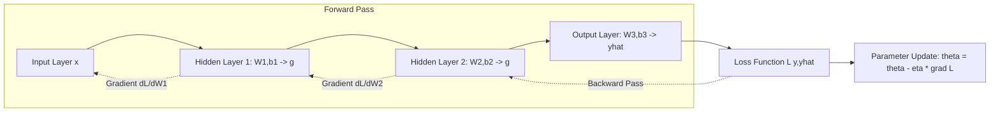

## Neural Networks and Deep Learning Fundamentals


### Overview

Neural networks are function approximators composed of layers of interconnected units ("neurons") that learn nonlinear mappings from inputs to outputs via gradient-based optimization. In econometrics, they serve as flexible nonparametric estimators for prediction tasks (forecasting, classification) where functional form is unknown, at the cost of the interpretability and asymptotic inference theory available in classical parametric models.

### The Single Neuron (Perceptron)

A single unit computes a weighted sum of inputs, adds a bias, and applies a nonlinear activation function:

$$z = w^T x + b, \qquad a = g(z)$$

where $w \in \mathbb{R}^p$ are weights, $b$ is a bias term, and $g(\cdot)$ is an activation function. This is structurally similar to a linear index model (as in logit/probit), with $g(\cdot)$ playing the role of the link function.

### Multilayer Architecture (Feedforward Networks)

A feedforward neural network (multilayer perceptron, MLP) stacks layers of neurons:

$$a^{[l]} = g^{[l]}\left(W^{[l]} a^{[l-1]} + b^{[l]}\right), \quad l = 1, \dots, L$$

where $a^{[0]} = x$ is the input, $W^{[l]}$ and $b^{[l]}$ are the weight matrix and bias vector for layer $l$, and $a^{[L]}$ is the network output. Layers between input and output are "hidden layers"; a network with more than one hidden layer is considered "deep."

### Activation Functions

| Function | Formula | Properties |
| --- | --- | --- |
| Sigmoid | $g(z) = \frac{1}{1+e^{-z}}$ | Output in $(0,1)$; saturates, vanishing gradients |
| Tanh | $g(z) = \frac{e^z - e^{-z}}{e^z + e^{-z}}$ | Output in $(-1,1)$; zero-centered, still saturates |
| ReLU | $g(z) = \max(0, z)$ | Fast, mitigates vanishing gradients; can "die" (zero gradient) |
| Leaky ReLU | $g(z) = \max(\alpha z, z)$, $\alpha$ small | Addresses dying ReLU |
| Softmax | $g(z)_i = \frac{e^{z_i}}{\sum_j e^{z_j}}$ | Multiclass output layer, produces probability vector |

For regression outputs (continuous targets, as in most econometric forecasting), the output layer typically uses a linear (identity) activation.

### Loss Functions

- **Regression**: Mean Squared Error, $\mathcal{L} = \frac{1}{n}\sum_i (y_i - \hat{y}_i)^2$
- **Binary classification**: Binary cross-entropy, $\mathcal{L} = -\frac{1}{n}\sum_i \left[y_i \log \hat{y}_i + (1-y_i)\log(1-\hat{y}_i)\right]$
- **Multiclass classification**: Categorical cross-entropy

### Training: Backpropagation and Gradient Descent

Parameters $\theta = \{W^{[l]}, b^{[l]}\}$ are estimated by minimizing the loss via gradient descent:

$$\theta \leftarrow \theta - \eta \nabla_\theta \mathcal{L}$$

where $\eta$ is the learning rate. Gradients are computed efficiently via **backpropagation**, which applies the chain rule layer by layer from the output back to the input:

$$\frac{\partial \mathcal{L}}{\partial W^{[l]}} = \frac{\partial \mathcal{L}}{\partial a^{[l]}} \cdot \frac{\partial a^{[l]}}{\partial z^{[l]}} \cdot \frac{\partial z^{[l]}}{\partial W^{[l]}}$$

**Optimization Variants**

| Optimizer | Key Idea |
| --- | --- |
| SGD | Updates on mini-batches; noisy but computationally cheap |
| Momentum | Accumulates a velocity term to smooth updates across iterations |
| RMSProp | Adapts learning rate per parameter using a moving average of squared gradients |
| Adam | Combines momentum and RMSProp; default choice in most applications |

### Diagram: Feedforward Network with Backpropagation



### Regularization Techniques

Overfitting is a central concern given the high parameter count relative to typical econometric sample sizes.

- **Weight decay (L2 regularization)**: Adds $\lambda \sum \|W^{[l]}\|^2$ to the loss, analogous to Ridge regression.
- **Dropout**: Randomly zeroes a fraction of neurons during training to prevent co-adaptation.
- **Early stopping**: Halts training when validation loss stops improving, using a held-out validation set.
- **Batch normalization**: Normalizes layer inputs to stabilize and accelerate training.

### Universal Approximation and Econometric Interpretation

**Key Points**

- The Universal Approximation Theorem states that a feedforward network with a single hidden layer and sufficient width can approximate any continuous function on a compact domain to arbitrary accuracy under mild conditions. [Inference] This result is an existence theorem and does not guarantee that a network of practical size, trained with finite data via gradient descent, will actually achieve this approximation in practice.
- Neural networks generalize the single-index model $E[y|x] = g(x^T\beta)$ used in econometrics (e.g., logit) by allowing multiple, stacked nonlinear transformations rather than a single link function.
- Unlike parametric econometric models, there is generally no closed-form standard error for network weights; uncertainty quantification typically relies on bootstrap, ensemble methods, or Bayesian neural network extensions.

### Architectures Relevant to Econometric Time Series

| Architecture | Use Case |
| --- | --- |
| MLP | Cross-sectional prediction, nonlinear regression |
| RNN / LSTM / GRU | Sequential/time-series forecasting (capturing temporal dependence) |
| CNN (1D) | Pattern detection in sequential/panel data |
| Autoencoders | Dimensionality reduction, anomaly detection (e.g., fraud) |
| Transformer | Long-range dependence in large time-series/panel datasets |

### Practical Example

**Example**

Forecasting quarterly GDP growth using a simple MLP in Keras:

```python
import tensorflow as tf
from tensorflow.keras import layers, models
from sklearn.preprocessing import StandardScaler

# Standardize features (essential for gradient-based optimization)
scaler = StandardScaler()
X_train_scaled = scaler.fit_transform(X_train)

model = models.Sequential([
    layers.Dense(32, activation='relu', input_shape=(X_train.shape[1],)),
    layers.Dropout(0.2),
    layers.Dense(16, activation='relu'),
    layers.Dense(1, activation='linear')  # continuous output
])

model.compile(optimizer=tf.keras.optimizers.Adam(learning_rate=0.001),
              loss='mse', metrics=['mae'])

history = model.fit(X_train_scaled, y_train,
                     validation_split=0.2,
                     epochs=100,
                     batch_size=16,
                     callbacks=[tf.keras.callbacks.EarlyStopping(patience=10)])
```

**Output**



```
Epoch 47/100 - loss: 0.0231 - mae: 0.121 - val_loss: 0.0298 - val_mae: 0.138
Restoring model weights from the end of the best epoch: 37.
```

### Practical Considerations for Econometric Use

- **Data scaling**: Gradient-based optimizers converge poorly on unscaled features; standardization or normalization is standard practice.
- **Sample size**: Deep networks are data-hungry; with typical macro/micro-econometric sample sizes (hundreds to low thousands of observations), shallow networks or heavy regularization are usually necessary to avoid overfitting.
- **Stationarity and time dependence**: Standard feedforward networks assume i.i.d. inputs; time-series applications require either explicit lag features or architectures designed for sequential dependence (RNN/LSTM).
- **Interpretability**: Techniques such as SHAP values, partial dependence plots, and Layer-wise Relevance Propagation are used to approximate marginal effects, since network weights themselves are not directly interpretable as elasticities or marginal effects.
- **Reproducibility**: Results depend on random weight initialization and stochastic optimization; multiple runs and fixed random seeds are standard practice for robustness checks.

### Conclusion

Neural networks generalize classical single-index econometric models into deep, compositional nonlinear function approximators trained via backpropagation and gradient descent. Their flexibility makes them powerful for prediction-focused tasks but introduces a tradeoff against the interpretability, asymptotic inference, and data efficiency of classical econometric estimators, motivating hybrid approaches that combine deep learning with structural or causal frameworks.

**Related Topics**

- Recurrent Neural Networks and LSTMs for Time Series Forecasting
- Convolutional Neural Networks for Panel/Sequential Data
- Regularization: Dropout, Weight Decay, Early Stopping
- Bayesian Neural Networks and Uncertainty Quantification
- SHAP Values and Model Interpretability
- Double/Debiased Machine Learning for Causal Inference
- Transformer Architectures in Time Series Econometrics