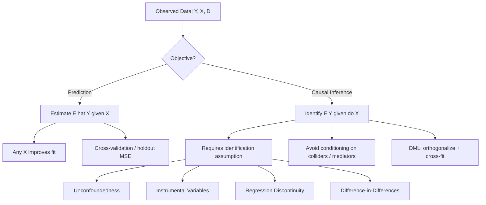

## Prediction versus Causal Inference Tradeoffs

### Overview

Prediction and causal inference optimize different objectives, and this distinction determines model choice, validation strategy, and interpretation. Prediction targets $E[Y|X=x]$ for accurate forecasting of an outcome given observed covariates, without requiring that the relationship be structural or stable under intervention. Causal inference targets $E[Y|do(X=x)]$, the outcome that would result from *setting* $X$ to $x$, which requires identifying assumptions that go beyond the observed joint distribution of the data.

### Formal Distinction

**Key Points**

- Prediction relies on the conditional expectation function (CEF), $\mu(x) = E[Y|X=x]$, estimated directly from observational data
- Causal inference relies on the counterfactual/potential outcomes framework, $Y_i(1), Y_i(0)$, where the causal effect is $\tau_i = Y_i(1) - Y_i(0)$
- The Average Treatment Effect (ATE) is defined as:

$$\tau_{ATE} = E[Y_i(1) - Y_i(0)]$$

- The fundamental problem of causal inference: for any unit $i$, only one of $Y_i(1)$ or $Y_i(0)$ is observed, so $\tau_i$ is never directly computable at the individual level
- Association ($E[Y|X=1] - E[Y|X=0]$) equals the causal effect only under specific identifying assumptions (e.g., unconfoundedness/ignorability: $\{Y_i(1), Y_i(0)\} \perp X_i$)

### Why Good Predictors Can Be Bad Causal Variables

A variable can have strong predictive power precisely because it is a proxy, a mediator, or a collider — none of which support causal interpretation.

- **Confounders** inflate predictive correlation without any causal path from $X$ to $Y$
- **Colliders**: conditioning on a collider (a variable caused by both $X$ and $Y$) induces spurious association where none existed causally
- **Mediators**: including a mediator of the $X \to Y$ path in a predictive model captures the *indirect* effect's signal but destroys the ability to recover the *total* causal effect of $X$
- **Proxy variables** (e.g., zip code as a proxy for income) predict well but have no manipulable causal meaning — "setting" zip code does not change income

**Example**

Ice cream sales strongly predict drowning incidents. Including "ice cream sales" in a model predicting drownings improves forecast accuracy (both driven by summer heat), but intervening on ice cream sales (e.g., banning sales) would not reduce drownings. The predictive relationship is real and exploitable; the causal relationship is absent.

### Objective Function Divergence

| Dimension | Prediction | Causal Inference |
| --- | --- | --- |
| Target | $E[Y\|X]$ | $E[Y\|do(X)]$ |
| Loss function | MSE, log-loss, cross-entropy | Bias of $\hat\tau$ relative to true $\tau$ |
| Model selection | Cross-validation, out-of-sample fit | Identification strategy validity |
| Feature inclusion | Any $X$ that improves fit | Only $X$ satisfying exogeneity/exclusion restrictions |
| Overfitting concern | Central (variance-bias tradeoff on $\hat{Y}$) | Secondary to bias from confounding/misspecification |
| Regularization goal | Minimize prediction error | Can bias $\hat\tau$ if applied to the treatment coefficient |

### The Bias-Variance Tradeoff Is Not the Same Tradeoff

In prediction, the bias-variance decomposition of MSE is:

$$\text{MSE}(\hat{f}(x)) = \text{Bias}[\hat{f}(x)]^2 + \text{Var}[\hat{f}(x)] + \sigma^2$$

Machine learning methods (LASSO, ridge, random forests, gradient boosting) deliberately introduce bias to reduce variance and improve *out-of-sample prediction accuracy*. This is appropriate for prediction tasks.

In causal inference, introducing bias into $\hat\tau$ is generally unacceptable regardless of variance reduction, because the goal is not minimal MSE on $Y$ but an unbiased (or consistent) estimate of a structural parameter. Regularizing the coefficient on the treatment variable $X$ directly (e.g., shrinking $\hat\tau$ toward zero via LASSO) biases the causal estimate toward the null — a critical pitfall known as **regularization bias**.

### Double/Debiased Machine Learning (Chernozhukov et al.)

**Key Points**

Modern econometrics reconciles ML's predictive power with causal identification via **Neyman orthogonality** and **cross-fitting**, allowing high-dimensional nuisance functions to be estimated flexibly (via ML) while preserving $\sqrt{n}$-consistent inference on the causal parameter.

Partially linear model setup:

$$Y = \tau D + g(X) + \varepsilon$$

$$D = m(X) + \nu$$

where $D$ is the treatment, $X$ are controls, and $g(\cdot)$, $m(\cdot)$ are unknown nuisance functions estimated with ML (random forests, gradient boosting, neural nets).

**Procedure**

1. Split sample into $K$ folds
2. On the training folds, estimate $\hat{g}(X)$ (predicting $Y$ from $X$) and $\hat{m}(X)$ (predicting $D$ from $X$) using any ML method
3. On the held-out fold, compute residuals $\tilde{Y} = Y - \hat{g}(X)$ and $\tilde{D} = D - \hat{m}(X)$
4. Regress $\tilde{Y}$ on $\tilde{D}$ to obtain $\hat\tau$
5. Average $\hat\tau$ across folds (cross-fitting) to remove overfitting bias

This procedure uses ML for what it is good at — flexible prediction of nuisance functions — while isolating the causal parameter $\tau$ through orthogonalization, which makes the estimate first-order insensitive to small errors in $\hat{g}$ and $\hat{m}$.

### Diagram: Prediction vs. Causal Estimand Pipeline

### Illustration: Confounding vs. Mediation vs. Collider Structures (svg_diagram)

<svg xmlns="http://www.w3.org/2000/svg" viewBox="0 0 900 320" font-family="sans-serif">
<text x="450" y="20" text-anchor="middle" font-size="16" font-weight="bold">Causal Structures Relevant to Prediction vs. Inference (svg_diagram)</text>

<text x="130" y="45" text-anchor="middle" font-size="13" font-weight="bold">Confounder</text>

<circle cx="130" cy="100" r="26" fill="`#e8e8e8`" stroke="#333" />

<text x="130" y="105" text-anchor="middle" font-size="12">Z</text>

<circle cx="60" cy="190" r="26" fill="`#cde4ff`" stroke="#333" />

<text x="60" y="195" text-anchor="middle" font-size="12">X</text>

<circle cx="200" cy="190" r="26" fill="`#ffd9d9`" stroke="#333" />

<text x="200" y="195" text-anchor="middle" font-size="12">Y</text>

<line x1="112" y1="118" x2="72" y2="170" stroke="#333" marker-end="url(#arrow)" />

<line x1="148" y1="118" x2="188" y2="170" stroke="#333" marker-end="url(#arrow)" />

<text x="130" y="250" text-anchor="middle" font-size="11">Z confounds X-Y;</text>

<text x="130" y="265" text-anchor="middle" font-size="11">must condition on Z</text>

<text x="450" y="45" text-anchor="middle" font-size="13" font-weight="bold">Mediator</text>

<circle cx="380" cy="150" r="26" fill="`#cde4ff`" stroke="#333" />

<text x="380" y="155" text-anchor="middle" font-size="12">X</text>

<circle cx="450" cy="100" r="26" fill="`#e8e8e8`" stroke="#333" />

<text x="450" y="105" text-anchor="middle" font-size="12">M</text>

<circle cx="520" cy="150" r="26" fill="`#ffd9d9`" stroke="#333" />

<text x="520" y="155" text-anchor="middle" font-size="12">Y</text>

<line x1="404" y1="135" x2="428" y2="115" stroke="#333" marker-end="url(#arrow)" />

<line x1="472" y1="115" x2="496" y2="135" stroke="#333" marker-end="url(#arrow)" />

<line x1="406" y1="150" x2="494" y2="150" stroke="#333" marker-end="url(#arrow)" />

<text x="450" y="250" text-anchor="middle" font-size="11">M mediates X-Y;</text>

<text x="450" y="265" text-anchor="middle" font-size="11">conditioning on M blocks indirect effect</text>

<text x="770" y="45" text-anchor="middle" font-size="13" font-weight="bold">Collider</text>

<circle cx="700" cy="190" r="26" fill="`#cde4ff`" stroke="#333" />

<text x="700" y="195" text-anchor="middle" font-size="12">X</text>

<circle cx="840" cy="190" r="26" fill="`#ffd9d9`" stroke="#333" />

<text x="840" y="195" text-anchor="middle" font-size="12">Y</text>

<circle cx="770" cy="100" r="26" fill="`#e8e8e8`" stroke="#333" />

<text x="770" y="105" text-anchor="middle" font-size="12">C</text>

<line x1="712" y1="170" x2="752" y2="118" stroke="#333" marker-end="url(#arrow)" />

<line x1="828" y1="170" x2="788" y2="118" stroke="#333" marker-end="url(#arrow)" />

<text x="770" y="250" text-anchor="middle" font-size="11">C is caused by X and Y;</text>

<text x="770" y="265" text-anchor="middle" font-size="11">conditioning on C induces spurious bias</text>

</svg>

### Identification Strategies for Causal Estimands

- **Randomized Controlled Trials (RCT)**: gold standard; treatment assignment independent of potential outcomes by design
- **Instrumental Variables (IV)**: exploits an instrument $Z$ affecting $Y$ only through $D$ (exclusion restriction) and correlated with $D$ (relevance)
- **Regression Discontinuity (RD)**: exploits a known threshold rule assigning treatment, identifying a local average treatment effect (LATE) near the cutoff
- **Difference-in-Differences (DiD)**: relies on parallel trends between treated and control groups absent treatment
- **Matching / Propensity Score methods**: rely on unconfoundedness (selection on observables)
- **Synthetic Control**: constructs a weighted counterfactual from untreated units for comparative case studies

### Where ML Complements Causal Inference

**Key Points**

- **Heterogeneous treatment effect estimation**: Causal Forests (Wager & Athey) and Bayesian Additive Regression Trees (BART, via BCF) estimate conditional average treatment effects (CATE), $\tau(x) = E[Y(1)-Y(0)|X=x]$
- **Covariate balancing and propensity score estimation**: ML flexibly models $P(D=1|X)$ without imposing a linear functional form
- **High-dimensional control selection**: LASSO-based "double selection" (Belloni, Chernozhukov, Hansen) selects controls for both the outcome and treatment equations to avoid omitted variable bias from naive post-selection inference
- **Nuisance function estimation** in DML, as above

[Inference] The practical performance gains of Causal Forests over parametric interaction models depend heavily on sample size, treatment effect heterogeneity structure, and covariate dimensionality, and can vary substantially across empirical applications.

### Where ML Fails for Causal Inference Without Adjustment

- Naive application of predictive ML (random forest, XGBoost, deep nets) to estimate treatment effects by simply including $D$ as a feature produces **regularization bias** and **overfitting bias**, both of which contaminate $\hat\tau$
- Feature importance metrics (e.g., SHAP values, Gini importance) reflect predictive contribution, not causal effect magnitude, and should not be interpreted causally
- Post-double-selection without orthogonalization or sample splitting can produce invalid confidence intervals due to "own-bias" from using the same data to select and estimate

### Practical Decision Framework

**Next Steps**

1. Define the estimand first: is the object of interest $E[Y|X]$ (forecast) or $E[Y|do(X)]$ (policy effect)?
2. If causal, specify the identification strategy (RCT, IV, RD, DiD, unconfoundedness) *before* choosing an estimator
3. If using ML for nuisance parameters, use a Neyman-orthogonal moment condition (e.g., DML) and cross-fitting
4. Never regularize or apply variable selection directly on the treatment coefficient of interest
5. Validate predictive models via out-of-sample fit (RMSE, AUC); validate causal estimates via placebo tests, sensitivity analysis (e.g., Rosenbaum bounds, Oster's delta), and robustness to alternative specifications

### Related Topics

- Neyman Orthogonality and Cross-Fitting in Semi-Parametric Models
- Causal Forests and Generalized Random Forests (Wager & Athey, Athey-Tibshirani-Wager)
- Post-Double-Selection LASSO (Belloni-Chernozhukov-Hansen)
- Instrumental Variables with High-Dimensional Instruments (LASSO-IV)
- Heterogeneous Treatment Effects and Policy Learning
- Sensitivity Analysis for Unconfoundedness (Rosenbaum Bounds, Oster's Delta)
- Transfer Learning Limitations for Structural Parameters