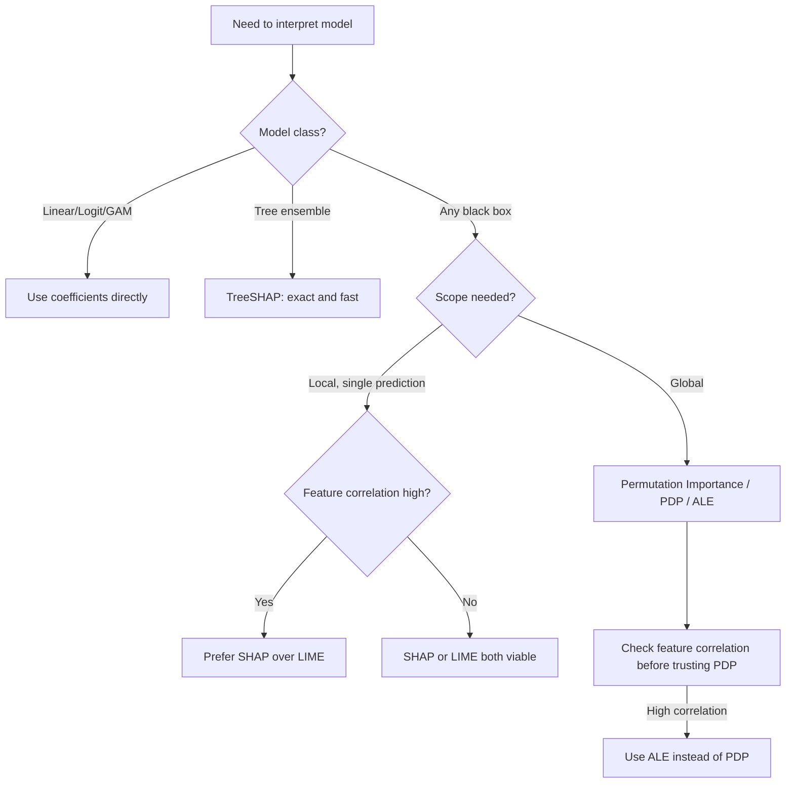

## Interpretability of Machine Learning Models

### Overview

Interpretability concerns the degree to which a human can understand *why* a model produces a given prediction. In econometrics, this matters beyond model debugging: policy decisions, regulatory compliance (e.g., credit scoring under the Equal Credit Opportunity Act), and scientific inference all require some account of the mechanism linking inputs to outputs, not just accurate forecasts. Interpretability is distinct from causal inference — an interpretable model explains its own internal logic, not necessarily the true data-generating process.

### Taxonomy: Intrinsic vs. Post-Hoc

**Key Points**

- **Intrinsically interpretable models**: the model's structure itself is human-readable (linear/logistic regression coefficients, decision trees of shallow depth, generalized additive models, rule lists)
- **Post-hoc interpretability methods**: applied after fitting a black-box model to approximate or expose its behavior (SHAP, LIME, partial dependence plots, permutation importance)
- **Global interpretability**: explains overall model behavior across the full input distribution
- **Local interpretability**: explains a single prediction for a single observation

| Model Class | Intrinsic Interpretability | Typical Post-Hoc Tool |
| --- | --- | --- |
| OLS / Logit | High (coefficients = marginal effects) | Rarely needed |
| LASSO / Ridge | Moderate (sparse coefficients, but shrinkage biases magnitude) | Coefficient paths |
| Decision Tree (shallow) | High (explicit rules) | None needed |
| Random Forest | Low | Permutation importance, SHAP |
| Gradient Boosting (XGBoost, LightGBM) | Low | SHAP, partial dependence |
| Neural Networks | Very low | SHAP, Integrated Gradients, LIME |

### Permutation Feature Importance

**Key Points**

Measures the increase in prediction error after randomly permuting a single feature's values, breaking its relationship with the outcome while preserving the marginal distribution.

$$\text{Importance}_j = \frac{1}{K}\sum_{k=1}^{K}\left[L(Y, \hat{f}(X_{\text{perm}_j}^{(k)})) - L(Y, \hat{f}(X))\right]$$

where $L$ is the loss function and $X_{\text{perm}_j}^{(k)}$ denotes the design matrix with column $j$ permuted in repetition $k$.

**Limitations**

- Biased toward correlated features: permuting one of two highly correlated variables barely changes predictions if the model can still extract the same signal from its correlated partner, understating true importance
- Computed on either training or held-out data — training-set importance can overstate relevance for overfit models
- Reflects predictive contribution, not causal effect; a strongly important feature may be a proxy, not a cause

### SHAP (SHapley Additive exPlanations)

**Key Points**

SHAP assigns each feature a contribution value for an individual prediction, grounded in cooperative game theory (Shapley values, Lloyd Shapley 1953). Each feature is treated as a "player" contributing to the "payout" (the prediction).

$$\phi_j = \sum_{S \subseteq F \setminus \{j\}} \frac{|S|!\,(|F|-|S|-1)!}{|F|!} \left[f(S \cup \{j\}) - f(S)\right]$$

where $F$ is the full feature set, $S$ ranges over all subsets excluding feature $j$, and $f(S)$ is the model's expected output given only features in $S$.

**Properties (Axioms)**

- **Efficiency**: $\sum_j \phi_j = f(x) - E[f(X)]$ — contributions sum exactly to the difference between the prediction and the baseline
- **Symmetry**: two features contributing equally to all subsets receive equal attribution
- **Dummy**: a feature that never changes the prediction receives zero attribution
- **Additivity**: for models that are sums of sub-models (e.g., tree ensembles), Shapley values are additive across sub-models

**Computational Variants**

- **KernelSHAP**: model-agnostic, approximates Shapley values via weighted linear regression on sampled feature coalitions; computationally expensive for high-dimensional $X$
- **TreeSHAP**: exact and polynomial-time algorithm specific to tree ensembles (random forests, XGBoost, LightGBM), exploiting tree structure to compute exact Shapley values efficiently
- **DeepSHAP**: approximation for neural networks combining DeepLIFT with Shapley value concepts

[Inference] Exact Shapley value computation is NP-hard in general for arbitrary black-box models with more than a handful of features, which is why KernelSHAP relies on sampling-based approximation rather than exhaustive coalition enumeration.

### LIME (Local Interpretable Model-Agnostic Explanations)

Approximates the black-box model $f$ locally around a specific instance $x$ with an interpretable surrogate model $g$ (typically sparse linear regression), fit on perturbed samples weighted by proximity to $x$:

$$\xi(x) = \arg\min_{g \in G} L(f, g, \pi_x) + \Omega(g)$$

where $\pi_x$ is a proximity kernel weighting perturbed samples near $x$, and $\Omega(g)$ penalizes surrogate complexity (e.g., number of non-zero coefficients).

**Limitations**

- Local surrogate fidelity is not guaranteed to be stable; small perturbations in the sampling procedure can produce different local explanations for the same instance
- Choice of perturbation distribution and kernel width is somewhat arbitrary and can materially change explanations
- Does not guarantee global consistency across neighboring instances

### Partial Dependence Plots (PDP) and Individual Conditional Expectation (ICE)

**Partial Dependence** shows the marginal effect of feature $X_j$ on the predicted outcome, averaging over the joint distribution of all other features:

$$\hat{f}_j^{PD}(x_j) = \frac{1}{n}\sum_{i=1}^{n} \hat{f}(x_j, X_{i,-j})$$

**ICE curves** plot this same relationship separately for each individual observation $i$ rather than averaging, revealing heterogeneity that PDPs mask (e.g., interaction effects that cancel out on average).

**Limitations**

- PDP assumes feature independence; under strong correlation among features, PDP extrapolates into regions of the feature space with little or no support in the training data, producing unreliable curves
- **Accumulated Local Effects (ALE) plots** are a common corrective, averaging differences in predictions over a conditional (rather than marginal) distribution to avoid this extrapolation issue

### Diagram: Interpretability Method Selection

### Illustration: Local vs. Global Explanation Scope (svg_diagram)

<svg xmlns="http://www.w3.org/2000/svg" viewBox="0 0 760 260" font-family="sans-serif">
<text x="380" y="20" text-anchor="middle" font-size="16" font-weight="bold">Local vs. Global Interpretability Scope (svg_diagram)</text>
<rect x="40" y="50" width="300" height="170" fill="#f5f5f5" stroke="#333" rx="8" />
<text x="190" y="75" text-anchor="middle" font-size="13" font-weight="bold">Global (Model-Wide)</text>
<text x="190" y="100" text-anchor="middle" font-size="11">Permutation Importance</text>
<text x="190" y="120" text-anchor="middle" font-size="11">Partial Dependence Plots</text>
<text x="190" y="140" text-anchor="middle" font-size="11">ALE Plots</text>
<text x="190" y="160" text-anchor="middle" font-size="11">Aggregated SHAP (beeswarm)</text>
<text x="190" y="190" text-anchor="middle" font-size="10" fill="#555">Explains overall behavior</text>
<rect x="420" y="50" width="300" height="170" fill="#eef4ff" stroke="#333" rx="8" />
<text x="570" y="75" text-anchor="middle" font-size="13" font-weight="bold">Local (Instance-Level)</text>
<text x="570" y="100" text-anchor="middle" font-size="11">SHAP force plot (single obs)</text>
<text x="570" y="120" text-anchor="middle" font-size="11">LIME surrogate</text>
<text x="570" y="140" text-anchor="middle" font-size="11">ICE curve (single unit)</text>
<text x="570" y="160" text-anchor="middle" font-size="11">Counterfactual explanation</text>
<text x="570" y="190" text-anchor="middle" font-size="10" fill="#555">Explains one prediction</text>
</svg>

### Interpretability vs. Accuracy Tradeoff

[Speculation] The commonly cited "interpretability-accuracy tradeoff" is not a strict mathematical law but an empirical regularity: for many tabular datasets with strong nonlinear interactions, flexible models outperform linear ones, though on structured/low-noise problems, well-specified linear or additive models can match black-box performance while remaining fully interpretable.

**Mitigating Approaches**

- **Generalized Additive Models (GAMs)**: $g(E[Y]) = \beta_0 + \sum_j f_j(X_j)$, allowing nonlinear component functions $f_j$ while preserving additive, per-feature interpretability
- **Explainable Boosting Machines (EBM)**: a GAM variant fit via cyclic gradient boosting per feature, achieving near-black-box accuracy with full additive transparency
- **Monotonicity constraints**: imposed during tree/boosting training (e.g., XGBoost's `monotone_constraints`) to enforce domain knowledge (e.g., predicted default risk must be monotonic in debt-to-income ratio)

### Regulatory and Econometric Context

**Key Points**

- The EU's GDPR Article 22 and related guidance are widely discussed as motivating a "right to explanation" for automated decisions, though the precise legal scope is debated among legal scholars
- In credit scoring (US), the Fair Credit Reporting Act and Regulation B require "adverse action" reasons for denied credit, pushing lenders toward interpretable models or rigorously validated post-hoc explanations
- Interpretability is not a substitute for causal validity: a highly interpretable SHAP attribution can still reflect a spurious, non-causal, or unstable correlation learned by the model

### Practical Workflow

**Next Steps**

1. Start with an intrinsically interpretable baseline (linear/logit, shallow tree, GAM) to establish a transparent performance floor
2. If a black-box model materially outperforms the baseline, quantify the gap before committing to reduced interpretability
3. Choose TreeSHAP for tree ensembles (exact, fast); KernelSHAP or LIME for other model classes
4. Check feature correlation structure before trusting PDPs; substitute ALE plots when correlation is high
5. Report interpretability findings with appropriate caveats: post-hoc explanations describe model behavior, not necessarily the true causal data-generating process

### Related Topics

- Generalized Additive Models and Explainable Boosting Machines
- Shapley Value Axioms and Cooperative Game Theory Foundations
- Counterfactual Explanations and Recourse
- Monotonicity and Fairness Constraints in Gradient Boosting
- Algorithmic Fairness Metrics (Demographic Parity, Equalized Odds)
- Model Cards and Documentation Standards for Econometric ML Deployment