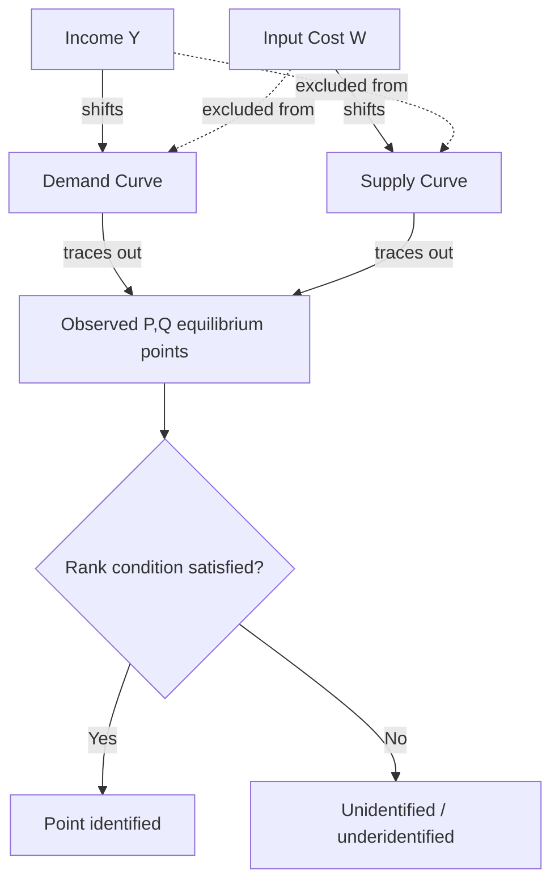

## Identification in Structural Models

### Overview

Identification asks whether the parameters of a structural (economically motivated) model are uniquely recoverable from the joint distribution of observable data, given the model's assumptions. A parameter $\theta$ is **identified** if no two distinct values $\theta_1 \neq \theta_2$ generate the same distribution of observables. Identification is a property of the population (infinite data), logically prior to and distinct from estimation, which concerns finite-sample statistical properties (consistency, efficiency) of a given identified parameter.

### Formal Definition

**Key Points**

Let $P_\theta$ denote the distribution of observable data implied by structural parameter $\theta \in \Theta$. The parameter is **point identified** if:

$$P_{\theta_1} = P_{\theta_2} \implies \theta_1 = \theta_2 \quad \forall \theta_1, \theta_2 \in \Theta$$

If this mapping is not one-to-one, $\theta$ is **unidentified** (or only **partially/set identified** if a nontrivial subset of $\Theta$ remains consistent with $P_\theta$).

- **Point identification**: a unique value of $\theta$ is consistent with the population distribution
- **Set (partial) identification**: only a set (identified set) of values is consistent, e.g., an interval $[\theta_L, \theta_U]$
- **Local identification**: unique in a neighborhood of the true $\theta_0$ (weaker than global identification), typically verified via a rank condition on the Jacobian of the moment/likelihood function

### Identification vs. Estimation

| Aspect | Identification | Estimation |
| --- | --- | --- |
| Data | Population (infinite sample) | Finite sample |
| Question | Can $\theta$ be uniquely recovered in principle? | How well can $\hat\theta$ approximate $\theta$ given finite $n$? |
| Failure mode | Multiple $\theta$ generate identical $P_\theta$ | Sampling variance, small-sample bias |
| Fixable by more data? | No — more observations of the same DGP do not resolve non-identification | Yes — more data reduces variance |

A model can be identified but estimated poorly (weak identification, small sample); or well-estimated in the sense of tight standard errors while being fundamentally unidentified (e.g., an ill-posed instrument yielding spuriously precise but meaningless estimates) — though [Inference] in practice, weak or non-identification typically manifests as large standard errors or numerical instability, alerting the researcher, rather than a false appearance of good estimation.

### The Classic Example: Simultaneous Equations (Supply and Demand)

Consider a linear supply-demand system:

$$Q^d = \alpha_0 + \alpha_1 P + \alpha_2 Y + \varepsilon^d \quad \text{(demand, } Y = \text{income)}$$

$$Q^s = \beta_0 + \beta_1 P + \beta_2 W + \varepsilon^s \quad \text{(supply, } W = \text{input cost)}$$

Observed $(P, Q)$ pairs are equilibrium outcomes, so regressing $Q$ on $P$ alone recovers neither curve — the observed cloud of points is a mixture of shifts in both curves. Structural parameters $(\alpha_1, \beta_1)$ are unidentified from $(P,Q)$ data alone absent further restrictions.

**Order and Rank Conditions**

- **Order condition** (necessary, not sufficient): the number of excluded exogenous variables from an equation must be at least the number of included endogenous right-hand-side variables minus one
- **Rank condition** (necessary and sufficient in linear systems): the relevant submatrix of the reduced-form coefficient matrix associated with excluded exogenous variables must have full rank

In the example: if $Y$ (income) shifts demand but not supply, and $W$ (input cost) shifts supply but not demand, each equation is exactly identified — the exclusion restrictions ($Y$ excluded from supply, $W$ excluded from demand) allow $(\alpha_1, \beta_1)$ to be separately recovered.

### Diagram: Identification via Exclusion Restrictions

### Identification Strategies by Model Class

**Instrumental Variables (Simultaneous Equations / Endogeneity)**

Requires an instrument $Z$ satisfying:

1. **Relevance**: $\text{Cov}(Z, X) \neq 0$
2. **Exclusion restriction**: $Z$ affects $Y$ only through $X$, i.e., $\text{Cov}(Z, \varepsilon) = 0$

$$\hat\beta_{IV} = \frac{\text{Cov}(Z, Y)}{\text{Cov}(Z, X)}$$

Exclusion restrictions are **not testable** from the data in the just-identified case; they must be argued from institutional knowledge or theory. In the over-identified case, the **Sargan/Hansen J-test** can test overidentifying restrictions jointly, but cannot validate each instrument individually, and a rejection does not indicate *which* instrument is invalid.

**Nonlinear/Nonparametric Models**

- **Control function approach**: models the endogenous regressor's error as a function of instruments plus an additive control, allowing identification of nonlinear/nonseparable models under monotonicity assumptions
- **Nonparametric IV**: identification of $g(\cdot)$ in $Y = g(X) + \varepsilon$ with endogenous $X$ requires completeness conditions on the instrument's conditional distribution — a stronger and less transparent requirement than linear rank conditions

**Discrete Choice / Limited Dependent Variable Models**

- Identification of parameters in probit/logit/multinomial choice models typically requires a normalization of scale (error variance) because only ratios of coefficients, not levels, are identified from binary/discrete outcomes without further restriction
- **Exclusion restrictions in selection models** (Heckman two-step / Heckit): identification of the selection equation formally holds even without an excluded instrument due to the nonlinearity of the inverse Mills ratio, but is **weakly identified** in practice absent a valid exclusion restriction, producing severe multicollinearity between the Mills ratio and covariates

**Dynamic and Panel Models**

- **Fixed effects models**: time-invariant unobserved heterogeneity is differenced out (within transformation or first-differencing), but this also removes time-invariant regressors, which become unidentified
- **Dynamic panel models** (Arellano-Bond GMM): lagged levels or differences serve as internal instruments for the lagged dependent variable, exploiting the panel structure itself for identification
- **Nickell bias**: in short panels with lagged dependent variables and fixed effects, standard within estimators are inconsistent as $T$ is fixed and $n \to \infty$, motivating GMM-based identification strategies

### Partial Identification (Set Identification)

**Key Points**

When point identification fails under credible assumptions, **partial identification** (Manski) characterizes the set of parameter values consistent with the data and a weaker set of assumptions, rather than imposing a stronger, less credible assumption to force point identification.

- **Worst-case bounds**: use only the data's support restrictions (e.g., bounding treatment effects using the observed outcome range under a monotonicity assumption)
- **Monotone Instrumental Variables / Monotone Treatment Response**: tightens bounds using weaker monotonicity assumptions rather than full exogeneity
- Manski's bounds on treatment effects under missing/censored data are a canonical example: absent further assumptions, the ATE is bounded by an interval whose width depends on the outcome's support and the fraction of missing data

[Inference] The choice between point identification via strong assumptions and partial identification via weaker assumptions often reflects a judgment call about which is more credible in the specific application, rather than a universally preferred strategy.

### Illustration: Point vs. Partial Identification (svg_diagram)

<svg xmlns="http://www.w3.org/2000/svg" viewBox="0 0 760 240" font-family="sans-serif">
<text x="380" y="20" text-anchor="middle" font-size="16" font-weight="bold">Point Identification vs. Set Identification (svg_diagram)</text>
<line x1="60" y1="100" x2="700" y2="100" stroke="#333" stroke-width="2" />
<text x="60" y="120" font-size="11">Parameter space Θ</text>
<circle cx="240" cy="100" r="6" fill="#2b6cb0" />
<text x="240" y="80" text-anchor="middle" font-size="12" font-weight="bold">θ (point identified)</text>
<text x="240" y="140" text-anchor="middle" font-size="10">Unique value consistent with P(data)</text>
<rect x="480" y="92" width="140" height="16" fill="#fbd38d" stroke="#333" />
<text x="550" y="80" text-anchor="middle" font-size="12" font-weight="bold">[θL, θU] (set identified)</text>
<text x="550" y="140" text-anchor="middle" font-size="10">Interval consistent with weaker assumptions</text>

<text x="380" y="200" text-anchor="middle" font-size="11" fill="#555">More data narrows estimation variance around θ,</text>

<text x="380" y="218" text-anchor="middle" font-size="11" fill="#555">but does not shrink the identified set without stronger assumptions</text>

</svg>

### Common Sources of Non-Identification

**Key Points**

- **Perfect multicollinearity** in linear structural equations (rank deficiency of the design matrix)
- **Circularity**: simultaneous determination without exclusion restrictions (as in the undifferentiated supply-demand example)
- **Reflection problem** (Manski) in social interaction models: separately identifying endogenous peer effects from correlated (contextual) effects and correlated unobservables is generally impossible without additional structure (e.g., network structure, timing)
- **Observational equivalence** of structural models: distinct economic theories (e.g., different utility functions) can generate identical reduced-form predictions
- **Weak instruments**: technically point-identified but with a nearly singular Jacobian/rank condition, producing severely biased finite-sample estimates and unreliable inference — closely related to, but conceptually distinct from, non-identification

### Practical Diagnostic Workflow

**Next Steps**

1. Write out the structural model and the mapping from structural parameters to the observable data distribution (reduced form) explicitly
2. Check order and rank conditions for linear simultaneous systems; verify local identification via the Jacobian's rank at the candidate parameter values for nonlinear/GMM models
3. If relying on exclusion restrictions or instruments, argue their validity using institutional/economic reasoning — exclusion restrictions are fundamentally untestable in just-identified settings
4. If point identification requires implausible assumptions, consider partial identification (bounds) as a more credible alternative
5. Distinguish weak identification (technically identified, poorly estimated) from true non-identification using weak-instrument diagnostics (e.g., first-stage F-statistics, Stock-Yogo critical values)

### Related Topics

- Weak Instrument Diagnostics (Stock-Yogo Critical Values, Anderson-Rubin Tests)
- Generalized Method of Moments (GMM) and Overidentifying Restrictions
- Manski Bounds and Partial Identification Methods
- The Reflection Problem in Social Interaction Models
- Dynamic Panel GMM (Arellano-Bond, Blundell-Bond)
- Nonparametric Identification and Completeness Conditions