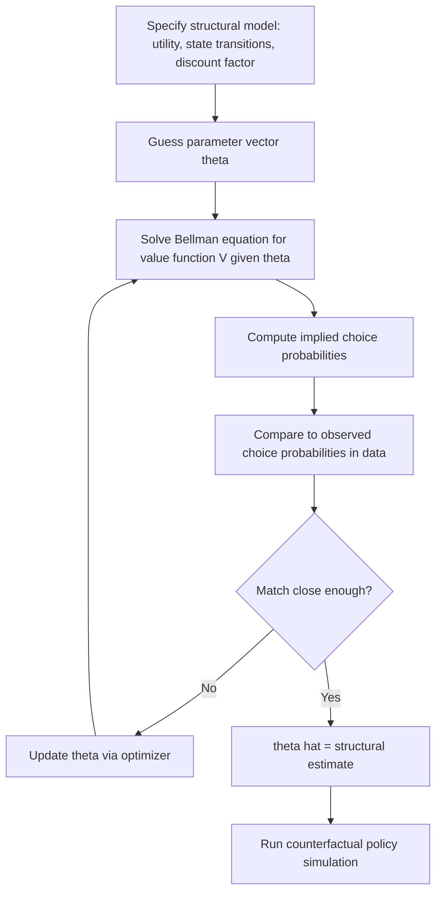

## Structural versus Reduced-Form Estimation

### Overview

Structural and reduced-form approaches represent two philosophies for connecting economic theory to data. Reduced-form estimation targets statistical relationships between observables — treatment effects, correlations, forecast functions — with minimal reliance on a fully specified behavioral model. Structural estimation recovers the deep parameters of an explicit economic model (preferences, technology, information sets, equilibrium concepts), enabling counterfactual policy simulation beyond the support of observed data.

### Formal Distinction

**Key Points**

- **Reduced-form models** estimate a statistical relationship, e.g., $Y = X\beta + \varepsilon$, where $\beta$ captures the net effect of $X$ on $Y$ as realized through whatever behavioral/equilibrium mechanisms generated the data, without explicitly modeling those mechanisms
- **Structural models** specify the underlying economic primitives — e.g., a utility function $U(c; \theta)$, a production function $F(K,L;\theta)$, or an equilibrium concept (Nash, competitive equilibrium) — and estimate the deep parameters $\theta$ that generate observed behavior through optimization and market clearing
- The reduced form is typically the *observational implication* of a structural model — for a correctly specified structural model, there exists a mapping from structural parameters $\theta$ to reduced-form parameters, though the reverse mapping (recovering $\theta$ from reduced-form estimates) may not be unique — this is the identification problem

### Illustration: Structural Parameters vs. Reduced-Form Coefficients (svg_diagram)

<svg xmlns="http://www.w3.org/2000/svg" viewBox="0 0 760 260" font-family="sans-serif">
<text x="380" y="20" text-anchor="middle" font-size="16" font-weight="bold">Mapping from Structural Model to Reduced Form (svg_diagram)</text>
<rect x="40" y="60" width="220" height="120" fill="#eef4ff" stroke="#333" rx="8" />
<text x="150" y="85" text-anchor="middle" font-size="12" font-weight="bold">Structural Primitives θ</text>
<text x="150" y="110" text-anchor="middle" font-size="11">Preferences, technology,</text>
<text x="150" y="128" text-anchor="middle" font-size="11">information sets,</text>
<text x="150" y="146" text-anchor="middle" font-size="11">equilibrium concept</text>
<line x1="260" y1="120" x2="380" y2="120" stroke="#333" stroke-width="2" marker-end="url(#arr2)" />
<text x="320" y="110" text-anchor="middle" font-size="10">solve model</text>
<rect x="380" y="60" width="220" height="120" fill="#f5f5f5" stroke="#333" rx="8" />
<text x="490" y="85" text-anchor="middle" font-size="12" font-weight="bold">Reduced-Form Coefficients</text>
<text x="490" y="110" text-anchor="middle" font-size="11">Statistical relationships</text>
<text x="490" y="128" text-anchor="middle" font-size="11">among observables</text>
<text x="490" y="146" text-anchor="middle" font-size="11">(β, treatment effects)</text>
<path d="M 490 180 Q 320 220 150 180" stroke="#a00" stroke-width="1.5" fill="none" stroke-dasharray="4,3" marker-end="url(#arr2)" />
<text x="320" y="235" text-anchor="middle" font-size="10" fill="#a00">recovery not always unique (identification problem)</text>
</svg>

### Comparative Table

| Dimension | Reduced-Form | Structural |
| --- | --- | --- |
| Object of estimation | Statistical association / treatment effect | Deep behavioral/technological parameters |
| Theoretical content | Minimal; theory motivates specification but isn't embedded in estimator | Full economic model embedded in likelihood/moments |
| Identification source | Natural experiments, instruments, discontinuities | Model's equilibrium restrictions + exclusion restrictions |
| Robustness to misspecification | Relatively robust — fewer functional form assumptions | Sensitive — invalid model assumptions propagate to all estimates |
| Counterfactual scope | Limited to variation observed in the data (local, near the identifying variation) | Can simulate policies never observed (out-of-sample counterfactuals), conditional on model validity |
| Typical estimators | 2SLS, DiD, RD, matching | Maximum Likelihood, GMM, Simulated Method of Moments (SMM), Nested Fixed Point (NFXP) |
| External validity | Often local (LATE); may not extrapolate to different populations/policies | In principle general, if the structural model is correctly specified |
| Computational burden | Typically lower | Often substantially higher (numerical solving of equilibrium/dynamic programs) |

### The Lucas Critique as Motivation for Structural Estimation

**Key Points**

Robert Lucas (1976) argued that reduced-form relationships estimated under one policy regime are not stable under a *different* policy regime, because economic agents' decision rules depend on their expectations about policy, which change when policy changes. A reduced-form Phillips curve estimated under one monetary regime, for instance, may not describe behavior under a new regime because agents' expectations formation shifts. Structural models, by explicitly parameterizing preferences and expectations (taken to be policy-invariant "deep" parameters), aim to remain stable across policy regimes, enabling valid counterfactual policy analysis.

[Inference] Whether structural "deep parameters" are truly policy-invariant in any given application is itself an assumption, not a guarantee — a common critique of structural work is that the claimed deep parameters may themselves be reduced-form objects with respect to some even deeper, unmodeled structure.

### Estimation Methods for Structural Models

**Maximum Likelihood Estimation (MLE)**

When the structural model fully specifies the distribution of outcomes given parameters, $\theta$ is estimated by maximizing the likelihood:

$$\hat\theta_{MLE} = \arg\max_\theta \sum_{i=1}^n \ln L(Y_i, X_i; \theta)$$

Requires a complete parametric specification of error distributions and choice probabilities (e.g., in discrete choice structural models).

**Generalized Method of Moments (GMM)**

Matches theoretical moments implied by the structural model to empirical moments, without requiring full distributional assumptions:

$$\hat\theta_{GMM} = \arg\min_\theta \; g_n(\theta)' W g_n(\theta)$$

where $g_n(\theta) = \frac{1}{n}\sum_i m(Y_i, X_i; \theta)$ is the sample moment vector and $W$ is a weighting matrix (optimally, the inverse of the moment covariance matrix for efficiency).

**Simulated Method of Moments (SMM) / Indirect Inference**

When the structural model's implied moments have no closed form (common in dynamic, nonlinear, or general equilibrium models), moments are computed via simulation:

1. Simulate data from the structural model at candidate $\theta$
2. Compute simulated moments and compare to empirical moments
3. Update $\theta$ to minimize the distance between simulated and empirical moments

**Nested Fixed Point Algorithm (NFXP, Rust 1987)**

For dynamic discrete choice models (e.g., Rust's bus engine replacement model), the outer loop searches over structural parameters $\theta$ while an inner loop solves the dynamic programming (Bellman) fixed point for the value function at each candidate $\theta$:

$$V(x;\theta) = \max_{a} \left[u(x,a;\theta) + \beta E[V(x';\theta)|x,a]\right]$$

**Conditional Choice Probability (CCP) Estimators (Hotz-Miller)**

Avoid repeatedly solving the full dynamic program by inverting observed choice probabilities to recover value function differences directly, substantially reducing computational cost relative to NFXP.

### Diagram: Structural Estimation Workflow (Dynamic Discrete Choice Example)

### Tradeoffs in Practice

**Key Points**

- **Credibility vs. scope**: reduced-form designs (RCTs, RD, DiD) offer high credibility for the specific causal question they answer but limited scope for policy counterfactuals outside the observed variation; structural models offer broad counterfactual scope but credibility hinges on the validity of the entire specified model
- **Transparency**: reduced-form results are easier for readers to audit (fewer assumptions to interrogate); structural results require scrutinizing functional form choices, distributional assumptions, and equilibrium concepts, which are harder to fully verify
- **The "credibility revolution" in applied microeconometrics** (Angrist & Pischke) has emphasized reduced-form, design-based identification as more transparent than structural approaches reliant on strong, often untested, functional form and equilibrium assumptions
- **Industrial organization and macroeconomics** more heavily favor structural approaches (e.g., demand estimation via BLP, dynamic discrete choice, DSGE models) because policy counterfactuals of interest (new market entry, merger simulation, monetary policy rule changes) inherently require extrapolation beyond observed historical variation

### Hybrid Approaches: Structural Estimation Disciplined by Reduced-Form Evidence

- **Sufficient statistics approach** (Chetty): uses reduced-form causal estimates (e.g., an elasticity) as direct inputs into welfare calculations, sidestepping the need to fully specify and estimate an entire structural model while retaining some capacity for policy counterfactuals
- **Structural models validated against quasi-experimental variation**: increasingly common practice is to estimate structural parameters using methods that explicitly target matching a credible reduced-form causal estimate (e.g., an IV-estimated elasticity) as one of the GMM moments, combining structural counterfactual scope with reduced-form credibility for at least part of the parameter space

### Practical Decision Framework

**Next Steps**

1. Define the required scope: does the research question need only local causal identification (an average treatment effect) or true out-of-sample counterfactual policy simulation?
2. If counterfactual simulation is required (e.g., predicting outcomes under a policy never observed), a structural model is generally necessary
3. If a credible natural experiment or instrument exists for the specific parameter of interest, reduced-form estimation offers superior transparency and credibility for that narrower question
4. Where feasible, use reduced-form causal estimates to discipline or validate key structural parameters/moments (hybrid approach)
5. Explicitly report the structural model's untestable identifying assumptions (functional forms, equilibrium concept, distributional assumptions) alongside estimates, since these cannot be verified from the reduced form alone

### Related Topics

- The Lucas Critique and Policy Invariance of Deep Parameters
- Dynamic Discrete Choice Models (Rust's NFXP, Hotz-Miller CCP Estimators)
- BLP Demand Estimation in Industrial Organization
- Sufficient Statistics Approach to Welfare Analysis (Chetty)
- Simulated Method of Moments and Indirect Inference
- DSGE Model Estimation via Bayesian Methods