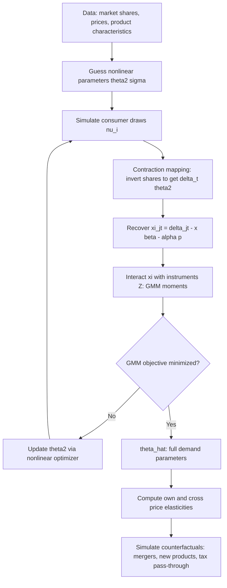

## Structural Demand Estimation (BLP Method)

### Overview

The BLP method (Berry, Levinsohn, Pakes, 1995) estimates demand systems for differentiated products using market-level (aggregate) data, recovering consumer-level preference parameters — including realistic own- and cross-price elasticities — without requiring individual-level purchase data. It addresses two central problems in demand estimation: the endogeneity of prices (firms set prices partly in response to unobserved product quality) and the need for flexible, realistic substitution patterns across a potentially large number of differentiated products.

### The Random Coefficients Logit Framework

**Key Points**

Consumer $i$'s indirect utility from product $j$ in market $t$ is specified as:

$$u_{ijt} = x_{jt}\beta_i + \alpha_i p_{jt} + \xi_{jt} + \varepsilon_{ijt}$$

where $x_{jt}$ are observed product characteristics, $p_{jt}$ is price, $\xi_{jt}$ is unobserved (to the econometrician) product quality, and $\varepsilon_{ijt}$ is a idiosyncratic taste shock, typically assumed i.i.d. Type I Extreme Value (logit).

Individual-level taste parameters vary across consumers:

$$\beta_i = \bar\beta + \Sigma \nu_i, \quad \nu_i \sim N(0, I)$$

so that $(\beta_i, \alpha_i)$ combine a mean preference $(\bar\beta, \bar\alpha)$ common across consumers with a random deviation $\Sigma \nu_i$, allowing heterogeneous price sensitivity and taste for characteristics across the population — this is what generates realistic substitution patterns (unlike standard logit's restrictive Independence of Irrelevant Alternatives property).

The outside option (not purchasing any product in the category) is normalized to utility $u_{i0t} = \varepsilon_{i0t}$.

### Why Standard Logit Fails: The IIA Problem

**Key Points**

In a standard (homogeneous-coefficient) logit model, the ratio of choice probabilities between any two products is independent of the characteristics of all other products (Independence of Irrelevant Alternatives). This implies cross-price elasticities are proportional only to market shares, not to product similarity — e.g., a price increase for a compact car would be predicted to divert equal *proportional* shares to a luxury sedan and to another compact car, which contradicts realistic substitution patterns where consumers switch to *similar* products. Random coefficients relax IIA by allowing correlated tastes across similar products.

### Aggregation to Market Shares

**Key Points**

Since only aggregate market shares (not individual choices) are observed, the model integrates individual choice probabilities over the assumed distribution of consumer heterogeneity:

$$s_{jt}(\delta_t, \theta_2) = \int \frac{\exp(\delta_{jt} + \mu_{ijt}(\theta_2))}{1 + \sum_{k=1}^{J_t} \exp(\delta_{kt} + \mu_{ikt}(\theta_2))} \, dF(\nu_i)$$

where $\delta_{jt} = x_{jt}\bar\beta + \bar\alpha p_{jt} + \xi_{jt}$ is the **mean utility** (common across consumers) and $\mu_{ijt}(\theta_2) = [x_{jt}, p_{jt}]\Sigma\nu_i$ is the individual deviation, governed by the variance parameters $\theta_2 = \Sigma$. This integral has no closed form and is evaluated via simulation (Monte Carlo or quasi-Monte Carlo draws of $\nu_i$).

### The Contraction Mapping (Berry's Inversion)

**Key Points**

For any candidate $\theta_2$, the mean utility vector $\delta_t$ that equates predicted shares $s_{jt}(\delta_t, \theta_2)$ to observed shares $S_{jt}$ is recovered via Berry's (1994) contraction mapping:

$$\delta_t^{(r+1)} = \delta_t^{(r)} + \ln(S_{jt}) - \ln\big(s_{jt}(\delta_t^{(r)}, \theta_2)\big)$$

iterated to convergence. This mapping is a contraction under standard regularity conditions, guaranteeing a unique fixed point $\delta_t(\theta_2)$ for each candidate $\theta_2$. Once $\delta_{jt}$ is recovered, the linear index $x_{jt}\bar\beta + \bar\alpha p_{jt} + \xi_{jt} = \delta_{jt}$ yields the structural error:

$$\xi_{jt}(\theta_2) = \delta_{jt}(\theta_2) - x_{jt}\bar\beta - \bar\alpha p_{jt}$$

### Addressing Price Endogeneity: Instruments

**Key Points**

Price $p_{jt}$ is correlated with $\xi_{jt}$ (unobserved quality) because firms observe $\xi_{jt}$ and set prices accordingly — a textbook simultaneity problem. GMM estimation requires instruments $Z_{jt}$ satisfying $E[\xi_{jt} Z_{jt}] = 0$:

- **"BLP instruments"**: characteristics of *competing* products (own and rivals'), exploiting that rivals' characteristics shift markup incentives via competitive interaction without directly entering product $j$'s utility
- **Cost-shifter instruments**: input prices, factor costs, or other observable supply-side shifters correlated with price but excluded from the demand equation
- **Hausman instruments**: prices of the same product in other, geographically separated markets, exploiting common cost shocks while assuming demand shocks are market-specific (controversial — can violate exclusion if common demand shocks exist across markets, e.g., national advertising)

[Inference] The validity of BLP-style rival-characteristic instruments is generally considered stronger under an assumption of exogenous product characteristics (i.e., characteristics are not themselves chosen in anticipation of $\xi_{jt}$), an assumption that is more plausible in some industries than others.

### GMM Estimation Procedure

The full parameter vector $(\bar\beta, \bar\alpha, \Sigma) = (\theta_1, \theta_2)$ is estimated by GMM, minimizing:

$$\hat\theta = \arg\min_{\theta_1, \theta_2} \; \xi(\theta_1,\theta_2)' Z \, W \, Z' \xi(\theta_1,\theta_2)$$

where $Z$ is the instrument matrix and $W$ is a GMM weighting matrix (optimally, the inverse of $Z'\xi\xi'Z$).

**Nested structure**: for any candidate $\theta_2$ (nonlinear parameters), $\delta_t(\theta_2)$ is recovered via the contraction mapping, then $\theta_1$ (linear parameters $\bar\beta, \bar\alpha$) is recovered by linear IV/2SLS of $\delta_{jt}$ on $(x_{jt}, p_{jt})$ instrumented by $Z_{jt}$. The outer nonlinear search is only over $\theta_2$, substantially reducing dimensionality relative to searching over the full parameter vector jointly.

### Diagram: BLP Estimation Algorithm

### Illustration: Substitution Patterns — Logit vs. Random Coefficients (svg_diagram)

<svg xmlns="http://www.w3.org/2000/svg" viewBox="0 0 760 260" font-family="sans-serif">
<text x="380" y="20" text-anchor="middle" font-size="16" font-weight="bold">Cross-Price Substitution: Standard Logit vs. BLP (svg_diagram)</text>

<text x="190" y="45" text-anchor="middle" font-size="12" font-weight="bold">Standard Logit (IIA)</text>

<circle cx="120" cy="120" r="24" fill="`#cde4ff`" stroke="#333" />

<text x="120" y="125" text-anchor="middle" font-size="10">Compact A</text>

<circle cx="260" cy="120" r="24" fill="`#cde4ff`" stroke="#333" />

<text x="260" y="125" text-anchor="middle" font-size="10">Luxury B</text>

<line x1="144" y1="120" x2="236" y2="120" stroke="#333" stroke-width="2" />

<text x="190" y="170" text-anchor="middle" font-size="10">Equal proportional diversion</text>

<text x="190" y="185" text-anchor="middle" font-size="10">regardless of similarity</text>

<text x="570" y="45" text-anchor="middle" font-size="12" font-weight="bold">BLP Random Coefficients</text>

<circle cx="500" cy="120" r="24" fill="`#ffd9d9`" stroke="#333" />

<text x="500" y="125" text-anchor="middle" font-size="10">Compact A</text>

<circle cx="580" cy="120" r="24" fill="`#ffd9d9`" stroke="#333" />

<text x="580" y="125" text-anchor="middle" font-size="9">Compact A2</text>

<circle cx="700" cy="170" r="20" fill="`#e8e8e8`" stroke="#333" />

<text x="700" y="175" text-anchor="middle" font-size="9">Luxury B</text>

<line x1="524" y1="120" x2="556" y2="120" stroke="#a00" stroke-width="3" />

<line x1="590" y1="135" x2="682" y2="163" stroke="#333" stroke-width="1" stroke-dasharray="3,2" />

<text x="600" y="220" text-anchor="middle" font-size="10">Strong diversion to similar products,</text>

<text x="600" y="235" text-anchor="middle" font-size="10">weak diversion to dissimilar ones</text>

</svg>

### Post-Estimation: Elasticities and Counterfactuals

**Own- and Cross-Price Elasticities**

$$\frac{\partial s_{jt}}{\partial p_{kt}} = \begin{cases} \displaystyle\int -\alpha_i \, s_{ijt}(1-s_{ijt}) \, dF(\nu_i) & j = k \\[8pt] \displaystyle\int \alpha_i \, s_{ijt}\, s_{ikt} \, dF(\nu_i) & j \neq k \end{cases}$$

These integrals are again evaluated via simulation over consumer draws, and because $\alpha_i$ varies across consumers, elasticities depend on the full distribution of price sensitivity, not just the mean.

**Merger Simulation**

Given estimated demand parameters and an assumed supply-side model (typically Bertrand-Nash price competition with multi-product firms), counterfactual post-merger prices are solved from first-order conditions incorporating the merged firm's internalization of cross-product externalities, enabling simulation of predicted price effects absent the merger having occurred — a canonical application in antitrust economics.

**New Product Introduction / Tax Incidence**

The same demand system supports welfare and pass-through analysis for hypothetical new products or tax policy changes, since $\bar\beta, \bar\alpha, \Sigma$ are structural (preference) parameters assumed invariant to these counterfactual changes.

### Computational and Practical Challenges

**Key Points**

- **Numerical instability of the contraction mapping**: convergence can be slow or numerically fragile for products with very small market shares; alternative fixed-point formulations (e.g., in logit-share space) have been proposed to improve stability
- **Simulation error**: a finite number of consumer draws introduces simulation noise into the GMM objective; too few draws can bias estimates and inflate standard errors — quasi-Monte Carlo (Halton sequences) is commonly used to reduce simulation variance for a given number of draws
- **Local optima**: the nonlinear GMM objective in $\theta_2$ is not guaranteed globally convex; multiple starting values are standard practice
- **Weak identification of variance parameters $\Sigma$**: with limited price/characteristic variation, the random coefficients' variances can be poorly identified in practice, producing large standard errors on taste heterogeneity parameters

[Inference] The severity of contraction mapping convergence issues and simulation error is highly dependent on the specific dataset's share distribution and the number of products per market, so general-purpose robustness cannot be assumed without diagnostics specific to the application.

### Extensions

- **Micro-BLP / matching with individual-level data**: incorporating individual-level demographic data (e.g., household income) alongside aggregate shares tightens identification of random coefficients by directly matching observed correlations between demographics and choices
- **Nested/mixed logit hybrids**: combining nesting structures with random coefficients for additional flexibility in substitution patterns
- **Dynamic BLP**: extending to settings with durable goods, storable goods, or forward-looking consumers, requiring integration with dynamic discrete choice methods

### Practical Workflow

**Next Steps**

1. Assemble market-level data: shares, prices, product characteristics across multiple markets/time periods
2. Specify the random coefficients structure — which characteristics have heterogeneous (vs. fixed) taste parameters
3. Construct valid price instruments (BLP rival-characteristic instruments, cost shifters) satisfying the exclusion restriction
4. Implement the nested GMM/contraction-mapping algorithm (or use established software: PyBLP in Python, the R `BLPestimatoR` package, or Stata's `blp` command)
5. Validate convergence and check sensitivity to starting values, number of simulation draws, and instrument set before proceeding to counterfactual simulation

### Related Topics

- Nested Fixed Point Algorithms and Berry's Contraction Mapping
- Merger Simulation and Antitrust Applications of Demand Estimation
- Micro-BLP: Combining Aggregate and Individual-Level Data
- Dynamic Discrete Choice Models for Durable Goods Demand
- Instrument Validity in Differentiated Products Markets
- Nested Logit and Mixed Logit Discrete Choice Models