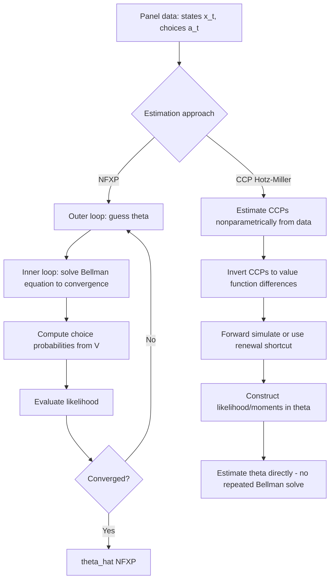

## Dynamic Discrete Choice Models

### Overview

Dynamic discrete choice (DDC) models estimate structural parameters governing forward-looking agents who choose among a finite set of alternatives repeatedly over time, trading off current payoffs against the expected future consequences of their choices. These models embed a dynamic programming problem inside the econometric estimator, recovering primitives — per-period utility/cost functions, discount factors, and state transition dynamics — that rationalize observed sequential choice behavior and support counterfactual policy simulation.

### The Canonical Framework

**Key Points**

An agent in state $x_t$ chooses action $a_t \in A$ to maximize expected discounted utility:

$$V(x_t) = \max_{a_t \in A} \; \Big[ u(x_t, a_t; \theta) + \varepsilon_t(a_t) + \beta \, E\big[V(x_{t+1}) \mid x_t, a_t\big] \Big]$$

where $u(x_t, a_t;\theta)$ is the structural per-period payoff (parameterized by $\theta$), $\varepsilon_t(a_t)$ is an action-specific unobserved shock (typically i.i.d. Type I Extreme Value), $\beta \in (0,1)$ is the discount factor, and the expectation is taken over the state transition density $p(x_{t+1}|x_t, a_t)$.

Assuming **conditional independence** ($\varepsilon_t$ i.i.d. across actions, independent of $x_t$) and Type I EV errors, the model reduces to a **logit-like** choice probability at each state, conditional on the *ex-ante* value function:

$$\bar{V}(x_t) = \ln \sum_{a \in A} \exp\big[u(x_t,a;\theta) + \beta E[\bar{V}(x_{t+1})|x_t,a]\big] + \gamma$$

(the Rust/Hotz-Miller "logit inclusive value," with $\gamma$ the Euler-Mascheroni constant).

### Rust's Bus Engine Replacement Model (Canonical Example)

**Key Points**

Rust (1987) models a bus maintenance manager's decision to replace ($a=1$) or continue operating ($a=0$) a bus engine each period, given mileage $x_t$ since last replacement.

$$u(x_t, a_t; \theta) = \begin{cases} -c(x_t; \theta_1) & a_t = 0 \text{ (continue)} \\ -RC - c(0;\theta_1) & a_t = 1 \text{ (replace)} \end{cases}$$

where $c(x;\theta_1)$ is the (increasing) maintenance cost function and $RC$ is the replacement cost parameter. Mileage evolves stochastically forward when continuing, and resets to (near) zero upon replacement. The structural parameters $(\theta_1, RC, \beta)$ are recovered from panel data on replacement decisions and mileage, disciplined by the dynamic optimality conditions implied by the Bellman equation.

### Estimation Methods

**Nested Fixed Point Algorithm (NFXP, Rust 1987)**

**Key Points**

1. **Outer loop**: search over structural parameters $\theta$ using a nonlinear optimizer (maximizing the likelihood of observed choices)
2. **Inner loop**: for each candidate $\theta$, solve the Bellman equation to convergence via value function iteration (or Newton-Kantorovich iteration for faster convergence), obtaining $\bar{V}(x;\theta)$ at every state
3. Construct choice probabilities from the converged value function (logit formula above) and evaluate the log-likelihood
4. Iterate the outer loop until convergence

**Computational cost**: the inner loop requires re-solving the full dynamic program at every candidate parameter vector, which is computationally expensive for large or continuous state spaces — a central practical limitation of NFXP.

**Conditional Choice Probability (CCP) Estimators (Hotz-Miller 1993, Hotz-Miller-Sanders-Smith 1994)**

**Key Points**

Avoids repeatedly solving the dynamic program by exploiting a key insight: under the conditional independence and extreme-value error assumptions, there exists an invertible mapping between **observed conditional choice probabilities** and **differences in value functions**. Since CCPs can be estimated directly and flexibly from the data (e.g., via nonparametric frequency estimators or a flexible logit), the value function differences needed to form the likelihood can be *recovered from the data* rather than solved via the Bellman equation.

**Two-step procedure**:

1. **First stage**: estimate CCPs $\hat{P}(a|x)$ nonparametrically or semiparametrically from observed choice frequencies at each state
2. **Second stage**: use $\hat P(a|x)$, the Hotz-Miller inversion, and forward simulation (or the Hotz-Miller-Sanders-Smith renewal-based shortcut) to construct the likelihood/moment conditions in terms of $\theta$, then estimate $\theta$ by (pseudo) maximum likelihood or GMM without repeatedly re-solving the dynamic program

CCP estimators are substantially faster computationally than NFXP because the inner fixed-point solve is replaced by a one-time nonparametric estimation step, at some cost in finite-sample efficiency relative to full-solution likelihood methods.

### Diagram: NFXP vs. CCP Estimation Architecture

### Identification of Dynamic Discrete Choice Models

**Key Points**

- **Discount factor $\beta$ is generally not separately identified from the per-period utility function** without additional structure (Magnac-Thesmar 2002; Rust 1994) — the same choice data can typically be rationalized by many $(\beta, u(\cdot))$ combinations, so $\beta$ is commonly calibrated (e.g., to a market interest rate) rather than estimated
- Exclusion restrictions (state variables affecting transitions but not directly entering current utility, or vice versa) aid identification of the per-period utility function separately from the value of continuation
- **Finite-dependence properties** (Arcidiacono-Miller) can restore identification and reduce the computational burden of CCP estimation by exploiting states where different choice paths converge to a common future state within a small, finite number of periods — avoiding the need to simulate infinitely forward

[Inference] The Magnac-Thesmar non-identification result for $\beta$ is a well-established theoretical finding, though the practical severity of this issue (how much counterfactual predictions actually vary with an uncalibrated $\beta$) depends on the specific application and functional form assumptions.

### Diagram: Finite Dependence Intuition (svg_diagram)

<svg xmlns="http://www.w3.org/2000/svg" viewBox="0 0 760 260" font-family="sans-serif">
<text x="380" y="20" text-anchor="middle" font-size="16" font-weight="bold">Finite Dependence: Paths Converging to a Common State (svg_diagram)</text>
<circle cx="120" cy="130" r="26" fill="#cde4ff" stroke="#333" />
<text x="120" y="135" text-anchor="middle" font-size="11">x_t</text>
<circle cx="320" cy="70" r="24" fill="#f5f5f5" stroke="#333" />
<text x="320" y="75" text-anchor="middle" font-size="10">Path A: a=1</text>
<circle cx="320" cy="190" r="24" fill="#f5f5f5" stroke="#333" />
<text x="320" y="195" text-anchor="middle" font-size="10">Path B: a=0</text>
<circle cx="560" cy="130" r="26" fill="#ffd9d9" stroke="#333" />
<text x="560" y="128" text-anchor="middle" font-size="10">Common</text>
<text x="560" y="142" text-anchor="middle" font-size="10">future state</text>
<line x1="144" y1="122" x2="298" y2="80" stroke="#333" marker-end="url(#arr3)" />
<line x1="144" y1="138" x2="298" y2="180" stroke="#333" marker-end="url(#arr3)" />
<line x1="342" y1="80" x2="538" y2="122" stroke="#333" marker-end="url(#arr3)" />
<line x1="342" y1="180" x2="538" y2="138" stroke="#333" marker-end="url(#arr3)" />

<text x="340" y="240" text-anchor="middle" font-size="10">Both action paths reach the same state after k periods —</text>

<text x="340" y="255" text-anchor="middle" font-size="10">future value terms cancel, avoiding full forward simulation</text>

</svg>

### Extensions to the Baseline Framework

**Key Points**

- **Unobserved heterogeneity**: finite mixture models (e.g., Kasahara-Shimotsu) or random effects allow for latent types with distinct preference parameters, relaxing the conditional independence assumption's implicit homogeneity
- **Serially correlated unobservables**: relaxing i.i.d. $\varepsilon_t$ requires alternative estimation approaches (e.g., Bayesian methods with data augmentation, or Arcidiacono-Miller's EM-based approach for finite mixtures)
- **Continuous state/action spaces**: approximate dynamic programming methods (value function approximation, e.g., via Chebyshev polynomials or neural networks) replace exact discretized Bellman solving for tractability
- **Multi-agent dynamic games**: extending single-agent DDC to strategic settings (e.g., Bajari-Benkard-Levin two-step estimators, Pakes-Ostrovsky-Berry) where agents' state transitions depend on rivals' actions, requiring equilibrium concepts (Markov Perfect Equilibrium) for identification
- **Machine learning-augmented DDC**: recent literature explores using flexible ML methods (e.g., random forests, neural nets) to estimate the first-stage CCPs or state transition densities nonparametrically before the second-stage structural estimation, in the spirit of double/debiased ML

### Applications in Econometrics

**Key Points**

- Labor economics: dynamic models of occupational choice, human capital investment, retirement timing
- Industrial organization: firm entry/exit dynamics, technology adoption, inventory/investment decisions
- Health economics: dynamic models of healthcare utilization, smoking cessation, insurance plan choice
- Marketing: dynamic models of brand choice incorporating stockpiling and habit formation

### Practical Workflow

**Next Steps**

1. Specify the state space, action space, per-period utility function, and state transition process explicitly
2. Assess whether the discount factor can be credibly calibrated externally, since it is typically not separately identified from utility parameters
3. Choose between NFXP (higher computational cost, potentially more efficient) and CCP/Hotz-Miller estimators (lower computational cost, especially valuable for large state spaces), informed by state space dimensionality and available computational resources
4. If applicable, exploit finite dependence properties (Arcidiacono-Miller) to reduce the computational burden of CCP-based estimation
5. Validate the estimated model's fit to observed choice frequencies and transition dynamics before proceeding to counterfactual policy simulation

### Related Topics

- Rust's NFXP Algorithm and Bellman Equation Contraction Mappings
- Hotz-Miller CCP Inversion and Finite Dependence (Arcidiacono-Miller)
- Magnac-Thesmar Non-Identification of the Discount Factor
- Dynamic Discrete Games and Markov Perfect Equilibrium (Bajari-Benkard-Levin)
- Unobserved Heterogeneity via Finite Mixture Models (Kasahara-Shimotsu)
- Approximate Dynamic Programming for Continuous State Spaces