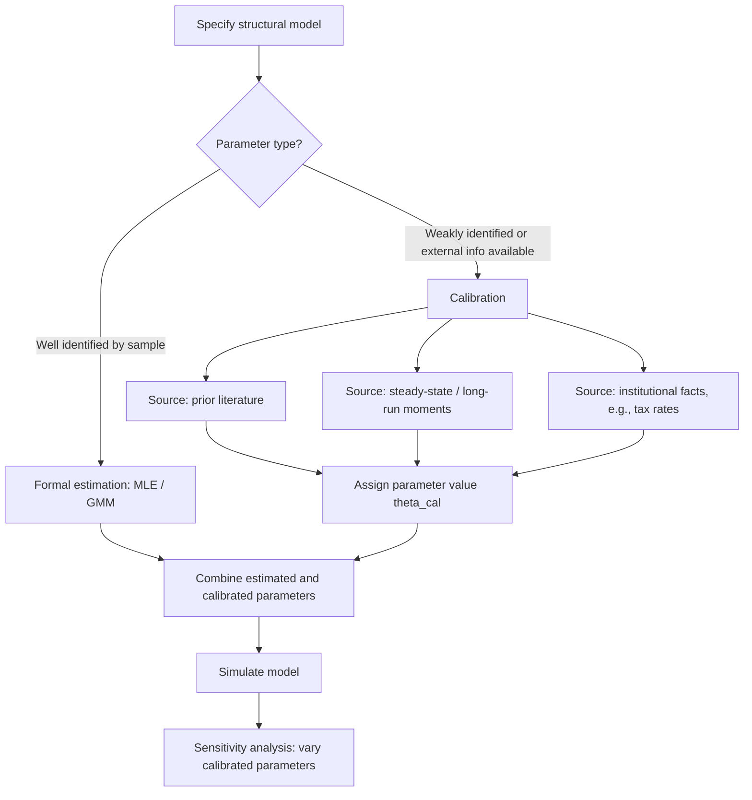

## Calibration Methods

### Overview

Calibration assigns numerical values to structural model parameters using external information, theoretical restrictions, or matching to a small set of target moments — as an alternative or complement to formal statistical estimation (MLE, GMM). Calibration is most closely associated with macroeconomics (following Kydland-Prescott's use in real business cycle models) but is widely used across structural econometrics whenever certain parameters are weakly identified by the estimation sample, or when external, more reliable sources of information exist.

### Calibration vs. Estimation

**Key Points**

| Dimension | Calibration | Formal Estimation (MLE/GMM) |
| --- | --- | --- |
| Source of parameter values | Prior studies, steady-state theory, institutional facts, micro data external to the sample | Data sample at hand, via a defined statistical procedure |
| Standard errors | Typically not formally reported (or only via informal sensitivity analysis) | Formal sampling distribution of the estimator |
| Target | Matching a small set of moments or known steady-state relationships | Minimizing a well-defined statistical objective (likelihood, GMM criterion) |
| Uncertainty quantification | Often informal (sensitivity/robustness checks) | Formal (standard errors, confidence intervals) |
| Typical use case | Parameters weakly identified by the available sample, or where credible external estimates exist (e.g., discount factor from interest rates) | Parameters well identified by within-sample variation |

Calibration is not the absence of discipline — well-executed calibration draws on the same identification logic as GMM (matching model-implied moments to data moments) but often uses moments external to the primary estimation sample, or imposes values with strong independent justification (e.g., a capital share of $\alpha \approx 1/3$ from national accounts data).

### Steady-State / Moment-Matching Calibration

**Key Points**

The classic RBC calibration approach (Kydland-Prescott 1982) sets structural parameters so that the model's steady state matches long-run averages of macroeconomic aggregates observed in the data:

$$\theta_{cal} = \arg\min_\theta \; \left\| m^{data} - m^{model}(\theta) \right\|$$

where $m^{data}$ are empirical long-run moments (e.g., capital-output ratio, labor share, consumption-output ratio) and $m^{model}(\theta)$ are the corresponding steady-state values implied by the model at parameter vector $\theta$. Unlike GMM, this is often solved by direct algebraic inversion of the steady-state equations rather than iterative numerical minimization, when the mapping from $\theta$ to $m^{model}$ is analytically tractable.

**Example**

The discount factor $\beta$ in a standard neoclassical growth model is commonly calibrated from the steady-state Euler equation:

$$\beta = \frac{1}{1 + r^{ss}}$$

where $r^{ss}$ is a long-run real interest rate observed in the data (e.g., average real return on capital), rather than estimated jointly with other parameters — directly exploiting the closed-form steady-state relationship.

### Diagram: Calibration Workflow

### Simulated Method of Moments as Formalized Calibration

**Key Points**

Simulated Method of Moments (SMM) can be viewed as a formalization of moment-matching calibration with an explicit statistical objective and standard errors:

$$\hat\theta_{SMM} = \arg\min_\theta \; \big[m^{data} - m^{sim}(\theta)\big]' W \big[m^{data} - m^{sim}(\theta)\big]$$

where $m^{sim}(\theta)$ are moments computed from data simulated at candidate $\theta$ (used when the model has no closed-form mapping from $\theta$ to moments), and $W$ is a weighting matrix. Unlike informal calibration, SMM delivers a formal asymptotic sampling distribution for $\hat\theta$, enabling standard errors and hypothesis tests — this is a key practical distinction: informal calibration typically forgoes this formal inference machinery in favor of transparency and computational simplicity.

### Sensitivity Analysis for Calibrated Parameters

**Key Points**

Because calibrated parameters lack formal standard errors, robustness is typically assessed via:

- **Local sensitivity analysis**: re-solving/re-simulating the model across a grid of plausible values for each calibrated parameter and reporting how key outcomes (e.g., counterfactual policy effects) change
- **Andrews-Gentzkow-Shapiro (2017) formal sensitivity measures**: a more recent, formalized approach quantifying how sensitive a GMM/SMM-estimated parameter of interest is to the calibrated (fixed) parameters, via a local sensitivity matrix:

$$\Lambda = -\left(\frac{\partial g}{\partial \theta_1}\right)^{-1} \frac{\partial g}{\partial \theta_2}$$

relating changes in freely estimated parameters $\theta_1$ to changes in fixed/calibrated parameters $\theta_2$, given moment conditions $g(\theta_1, \theta_2)$. This provides a systematic, reportable measure of how much conclusions depend on specific calibration choices, rather than an ad hoc grid search.

### Illustration: Sensitivity of Estimated Parameter to Calibrated Input (svg_diagram)

<svg xmlns="http://www.w3.org/2000/svg" viewBox="0 0 700 260" font-family="sans-serif">
<text x="350" y="20" text-anchor="middle" font-size="16" font-weight="bold">Sensitivity of θ₁ (estimated) to θ₂ (calibrated) (svg_diagram)</text>
<line x1="80" y1="220" x2="620" y2="220" stroke="#333" stroke-width="1.5" />
<line x1="80" y1="220" x2="80" y2="50" stroke="#333" stroke-width="1.5" />
<text x="350" y="245" text-anchor="middle" font-size="11">Calibrated parameter θ₂ (e.g., discount factor β)</text>
<text x="35" y="135" text-anchor="middle" font-size="11" transform="rotate(-90 35 135)">Estimated θ₁</text>
<path d="M 100 200 L 250 150 L 400 100 L 550 60" stroke="#2b6cb0" stroke-width="2.5" fill="none" />
<circle cx="330" cy="120" r="5" fill="#a00" />
<text x="330" y="105" text-anchor="middle" font-size="10" fill="#a00">baseline calibration</text>
<line x1="330" y1="220" x2="330" y2="120" stroke="#a00" stroke-dasharray="3,2" />
<text x="330" y="195" text-anchor="middle" font-size="10" fill="#555">steep slope = high sensitivity</text>
</svg>

### Common Sources for Calibrated Values

**Key Points**

- **Prior structural estimates from the literature**: e.g., risk aversion coefficients, elasticities of substitution estimated in other studies with richer identifying variation
- **National accounts / administrative data**: capital shares, depreciation rates, tax rates, government spending shares
- **Micro-level moments external to the estimation sample**: e.g., calibrating a labor supply elasticity from a separate micro-data study while estimating other parameters from macro time series
- **Institutional/regulatory facts**: known policy parameters (statutory tax rates, benefit replacement rates) that are directly observed rather than estimated

### Criticisms and Limitations of Calibration

**Key Points**

- **Lack of formal uncertainty quantification**: informal calibration typically does not propagate parameter uncertainty into reported counterfactual results, potentially overstating the precision of policy conclusions
- **Cherry-picking risk**: because calibration targets are chosen by the researcher rather than dictated by a single objective function, there is scope (whether deliberate or inadvertent) to select calibration targets that favor a preferred result
- **Circularity concern**: calibrating a parameter using moments from a source study that itself relied on a different (possibly inconsistent) structural model can propagate that source model's assumptions invisibly into the current analysis
- **Overidentification is typically absent**: unlike GMM with overidentifying restrictions, simple moment-matching calibration with exactly as many targets as parameters offers no internal specification test of model fit

[Inference] The macroeconomics literature's historical preference for calibration over formal estimation partly reflects the practical difficulty of applying likelihood-based or GMM estimation to full nonlinear DSGE models before modern Bayesian DSGE estimation techniques matured, and the relative balance between calibration and formal estimation in current practice varies by subfield and specific application.

### Bayesian Estimation as a Middle Ground

**Key Points**

Modern **Bayesian DSGE estimation** (following Smets-Wouters and related work) formalizes the intuition behind calibration by encoding prior beliefs about parameter values (often informed by the same sources used in traditional calibration — micro estimates, prior studies) as explicit prior distributions, then updating these priors with the likelihood of the observed macro data to obtain posterior distributions:

$$p(\theta | \text{data}) \propto L(\text{data}|\theta) \, p(\theta)$$

This approach retains calibration's use of external information (via informative priors) while providing formal posterior uncertainty quantification, addressing one of the central criticisms of pure calibration.

### Practical Workflow

**Next Steps**

1. Classify each structural parameter as well-identified by the primary estimation sample, weakly identified, or reliably available from external sources
2. For calibrated parameters, document the specific source (prior study, steady-state relationship, administrative data) and justify its applicability to the current setting
3. Conduct sensitivity analysis on key counterfactual results with respect to calibrated parameter values — ideally using formal measures (e.g., Andrews-Gentzkow-Shapiro sensitivity) rather than only ad hoc grid searches
4. Consider Bayesian estimation with informative priors as a formal alternative when calibration targets and estimation targets can be jointly modeled
5. Report calibrated and estimated parameters transparently and separately, avoiding conflation of their differing levels of statistical rigor

### Related Topics

- Simulated Method of Moments and Indirect Inference
- Bayesian Estimation of DSGE Models (Smets-Wouters Framework)
- Andrews-Gentzkow-Shapiro Measures of Estimator Sensitivity
- Real Business Cycle Theory and Kydland-Prescott Calibration
- Overidentifying Restrictions and Specification Testing in GMM
- External Validity of Structural Parameter Estimates Across Studies