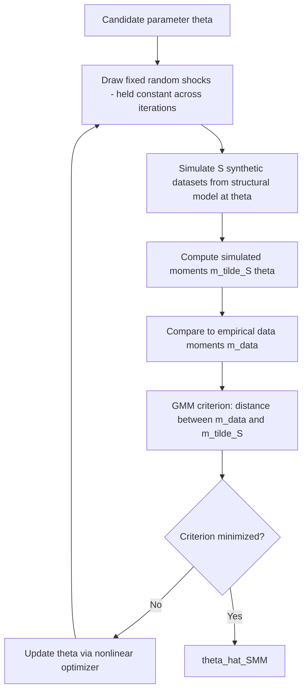

## Simulation-Based Structural Estimation

### Overview

Simulation-based estimation methods recover structural parameters in models where the mapping from parameters to the likelihood or to closed-form moments is analytically intractable — common in dynamic, nonlinear, or high-dimensional structural models. Rather than evaluating an exact likelihood or exact moment function, these methods use simulated data generated from the model at candidate parameter values to approximate the objects needed for estimation.

### Why Simulation Is Necessary

**Key Points**

Many structural models involve integrals with no closed-form solution:

- Multinomial probit choice probabilities require integrating over a multivariate normal distribution with no analytical form for dimension $> 2$
- Random coefficients discrete choice models (e.g., BLP) require integrating over the distribution of unobserved consumer heterogeneity
- Dynamic models with continuous state variables require integrating over stochastic state transitions
- Panel models with serially correlated unobserved heterogeneity require integrating over the individual-specific latent process

Simulation replaces these intractable integrals with Monte Carlo (or quasi-Monte Carlo) approximations, evaluated using pseudo-random (or low-discrepancy) draws from the relevant distribution.

### Method of Simulated Moments (MSM) / Simulated Method of Moments (SMM)

**Key Points**

When the model implies theoretical moments $m(\theta)$ with no closed form, but the model *can* be simulated for any candidate $\theta$, SMM replaces $m(\theta)$ with simulated moments $\tilde m_S(\theta)$ computed by averaging over $S$ simulated datasets (or one large simulated dataset):

$$\hat\theta_{SMM} = \arg\min_\theta \; \big[m^{data} - \tilde{m}_S(\theta)\big]' \, W \, \big[m^{data} - \tilde{m}_S(\theta)\big]$$

**Key implementation details**

- The **same random draws** (fixed across iterations of the optimizer) should be used at every candidate $\theta$ during optimization, ensuring the objective function is smooth in $\theta$ — using fresh random draws at each evaluation introduces "chatter" in the objective that impedes numerical optimization convergence
- As $S \to \infty$ (number of simulations per candidate $\theta$), simulation error vanishes and SMM approaches GMM efficiency; for finite $S$, simulation noise inflates the asymptotic variance of $\hat\theta$ by a factor of $(1 + 1/S)$ relative to the infeasible GMM estimator using exact moments
- Because of this $(1+1/S)$ variance inflation, using $S=1$ simulation per observation is common in panel/individual-level applications with many observations (since the researcher can increase precision via sample size rather than simulations per unit), while aggregate/macro applications with few time-series observations typically require large $S$

### Diagram: SMM Estimation Loop

### Indirect Inference

**Key Points**

Indirect inference (Gourieroux, Monfort, Renault 1993; Smith 1993) generalizes SMM by matching parameters of an **auxiliary model** (rather than raw moments) between observed and simulated data. The auxiliary model need not be correctly specified — it serves only as a dimension-reduction device that summarizes features of the data the researcher wants the structural model to replicate.

**Procedure**

1. Estimate auxiliary parameters $\hat\gamma$ by fitting a (possibly misspecified but tractable) auxiliary model to the observed data — e.g., a VAR, a simple regression, or a flexible reduced-form model
2. For each candidate structural parameter $\theta$, simulate data from the structural model and estimate the same auxiliary model on the simulated data, obtaining $\tilde\gamma_S(\theta)$
3. Choose $\hat\theta$ to minimize the distance between $\hat\gamma$ and $\tilde\gamma_S(\theta)$:

$$\hat\theta_{II} = \arg\min_\theta \; \big[\hat\gamma - \tilde\gamma_S(\theta)\big]' \, W \, \big[\hat\gamma - \tilde\gamma_S(\theta)\big]$$

**Binding function**: the mapping $\theta \mapsto \gamma(\theta) = \text{plim}\,\tilde\gamma_S(\theta)$ must be locally one-to-one (injective) for $\theta$ to be identified — this is the indirect inference analog of the rank condition in linear IV.

### SMM vs. Indirect Inference

| Aspect | SMM | Indirect Inference |
| --- | --- | --- |
| Target | Raw data moments (means, variances, covariances) | Parameters of an auxiliary model |
| Auxiliary model needed | No | Yes (any tractable, even misspecified, model) |
| Flexibility | Requires the researcher to select informative moments directly | Auxiliary model parameters implicitly select informative dimensions |
| Common use case | Matching specific targeted moments (e.g., variance of consumption growth) | Matching a richer, high-dimensional summary of dynamics (e.g., an entire VAR) |

### Simulated Maximum Likelihood (SML)

**Key Points**

When the exact likelihood involves an intractable integral (e.g., multinomial probit), SML approximates the likelihood contribution of each observation via simulation, most commonly using the **GHK (Geweke-Hajivassiliou-Keane) simulator**, which exploits the recursive structure of the multivariate normal CDF to simulate choice probabilities via sequential draws from truncated univariate normals — substantially more efficient than naive accept-reject Monte Carlo integration for probit-type models.

$$\hat{L}_i(\theta) = \frac{1}{S}\sum_{s=1}^{S} \Pr(\text{observed choice} \mid \eta_i^{(s)}, \theta)$$

where $\eta_i^{(s)}$ are simulated draws of the latent heterogeneity/error terms. A critical requirement: the simulator must be **unbiased for the probability itself**, not merely for the log-probability, because $\ln(\cdot)$ is a nonlinear (concave) transformation — simulating $\hat{L}_i$ unbiasedly and then taking $\ln(\hat{L}_i)$ introduces a finite-sample bias (by Jensen's inequality) that only vanishes as $S \to \infty$. This motivates using a reasonably large number of simulation draws in SML relative to SMM, where the moment condition itself, not a nonlinear transform of it, is what must be unbiased.

### Illustration: Simulation Bias from Nonlinear Transformation (svg_diagram)

<svg xmlns="http://www.w3.org/2000/svg" viewBox="0 0 700 260" font-family="sans-serif">

<text x="350" y="20" text-anchor="middle" font-size="15" font-weight="bold">Jensen's Inequality Bias in Simulated Log-Likelihood (svg_diagram)</text>

<line x1="80" y1="220" x2="620" y2="220" stroke="#333" stroke-width="1.5" />

<line x1="80" y1="220" x2="80" y2="50" stroke="#333" stroke-width="1.5" />

<text x="350" y="245" text-anchor="middle" font-size="11">Simulated probability L̂</text>

<text x="35" y="135" text-anchor="middle" font-size="11" transform="rotate(-90 35 135)">ln(L̂)</text>

<path d="M 100 210 Q 300 90 580 60" stroke="#2b6cb0" stroke-width="2.5" fill="none" />

<text x="500" y="80" font-size="10" fill="#2b6cb0">ln(x) — concave</text>

<circle cx="340" cy="140" r="5" fill="#a00" />

<text x="340" y="128" text-anchor="middle" font-size="9" fill="#a00">E[ln L̂]</text>

<circle cx="340" cy="120" r="5" fill="#2b6cb0" />

<text x="400" y="110" text-anchor="middle" font-size="9" fill="#2b6cb0">ln(E[L̂]) = ln(true L)</text>

<line x1="340" y1="140" x2="340" y2="120" stroke="#555" stroke-dasharray="2,2" />

<text x="340" y="180" text-anchor="middle" font-size="9" fill="#555">downward bias from Jensen's inequality</text>

</svg>

### Variance Reduction Techniques

**Key Points**

- **Quasi-Monte Carlo (Halton sequences, Sobol sequences)**: low-discrepancy sequences that fill the sampling space more evenly than pseudo-random draws, reducing simulation variance for a given number of draws — widely used in BLP-style random coefficients estimation
- **Antithetic variates**: pairing each random draw with its mirror-image draw (e.g., $\nu_i$ and $-\nu_i$ for symmetric distributions) to reduce variance in the simulated average
- **Common random numbers**: using the same underlying random draws across different candidate parameter values (already noted above as essential for optimizer smoothness), which also reduces variance in the *comparison* between candidate parameter values, even though it doesn't reduce variance in a single moment evaluation

### Computational Considerations

**Key Points**

- **Number of simulations $S$**: the researcher chooses $S$ trading off computational cost against simulation-induced efficiency loss; the $(1+1/S)$ SMM variance inflation formula provides a formal guide for this choice
- **Global optimization concerns**: simulated objective functions can retain local optima even with common random numbers; multiple starting values remain standard practice
- **Parallelization**: simulation draws for a given $\theta$ are naturally parallelizable across simulation replications, and modern implementations commonly exploit multi-core or GPU-based parallel computation for large-scale structural models

[Inference] The relative computational advantage of quasi-Monte Carlo over standard pseudo-random Monte Carlo can depend on the dimensionality of the integration problem — the benefits of low-discrepancy sequences are best established in low-to-moderate dimensions, and their advantage may diminish in very high-dimensional integration problems, though this is an active area of ongoing methodological refinement.

### Applications

**Key Points**

- Dynamic discrete choice models with continuous state variables (SMM/simulated NFXP variants)
- BLP-style demand estimation (simulated integration over random coefficients)
- DSGE model estimation (simulated method of moments matching business cycle moments)
- Multinomial probit and mixed logit discrete choice models (GHK simulator, SML)
- Life-cycle models of consumption/savings with borrowing constraints (SMM matching wealth accumulation moments)

### Practical Workflow

**Next Steps**

1. Determine whether the intractable object is a likelihood (favoring SML with GHK-type simulators) or a set of moments (favoring SMM) or a richer auxiliary model summary (favoring indirect inference)
2. Fix random draws across optimizer iterations to ensure a smooth, well-behaved objective function
3. Select the number of simulations $S$ using the relevant efficiency-loss formula (e.g., $(1+1/S)$ for SMM) as a guide, balanced against computational budget
4. Apply variance reduction techniques (quasi-Monte Carlo, antithetic variates) where the integration dimensionality permits
5. Verify convergence robustness across multiple starting values before reporting final structural estimates

### Related Topics

- Method of Simulated Moments Asymptotic Theory and Efficiency Loss
- GHK Simulator for Multinomial Probit Models
- Quasi-Monte Carlo Methods (Halton and Sobol Sequences) in Econometrics
- Indirect Inference and the Binding Function Identification Condition
- Simulated Method of Moments in BLP Demand Estimation
- Parallelized and GPU-Accelerated Structural Estimation