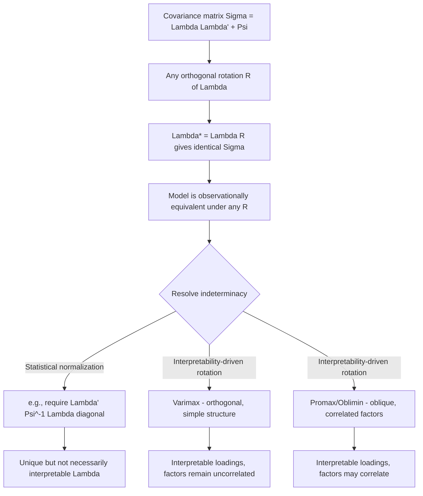

## Factor Analysis

### Overview

Factor analysis models observed correlations among a set of variables as arising from a smaller number of unobserved (latent) common factors plus variable-specific idiosyncratic noise. Unlike PCA, which is a variance-maximizing transformation with no explicit error structure, factor analysis is a genuine statistical model with testable implications for the covariance structure of the data, making it central to econometric applications involving latent constructs (e.g., permanent income, ability, business cycle conditions) and large approximate factor models for macro/finance panels.

### The Factor Model

**Key Points**

For observed variables $X = (X_1, \dots, X_p)'$, the factor model specifies:

$$X = \mu + \Lambda F + e$$

where $F = (F_1, \dots, F_r)'$ is the $r$-dimensional vector of common factors ($r \ll p$), $\Lambda$ is the $p \times r$ matrix of **factor loadings**, and $e$ is the $p \times 1$ vector of idiosyncratic errors, with standard assumptions:

$$E[F] = 0, \quad \text{Var}(F) = I_r, \quad E[e] = 0, \quad \text{Cov}(F, e) = 0, \quad \text{Var}(e) = \Psi \text{ (diagonal)}$$

The diagonality of $\Psi$ is the defining assumption: all cross-covariance among the observed $X_j$'s must be explained entirely through the shared factors $F$, with idiosyncratic errors uncorrelated across variables. This implies the covariance structure:

$$\Sigma = \Lambda \Lambda' + \Psi$$

**Communality and Uniqueness**

For variable $j$, the **communality** $h_j^2 = \sum_{k=1}^r \lambda_{jk}^2$ is the proportion of $\text{Var}(X_j)$ explained by the common factors, and the **uniqueness** $\psi_j = \text{Var}(X_j) - h_j^2$ is the idiosyncratic remainder.

### Identification: The Rotation Problem

**Key Points**

For any orthogonal matrix $R$ (i.e., $RR' = I$), the transformation $\Lambda^* = \Lambda R$ and $F^* = R'F$ yields an observationally equivalent model:

$$\Lambda^* \Lambda^{*\prime} = \Lambda R R' \Lambda' = \Lambda \Lambda'$$

so the covariance structure $\Sigma = \Lambda\Lambda' + \Psi$ is unchanged. This means **factor loadings are identified only up to an arbitrary orthogonal rotation** — the model does not pin down a unique $\Lambda$ from the covariance structure alone. Resolving this **rotation problem** requires either:

- **Statistical normalization** (e.g., requiring $\Lambda'\Psi^{-1}\Lambda$ diagonal), which achieves identification but not necessarily interpretability
- **Rotation for interpretability**: after estimating any valid $\Lambda$, applying a rotation criterion (varimax, promax, oblimin) chosen to produce loadings that are easier to substantively interpret (e.g., each variable loading strongly on only one factor)

**Common Rotation Methods**

- **Varimax** (orthogonal): maximizes the variance of squared loadings within each factor, tending to produce a "simple structure" where each variable loads highly on one factor and near-zero on others; preserves factor orthogonality
- **Promax / Oblimin** (oblique): allow factors to be correlated, often yielding simpler structure at the cost of interpretability of factor variances as strictly additive

### Diagram: The Rotation Indeterminacy

### Estimation Methods

**Principal Factor Method**

Iteratively estimates communalities and loadings starting from an initial communality estimate (e.g., squared multiple correlation of each variable with the others), extracting factors via eigendecomposition of the reduced correlation matrix (correlation matrix with communalities on the diagonal instead of 1s).

**Maximum Likelihood Factor Analysis**

Under the additional assumption $F, e \sim$ multivariate normal, the log-likelihood is:

$$\ln L(\Lambda, \Psi) = -\frac{n}{2}\Big[\ln|\Sigma(\Lambda,\Psi)| + \text{tr}\big(S\,\Sigma(\Lambda,\Psi)^{-1}\big)\Big] + \text{const}$$

where $S$ is the sample covariance matrix and $\Sigma(\Lambda,\Psi) = \Lambda\Lambda' + \Psi$. MLE has the advantage of enabling a formal **likelihood ratio test for the number of factors** $r$ (testing $H_0: r = r_0$ against a larger number), unlike the principal factor method, which offers no built-in inferential test.

### Determining the Number of Factors

**Key Points**

- **Likelihood ratio test** (MLE-based): sequentially test $r$ vs. $r+1$ factors; requires normality assumption for formal validity
- **Scree plot / eigenvalue-based heuristics**: analogous to PCA, though applied to the reduced correlation matrix
- **Parallel analysis**: comparing observed eigenvalues to those from randomly generated data, as in PCA
- **Bai-Ng information criteria**: specifically developed for large approximate factor models with $n, T \to \infty$, providing consistent factor-number selection in high-dimensional macro/finance panels — the standard approach in modern large-panel factor-augmented econometrics

[Inference] The choice between an LR-test-based approach and information-criterion-based approaches (Bai-Ng) often depends on sample dimensions: LR tests are more natural in small-$p$, well-identified classical factor analysis settings, while Bai-Ng criteria are specifically designed for and more commonly applied in the large-$n$, large-$T$ approximate factor model settings typical of macroeconometric panels.

### Exact vs. Approximate Factor Models

| Aspect | Exact (Classical) Factor Model | Approximate Factor Model |
| --- | --- | --- |
| Idiosyncratic error structure | Strictly diagonal $\Psi$ (no cross-sectional correlation) | Weak cross-sectional correlation permitted among $e_j$'s |
| Typical setting | Small $p$, psychometrics/classical multivariate statistics | Large $p$ (potentially $p > n$), macro/finance panels |
| Estimation | MLE or principal factor method | Principal components (asymptotically equivalent to MLE as $n, T \to \infty$) |
| Key reference | Classical factor analysis (Spearman, Thurstone) | Stock-Watson, Bai-Ng, Bai (2003) |

In large approximate factor models common in macroeconometrics, the strict diagonality assumption of classical factor analysis is relaxed to allow weak dependence among idiosyncratic errors, and the **principal components estimator becomes consistent for the common factor space** as both $n$ and $T$ grow — this is the formal justification for using PCA (computationally simpler) as a factor-extraction method in large panels, effectively bridging PCA and factor analysis in this asymptotic regime.

### Illustration: Factor Model Structure (svg_diagram)

<svg xmlns="http://www.w3.org/2000/svg" viewBox="0 0 760 280" font-family="sans-serif">
<text x="380" y="20" text-anchor="middle" font-size="16" font-weight="bold">Common Factor Model: Shared Factors + Idiosyncratic Errors (svg_diagram)</text>
<circle cx="150" cy="100" r="30" fill="#cde4ff" stroke="#333" />
<text x="150" y="105" text-anchor="middle" font-size="12">F₁</text>
<circle cx="150" cy="200" r="30" fill="#cde4ff" stroke="#333" />
<text x="150" y="205" text-anchor="middle" font-size="12">F₂</text>
<rect x="330" y="50" width="60" height="35" fill="#f5f5f5" stroke="#333" />
<text x="360" y="72" text-anchor="middle" font-size="11">X₁</text>
<rect x="330" y="105" width="60" height="35" fill="#f5f5f5" stroke="#333" />
<text x="360" y="127" text-anchor="middle" font-size="11">X₂</text>
<rect x="330" y="160" width="60" height="35" fill="#f5f5f5" stroke="#333" />
<text x="360" y="182" text-anchor="middle" font-size="11">X₃</text>
<rect x="330" y="215" width="60" height="35" fill="#f5f5f5" stroke="#333" />
<text x="360" y="237" text-anchor="middle" font-size="11">X₄</text>
<line x1="178" y1="90" x2="330" y2="65" stroke="#333" marker-end="url(#arr4)" />
<line x1="178" y1="105" x2="330" y2="120" stroke="#333" marker-end="url(#arr4)" />
<line x1="178" y1="195" x2="330" y2="135" stroke="#333" marker-end="url(#arr4)" />
<line x1="178" y1="205" x2="330" y2="180" stroke="#333" marker-end="url(#arr4)" />
<line x1="178" y1="210" x2="330" y2="230" stroke="#333" marker-end="url(#arr4)" />

<text x="540" y="67" font-size="11" fill="#a00">+ e₁</text>

<text x="540" y="122" font-size="11" fill="#a00">+ e₂</text>

<text x="540" y="177" font-size="11" fill="#a00">+ e₃</text>

<text x="540" y="232" font-size="11" fill="#a00">+ e₄</text>

<text x="640" y="150" text-anchor="middle" font-size="10" fill="#555">idiosyncratic,</text>

<text x="640" y="165" text-anchor="middle" font-size="10" fill="#555">uncorrelated across j</text>

</svg>

### Factor Scores

**Key Points**

Unlike factor loadings, individual factor values $F_i$ for each observation are not directly estimated by the model fitting procedure and must be **predicted** after estimation, since $F$ is latent. Common approaches:

- **Regression (Thomson) scores**: $\hat{F} = \Lambda' \Sigma^{-1} X$, treating factor prediction as a regression of the latent factor on observed variables
- **Bartlett scores**: $\hat{F} = (\Lambda'\Psi^{-1}\Lambda)^{-1}\Lambda'\Psi^{-1}X$, an unbiased predictor (in a specific technical sense) that weights variables inversely by their uniqueness

Neither method produces a truly "correct" recovery of the latent factor — factor scores are best understood as model-based predictions, not direct observations, of an inherently unobserved quantity.

### Applications in Econometrics

**Key Points**

- **Dynamic Factor Models (DFM)**: extending static factor analysis to allow $F_t$ to follow its own time-series (typically VAR) dynamics, widely used for macroeconomic nowcasting (e.g., the New York Fed's Weekly Economic Index, Stock-Watson coincident indicators)
- **Factor-Augmented VAR (FAVAR)**: augmenting a standard VAR with estimated common factors from a large macro panel to capture broader economic information without a fully specified large-scale VAR
- **Arbitrage Pricing Theory (APT) in finance**: models asset returns as driven by a small number of common risk factors plus idiosyncratic asset-specific risk, directly mirroring the factor model structure
- **Measurement models for latent constructs**: e.g., modeling "socioeconomic status" or "financial literacy" as latent factors measured imperfectly through multiple observed survey indicators

### Factor Analysis vs. Structural Equation Modeling (SEM)

**Key Points**

Factor analysis is the measurement-model component of the broader SEM framework; **confirmatory factor analysis (CFA)** imposes a pre-specified loading structure (based on theory) and tests its fit to the data, in contrast to **exploratory factor analysis (EFA)**, which estimates the loading structure freely from the data (as described throughout this entry) and relies on rotation for interpretability after the fact. CFA is generally preferred when strong a priori theory about which variables load on which factors exists, since it provides a genuine overidentification test of that theory against the data, which EFA does not.

### Practical Workflow

**Next Steps**

1. Determine whether the setting calls for a classical (small-$p$) factor model or a large approximate factor model (large-$n$ macro/finance panel)
2. For classical settings, choose between principal factor and MLE estimation, favoring MLE when a formal test for the number of factors is desired
3. For large panels, use principal components as a consistent estimator of the factor space, selecting the number of factors via Bai-Ng information criteria
4. Address the rotation problem explicitly: apply varimax (orthogonal) or oblimin/promax (oblique) rotation based on whether correlated latent factors are theoretically plausible
5. If testing a specific pre-specified theoretical factor structure, use confirmatory factor analysis rather than exploratory factor analysis to obtain a genuine model fit test

### Related Topics

- Dynamic Factor Models and Macroeconomic Nowcasting
- Bai-Ng Information Criteria for Large Approximate Factor Models
- Confirmatory Factor Analysis and Structural Equation Modeling
- Arbitrage Pricing Theory and Empirical Asset Pricing Factor Models
- Factor Rotation Methods: Varimax, Promax, and Oblimin
- Principal Component Analysis as an Approximate Factor Estimator