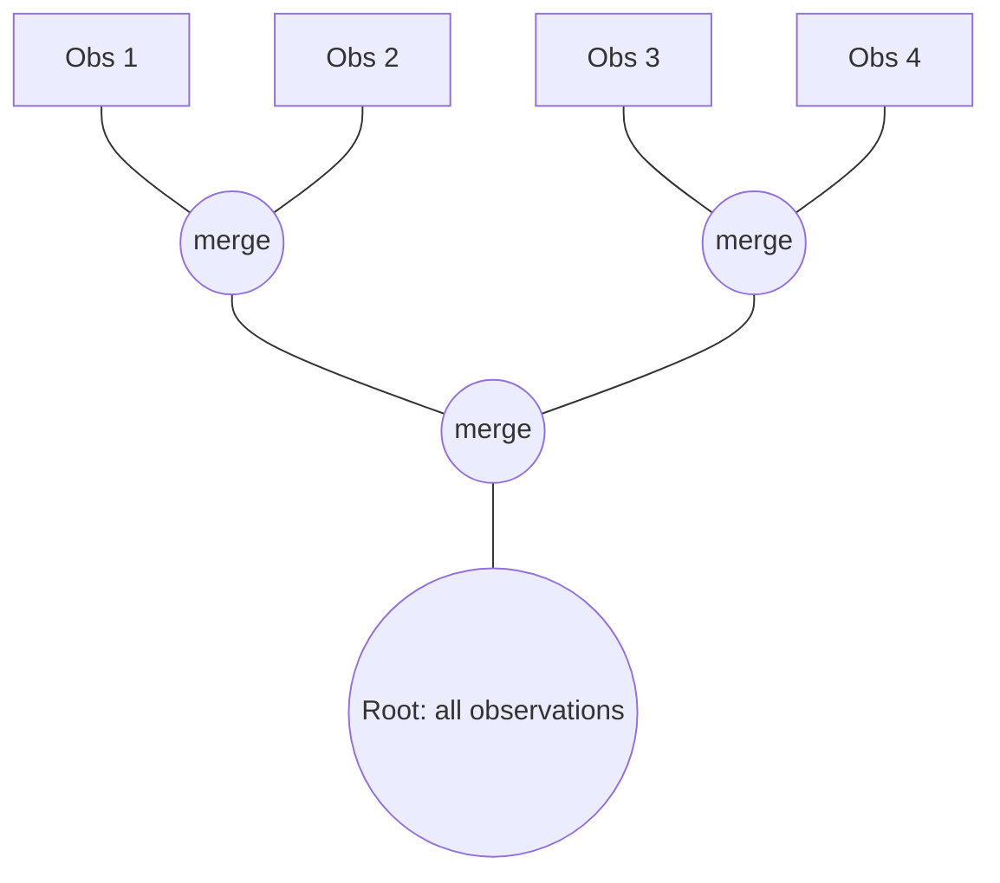

## Cluster Analysis


### Overview

Cluster analysis is a class of unsupervised multivariate techniques used to partition a set of $n$ observations into groups (clusters) such that observations within a cluster are more similar to one another than to observations in other clusters. Unlike classification, no labeled training data exists; the structure is inferred purely from the data's internal similarity or distance patterns.

Cluster analysis is used across market segmentation, document/topic grouping, image segmentation, genomics (gene expression clustering), anomaly detection, and exploratory data reduction prior to further modeling.

### Mathematical Foundations

**Distance and Similarity Measures**

Given observations $\mathbf{x}_i, \mathbf{x}_j \in \mathbb{R}^p$, common distance metrics include:

Euclidean distance:

$$d(\mathbf{x}_i, \mathbf{x}_j) = \sqrt{\sum_{k=1}^{p} (x_{ik} - x_{jk})^2}$$

Manhattan (city-block) distance:

$$d(\mathbf{x}_i, \mathbf{x}_j) = \sum_{k=1}^{p} |x_{ik} - x_{jk}|$$

Minkowski distance (generalization, parameter $m$):

$$d(\mathbf{x}_i, \mathbf{x}_j) = \left( \sum_{k=1}^{p} |x_{ik} - x_{jk}|^m \right)^{1/m}$$

Mahalanobis distance (accounts for covariance structure $\mathbf{S}$):

$$d(\mathbf{x}_i, \mathbf{x}_j) = \sqrt{(\mathbf{x}_i - \mathbf{x}_j)^\top \mathbf{S}^{-1} (\mathbf{x}_i - \mathbf{x}_j)}$$

Cosine similarity (common in text/high-dimensional sparse data):

$$\cos(\theta) = \frac{\mathbf{x}_i \cdot \mathbf{x}_j}{\|\mathbf{x}_i\| \|\mathbf{x}_j\|}$$

For categorical data, similarity measures such as the **Jaccard index** or **matching coefficients** are used instead of continuous distance metrics.

**Standardization**

Because distance metrics are scale-sensitive, variables are typically standardized (z-scores) before clustering:

$$z_{ik} = \frac{x_{ik} - \bar{x}_k}{s_k}$$

Failing to standardize allows variables with larger numeric ranges to dominate the distance calculation, biasing cluster formation.

### Major Clustering Approaches

#### 1. Hierarchical Clustering

Builds a tree (dendrogram) of nested clusters, either by successively merging (agglomerative) or splitting (divisive) groups.

**Agglomerative algorithm:**

1. Start with each observation as its own cluster.
2. Compute pairwise distances between all clusters.
3. Merge the two closest clusters.
4. Recompute distances between the new cluster and remaining clusters.
5. Repeat until one cluster remains (or a stopping criterion is met).

**Linkage criteria** (define "distance between clusters" $A$ and $B$):

- **Single linkage (nearest neighbor):** $d(A,B) = \min_{i \in A, j \in B} d(x_i, x_j)$ — tends to produce elongated, "chaining" clusters.
- **Complete linkage (farthest neighbor):** $d(A,B) = \max_{i \in A, j \in B} d(x_i, x_j)$ — produces compact, spherical clusters.
- **Average linkage:** $d(A,B) = \frac{1}{|A||B|} \sum_{i \in A} \sum_{j \in B} d(x_i, x_j)$
- **Ward's method:** merges the pair of clusters that minimizes the increase in total within-cluster variance (sum of squared errors). Ward's criterion is:


  $$\Delta(A,B) = \frac{|A||B|}{|A|+|B|} \|\bar{\mathbf{x}}_A - \bar{\mathbf{x}}_B\|^2$$

**Dendrogram interpretation:** The height at which two branches merge represents the distance/dissimilarity at which those clusters were joined. Cutting the dendrogram horizontally at a chosen height yields a specific number of clusters.



**Advantages:** No need to pre-specify $k$; produces an interpretable hierarchy; deterministic.

**Disadvantages:** Computationally expensive ($O(n^2 \log n)$ or worse for large $n$); merge decisions are irreversible (a poor early merge cannot be undone); sensitive to noise and outliers (especially single linkage).

#### 2. Partitioning Methods: k-Means

Partitions observations into exactly $k$ clusters by minimizing the within-cluster sum of squares (WCSS):

$$\text{WCSS} = \sum_{c=1}^{k} \sum_{\mathbf{x}_i \in C_c} \|\mathbf{x}_i - \boldsymbol{\mu}_c\|^2$$

where $\boldsymbol{\mu}_c$ is the centroid of cluster $C_c$.

**Lloyd's algorithm (standard k-means):**

1. Initialize $k$ centroids (randomly or via k-means++ seeding).
2. **Assignment step:** assign each point to the nearest centroid.
3. **Update step:** recompute each centroid as the mean of points assigned to it.
4. Repeat steps 2–3 until assignments stabilize (convergence) or a maximum iteration count is reached.

k-means is guaranteed to converge to a local minimum of WCSS, but not necessarily the global minimum, since it is sensitive to initial centroid placement. **k-means++** initialization improves this by choosing initial centroids probabilistically, favoring points far from already-chosen centroids, which empirically improves convergence quality and speed.

**Choosing $k$:**

- **Elbow method:** Plot WCSS against $k$ and look for the point of diminishing returns (the "elbow").
- **Silhouette score:** For each point $i$, define


  $$s(i) = \frac{b(i) - a(i)}{\max\{a(i), b(i)\}}$$

  where $a(i)$ is the mean distance from $i$ to other points in its own cluster, and $b(i)$ is the mean distance to points in the nearest neighboring cluster. Values range from $-1$ to $1$; higher average silhouette indicates better-defined clusters.
- **Gap statistic:** Compares WCSS to that expected under a null reference distribution.

**Limitations:** Assumes roughly spherical, equally-sized clusters; sensitive to outliers; requires $k$ to be specified in advance; performs poorly on non-convex cluster shapes.

**k-medoids (PAM — Partitioning Around Medoids)** is a robust variant that uses actual data points (medoids) rather than centroids, minimizing sum of dissimilarities rather than squared Euclidean distance — more robust to outliers and applicable to arbitrary distance metrics.

#### 3. Density-Based Clustering: DBSCAN

Defines clusters as dense regions separated by regions of lower density, rather than by distance to a central point.

**Key parameters:**

- $\varepsilon$ (epsilon): neighborhood radius.
- $\text{MinPts}$: minimum number of points required within $\varepsilon$ to form a dense region.

**Point classification:**

- **Core point:** has at least MinPts points within $\varepsilon$ (including itself).
- **Border point:** within $\varepsilon$ of a core point but does not itself satisfy MinPts.
- **Noise point:** neither core nor border — treated as an outlier.

**Advantages:** Does not require specifying the number of clusters in advance; can find arbitrarily shaped clusters; naturally identifies outliers/noise.

**Disadvantages:** Struggles with varying-density clusters; sensitive to $\varepsilon$ and MinPts selection; performance degrades in high-dimensional space due to the curse of dimensionality affecting distance meaningfulness. [Inference: exact degradation behavior depends on data sparsity and dimensionality-reduction preprocessing used.]

**HDBSCAN** extends DBSCAN by handling varying density clusters through a hierarchical density approach, removing the need to fix a single global $\varepsilon$.

#### 4. Model-Based Clustering: Gaussian Mixture Models (GMM)

Assumes data is generated from a mixture of $k$ multivariate Gaussian distributions:

$$p(\mathbf{x}) = \sum_{c=1}^{k} \pi_c \, \mathcal{N}(\mathbf{x} \mid \boldsymbol{\mu}_c, \boldsymbol{\Sigma}_c)$$

where $\pi_c$ are mixing proportions ($\sum \pi_c = 1$), and each component has its own mean $\boldsymbol{\mu}_c$ and covariance $\boldsymbol{\Sigma}_c$.

Parameters are estimated via the **Expectation-Maximization (EM) algorithm**:

- **E-step:** compute the posterior probability (responsibility) that each point belongs to each component.
- **M-step:** update $\pi_c, \boldsymbol{\mu}_c, \boldsymbol{\Sigma}_c$ using the responsibilities as soft weights.

GMM produces **soft (probabilistic) cluster assignments**, unlike the hard assignments of k-means. k-means can be shown to be a special case of GMM with equal, spherical, fixed covariance matrices. Model selection (choice of $k$) is typically done via **BIC** or **AIC**:

$$\text{BIC} = -2 \ln(\hat{L}) + m \ln(n)$$

where $\hat{L}$ is the maximized likelihood and $m$ is the number of free parameters.

### Cluster Validation

**Internal validation** (no ground truth labels):

- Silhouette coefficient (defined above)
- Calinski-Harabasz index (ratio of between-cluster to within-cluster dispersion)
- Davies-Bouldin index (average similarity between each cluster and its most similar counterpart; lower is better)

**External validation** (when true labels are known, e.g., for benchmarking):

- Adjusted Rand Index (ARI)
- Normalized Mutual Information (NMI)
- Fowlkes-Mallows index

**Stability validation:** Assess sensitivity of cluster assignments to bootstrapped resamples or perturbations of the data; consistent solutions across resamples suggest robust structure.

### Dimensionality Considerations

High-dimensional data suffers from the **curse of dimensionality**: as $p$ grows, pairwise distances between points tend to converge, reducing the contrast that clustering algorithms rely on. Common mitigations:

- **PCA** (Principal Component Analysis) prior to clustering, retaining components that explain a target proportion of variance.
- **t-SNE** or **UMAP** for visualization of cluster structure in 2D/3D (not typically used as the clustering space itself, since distances in the reduced embedding are not globally faithful to the original space).
- **Feature selection** to remove uninformative or collinear variables before clustering.

### Worked Example (k-means, conceptual)

Suppose a Local Government Unit (LGU) wants to segment barangays by socioeconomic indicators: population density, average household income, literacy rate, and access-to-services index (4 continuous variables, $p=4$).

1. Standardize all four variables to z-scores.
2. Run k-means for $k = 2, \dots, 8$; compute WCSS and average silhouette for each $k$.
3. Suppose the elbow plot flattens noticeably at $k=4$, and silhouette peaks at $k=4$ ($\bar{s} \approx 0.52$).
4. Fit final k-means with $k=4$; interpret cluster centroids:
   - Cluster 1: high income, high literacy, high service access → "developed urban barangays"
   - Cluster 2: high density, moderate income, low service access → "urban poor"
   - Cluster 3: low density, low income, low literacy → "rural underserved"
   - Cluster 4: low density, moderate income, high service access → "rural but well-connected"
5. Validate: cross-tabulate cluster membership against an external variable not used in clustering (e.g., existing poverty incidence classification) to sanity-check interpretability.

### Practical Implementation Notes

**Python (scikit-learn):**

```python
from sklearn.preprocessing import StandardScaler
from sklearn.cluster import KMeans, DBSCAN, AgglomerativeClustering
from sklearn.mixture import GaussianMixture
from sklearn.metrics import silhouette_score

X_scaled = StandardScaler().fit_transform(X)

# k-means
km = KMeans(n_clusters=4, init="k-means++", n_init=10, random_state=42)
labels = km.fit_predict(X_scaled)
sil = silhouette_score(X_scaled, labels)

# Hierarchical (Ward linkage)
agg = AgglomerativeClustering(n_clusters=4, linkage="ward")
labels_h = agg.fit_predict(X_scaled)

# DBSCAN
db = DBSCAN(eps=0.5, min_samples=5)
labels_db = db.fit_predict(X_scaled)

# Gaussian Mixture
gmm = GaussianMixture(n_components=4, covariance_type="full", random_state=42)
labels_gmm = gmm.fit_predict(X_scaled)
```

**R:**

```r
scaled_data <- scale(df)
km <- kmeans(scaled_data, centers = 4, nstart = 25)
hc <- hclust(dist(scaled_data), method = "ward.D2")
clusters <- cutree(hc, k = 4)
library(mclust)
gmm <- Mclust(scaled_data)
```

**Key Points**

- Always standardize variables before distance-based clustering unless variables are already commensurable.
- k-means minimizes WCSS but assumes spherical, similarly-sized clusters; it is not appropriate for elongated or nested cluster shapes.
- Hierarchical clustering trades scalability for interpretability and does not require pre-specifying $k$.
- DBSCAN is preferred when clusters are non-convex or when outlier detection is itself a goal.
- GMM generalizes k-means by allowing elliptical clusters and soft assignments, at the cost of more parameters to estimate.
- No single "correct" cluster count exists in the absence of ground truth; multiple validity indices should be triangulated rather than relying on one criterion alone.
- Cluster interpretability (domain-meaningful centroid profiles) matters as much as statistical validity indices.

### Common Pitfalls

- Applying Euclidean-distance methods (k-means) directly to categorical or mixed-type data without appropriate transformation (e.g., Gower distance for mixed types).
- Interpreting dendrogram merge height as a probabilistic or causal distance rather than a purely algorithmic linkage measure.
- Over-relying on the elbow method, which can be ambiguous or produce no clear "elbow" in real data.
- Ignoring the effect of outliers on centroid-based methods (a single extreme point can substantially shift a k-means centroid).
- Treating cluster labels as stable/objective truth rather than as one of potentially several valid partitions depending on algorithm and distance metric choice.

**Related Topics**

- Principal Component Analysis (dimensionality reduction preprocessing)
- Discriminant Analysis (supervised counterpart for known group labels)
- Factor Analysis (latent variable structure vs. observation grouping)
- Mixture Models and the EM Algorithm (general theory)
- Multidimensional Scaling (visualizing distance structures)
- Distance and Similarity Measures for Mixed Data Types
- Model-Based Clustering Selection Criteria (BIC/AIC/ICL)