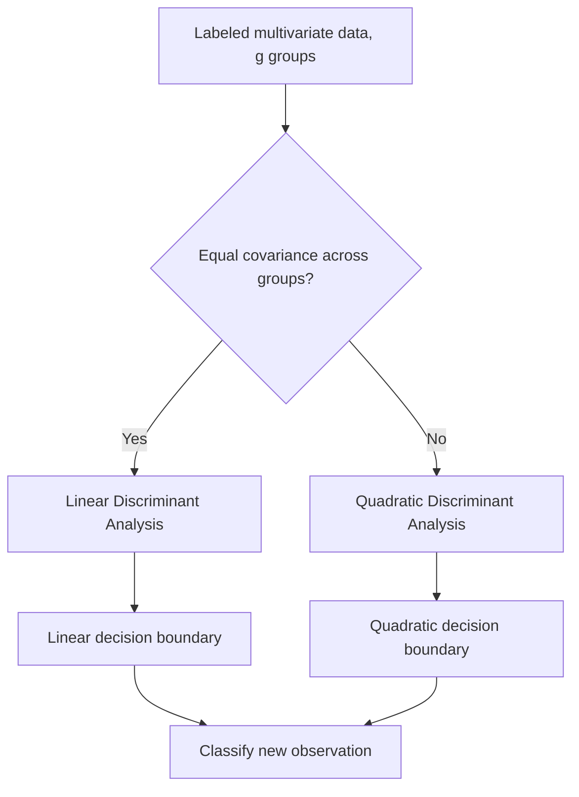

## Discriminant Analysis


### Overview

Discriminant analysis is a supervised multivariate technique used to classify observations into two or more predefined groups based on a set of predictor variables, and to understand which variables best separate those groups. Unlike cluster analysis, group membership is known in advance for a training sample; the goal is to construct a decision rule (discriminant function) that generalizes to classify new, unlabeled observations.

Common applications include credit risk classification (default vs. non-default), medical diagnosis (disease present vs. absent), species classification in biology, and quality control (pass vs. fail).

### Linear Discriminant Analysis (LDA)

#### Conceptual Basis

LDA seeks a linear combination of predictor variables that maximizes the separation between group means relative to the within-group variability. Given $g$ groups and $p$ predictors, LDA finds discriminant functions:

$$D_k = \mathbf{a}_k^\top \mathbf{x} = a_{k1}x_1 + a_{k2}x_2 + \dots + a_{kp}x_p$$

The coefficients $\mathbf{a}_k$ are chosen to maximize the ratio of between-group variance to within-group variance — the same objective as Fisher's linear discriminant.

#### Fisher's Criterion

For the two-group case, Fisher's approach finds the direction $\mathbf{a}$ that maximizes:

$$J(\mathbf{a}) = \frac{\mathbf{a}^\top \mathbf{B} \mathbf{a}}{\mathbf{a}^\top \mathbf{W} \mathbf{a}}$$

where $\mathbf{B}$ is the between-group sum-of-squares-and-cross-products (SSCP) matrix, and $\mathbf{W}$ is the within-group (pooled) SSCP matrix. The optimal $\mathbf{a}$ is the eigenvector corresponding to the largest eigenvalue of $\mathbf{W}^{-1}\mathbf{B}$.

For $g$ groups, this generalizes to an eigenvalue problem yielding up to $\min(g-1, p)$ discriminant functions, ordered by the proportion of between-group variance each explains (analogous to principal components, but oriented toward group separation rather than total variance).

#### Classification Rule (Bayes/Probabilistic Formulation)

Assuming each group $k$ follows a multivariate normal distribution $\mathcal{N}(\boldsymbol{\mu}_k, \boldsymbol{\Sigma})$ with a **common covariance matrix $\boldsymbol{\Sigma}$ across groups**, the linear discriminant score for group $k$ is:

$$\delta_k(\mathbf{x}) = \mathbf{x}^\top \boldsymbol{\Sigma}^{-1} \boldsymbol{\mu}_k - \frac{1}{2}\boldsymbol{\mu}_k^\top \boldsymbol{\Sigma}^{-1} \boldsymbol{\mu}_k + \ln(\pi_k)$$

where $\pi_k$ is the prior probability of group $k$. An observation is classified into the group with the highest $\delta_k(\mathbf{x})$. This decision boundary between any two groups is **linear** in $\mathbf{x}$ — the defining property of LDA, arising directly from the shared-covariance assumption.

#### Key Assumptions

1. **Multivariate normality** of predictors within each group.
2. **Homogeneity of covariance matrices** across groups (homoscedasticity) — tested via **Box's M test**.
3. Predictors are not perfectly collinear (so $\mathbf{W}$ is invertible).
4. Observations are independent.

Violations of normality are relatively tolerated in practice for classification accuracy (LDA is often robust), but violations of covariance homogeneity materially bias the decision boundary, motivating QDA below. [Inference: the degree of robustness to non-normality depends on sample size and the specific departure from normality; this is a general tendency rather than a guaranteed property.]

### Quadratic Discriminant Analysis (QDA)

QDA relaxes the equal-covariance assumption, allowing each group $k$ to have its own covariance matrix $\boldsymbol{\Sigma}_k$. The discriminant score becomes:

$$\delta_k(\mathbf{x}) = -\frac{1}{2}\ln|\boldsymbol{\Sigma}_k| - \frac{1}{2}(\mathbf{x}-\boldsymbol{\mu}_k)^\top \boldsymbol{\Sigma}_k^{-1}(\mathbf{x}-\boldsymbol{\mu}_k) + \ln(\pi_k)$$

Because $\boldsymbol{\Sigma}_k$ varies by group, the term $(\mathbf{x}-\boldsymbol{\mu}_k)^\top \boldsymbol{\Sigma}_k^{-1}(\mathbf{x}-\boldsymbol{\mu}_k)$ is quadratic in $\mathbf{x}$, producing curved (quadratic) decision boundaries.

**Trade-off:** QDA is more flexible and can fit more complex boundaries, but requires estimating a separate $p \times p$ covariance matrix per group, substantially increasing the number of parameters ($g \cdot \frac{p(p+1)}{2}$ vs. $\frac{p(p+1)}{2}$ for LDA). With small sample sizes relative to $p$, this increases variance of the estimated boundary (risk of overfitting), whereas LDA's shared-covariance assumption acts as a form of regularization.

### Canonical Discriminant Functions

For $g > 2$ groups, LDA produces multiple discriminant functions (canonical variates), each orthogonal to the previous, maximizing remaining between-group separation. These are often used for **visualization**: plotting observations on the first two discriminant functions (analogous to a PCA biplot) shows how well groups separate in reduced dimensions.

**Standardized discriminant coefficients** indicate the relative contribution of each original variable to a discriminant function, analogous to standardized regression coefficients, and are used for substantive interpretation of "what separates the groups."

**Structure coefficients** (correlations between each original variable and the discriminant score) are often preferred over raw/standardized coefficients for interpretation, since they are less sensitive to multicollinearity among predictors.

### Model Evaluation

- **Classification (confusion) matrix**: cross-tabulates predicted vs. actual group membership; yields overall accuracy, sensitivity, specificity, and per-group error rates.
- **Cross-validation (leave-one-out or k-fold)**: essential because resubstitution accuracy (classifying the same data used to fit the model) is optimistically biased.
- **Wilks' Lambda**: a multivariate test statistic assessing whether group centroids differ significantly across all discriminant functions jointly:


  $$\Lambda = \frac{|\mathbf{W}|}{|\mathbf{W}+\mathbf{B}|}$$

  Smaller $\Lambda$ (closer to 0) indicates stronger group separation; it is converted to an approximate $F$ or $\chi^2$ statistic for significance testing.
- **Eigenvalues and canonical correlation** per discriminant function indicate the proportion of between-group variance explained by that function.

### Regularized and Alternative Variants

- **Regularized Discriminant Analysis (RDA):** shrinks each group's covariance matrix toward the pooled covariance matrix (a continuum between LDA and QDA), controlled by a shrinkage parameter, improving stability in high-dimensional or small-sample settings.
- **Diagonal LDA / Naive Bayes discriminant:** assumes predictors are conditionally independent within each group (diagonal covariance), reducing parameters drastically — useful when $p \gg n$ (e.g., genomics).
- **Mixture Discriminant Analysis (MDA):** models each class as a mixture of several Gaussian subclasses rather than a single Gaussian, accommodating non-elliptical class distributions.
- **Logistic regression** is a common alternative/comparison: it does not assume multivariate normality of predictors and directly models $P(\text{group} \mid \mathbf{x})$, generally preferred when normality is clearly violated, though LDA can be more efficient (lower variance) when its assumptions approximately hold.



### Worked Example (Two-Group LDA, conceptual)

An LGU processing office wants to predict whether a submitted permit application will be **approved** or **flagged for review**, based on two predictors: completeness score (0–100) and number of prior submissions by the applicant.

1. Compute group means: approved applications average (completeness = 85, prior submissions = 2.1); flagged applications average (completeness = 60, prior submissions = 0.4).
2. Test covariance homogeneity via Box's M; assume it is not significant (fail to reject $H_0$), justifying LDA over QDA.
3. Compute pooled within-group covariance $\mathbf{W}$ and between-group matrix $\mathbf{B}$; solve for the discriminant coefficients $\mathbf{a}$.
4. Resulting discriminant function (illustrative): $D = 0.04 \cdot \text{completeness} + 0.9 \cdot \text{prior\_submissions} - 4.2$.
5. Classify a new application (completeness = 70, prior submissions = 1): compute $D$, compare to the midpoint of group centroid discriminant scores, and assign to the nearer group.
6. Validate via 10-fold cross-validation; report the confusion matrix and overall classification accuracy.

### Practical Implementation Notes

**Python (scikit-learn):**

```python
from sklearn.discriminant_analysis import LinearDiscriminantAnalysis, QuadraticDiscriminantAnalysis
from sklearn.model_selection import cross_val_score

lda = LinearDiscriminantAnalysis()
lda.fit(X_train, y_train)
pred = lda.predict(X_test)
scores = cross_val_score(lda, X, y, cv=10)

qda = QuadraticDiscriminantAnalysis()
qda.fit(X_train, y_train)

# Regularized (shrinkage) LDA
lda_shrink = LinearDiscriminantAnalysis(solver="lsqr", shrinkage="auto")
```

**R:**

```r
library(MASS)
lda_fit <- lda(group ~ ., data = df)
pred <- predict(lda_fit, newdata = test_df)
table(pred$class, test_df$group)  # confusion matrix

qda_fit <- qda(group ~ ., data = df)

# Box's M test for covariance homogeneity
library(biotools)
boxM(df[, predictor_cols], df$group)
```

**Key Points**

- LDA assumes a common covariance matrix across groups, producing linear decision boundaries; QDA relaxes this, producing quadratic boundaries at the cost of more estimated parameters.
- The number of possible discriminant functions is $\min(g-1, p)$, where $g$ is the number of groups.
- Wilks' Lambda tests overall group separation; smaller values indicate stronger separation.
- Structure coefficients (correlations with the discriminant score) are generally more robust for interpreting variable importance than raw or standardized coefficients when predictors are correlated.
- Cross-validated classification accuracy, not resubstitution accuracy, should be reported as the performance estimate.
- Logistic regression is a common comparator when multivariate normality is implausible.

### Common Pitfalls

- Reporting resubstitution (training-set) accuracy as if it were out-of-sample performance — this is optimistically biased and should be replaced with cross-validated or holdout accuracy.
- Using LDA when covariance matrices are clearly heterogeneous across groups without testing (Box's M) or considering QDA/RDA as alternatives.
- Interpreting raw discriminant coefficients as variable importance when predictors are highly correlated (multicollinearity distorts raw coefficients; use structure coefficients instead).
- Applying LDA/QDA to grossly non-normal or categorical predictors without transformation — logistic regression or non-parametric classifiers may be more appropriate.
- Ignoring unequal group sizes when setting prior probabilities $\pi_k$, which can bias the classification rule toward the majority class if priors are set equal to sample proportions without domain justification, or vice versa.

**Related Topics**

- Cluster Analysis (unsupervised counterpart with unknown group labels)
- Logistic Regression and Multinomial Logit Models
- Principal Component Analysis (dimensionality reduction, unsupervised)
- MANOVA (Multivariate Analysis of Variance — tests underlying group mean differences)
- Support Vector Machines (alternative discriminative classifier)
- Canonical Correlation Analysis
- Regularization Methods in High-Dimensional Classification ($p \gg n$ settings)