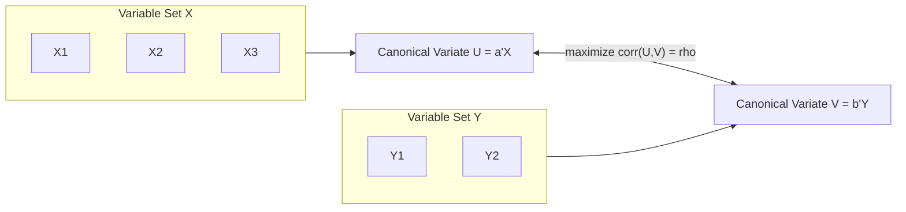

## Canonical Correlation Analysis


### Overview

Canonical Correlation Analysis (CCA) is a multivariate technique for investigating the relationship between two sets of variables measured on the same observations. Rather than relating a single dependent variable to predictors (as in multiple regression) or reducing one set of variables to components (as in PCA), CCA finds linear combinations of variables from each of two sets — called **canonical variates** — that are maximally correlated with each other.

CCA generalizes several familiar techniques: if one set contains a single variable, CCA reduces to multiple regression; if both sets contain a single variable, it reduces to simple correlation. It is used when a researcher has two conceptually distinct blocks of variables (e.g., a set of psychological measures and a set of academic outcomes) and wants to understand the shared structure between them.

### Mathematical Formulation

Let $\mathbf{X} \in \mathbb{R}^{p}$ be the first set of variables and $\mathbf{Y} \in \mathbb{R}^{q}$ be the second set, both measured on the same $n$ observations. CCA seeks linear combinations:

$$U = \mathbf{a}^\top \mathbf{X} = a_1 X_1 + a_2 X_2 + \dots + a_p X_p$$


$$V = \mathbf{b}^\top \mathbf{Y} = b_1 Y_1 + b_2 Y_2 + \dots + b_q Y_q$$

such that the correlation between $U$ and $V$,

$$\rho = \text{corr}(U, V) = \frac{\mathbf{a}^\top \boldsymbol{\Sigma}_{XY} \mathbf{b}}{\sqrt{\mathbf{a}^\top \boldsymbol{\Sigma}_{XX} \mathbf{a}} \sqrt{\mathbf{b}^\top \boldsymbol{\Sigma}_{YY} \mathbf{b}}}$$

is maximized, where $\boldsymbol{\Sigma}_{XX}$ and $\boldsymbol{\Sigma}_{YY}$ are the within-set covariance matrices and $\boldsymbol{\Sigma}_{XY}$ is the cross-covariance matrix between the two sets.

This is solved as an eigenvalue problem:

$$\boldsymbol{\Sigma}_{XX}^{-1}\boldsymbol{\Sigma}_{XY}\boldsymbol{\Sigma}_{YY}^{-1}\boldsymbol{\Sigma}_{YX}\,\mathbf{a} = \rho^2 \mathbf{a}$$

The eigenvalues $\rho_1^2 \ge \rho_2^2 \ge \dots \ge \rho_m^2$ (where $m = \min(p,q)$) are the squared **canonical correlations**, and each eigenvector $\mathbf{a}_k$ (with a corresponding $\mathbf{b}_k$ from the analogous equation) defines one pair of canonical variates $(U_k, V_k)$. Successive pairs are constructed to be uncorrelated with all previous pairs (orthogonality constraint), analogous to successive principal components.

### Number of Canonical Functions

The maximum number of canonical variate pairs is $m = \min(p, q)$. In practice, only the first one or two pairs are typically substantively interpretable; later pairs often capture noise or trivial residual covariance.

### Significance Testing

**Wilks' Lambda** tests whether the full set of canonical correlations (all $m$ pairs jointly) is significantly different from zero:

$$\Lambda = \prod_{k=1}^{m} (1 - \rho_k^2)$$

This is converted to an approximate $F$-statistic (Rao's approximation) for a formal hypothesis test. A sequential testing procedure is used to determine how many canonical functions are statistically significant: after removing the first (largest) canonical correlation, Wilks' Lambda is recomputed on the remaining $\rho_2^2, \dots, \rho_m^2$ to test whether additional dimensions contribute significant shared variance, continuing until a non-significant result is reached.

### Interpretation

**Canonical weights (coefficients)** $\mathbf{a}_k, \mathbf{b}_k$ indicate the contribution of each original variable to its canonical variate, but like regression coefficients, they are unstable under multicollinearity within a variable set and do not by themselves indicate substantive importance reliably.

**Canonical loadings (structure coefficients)** — the correlation between each original variable and its own canonical variate — are generally preferred for interpretation, since they are more stable and directly indicate how strongly each observed variable relates to the underlying canonical dimension.

**Cross-loadings** — the correlation between a variable in set $X$ and the canonical variate $V$ from set $Y$ (and vice versa) — directly show how a variable in one domain relates to the composite from the other domain.

**Redundancy analysis (Stewart-Love redundancy index)** measures the proportion of variance in one set of variables explained by the canonical variate(s) of the other set, addressing a key limitation of the raw canonical correlation $\rho_k$ itself: $\rho_k$ can be high even when the canonical variate explains little of the total variance within its own variable set. The redundancy index is computed as:

$$R^2_{Y|U_k} = \left(\frac{1}{q}\sum_{j=1}^{q} r^2_{Y_j, U_k}\right) \times \rho_k^2$$

i.e., the average squared structure loading of $Y$'s variables on $U_k$, multiplied by the squared canonical correlation.



### Assumptions

1. **Multivariate normality** within and across both variable sets (required for exact significance testing; CCA is more sensitive to this than regression).
2. **Linearity** — CCA only captures linear relationships between the two sets; nonlinear associations are not detected.
3. **Adequate sample size relative to $p + q$** — CCA is highly sample-hungry; a common rule of thumb suggests at least 10 observations per variable across both sets combined, though this varies by source and effect size sought. [Inference: specific sample-size heuristics vary across textbooks and are not a fixed statistical law; larger samples are generally required as $p+q$ grows.]
4. **No extreme multicollinearity** within either variable set (near-singular $\boldsymbol{\Sigma}_{XX}$ or $\boldsymbol{\Sigma}_{YY}$ destabilizes the solution).
5. Homoscedasticity across the range of canonical variate scores.

### Relationship to Other Techniques

- **Multiple regression:** a special case of CCA where set $Y$ contains a single variable.
- **MANOVA:** can be reformulated as a CCA between a set of continuous outcome variables and a set of dummy-coded group-membership variables; the canonical correlations relate directly to MANOVA's eigenvalues (Wilks' Lambda is shared machinery).
- **PCA:** finds directions of maximum variance within a single set; CCA finds directions of maximum covariance/correlation between two sets — PCA is unsupervised within one block, CCA is inherently a two-block relational technique.
- **Partial Least Squares (PLS):** an alternative to CCA when $p$ or $q$ is large relative to $n$ or when multicollinearity is severe; PLS maximizes covariance (not correlation) between the two composite scores and is more numerically stable in high-dimensional or small-sample settings since it does not require inverting $\boldsymbol{\Sigma}_{XX}$ or $\boldsymbol{\Sigma}_{YY}$.

### Worked Example (Conceptual)

Suppose a university's Special Topics research office wants to relate a set of **study-habit variables** (hours studied per week, attendance rate, use of tutoring services) to a set of **outcome variables** (GPA, standardized exam score, self-reported confidence).

1. Standardize all six variables.
2. Compute $\boldsymbol{\Sigma}_{XX}$ (3×3, study habits), $\boldsymbol{\Sigma}_{YY}$ (3×3, outcomes), and $\boldsymbol{\Sigma}_{XY}$ (3×3 cross-covariance).
3. Solve the eigenvalue equation; obtain $m = \min(3,3) = 3$ canonical correlations, e.g., $\rho_1 = 0.71$, $\rho_2 = 0.28$, $\rho_3 = 0.09$.
4. Test significance sequentially via Wilks' Lambda; suppose only the first canonical function is significant ($p < .01$), while the second and third are not.
5. Examine structure loadings for the first pair: hours studied (.85) and tutoring use (.62) load strongly on $U_1$; GPA (.90) and exam score (.81) load strongly on $V_1$ — interpreted as a general "study engagement" dimension linked to a general "academic performance" dimension.
6. Compute the redundancy index for $Y$ given $U_1$ to quantify how much outcome variance is actually explained by the study-habit canonical variate (this may be modest even if $\rho_1$ is large, since $\rho_1$ reflects correlation between composites, not variance explained in the original variables).

### Practical Implementation Notes

**Python (statsmodels / scikit-learn):**

```python
from sklearn.cross_decomposition import CCA
import numpy as np

n_components = min(X.shape[1], Y.shape[1])
cca = CCA(n_components=n_components)
cca.fit(X_scaled, Y_scaled)
U, V = cca.transform(X_scaled, Y_scaled)

canonical_corrs = [np.corrcoef(U[:, i], V[:, i])[0, 1] for i in range(n_components)]
```

**R:**

```r
library(CCA)
cc_result <- cc(X_scaled, Y_scaled)
cc_result$cor                     # canonical correlations
cc_result$xcoef; cc_result$ycoef  # canonical weights

# Significance testing (Wilks' Lambda, sequential)
library(candisc)
cancor_test <- candisc::cancor(X_scaled, Y_scaled)
```

**Key Points**

- CCA finds pairs of linear composites, one from each variable set, that maximize the correlation between the composites — not the variance within either set.
- The maximum number of canonical variate pairs equals $\min(p, q)$; typically only the first one or two are substantively meaningful.
- Structure loadings (correlations between original variables and their own canonical variate) are more interpretable and stable than raw canonical weights, especially under multicollinearity.
- A high canonical correlation $\rho_k$ does not imply the canonical variate explains substantial variance in the original variable set — use the redundancy index for that.
- CCA requires relatively large samples and is sensitive to violations of multivariate normality and linearity.
- PLS is a common alternative when sample size is limited relative to $p+q$ or multicollinearity is severe.

### Common Pitfalls

- Interpreting a high canonical correlation as evidence of strong "explained variance" without checking the redundancy index, which can reveal that the canonical variate captures only a small share of variance within the original variable set.
- Over-interpreting later (non-significant) canonical function pairs, which typically reflect sampling noise rather than genuine shared structure.
- Using raw canonical weights instead of structure loadings for substantive interpretation when predictors within a set are correlated.
- Applying CCA with an inadequate sample size relative to $p+q$, producing unstable and non-replicable canonical weights.
- Treating CCA results as evidence of a causal relationship between the two variable sets, when CCA is a purely associative (correlational) technique.

**Related Topics**

- Multiple Regression Analysis (special case of CCA with a single-variable outcome set)
- MANOVA and Multivariate Hypothesis Testing (shared eigenvalue machinery with CCA)
- Partial Least Squares Regression (high-dimensional/small-sample alternative)
- Principal Component Analysis (single-set variance decomposition)
- Factor Analysis (latent variable modeling within a single set)
- Redundancy Analysis (RDA) as a related constrained ordination technique
- Structural Equation Modeling (generalizes CCA-like relationships into a full latent-variable causal framework)