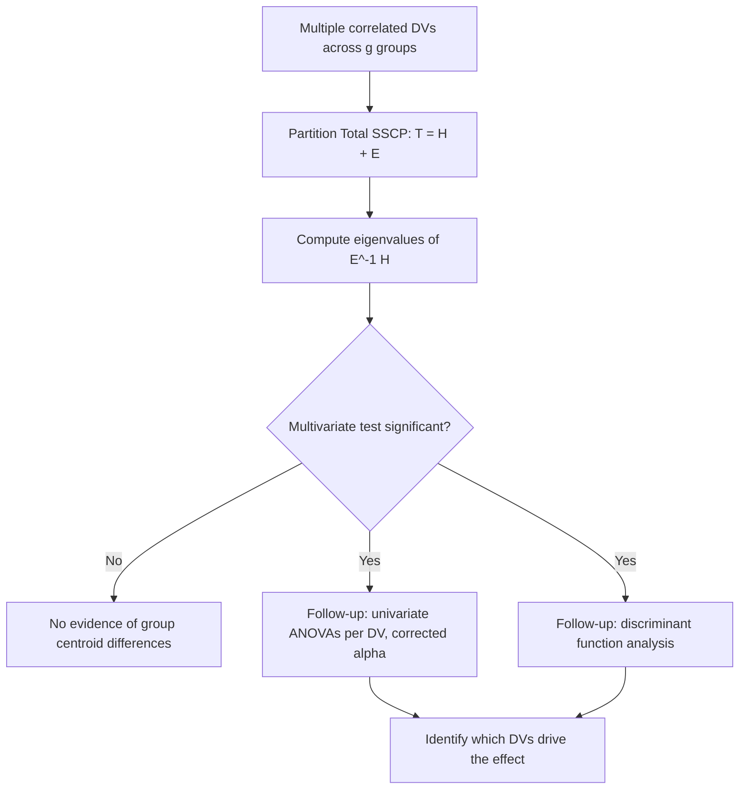

## Multivariate Analysis of Variance


### Overview

Multivariate Analysis of Variance (MANOVA) extends univariate ANOVA to situations involving **two or more correlated dependent variables** measured simultaneously across groups defined by one or more categorical independent variables (factors). Rather than testing group differences on each outcome separately, MANOVA tests whether group centroids (vectors of means) differ across the multivariate space of outcomes jointly, while accounting for correlations among the dependent variables.

MANOVA is preferred over running multiple separate ANOVAs when dependent variables are conceptually related and correlated, since separate univariate tests inflate the family-wise Type I error rate and ignore the joint covariance structure that may itself carry information about group differences.

### Model Specification

For $g$ groups and $p$ correlated dependent variables, the model for observation $i$ in group $k$ is:

$$\mathbf{y}_{ik} = \boldsymbol{\mu} + \boldsymbol{\tau}_k + \boldsymbol{\varepsilon}_{ik}$$

where $\mathbf{y}_{ik} \in \mathbb{R}^p$ is the vector of outcomes, $\boldsymbol{\mu}$ is the grand mean vector, $\boldsymbol{\tau}_k$ is the effect vector for group $k$, and $\boldsymbol{\varepsilon}_{ik} \sim \mathcal{N}_p(\mathbf{0}, \boldsymbol{\Sigma})$ is multivariate normal error with a common covariance matrix $\boldsymbol{\Sigma}$ across groups.

**Hypotheses:**

$$H_0: \boldsymbol{\mu}_1 = \boldsymbol{\mu}_2 = \dots = \boldsymbol{\mu}_g \quad \text{vs.} \quad H_1: \text{at least one } \boldsymbol{\mu}_k \text{ differs}$$

### Partitioning Variance: SSCP Matrices

MANOVA generalizes the univariate sum-of-squares decomposition to matrices. Instead of scalar SS values, MANOVA partitions total variation into **Sum of Squares and Cross-Products (SSCP)** matrices:

$$\mathbf{T} = \mathbf{H} + \mathbf{E}$$

where:

- $\mathbf{T}$ (Total SSCP): total variation and covariation across all observations.
- $\mathbf{H}$ (Hypothesis/Between-groups SSCP): variation attributable to group differences (analogous to SS-between).
- $\mathbf{E}$ (Error/Within-groups SSCP): pooled within-group variation and covariation (analogous to SS-within).

Each diagonal element of these matrices is the univariate SS for one dependent variable; off-diagonal elements capture cross-products (covariation) between pairs of dependent variables — this cross-product structure is what a set of separate univariate ANOVAs cannot capture.

### Multivariate Test Statistics

Because $\mathbf{H}$ and $\mathbf{E}$ are matrices, "how large is $\mathbf{H}$ relative to $\mathbf{E}$" is assessed via the eigenvalues $\lambda_1 \ge \lambda_2 \ge \dots \ge \lambda_s$ of $\mathbf{E}^{-1}\mathbf{H}$, where $s = \min(p, g-1)$. Four principal test statistics are derived from these eigenvalues:

**Wilks' Lambda:**

$$\Lambda = \prod_{i=1}^{s} \frac{1}{1+\lambda_i} = \frac{|\mathbf{E}|}{|\mathbf{E}+\mathbf{H}|}$$

Smaller $\Lambda$ (closer to 0) indicates stronger group separation. This is the most commonly reported statistic and is converted to an approximate $F$-distribution (Rao's approximation) for significance testing.

**Pillai's Trace:**

$$V = \sum_{i=1}^{s} \frac{\lambda_i}{1+\lambda_i}$$

Considered the most robust test to violations of assumptions (particularly homogeneity of covariance and multivariate normality), and generally recommended when sample sizes are unequal across groups or assumptions are in doubt.

**Hotelling-Lawley Trace:**

$$T = \sum_{i=1}^{s} \lambda_i$$

Generally more powerful than Wilks' Lambda when group differences are concentrated along a single dimension, but less robust to assumption violations than Pillai's Trace.

**Roy's Largest Root:**

$$\theta = \frac{\lambda_1}{1+\lambda_1}$$

Uses only the largest eigenvalue; most powerful when the true group separation is concentrated in exactly one dimension, but least robust — highly sensitive to violations of assumptions, since it ignores all other dimensions of the eigenstructure.

**Practical guidance:** When assumptions are well-satisfied and $g$ is small, the four statistics generally agree in substantive conclusions. When they diverge, Pillai's Trace is the most conservative and robust choice under assumption violations. [Inference: relative power rankings among these four statistics depend on the specific effect structure (concentrated vs. diffuse across dimensions) and are general tendencies rather than fixed rules for every dataset.]

### Assumptions

1. **Multivariate normality** of the dependent variable vector within each group (assessed via Mardia's test, Q-Q plots of Mahalanobis distances, or Shapiro-Wilk on each variable as a partial check).
2. **Homogeneity of covariance matrices** across groups — tested via **Box's M test**. Box's M is highly sensitive to sample size and non-normality, often over-rejecting in large samples; violations are usually addressed by preferring Pillai's Trace over Wilks' Lambda rather than abandoning MANOVA outright.
3. **Independence of observations** across and within groups.
4. **Linearity** among the dependent variables (no strong nonlinear relationships).
5. **Absence of multicollinearity/singularity** among dependent variables — if two outcomes are near-perfectly correlated, $\mathbf{E}$ becomes near-singular and $\mathbf{E}^{-1}\mathbf{H}$ is unstable.
6. Adequate sample size in each group, generally exceeding $p$ (the number of dependent variables), since $\mathbf{E}$ must be invertible.

### Post-Hoc Procedures: Follow-Up Analysis

A significant multivariate test indicates *some* difference among group centroids across the outcome set jointly, but does not indicate *which* dependent variable(s) drive the difference or *which* group pairs differ. Common follow-up strategies:

**1. Univariate ANOVAs (with correction):** Run separate ANOVAs on each dependent variable, applying a Bonferroni or similar correction ($\alpha / p$) to control the family-wise error rate, since MANOVA's overall significance justifies proceeding to univariate tests without inflating error as severely as testing each DV independently from the start (this sequential logic is sometimes called "protected" univariate testing, though its protective value has been debated in the literature). [Inference: the degree of protection offered by a prior significant MANOVA before univariate follow-up is a matter of some methodological debate rather than a settled guarantee.]

**2. Discriminant Function Analysis:** Since MANOVA and discriminant analysis share the same underlying eigenvalue decomposition ($\mathbf{E}^{-1}\mathbf{H}$), the discriminant functions from this decomposition can be examined directly to see which linear combination of dependent variables best separates the groups, with structure coefficients indicating each variable's contribution.

**3. Univariate/multivariate pairwise contrasts:** Simultaneous confidence intervals or multivariate $t^2$-based pairwise group comparisons (analogous to Tukey's HSD but in the multivariate case).



### Effect Size

**Multivariate $\eta^2$** (partial eta-squared, derived from Wilks' Lambda):

$$\eta^2_{\text{partial}} = 1 - \Lambda^{1/s}$$

where $s = \min(p, g-1)$. This provides an overall measure of the proportion of multivariate variance in the outcome set attributable to group membership, analogous to $\eta^2$ in univariate ANOVA.

### Extensions

- **Factorial MANOVA:** extends the single-factor model to multiple independent variables (factors) and their interactions, with separate $\mathbf{H}$ matrices computed for each main effect and interaction term.
- **MANCOVA (Multivariate Analysis of Covariance):** incorporates one or more continuous covariates to statistically control for their influence before testing group differences on the DV set, analogous to ANCOVA's role relative to ANOVA.
- **Repeated Measures MANOVA:** treats multiple time points or repeated conditions per subject as the "multivariate" outcome set, offering an alternative to repeated-measures ANOVA that does not require the sphericity assumption.
- **Profile Analysis:** a specialized MANOVA application testing whether group profiles across a set of commensurable (same-scale) outcomes are parallel, coincident, and/or at the same level — common in longitudinal or repeated-measure designs with commensurable variables.

### Worked Example (Conceptual)

An LGU training office wants to determine whether three different staff training programs (Program A, B, C) produce different outcomes on two correlated performance measures: **processing accuracy score** and **processing speed score** (correlated because more careful staff tend to be somewhat slower).

1. Confirm study design: one factor (training program, 3 levels), two correlated DVs.
2. Check assumptions: Box's M test for covariance homogeneity across the three groups (assume not significant, i.e., assumption reasonably met); assess multivariate normality via Mahalanobis distance Q-Q plot.
3. Compute $\mathbf{H}$ and $\mathbf{E}$ SSCP matrices; derive eigenvalues of $\mathbf{E}^{-1}\mathbf{H}$.
4. Report Wilks' Lambda: $\Lambda = 0.72$, converted to $F(4, 92) = 3.85$, $p = .006$ — reject $H_0$; training program groups differ significantly on the joint outcome vector.
5. Follow up with univariate ANOVAs (Bonferroni-corrected $\alpha = .025$): accuracy score differs significantly across programs ($p = .01$), speed score does not ($p = .09$).
6. Interpret: the multivariate effect is driven primarily by differences in accuracy rather than speed; report Tukey-adjusted pairwise comparisons on accuracy to identify which specific programs differ.

### Practical Implementation Notes

**Python (statsmodels):**

```python
from statsmodels.multivariate.manova import MANOVA

maov = MANOVA.from_formula('accuracy + speed ~ program', data=df)
print(maov.mv_test())  # reports Wilks' Lambda, Pillai's Trace, Hotelling-Lawley, Roy's Root
```

**R:**

```r
dv <- cbind(df$accuracy, df$speed)
fit <- manova(dv ~ program, data = df)
summary(fit, test = "Wilks")
summary(fit, test = "Pillai")

# Box's M test
library(biotools)
boxM(dv, df$program)

# Follow-up univariate ANOVAs
summary.aov(fit)
```

**Key Points**

- MANOVA tests whether group centroids differ jointly across multiple correlated dependent variables, using SSCP matrices ($\mathbf{H}$, $\mathbf{E}$) rather than scalar sums of squares.
- Four principal test statistics — Wilks' Lambda, Pillai's Trace, Hotelling-Lawley Trace, and Roy's Largest Root — are derived from the eigenvalues of $\mathbf{E}^{-1}\mathbf{H}$ and can diverge when assumptions are violated or effects are concentrated in one dimension.
- Pillai's Trace is generally the most robust choice under assumption violations or unequal group sizes.
- A significant MANOVA result must be followed up (via corrected univariate ANOVAs or discriminant function analysis) to determine which dependent variables and group contrasts drive the effect.
- MANOVA and discriminant analysis share the same underlying eigenstructure, differing mainly in framing (hypothesis testing vs. classification).
- Box's M test for covariance homogeneity is highly sensitive to sample size and non-normality; a significant result does not automatically invalidate MANOVA if a robust statistic (Pillai's) is used.

### Common Pitfalls

- Running MANOVA merely as a formality before separate ANOVAs without leveraging the actual multivariate information (correlations among DVs) that motivates the technique in the first place.
- Combining conceptually unrelated or uncorrelated dependent variables into a single MANOVA, which reduces power and produces a joint test with limited substantive interpretability.
- Relying solely on Wilks' Lambda without checking whether the four multivariate test statistics agree, especially when assumptions are questionable.
- Treating a significant Box's M test as an automatic disqualifier for MANOVA, rather than as a signal to prefer Pillai's Trace and/or consider sample-size-driven sensitivity.
- Failing to correct for multiple comparisons in univariate follow-up tests, inflating the family-wise Type I error rate.
- Interpreting a non-significant MANOVA as proof of "no differences" on any individual outcome, when a true effect concentrated in one variable diluted by an unrelated second variable can suppress multivariate significance.

**Related Topics**

- Discriminant Analysis (shares MANOVA's eigenvalue decomposition, framed as classification)
- ANOVA and Factorial ANOVA (univariate foundation MANOVA generalizes)
- MANCOVA (incorporating covariates into the multivariate framework)
- Repeated Measures Designs and Profile Analysis
- Canonical Correlation Analysis (shared Wilks' Lambda machinery, two-set framing)
- Box's M Test and Assumption Diagnostics for Multivariate Models
- Multivariate Effect Size and Power Analysis